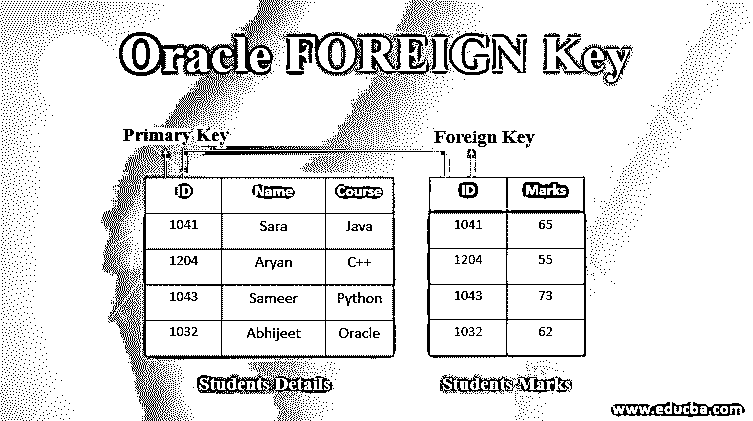
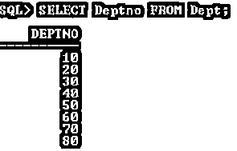

# Oracle 外键

> 原文：<https://www.educba.com/oracle-foreign-key/>

## 什么是 Oracle 外键？

Oracle 外键用于定义限制数据库表中的值的完整性约束。包含外键的表称为子表。外键列数据引用父列数据。

### 外键的声明样式

它可以通过两种方式声明。他们是，

<small>Hadoop、数据科学、统计学&其他</small>

**1。列级(内嵌)样式**

*   它可以声明为单个列或属性定义的一部分。
*   通常在约束仅特定于该列时应用。

**2。表格级别(不一致)样式**

*   它可以被声明为表定义的一部分。
*   它可以在列的组合上一起声明。

#### 集中点

*   一个称为引用完整性约束的 Oracle 外键。
*   外键列与指定的主键或唯一键建立关系。
*   如果外键应用于多个列，则称为复合外键。
*   包含外键的表或视图称为子对象，如果外键列引用该表或视图，则称为父对象。
*   同一个表或视图可以包含外键和引用键。
*   顺序和数据类型必须与相应的外键和引用键列相匹配。
*   父表或视图的组合唯一键或主键只能由组合外键引用。
*   那些只包含与另一个表主键相关的外键的表，称为纯细节表。

#### 限制

外键不能应用于:

*   LOB、LONG、LONG RAW、VARRAY、嵌套表、对象、BFILE、REF、带时区的时间戳。
*   在声明引用该列的外键之前，被引用的唯一/主键必须存在于父表或视图中。
*   一个复合外键组合最多可以包含 32 列。
*   用于外键的子表和父表必须属于同一个数据库。
*   可以在跨节点的分布式数据库上使用 ORACLE 触发器来启用引用完整性。
*   在单个用户或同一模式中，不能有两个外键同名。

### 参考条款

当外键约束是内联声明的时，应该使用 REFERENCES 子句。当约束在第行之外时，必须指定外键关键字。

**语法# 1–用于内联外键**

`CREATE table Table_Name **(**col_1 Datatype (width), col_2 Data type (width)   CONSTRAINT cons_name REFERENCES Table (column name));`

**语法# 2–用于行外外键**

`CREATE table Table_Name **(**col_1 Datatype (width), col_2 Datatype (width), col_2 Datatype (width), CONSTRAINT cons_name FOREIGN KEY (col_1, col_2)  REFERENCES Table (col_1, col_2);`

**说明:** Col_1/2/n:根据您的要求进行计算的列。Table_Name:根据您的要求。Table (col_1，col_2): Table 是我们用于引用的表名，col_1/2 是表中用于外键引用的列。

### 外键的实现及示例

在本节中，我们将看到 Oracle 外键的实现及其行为。

#### 示例#1

**代码:**

`CREATE TABLE emp_1 (emp_id NUMBER (2), emp_dept NUMBER (2) CONSTRAINT   DeptID REFERENCES dept (deptno));`

**输出:**

**解释**:在上面的例子中，外键约束应用于 emp_dept 列，外键引用 dept 表中的 deptno 列。这意味着 emp_1 表的 emp_dept 列只能包含存在于 dept 表的 deptno 列中的记录。这种记录称为子记录。

#### 实施例 2

**代码:**

`INSERT INTO Emp_1 VALUES (1, 70);`

**输出:**

**解释:**上面的插入查询插入一条记录(见下图), emp_dept 值(70)存在于 dept 表中。

**输出:**

#### 实施例 3

**代码:**

`INSERT INTO Emp_1 VALUES (1, 90);`

**输出:**

**解释:**但是我们用不同的值(90)运行相同的插入查询，它返回一个错误。为什么？因为 dept 表的 deptno 列中不存在值(90)(参见下面的 dept 表数据)。根据外键规则，由外键组成的列只能包含引用数据，而不能包含新值。

**代码:**

`SELECT Deptno from Dept;`

**输出:**

### Oracle 中的复合外键

复合外键/表级别(不一致)样式:

**代码:**

`CREATE TABLE Samp_PK
(
SamID NUMBER (2),
SamName VARCHAR2 (10),
SamDate DATE
) ;`

**输出:**

**说明:**上面的 SELECT 语句创建了一个没有任何约束的表 Samp_PK。我们将在下面的 CREATE table 语句中使用这个表来声明/引用外键。

**代码:**

`CREATE TABLE Samp_FK
(
SamID NUMBER (2),
SamName VARCHAR2 (10),
SamDate DATE,
CONSTRAINT sampFK_01 FOREIGN KEY (SamID, SamName)
REFERENCES Samp_PK (SamID, SamName)
);`

**输出:**

**解释**:在上面的例子中，我们试图使用表 Samp_PK 创建一个复合外键来引用列，但是它抛出了一个错误。为什么？因为根据规则，复合外键只能引用父表或视图中的复合唯一键或复合主键列。

#### 1.外键维护

*   可以添加、删除、启用或禁用外键，但不能修改表的物理结构。
*   外键约束名可以从
*   用户约束
*   用户 _ CONS _ 列数据字典视图

#### 2.查看外键

**语法:**

`SELECT * FROM USER_CONSTRAINTS WHERE TABLE_NAME= ‘Table_Name’;`

**代码:**

`SELECT Constraint_Name, Constraint_type FROM USER_CONSTRAINTS WHERE  TABLE_NAME= ‘Emp_1’;`

**输出:**

显示约束名称和类型的输出。这里 R 表示引用完整性，表示外键。

#### 3.添加外键

**语法:**

`ALTER TABLE Table_Name ADD [CONSTRAINT <Constraint Name>]   Constraint_Type (Column_Name);`

**代码:**

`ALTER TABLE Samp_PK ADD CONSTRAINT samp_FK UNIQUE (SamID,    SamName);`

**输出:**

早期的 SAMP_PK 表没有约束。

#### 4.删除外键

**语法:**

`ALTER TABLE Table_Name DROP [CONSTRAINT <Constraint Name>]   Constraint_Type (Column_Name);`

**代码:**

`ALTER TABLE Emp_1 DROP CONSTRAINT DeptID;`

**输出**:

在上面的例子中，Emp_1 表中的外键(DeptID)被删除。现在，Emp_1 没有任何外键(见下图)。

**代码:**

`SELECT Constraint_Name, Constraint_type FROM USER_CONSTRAINTS WHERE     TABLE_NAME= ‘Emp_1’;`

**输出:**

**提示**

1.也可以禁用或启用外键约束。下面给出了语法。

**语法:**

`ALTER TABLE Table_Name ENABLE / DISABLE CONSTRAINT <Constraint   Name>];`

2.如果存在子记录，则不能删除父记录。如果你试图删除它，它会抛出一个错误信息(如下所示)。

**输出:**

### 结论

Oracle 外键是提供引用完整性的约束，它限制父表或视图中不存在的值。外键是将一个表与另一个表链接起来的最佳实践。

### 推荐文章

这是一个 Oracle 外键指南。这里我们讨论两种方式的声明，引用子句，用例子和组合键。您也可以浏览我们的其他相关文章，了解更多信息——

1.  [Oracle 中的光标](https://www.educba.com/cursor-in-oracle/)
2.  [在甲骨文之间](https://www.educba.com/between-in-oracle/)
3.  [Oracle 中的排序依据](https://www.educba.com/order-by-in-oracle/)
4.  [甲骨文中的减号](https://www.educba.com/minus-in-oracle/)
5.  [Oracle Alter Table 指南](https://www.educba.com/oracle-alter-table/)

