# Oracle 视图

> 原文：<https://www.educba.com/oracle-views/>

## Oracle 视图简介

Oracle 数据库中的视图实际上是一个虚拟表，它不是物理地存储在数据库数据字典中，也不存储任何类型的数据，通常是通过对两个或更多个表使用连接查询来创建的，这使视图能够隐藏数据复杂性并提供安全性，因为实际上我们没有在视图中物理地存储任何数据，所以它实际上限制了数据库用户对表中各列的访问。视图是由连接一个或多个表的查询创建的。

### 在 Oracle 中创建视图

借助下面提到的一些示例，让我们看看如何在 Oracle 中创建视图:

<small>Hadoop、数据科学、统计学&其他</small>

**创建视图的语法—**

`CREATE VIEW view name AS
SELECT column [ , column ] FROM table
WHERE condition;`

**视图名称—**指定用户想要创建的 Oracle 视图名称。

下图中显示了 oracle 视图的可视化表示，因为在下图中，红色阴影区域作为 Oracle select 查询的结果返回，并且存储为视图–

### 查询示例

让我们举一个例子来创建一个视图。下面是一个例子，我们在一个表上创建一个简单的视图。

#### 供应商表

**查询示例:**

`CREATE VIEW empview AS
SELECT *
FROM employees;
WHERE employees.manager_id = 100;`

**输出:**

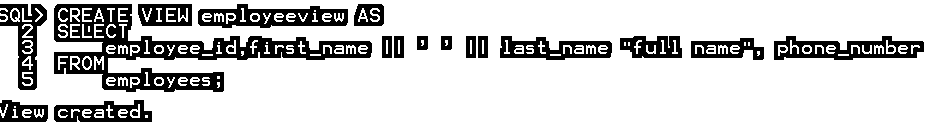

视图已创建。0.21 秒

上面的 Oracle INNER JOIN 示例将返回 employee 表和 department 表中 employee _id 值匹配的所有行。

让我们借助一些示例查询来详细理解 oracle 视图:

我们在这里考虑 hr 模式，它是 oracle 数据库的样本模式。hr 模式包含国家、员工、部门、JOB_HISTORY、JOBS、LOCATIONS、REGIONS 表，我们对这些表感兴趣或者需要员工、部门和位置表。

这些表格的描述如下:

##### 员工表

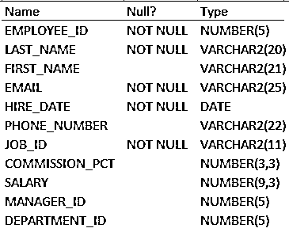

##### 表格部门

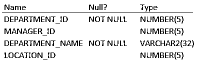

#### 示例#1

在选定的列上创建视图

在这里，我们基于雇员的表创建一个名为 employee view 的视图。雇员视图包含雇员 id、雇员全名(由名和姓连接而成)和雇员电话号码-

**代码:**

`CREATE VIEW employee view AS
SELECT
employee_id,
first_name || ' ' || last_name full name,
phone_number
FROM
employees;`

**输出:**

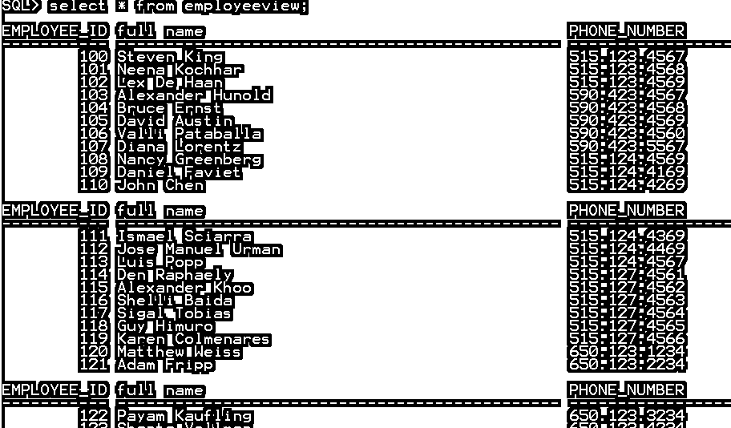

我们现在可以使用以下查询来检查上面刚刚创建的 Oracle 视图

`Select * from employee view;`

**输出:**

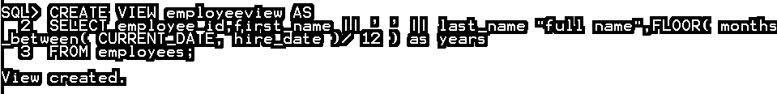

#### 实施例 2

使用列别名创建 oracle 视图

**代码:**

`CREATE VIEW employee view AS
SELECT employee_id, first_name || '  ' || last_name "full name", FLOOR( months_between ( CURRENT_DATE, hire_date )/ 12 ) as years
FROM employees;`

**输出:**

`Select * from employee view;`

**输出:**

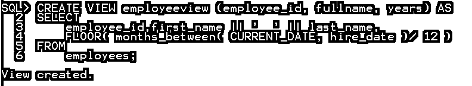

#### 实施例 3

使用列别名创建 oracle 视图

**代码:**

`CREATE VIEW employee view (employee_id, full name, years) AS
SELECT
employee_id,first_name || '  ' || last_name,
FLOOR( months_between ( CURRENT_DATE, hire_date )/ 12 )
FROM
employees;`

**输出:**

`Select * from employee view;`

**输出:**

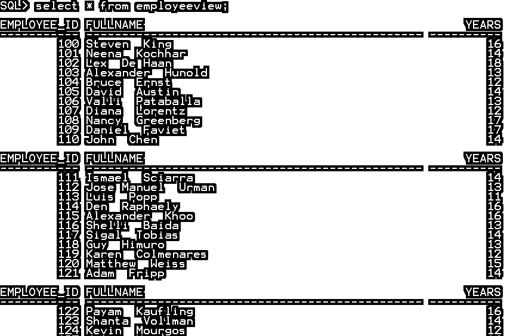

#### 实施例 4

使用 where 子句访问视图

**代码:**

`SELECT *
FROM employee view
WHERE years > 10;
ORDER BY full name;`

**输出:**

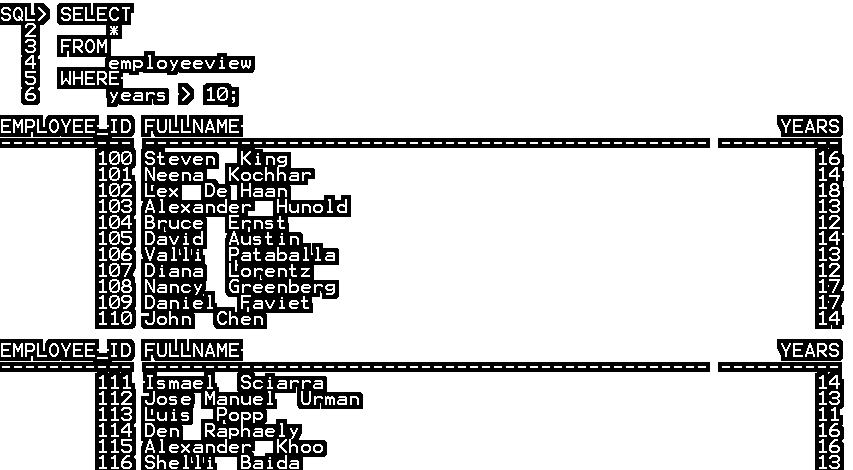

#### 实施例 5

使用 order by 子句访问视图

**代码:**

`SELECT full name
FROM employee view
WHERE years > 10
ORDER BY full name;`

**输出:**

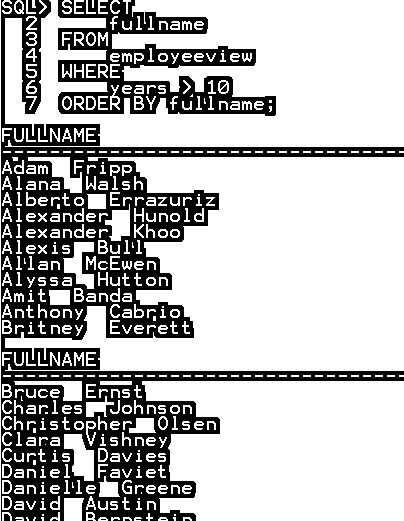

#### 实施例 6

更新并使其成为只读视图

**代码:**

`CREATE OR REPLACE VIEW employee view (employee_id, full name, years) AS
SELECT
employee_id,first_name || '  ' || last_name,
FLOOR ( months_between ( CURRENT_DATE, hire_date ) / 12 )
FROM employees WITH reading ONLY;`

**输出:**

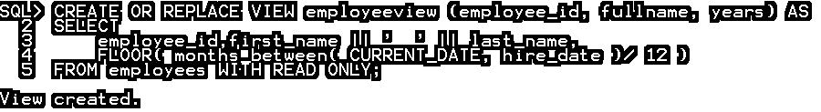

#### 实施例 7

创建包含多个表的 oracle 视图

**代码:**

`CREATE OR REPLACE VIEW dept_manger AS
SELECT
employee_id,first_name || '  ' || last_name as name, department_name
FROM EMPLOYEES
INNER JOIN DEPARTMENTS
on EMPLOYEES. EMPLOYEE_ID = DEPARTMENTS. MANAGER_ID;,`

**输出:**

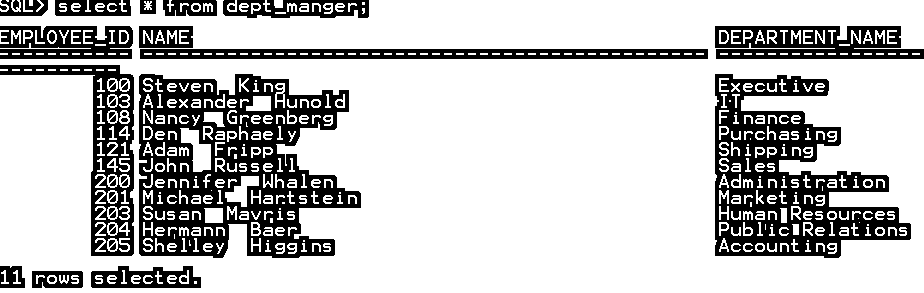

#### 实施例 8

使用 Drop 语句删除视图

**代码:**

`Drop view employee view;`

**输出:**

### oracle 中视图的优点和缺点

优点和缺点如下:

#### oracle 中视图的优势

以下是优点:

*   可以在表的选定数据或列上创建视图，这限制了表的视图，并且可以隐藏表中的一些数据或列。
*   视图创建来查看数据，而不将数据存储到表中。
*   创建 View cab 是为了连接两个或更多表数据，并将其存储为一个表或对象。
*   创建了一个视图 cab 以实现安全性。
*   该视图为运行复杂查询或连接查询提供了良好的性能。

#### oracle 中视图的缺点

以下是缺点:

*   无法在视图中执行 DML 操作。
*   如果删除了创建该视图的表，该视图将变为非活动状态。
*   视图占用内存空间，因为它是一个对象。

### 结论

视图是物理上不存在的虚拟表。视图是在现有的一个或多个表上创建的。视图是在常用查询、复杂查询或连接查询上创建的。该视图为运行复杂查询或连接查询提供了良好的性能。无法在视图中执行 DML 操作。创建了一个视图 cab 以实现安全性。如果删除了创建该视图的表，该视图将变为非活动状态。

### 推荐文章

这是 Oracle 视图指南。这里我们讨论 Oracle 视图的参数、优缺点以及查询示例。您也可以浏览我们推荐的其他文章，了解更多信息——

1.  [加入甲骨文](https://www.educba.com/joins-in-oracle/)
2.  [甲骨文数据仓库](https://www.educba.com/oracle-data-warehousing/)
3.  [Oracle 查询](https://www.educba.com/oracle-queries/)
4.  [什么是 Oracle 数据库](https://www.educba.com/what-is-oracle-database/)
5.  [Java 字符串连接指南](https://www.educba.com/java-string-concatenation/)
6.  [甲骨文版本一览](https://www.educba.com/oracle-versions/)
7.  [PostgreSQL WHERE 子句的前 9 个运算符](https://www.educba.com/postgresql-where-clause/)
8.  [内部连接与外部连接的区别](https://www.educba.com/inner-join-vs-outer-join/)
9.  [如何使用 MySQL 外连接？](https://www.educba.com/mysql-outer-join/)
10.  [SQL 外部连接的前 4 种类型](https://www.educba.com/sql-outer-join/)

