# Oracle 日期函数

> 原文：<https://www.educba.com/oracle-date-functions/>

## Oracle 日期函数简介

Oracle 中的日期函数可以定义为一组对日期进行操作的函数，它允许开发人员或用户检索特定时区的当前日期和时间，或者仅提取日期/月份/年份，或者更复杂的操作，如提取月份的最后一天/下一天/会话时区，它还包含可用于将日期值转换为字符串或将字符串中的日期转换为日期值的函数。

### Oracle 日期函数及示例

下面给出了各种 oracle 日期函数及其示例:

<small>Hadoop、数据科学、统计学&其他</small>

#### 1.当前日期

此函数用于获取会话时区中的当前日期。它不需要参数，是一个非常简单的函数。

**语法:**

`CURRENT_DATE`

**举例:**

在这个例子中，我们将尝试使用这个函数来查找会话的当前日期。

**代码:**

`SELECT CURRENT_DATE FROM DUAL;`

在输出中，我们将看到会话时区的当前日期。

#### 2.系统日期

该函数返回安装 Oracle 数据库的操作系统的当前日期和时间。

**语法:**

`SYSDATE`

**举例:**

在本例中，我们将查找安装了当前数据库的操作系统的 sysdate。

**代码:**

`select sysdate from dual;`

**输出:**

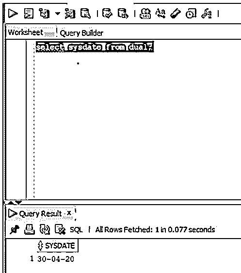

我们可以看到屏幕截图显示了系统日期。

#### 3.提取

Oracle 中的这个 extract 函数用于从日期值中检索特定的部分，可以是年、日、月、小时、分钟、秒。

**语法:**

`EXTRACT (component from source)`

**参数:**

*   **分量:**是指我们要提取的分量(年、日、月、时、分、秒)。
*   **source:** 是指我们要从中提取的值(日期，时间戳)。

**举例:**

在这个例子中，我们将从日期中提取年份。

**代码:**

`SELECT
EXTRACT( YEAR FROM TO_DATE( '29-Apr-2020 05:30:20 ',  'DD-Mon-YYYY HH24:MI:SS' ) ) YEAR
FROM
DUAL;`

我们已经使用了 _date 函数。

**输出:**

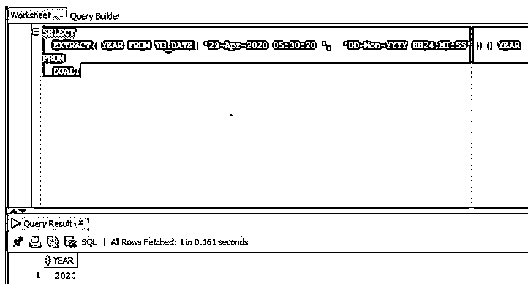

在上面的屏幕截图中，我们可以看到年份已经被成功提取出来。

#### 4.截止日期

此函数将字符串类型的日期转换为日期值。它需要三个参数。

**语法:**

`TO_DATE(string, format, nls_language)`

**参数:**

*   **string:** 表示我们要转换的字符串类型的日期。
*   **format:** 表示我们要转换的日期和时间格式，可选参数。
*   **nls_language:** 表示日、月名称的语言。它也是一个可选参数。

**举例:**

在这个例子中，我们将把字符串中的日期转换成日期值。

**代码:**

`SELECT
TO_DATE( '20 APR 2020', 'DD MON YYYY' )CONVERTED_DATE
FROM dual;`

**输出:**

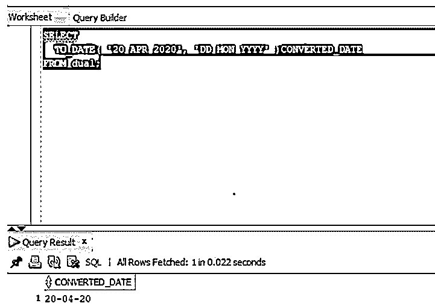

正如我们在屏幕截图中看到的，日期值已经被转换为特定的格式。

#### 5.收件人 _ 字符

它用于将日期从日期值转换为指定的日期格式。

**语法:**

`TO_CHAR(expression, date_format)`

**参数:**

*   **表达式:**需要换算的日期或区间值。表达式可以是日期或时间戳类型
*   **date_format:** 表示我们要转换表达式的指定格式。它是可选参数。

**举例:**

在本例中，我们将把系统日期或当前日期转换成 DD-MM-YYYY 格式的字符串值。

**代码:**

`SELECT
TO_CHAR( sysdate, 'DD-MM-YYYY' )NEW_DATE
FROM
dual;`

**输出:**

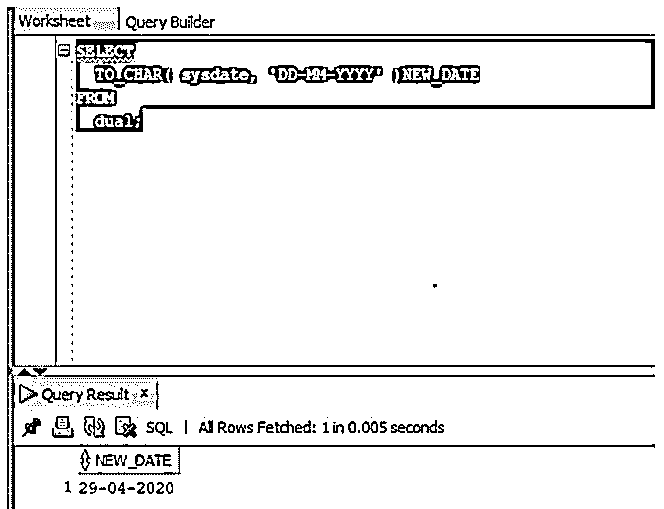

正如我们在屏幕截图中看到的，sysdate 已经被转换为指定的格式。

#### 6.最后一天

此函数用于返回特定日期所在月份的最后一天。它接受一个日期参数作为参数。

**语法:**

`LAST_DAY(date)`

**参数:**

*   **date:** 这是指我们要获取的当月最后一天的日期值。

**举例:**

在本例中，我们将提取 sysdate 月份的最后一天。

**代码:**

`SELECT
LAST_DAY(sysdate) LAST_DAY
FROM
dual;`

**输出:**

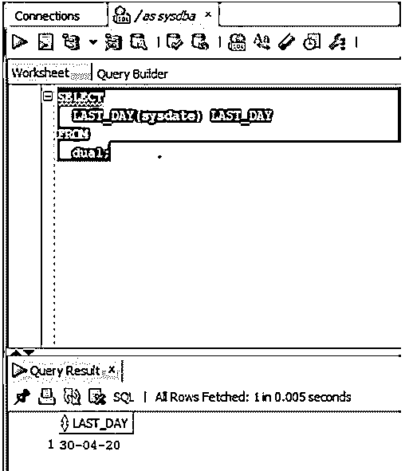

正如我们在屏幕截图中看到的，该查询显示了四月份的最后一天。

#### 7.月份间隔

此函数用于测量两个日期之间的月份。

它采用两个参数作为参数。

**语法:**

`MONTHS_BETWEEN(from_date, to_date)`

**参数:**

*   **from_date:** 指从中减去的日期。
*   **to_date:** 指要减去的日期。

**举例:**

在这个例子中，我们将计算系统日期和印度第二次赢得板球世界杯的日期(2011 年 4 月 2 日)之间的月份。

**代码:**

`SELECT
MONTHS_BETWEEN( sysdate, DATE '2011-04-02' ) MONTH_DIFFERENCE
FROM
DUAL;`

**输出:**

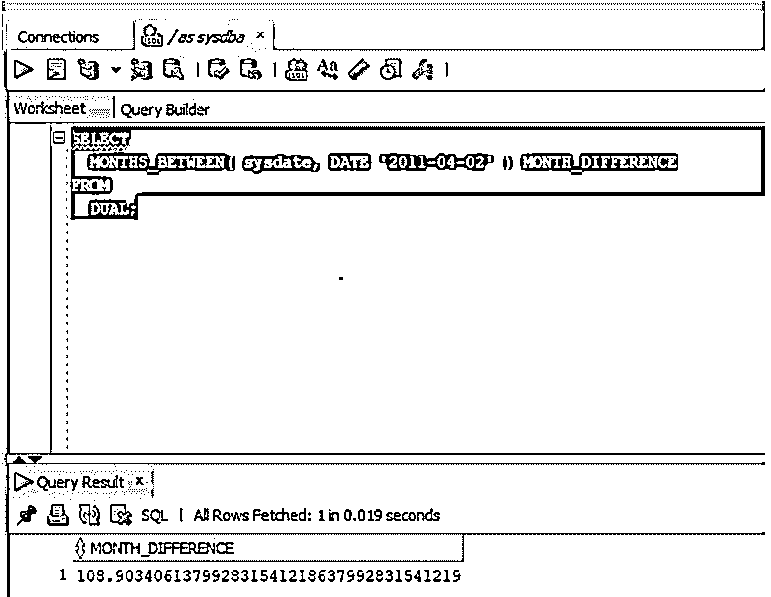

正如我们在屏幕截图中看到的，该查询显示了两个日期之间的月份。

#### 8.添加 _ 月份

此函数将一个日期加上 N 个月，并返回 N 个月后的同一天。

**语法:**

`ADD_MONTHS(expression, N)`

**参数:**

*   **表达式:**表示日期值。
*   **N:** 代表月数。

**举例:**

使用 ADD_MONTHS 函数获取两个月后的今天系统日日期。

**代码:**

`SELECT
ADD_MONTHS( sysdate, 2 ) NEWDATE
FROM
dual;`

**输出:**

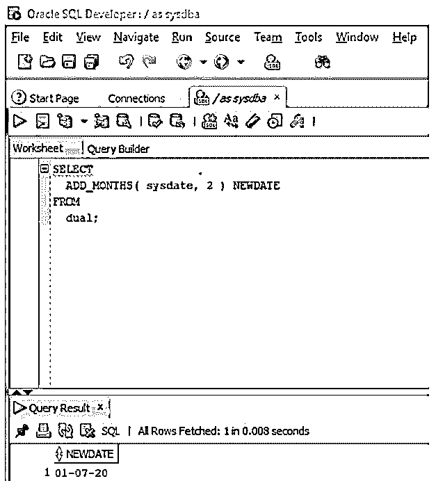

#### 9.当前时间戳

此函数返回会话时区中的当前日期和时间。

**语法:**

`CURRENT_TIMESTAMP`

**举例:**

让我们尝试获取这个特定会话时区的当前时间戳。

**代码:**

`SELECT
CURRENT_TIMESTAMP
FROM
dual;`

**输出:**

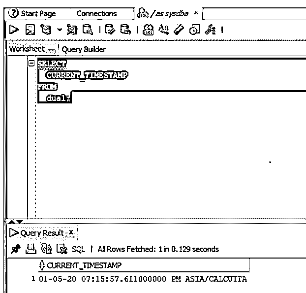

#### 10\. DBTIMEZONE

这表示数据库时区。

**语法:**

`DBTIMEZONE`

**举例:**

获取当前数据库时区。

**代码:**

`SELECT
DBTIMEZONE
FROM
dual;`

**输出:**

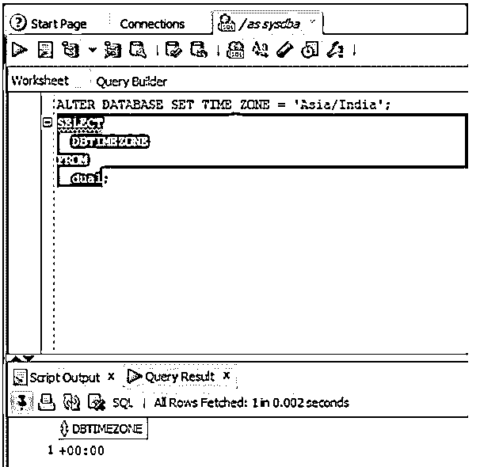

#### 11.来自 TZ

这个函数将时间戳转换为带有时区值的时间戳。

**语法:**

`FROM_TZ(timestamp, timezone)`

**参数:**

*   **时间戳:**是指时间戳值。
*   **时区:**是一个字符串 TZH:TZM。

**举例:**

将时间戳转换为带时区值的时间戳。

**代码:**

`SELECT
FROM_TZ(TIMESTAMP '2020-05-01 19:35:10', '-07:00')NEWVALUE
FROM
DUAL;`

**输出:**

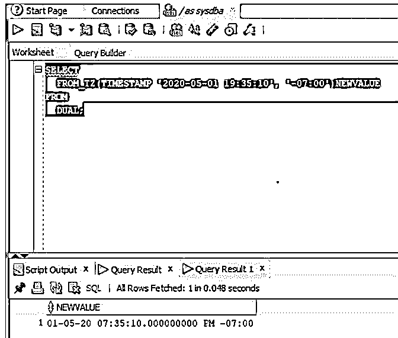

#### 12.新时间()

此函数将日期从一个时区转换为另一个时区。

**语法:**

`NEW_TIME(date, from_timezone, new_timezone)`

**参数:**

*   **日期:**是指我们要换算的日期。
*   **from_timezone:** 表示日期所在的时区。
*   **new_timezone:** 表示我们要转换到的时区。

**代码:**

`SELECT
NEW_TIME( sysdate,  'PST', 'AST' ) TIME_IN_AST
FROM
DUAL;`

**输出:**

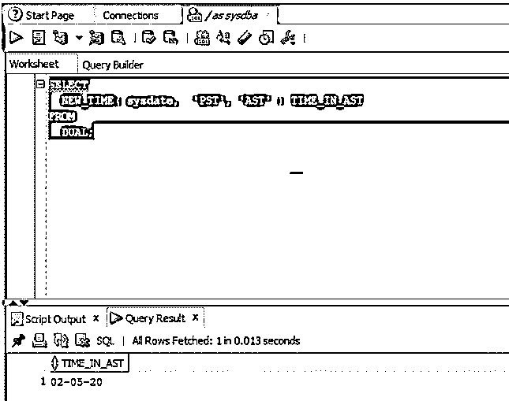

#### 13.轮次

此函数将日期舍入到特定的格式。

**语法:**

`ROUND(date, format)`

**参数:**

*   **日期:**表示我们要舍入的日期。
*   **格式:**表示我们要舍入到的格式。

**举例:**

在本例中，我们将把当前日期 2020 年 5 月 1 日 20:27:15 四舍五入到最近的日期。

**代码:**

`SELECT
TO_CHAR(
ROUND( TO_DATE( '01-May-2020 20:27:15',  'DD-Mon-YYYY HH24:MI:SS' ) ),
'DD-Mon-YYYY HH24:MI:SS' )  rounded_date
FROM
dual;`

**输出:**

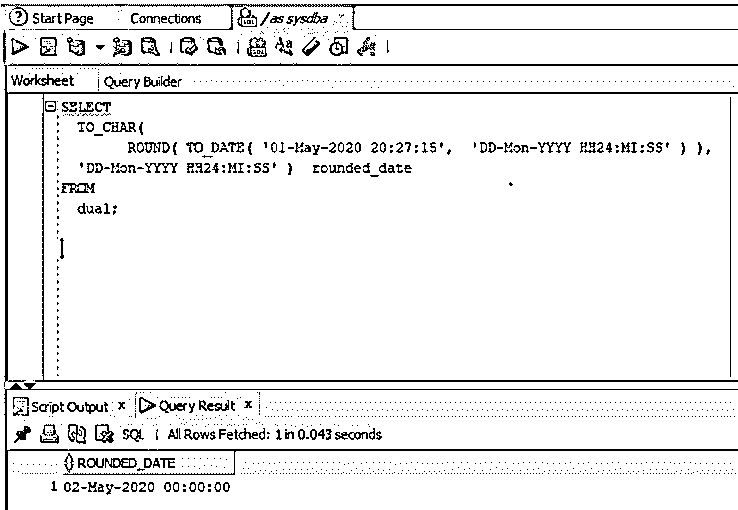

#### 14.SESSIONTIMEZONE

顾名思义，这个函数返回当前工作会话的时区。

**语法:**

`SESSIONTIMEZONE`

**举例:**

获取当前工作会话的时区。

**代码:**

`SELECT
SESSIONTIMEZONE
FROM
dual;`

**输出:**

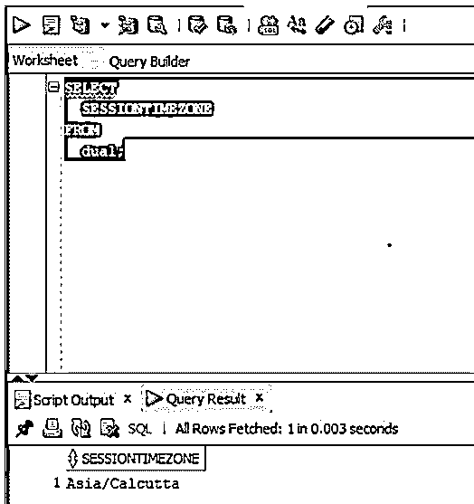

#### 15.系统时间戳

这个函数表示一个带有时区的时间戳。它显示精确到秒的结果。

**语法:**

`SYSTIMESTAMP`

**举例:**

在本例中，我们将尝试获取系统时间戳。

**代码:**

`SELECT
SYSTIMESTAMP
FROM
dual;`

**输出:**

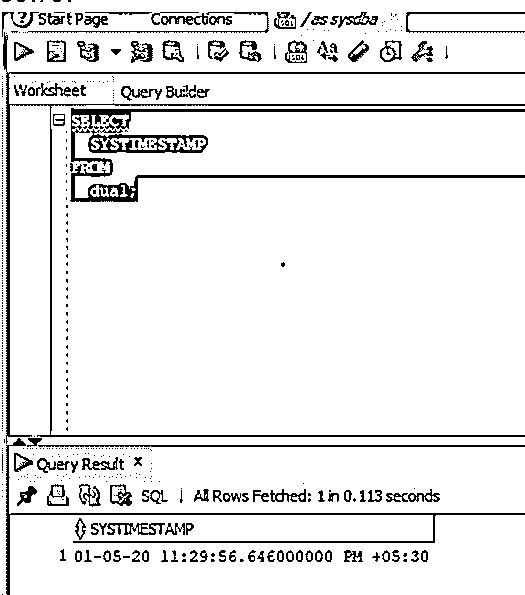

#### 16.TRUNC

此函数返回截断为特定格式/单位的日期值。

**语法:**

`TRUNC(date, format)`

**参数:**

*   **date:** 表示要截断的日期值。
*   **格式:**日期值将被截断的单位。

**举例:**

获取当月的第一天。

**代码:**

`SELECT
TRUNC( SYSDATE, 'MM' ) MONTH
FROM
dual;`

**输出:**

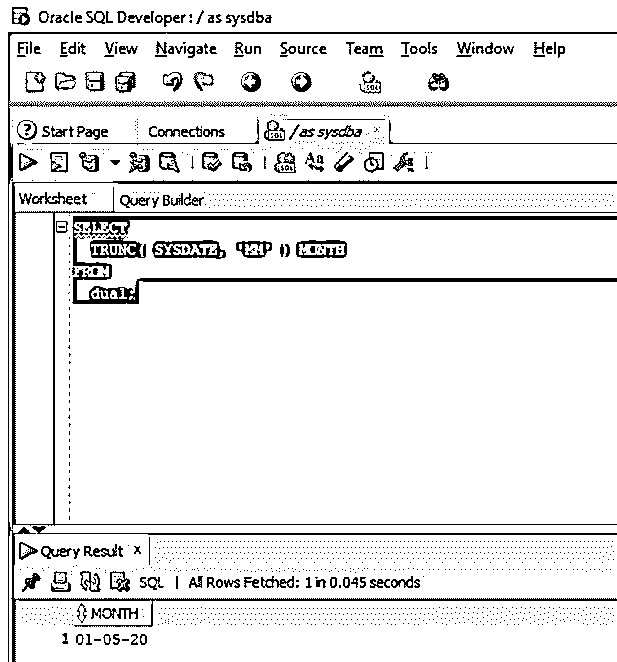

#### 17.TZ _ 偏移量

此函数返回时区名称相对于 UTC 的偏移量。

**语法:**

`TZ_OFFSET(value)`

**参数:**

*   **值:**表示有效的时区。

**举例:**

我们将得到亚洲/加尔各答时区的时差。

**代码:**

`SELECT
TZ_OFFSET('Asia/Kolkata') OFFSET
FROM
DUAL;`

**输出:**

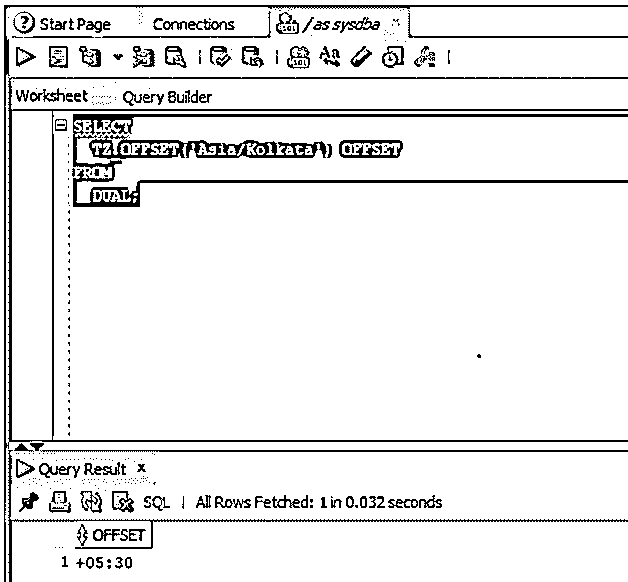

### 结论

在本文中，我们了解了 Oracle 日期函数的定义，以及 Oracle 数据库中可用的各种日期函数。我们看到了不同类型的日期函数，它们的定义、语法，以及每个函数的示例，以便更好地理解每个函数。

### 推荐文章

这是 Oracle 日期函数的指南。为了更好地理解，我们在这里讨论 Oracle 日期函数的 17 个函数和示例。您也可以看看以下文章，了解更多信息–

1.  [在 Oracle 中获取](https://www.educba.com/fetch-in-oracle/)
2.  [Oracle 唯一约束](https://www.educba.com/oracle-unique-constraint/)
3.  [Oracle 中的自然连接](https://www.educba.com/natural-join-in-oracle/)
4.  [Oracle Alter Table](https://www.educba.com/oracle-alter-table/)

