# Oracle 分析函数

> 原文：<https://www.educba.com/oracle-analytic-functions/>

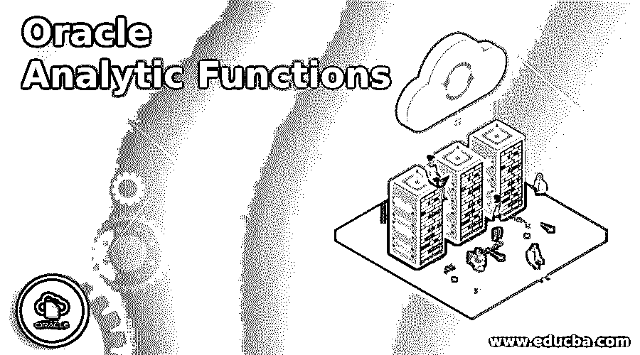

## Oracle 分析函数简介

Oracle 中的分析函数可以定义为类似于聚合函数的函数(聚合函数用于将几行数据分组为一行)，因为它作用于行的子集，并用于根据一组行计算聚合值，但是在聚合函数的情况下，查询返回的行数会减少，而在聚合函数的情况下，查询返回的行数在执行后不会减少。

### Oracle 分析函数列表

下面列出了 Oracle 分析函数:

<small>Hadoop、数据科学、统计学&其他</small>

#### 1.密集 _ 秩

这是一种计算行排名的分析函数。与 rank 函数不同，该函数返回连续整数形式的 RANK。

**举例:**

在本例中，我们将在 EMPLOYEE 表中查找列 city 的等级。

**代码:**

`SELECT
city,
DENSE_RANK () OVER (
ORDER BY city)
city_rank
FROM
EMPLOYEE;`

**输出:**

正如我们在输出屏幕截图中看到的，显示的等级是连续的。

#### 2.第一个值

顾名思义，它是一个分析函数，用于提供一组有序行中第一行的值。

**举例:**

在本例中，我们将根据表 employee 中的城市来查看最低年龄。

**代码:**

`select employee_id ,
age,
city,
FIRST_VALUE(age)
OVER(PARTITION BY city
ORDER BY employee_id
)FIRST_
from employee;`

**输出:**

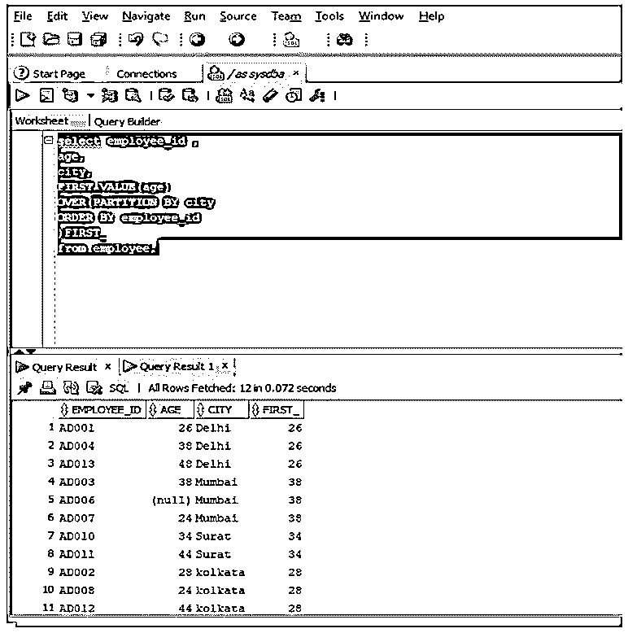

正如我们在屏幕截图中看到的，最后一列显示了每个城市的最低年龄。

#### 3.最后一个值

它也是一个分析函数，用于获取一组有序行中最后一行的值。

**举例:**

在本例中，我们将根据 employees 表中的城市获取最高年龄。

**代码:**

`select employee_id ,
age,
city,
LAST_VALUE(age)
OVER(PARTITION BY city
ORDER BY employee_id
RANGE BETWEEN UNBOUNDED PRECEDING AND
UNBOUNDED FOLLOWING)HIGHEST_AGE
from employee;`

子句“RANGE BETWEEN UNBOUNDED previous AND UNBOUNDED FOLLOWING”意味着窗口框架从结果集的第一行开始，到最后一行结束。

**输出:**

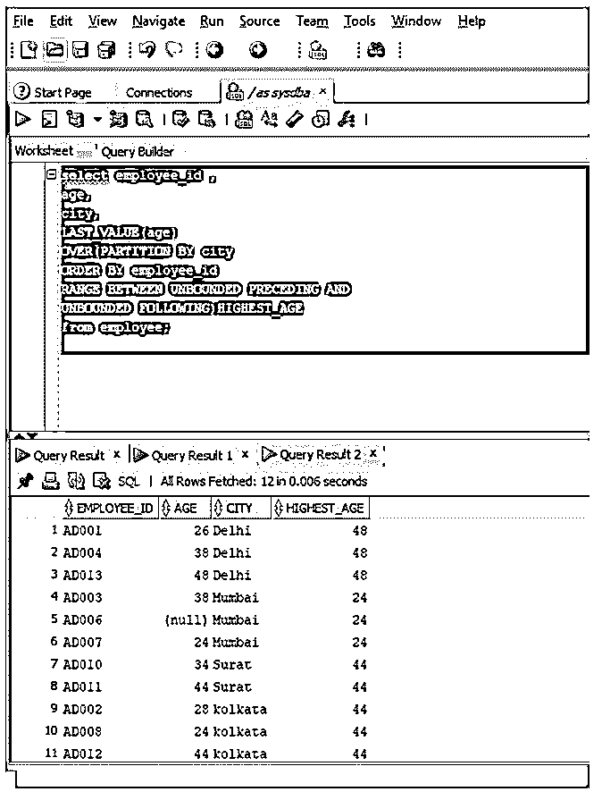

正如我们在屏幕截图中看到的，最后一行显示了最高年龄。

#### 4.导致

这是一种分析函数，允许我们根据偏移值从当前行访问下一行，而无需使用自连接。

**举例:**

在本例中，我们将获得德里市雇员的以下年龄。

**代码:**

`SELECT
city,
age,
LEAD(age) OVER (
ORDER BY city
) following_employee_age
FROM
employee
WHERE
city = 'Delhi';`

**输出:**

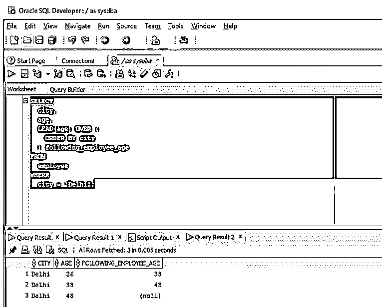

在屏幕截图中，最后一个值为 null，因为偏移量超出了结果集的范围。

#### 5.落后

这是一种分析函数，允许我们根据偏移值访问当前行中的前一行，而无需使用自连接。

**举例:**

**代码:**

`SELECT
city,
age,
LAG(age) OVER (
ORDER BY city
) following_employee_age
FROM
employee
WHERE
city = 'Delhi';`

**输出:**

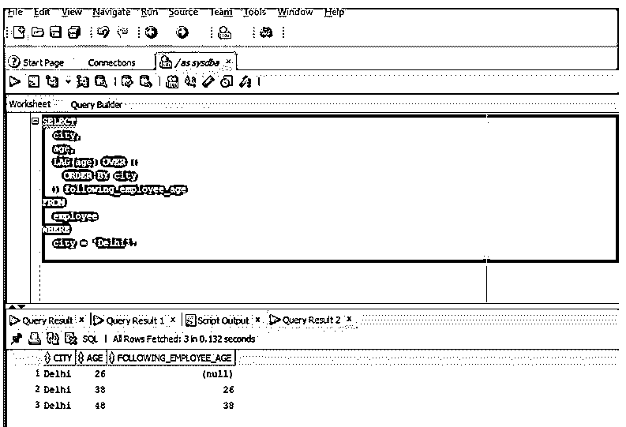

在屏幕截图中，我们可以看到最后一列的第一个值为 null，因为第一行没有前一行。

#### 6.第 n 个值

这是一个分析函数，顾名思义，它返回一组值中的第 n 个值。

**举例:**

在本例中，我们将根据表 vehicle 中的汽车制造商名称来查找第二贵汽车的价格。

**代码:**

`SELECT
VEHICLE_ID,
vehicle_name,
price,
NTH_VALUE(price,2) OVER (
PARTITION BY VEHICLE_NAME
ORDER BY price DESC
RANGE BETWEEN
UNBOUNDED PRECEDING AND
UNBOUNDED FOLLOWING
) AS second_expensive_car
FROM
vehicle;`

**输出:**

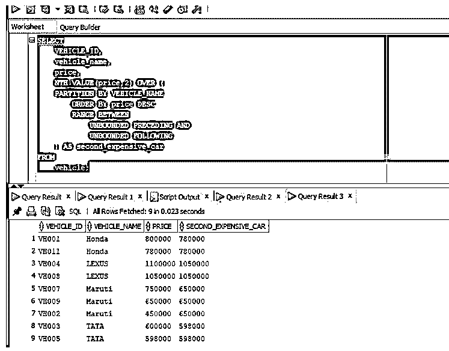

在屏幕截图中，我们可以看到最后一列显示了每种车型的第二贵价格。

#### 7.恩蒂莱

这是一个分析函数，它将有序集划分为多个时段，并为每一行分配一个时段号。

**举例:**

在本例中，我们将为每辆汽车分配一个存储桶编号，并将汽车的价格列分配给一个存储桶编号。

**代码:**

`SELECT
vehicle_name,
price,
NTILE(4) OVER(
ORDER BY price DESC
) bucket_number
FROM
vehicle;`

**输出:**

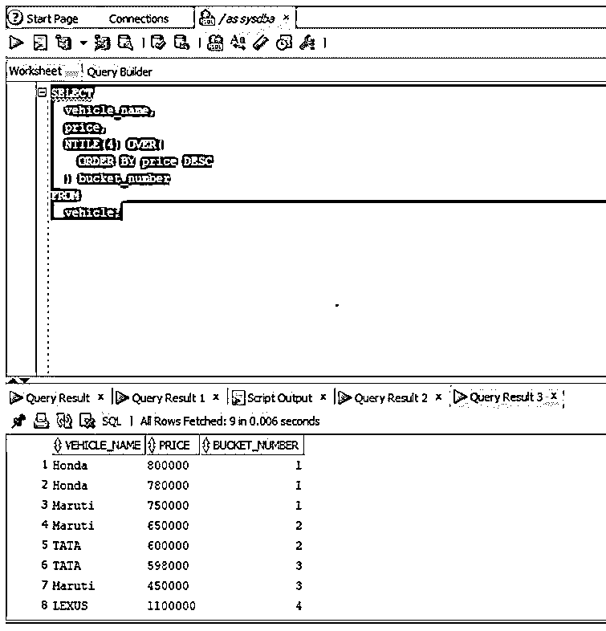

正如我们在上面的屏幕截图中看到的，价格列的每一行都被分配了一个数字。

#### 8.行数

它是一个分析函数，与 NTILE 不同的是，该函数为结果集的每一行分配一个唯一的序列号。

**举例:**

在本例中，当结果集按 sale 列排序并按降序排序时，我们为由 vehicle id、vehicle name、price、city 和 sale 组成的结果集分配一个行号。

**代码:**

`SELECT
ROW_NUMBER() OVER(
ORDER BY price DESC
) row_number,
vehicle_id,
vehicle_name,
city
FROM
vehicle;`

**输出:**

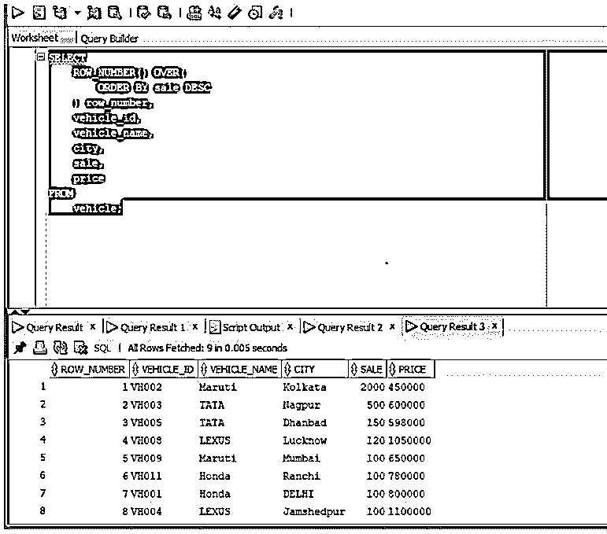

正如我们在屏幕截图中看到的，行号被分配给结果集的每一行。

#### 9.等级

它是一个分析函数，用于计算有序值集中某个值的排名。与 DENSE_RANK 不同的一个重要点是，来自该函数的秩可能不是连续数。

**举例:**

在本例中，我们将根据每辆车的价格，按降序查找其排名。

**代码:**

`SELECT vehicle_id, vehicle_name,
sale, RANK() OVER(ORDER BY sale desc)
RANK_NUMBER from
vehicle;`

**输出:**

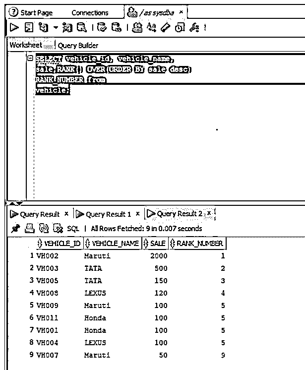

正如我们在屏幕截图中看到的，等级编号不是连续的。

#### 10.DIST CUME

顾名思义，它也是一个分析函数，用于计算一组值中某个值的累积分布。

**举例:**

在本例中，我们将获得每辆车的销售百分比。

**代码:**

`SELECT
vehicle_id,
sale,
ROUND(cume_dist() OVER (ORDER BY sale DESC) * 100,2) || '%' cumulative_dist
FROM
vehicle;`

**输出:**

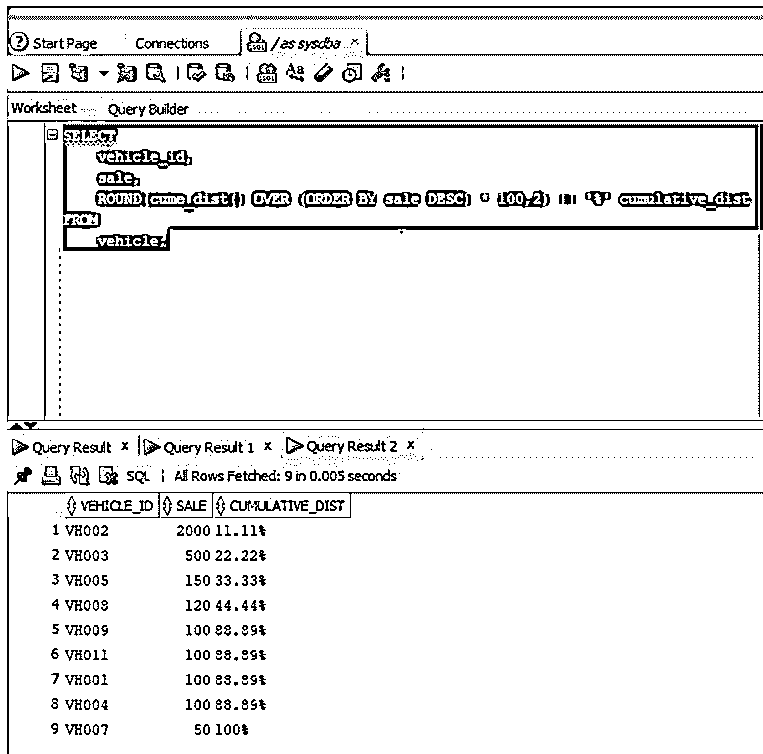

正如我们在截图中看到的，22%的汽车销量超过 500 辆。

#### 11.百分比排名

顾名思义，它是一个分析函数，用于计算一个值在一组有序值中的百分比排名。

**举例:**

在本例中，我们将计算表 vehicle 中每个 vehicle_id 的销售排名百分比。

**代码:**

`SELECT
ehicle_id,
sale,
ROUND(PERCENT_RANK() OVER (ORDER BY sale DESC) * 100,2) || '%' percent_rank
FROM
vehicle;`

**输出:**

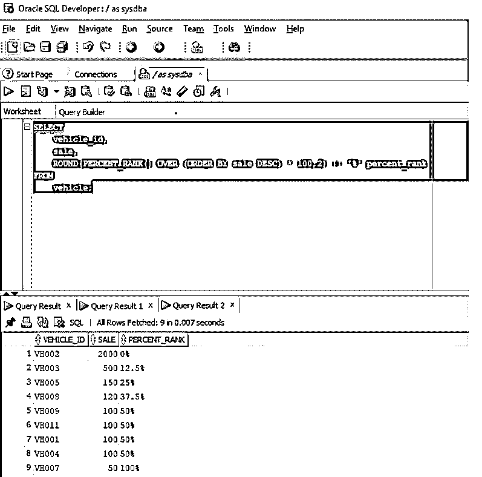

正如我们在屏幕截图中看到的，百分比等级范围包括 0%和 100%。

### 推荐文章

这是 Oracle 分析函数指南。这里我们讨论 Oracle 分析函数的介绍以及分析函数列表。您也可以看看以下文章，了解更多信息–

1.  [Oracle 锁表](https://www.educba.com/oracle-lock-table/)
2.  [IF THEN ELSE in Oracle](https://www.educba.com/if-then-else-in-oracle/)
3.  [Oracle 基数](https://www.educba.com/oracle-cardinality/)
4.  [Oracle While 循环](https://www.educba.com/oracle-while-loop/)

