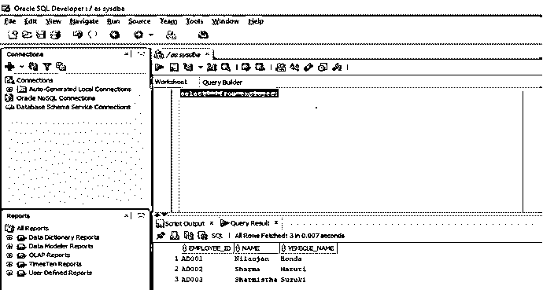
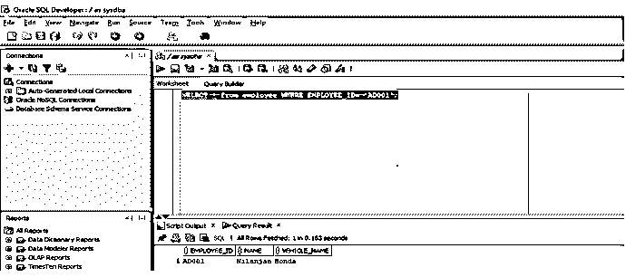
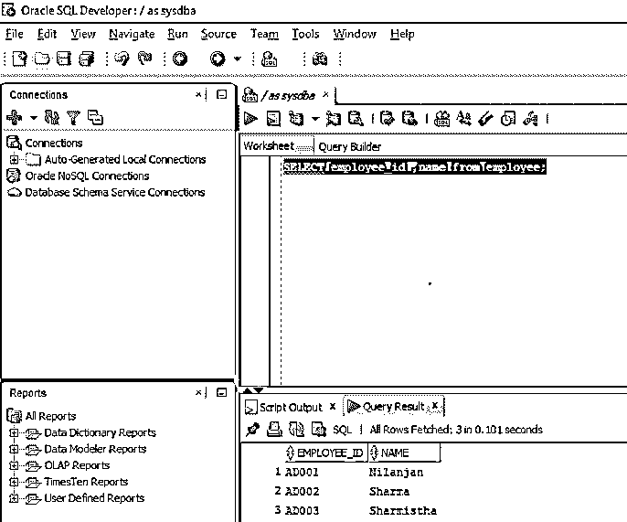
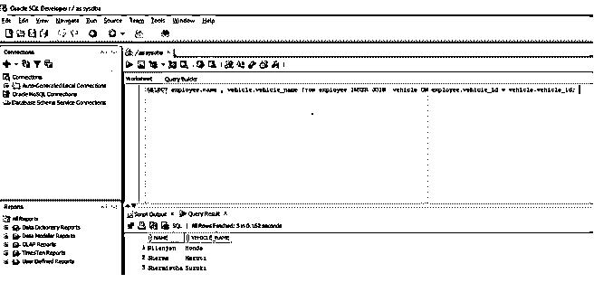
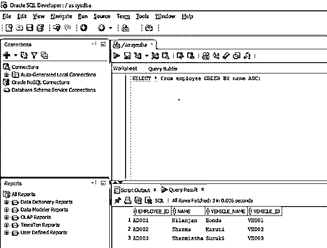
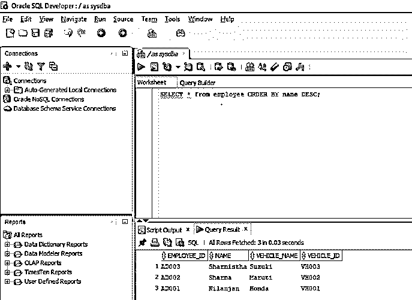
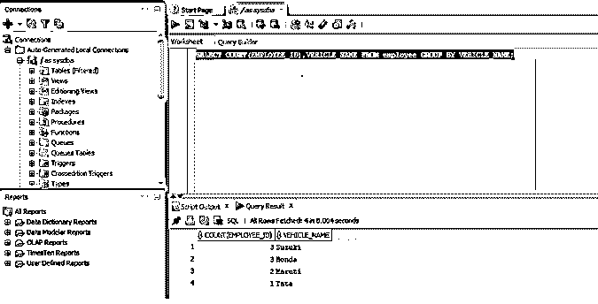
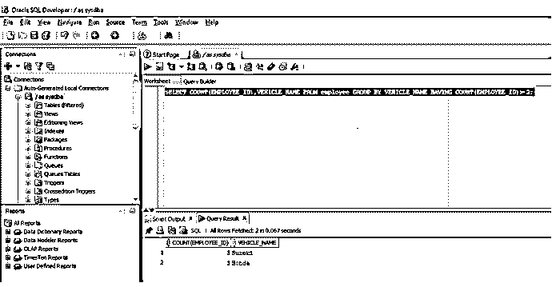

# 在 Oracle 中选择

> 原文：<https://www.educba.com/select-in-oracle/>

## Oracle 中的 Select 简介

Oracle 是业内使用最广泛的数据库之一。最常用的查询是选择查询。该查询用于从数据库中的一个或多个表中检索数据。SELECT 查询不仅可以单独使用，还可以与它一起使用，许多条件、子句和内部查询都用于从行业数据库中获取数据。SELECT 查询不处理它所执行的表中的任何数据。oracle 中的 Select 关键字用于获取一组数据，可以单独使用，也可以结合其他条件语句作为过滤器使用。当 select 语句为' SELECT * from <table_name>时，整个表显示为结果集，而 SELECT 语句为' SELECT *Column_1，Column _ 2*from<Table _ Name>时，只显示'< Table_Name >的 column_1 & column_2 的内容。Where '，' Group By '，' Order By '条件也可以应用于 Select 语句的末尾。</table_name>

**语法:**

<small>Hadoop、数据科学、统计学&其他</small>

`SELECT expressions
FROM tables
[WHERE conditions];`

语法中的前两行是语法的强制部分，但[WHERE conditions]是可选的，因为如果我们希望根据某些条件从一个或多个表中提取数据，就会使用它。语法中的“表达式”表示表中的列。如果我们想从表中提取所有字段，我们在语法中用' * '代替'表达式',否则我们用列名。

### 在 Oracle 中实施 Select 的示例

以下是 oracle 中 select 的不同示例:

#### 1.选择没有 WHERE 条件的所有字段

从表中选择所有字段:我们将使用' * '字符来表示我们希望从特定表中提取所有字段。

**查询:**

`SELECT * from employee;`

该查询将从表中获取所有记录，因为没有附加条件子句。

**输出:**

#### 2.使用 WHERE 条件选择所有字段

我们现在将在前面使用的查询中使用 where 条件。在这个查询中，我们只需要特定雇员的详细信息。为此，我们将使用 where 条件。让我们看看这个查询

**查询:**

`SELECT * from employee WHERE EMPLOYEE_ID= 'AD001';`

我们在这个查询中使用 EMPLOYEE_ID，因为它是这个表中的主键，所以是唯一的。

**输出:**

#### 3.从表中选择单个字段

在本例中，我们将使用 SELECT 语句从表中选择几个字段，但不是所有字段。让我们看看这个查询。

**查询:**

`SELECT employee_id, name from employee;`

此查询将只显示两列，因为我们在此查询中的 SELECT 后没有使用' * '。

**输出:**

#### 4.从多个表中选择字段

在本例中，我们将使用 SELECT 语句通过 JOIN 从多个表中检索数据。让我们看看这个查询。

**查询:**

`SELECT employee.name, vehicle.vehicle_name from employee INNER JOIN vehicle ON employee.vehicle_id = vehicle.vehicle_id;`

在这个查询中，我们使用 SELECT 语句，该语句基于 employees 表中的 vehicle id 应该与 vehicle 表中的 vehicle id 相匹配的条件来联接两个表。该查询显示雇员表中的雇员姓名和车辆表中的车辆名称。

**输出:**

#### 5.使用 SELECT 按顺序显示记录

通过在查询中使用 ORDER BY 子句，我们还可以按升序或降序显示特定的记录。我们将研究升序和降序查询。

**a .升序查询**

`SELECT * from employee ORDER BY name ASC;`

在这个查询中，我们显示所有记录，结果集按名称升序排序。
下面的截图显示了在 [SQL Developer](https://www.educba.com/what-is-sql-developer/) 中执行查询时的输出。

**输出:**

##### 

**b .降序查询**

`SELECT * from employee ORDER BY name DESC;`

在这个查询中，我们显示了表中的所有记录，结果集按名称降序排序
。下面的屏幕截图显示了在 SQL Developer 中执行查询时的输出。

**输出:**

#### 6.使用 GROUP BY 子句选择查询

当我们希望获得基于组的记录时，我们在 SELECT 语句中使用 GROUP BY 子句。所以基本上它将具有相同值的行分组。它通常与集合函数连用。它在生成摘要报告时很有用。

现在，我们将通过一个示例来了解如何在 oracle 数据库中使用 GROUP BY 和 SELECT 语句。

**查询:**

`SELECT COUNT(EMPLOYEE_ID),VEHICLE_NAME FROM employee GROUP BY VEHICLE_NAME;`

所以在上面的例子中，我们基本上是在寻找使用特定品牌汽车的员工数量。GROUP BY 根据汽车的类型对记录进行分组，然后我们使用聚合函数 COUNT，通过使用列 employee_id(因为它是表的主键)来计算每个组中的雇员数。

**输出:**

#### 7.使用 HAVING 子句选择查询

having 子句与 select 语句一起使用，其中我们希望有一些条件，如 where 关键字不能直接与聚合函数一起使用。这就是在 SQL 中添加 having 子句的原因。我们将看到一个如何在 select 语句中使用 having 子句的例子。

**查询:**

`SELECT COUNT(EMPLOYEE_ID),VEHICLE_NAME FROM employee GROUP BY VEHICLE_NAME HAVING COUNT(EMPLOYEE_ID)> 2;`

正如我们所看到的，我们在 GROUP 中添加了 HAVING 子句，根据该子句，我们可以设置一个条件，即只显示员工超过两人的车辆。这就是 HAVING 子句有用的地方。

**输出:**

如果我们看到输出，我们只得到两条记录，而不是使用 GROUP BY 函数时得到的五条记录。

### 结论

在本文中，我们学习了使用 SELECT 的语法和原因，还学习了用 SQL 编写 SELECT 查询的各种方法，以及应该在哪里以及出于什么原因使用它们。

### 推荐文章

这是在 Oracle 中选择的指南。在这里我们讨论 SQL 中的 select 查询的介绍和不同的例子。您也可以阅读以下文章，了解更多信息——

1.  [加入甲骨文](https://www.educba.com/joins-in-oracle/)
2.  [甲骨文数据仓库](https://www.educba.com/oracle-data-warehousing/)
3.  [敏捷甲骨文](https://www.educba.com/agile-oracle/)
4.  [什么是 Oracle 数据库](https://www.educba.com/what-is-oracle-database/)
5.  [甲骨文运算符|示例](https://www.educba.com/oracle-operators/)

