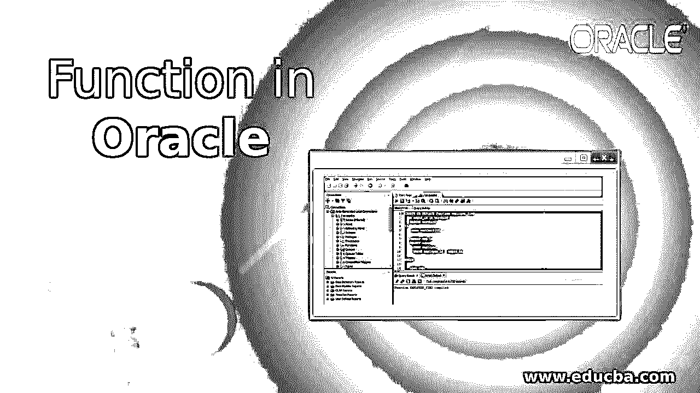
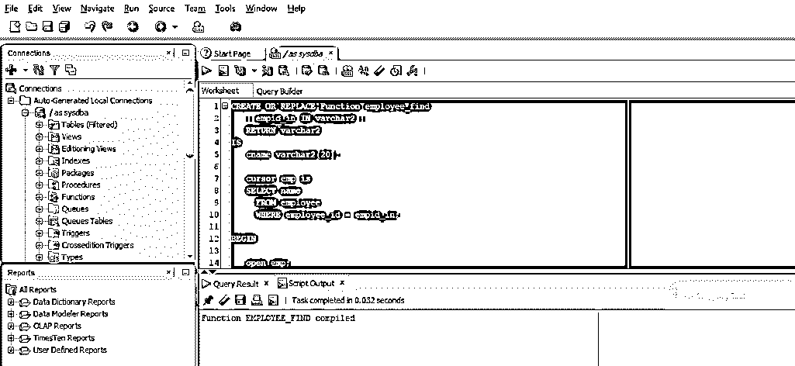
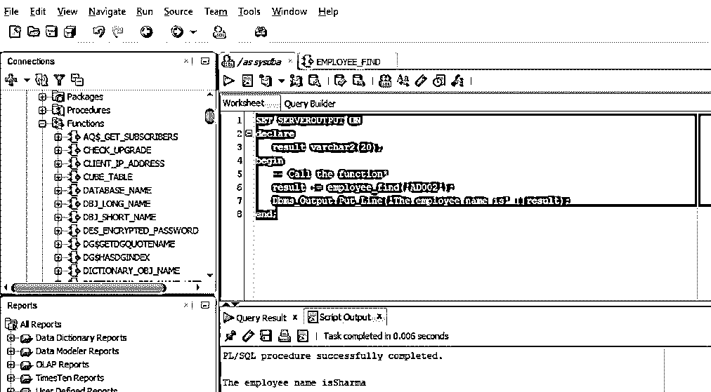
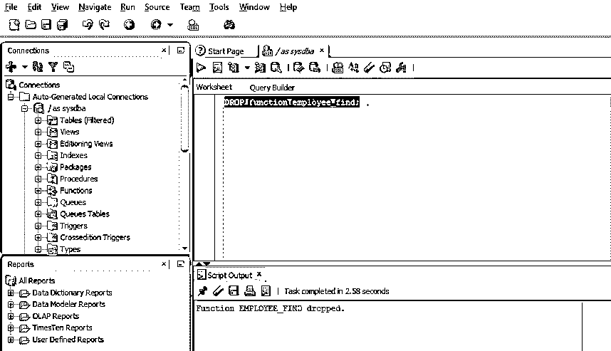

# Oracle 中的函数

> 原文：<https://www.educba.com/function-in-oracle/>

## Oracle 中的函数简介

函数是存储在 Oracle 数据库中返回值的子程序。它是一个存储的 PL/SQL 块，就像过程一样，但有一点不同。函数总是返回值，而过程可能返回值，也可能不返回值。在我们的操作中使用这些过程之前，我们必须声明并定义它们。在 PL/SQL 中，每当我们想要执行某个任务并在执行后返回某个值时，函数就非常重要。我们将在本文中进一步讨论函数。

**语法:**

<small>Hadoop、数据科学、统计学&其他</small>

为了更好地理解函数，让我们看一下 oracle 中函数的语法

**代码:**

`CREATE OR REPLACE FUNCTION  function_name(parameter) ] RETURN datatype
IS | AS
variable_name
BEGIN
Executable_section
EXCEPTION
[exception_section] END [function_name];`

**参数:**

*   函数名:函数的名称。
*   参数:我们传递给函数的参数。
*   variable_name:要在可执行部分中使用的变量名。
*   executable_section:这个部分用作函数的主体。
*   Exception_section:这个部分用于捕获异常(如果有的话)。
*   END:这标志着函数的结束。

### Oracle 中的函数是如何工作的？

*   函数是非常有用的 PL/SQL 块。它们的工作方式很像其他语言中的函数，我们通常用来执行特定的业务逻辑，但除了输出或响应之外。我们首先使用 PL/SQL 过程语言创建一个函数。如果我们想创建一个参数化的函数，那么我们就用函数传递参数。
*   之后，控制转到声明部分，在这里声明函数局部变量，之后，我们到执行部分，执行部分以 BEGIN 关键字开始。在这一节中，我们写函数体，这意味着函数的逻辑。以防在执行函数时执行部分出现异常。我们可以有一个异常部分来处理控件抛出的异常。END 关键字表示函数结束，执行结束。

**举例:**

因此，让我们看一个实际的例子来更好地理解函数是如何工作的。在本例中，我们将有两个步骤。第一步是在数据库中创建函数，第二步是通过调用函数和传递输入参数来执行函数。

因此，在本例中，我们将创建一个函数，当我们在函数中传递雇员 id 时，该函数将返回雇员的姓名。让我们看看下面创建函数的查询。

创建函数的 PL/SQL 块:

**代码:**

`CREATE OR REPLACE Function employee_find
( empid_in IN varchar2 )
RETURN varchar2
IS
cname varchar2(20);
cursor emp is
SELECT name
FROM employee
WHERE employee_id = empid_in;
BEGIN
open emp;
fetch emp into cname;
if emp%notfound then
cname := 'NO RECORDS';
end if;
close emp;
RETURN cname;
EXCEPTION
WHEN OTHERS THEN
raise_application_error(-20001,'An error was encountered - '||SQLCODE||' -ERROR- '||SQLERRM);
END;`

如果我们查看查询，我们可以看到该函数将一个参数作为变量。该函数的返回类型被设置为 varchar2，因为我们返回的是雇员的姓名。然后，我们创建一个游标，以便将从 SELECT 语句中检索到的记录存储到内存位置。然后，程序将这个值(在我们的例子中是返回的雇员姓名)放入我们在声明部分声明的变量 cname 中。如果光标为空，则函数将返回“无记录”,如果光标不为空，则函数将返回局部变量。如果在执行期间有任何运行时异常，那么有一个单独的异常部分来处理异常。END 语句表示函数的结束。

让我们在 SQL developer 中运行 PL/SQL 程序并查看输出。

正如你所看到的，函数已经被成功编译，这意味着我们现在可以使用这个函数了。现在让我们执行这个函数。为此，我们将创建一个 PL/SQL 块，并声明一个变量来存储函数返回的值。然后将变量作为输出打印出来。

执行该函数的 PL/SQL 块如下所示。

**代码:**

`SET SERVEROUTPUT ON
declare
result varchar2(20);
begin
-- Call the function
result := employee_find('AD002');
Dbms_Output.Put_Line('The employee name is' ||result);
end;`

现在让我们在 SQL developer 中执行上面的 PL/SQL 块。并检查输出。

如您所见，输出显示了雇员的姓名。

### 如何在 Oracle 中删除函数？

一旦我们创建了一个函数，它就被保存在数据库中。要从数据库中删除该函数，我们需要删除该函数。我们需要使用 DROP 关键字来删除该函数。让我们看看如下所示的查询。

**查询:**

`DROP function employee_find;`

现在让我们在 SQL developer 中运行上面的 SQL 查询并检查输出。

正如我们所看到的，输出显示 PL/SQL 函数已经从数据库中删除。

### 使用功能的优势

让我们看看在 PL/SQL 中使用存储函数的一些优点

*   它提高了数据库性能，因为编译是由 Oracle 引擎自动完成的。
*   每当调用存储函数时，oracle 引擎都会将该函数加载到内存区域 SGA 中，因此执行速度非常快。
*   它提供了可重用性，因为用户可以在需要时重用代码块。
*   它保持了完整性，因为它们被 Oracle 引擎存储为 Oracle 数据库对象。

### 推荐文章

这是 Oracle 中的功能指南。在这里，我们讨论介绍，函数如何在 Oracle 中工作，如何使用 drop function 以及示例、语法。您也可以浏览我们推荐的其他文章，了解更多信息——

1.  [Oracle 中的分组依据](https://www.educba.com/group-by-in-oracle/)
2.  [甲骨文联合所有](https://www.educba.com/oracle-union-all/)
3.  [甲骨文运算符](https://www.educba.com/oracle-operators/)
4.  [甲骨文中的减号](https://www.educba.com/minus-in-oracle/)

