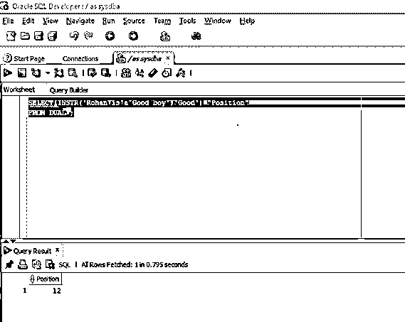
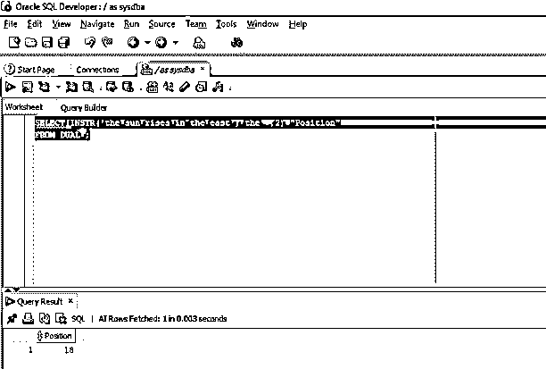
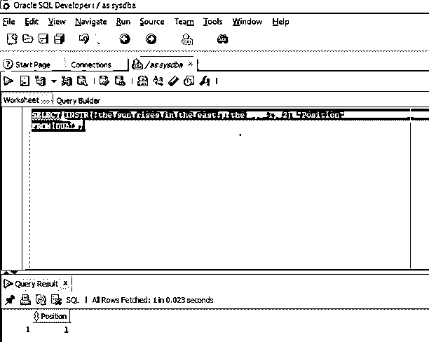
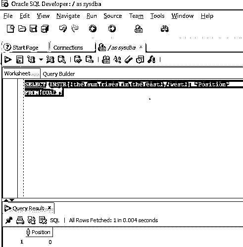

# Oracle INSTR()

> 原文：<https://www.educba.com/oracle-instr/>

## Oracle INSTR 简介()

Oracle 中的 INSTR()函数(INSTR、INSTRB、INSTRC、INSTR4 和 INSTR2)可以定义为用于查找字符串中存在的子字符串的位置的函数，这意味着函数 INSTR()在整个字符串中搜索所提到的子字符串，然后返回字符串中存在的子字符串的第一个字符的位置，当搜索为真时，函数返回非零整数，当搜索为假时，函数返回零。

**语法**

<small>Hadoop、数据科学、统计学&其他</small>

现在让我们讨论 INSTR()函数的语法

`INSTR (original_string, substring [, start_position [, occurence] ]`

**参数**

*   **original_string:** 是指我们要搜索的字符串。
*   **substring:** 是指我们要在字符串中查找的子串。
*   **start_position** :可选，一般指原始字符串中开始搜索的位置。如果没有提供值，默认值将设置为 1。默认值为 1。
*   **occurrence:** 可选，一般为整数，表示 INSTR 函数在字符串中要查找的子串的出现次数。

### Oracle 中 INSTR()函数是如何工作的？

oracle 中 INSTR()函数的工作非常简单。我们必须在 INSTR 函数中强制输入两个参数作为参数。第一个参数是我们要搜索的字符串，第二个参数是我们要在字符串中搜索的子字符串。因此，只要我们执行函数，它就搜索函数中提到的子串，如果在字符串中找到与传递的子串相等的子串，那么函数返回一个非零整数，指示子串的第一个字符的位置，如果在字符串中没有找到匹配，那么它返回整数 0。默认的起始位置是 1，但是如果用户想从特定的位置开始搜索字符串，他可以使用可选的参数 start_position 来实现，如本文前面的参数部分所述。

### 实施 Oracle INSTR()的示例

现在，我们将通过本节中的各种示例来更好地理解该函数。

#### 1.对偶表上的 INSTR()函数

我们知道 dual 是 SQL 中的一个虚拟表，由数据库自动创建。因此，在本例中，我们将在字符串“Rohan is a good boy”中找到一个名为“Good”的子字符串。在这个例子中，我们将使用 INSTR 函数。

让我们看看下面的查询

**代码:**

`SELECT INSTR ('Rohan is a Good boy', 'Good') "Position"
FROM DUAL;`

在上面的查询中，我们可以看到第一个参数传递了我们想要搜索的字符串，第二个参数传递了子字符串。

**输出:**让我们在 SQL developer 中运行查询并检查结果。

正如我们看到的，子串的位置是 12。

#### 2.带有可选起始位置参数的 INSTR()函数

我们将使用可选的起始位置参数作为函数的输入参数来研究 INSTR()函数的行为。在这个例子中，我们将从原始字符串的第三个位置开始搜索子字符串。这里的原始字符串是“太阳从东方升起”，要搜索的子字符串是“the”。让我们看看同样的查询。

**代码:**

`SELECT INSTR ('the sun rises in the east', 'the', 2) "Position"
FROM DUAL;`

在上面的查询中，我们可以看到我们给了位置 2，这意味着函数将从字符串的第二个位置开始搜索。

**输出:**让我们在 SQL developer 中执行查询并查看结果。

正如我们在上面的截图中看到的，该函数返回子串的位置。

#### 3.带有所有可选参数的 INSTR()函数

我们将研究一种情况，在这种情况下，我们在函数中传递所有四个参数，即字符串、子字符串、起始位置和出现次数。所有这些都已经在参数部分讨论过了。在本例中，我们将从后向开始搜索子字符串的第二次出现。这里使用的字符串将是“太阳从东方升起”，子字符串是“the”。让我们看看同样的查询。

**代码:**

`SELECT INSTR ('the sun rises in the east', 'the', -1, 2) "Position"
FROM DUAL;`

在上面的查询中，值-1 表示字符串从后向开始，值 2 表示子字符串的第二次出现。

**输出:**让我们在 SQL developer 中执行查询并检查结果。

正如我们在输出中看到的，该函数返回子字符串第二次出现的位置，从后开始。

#### 4.带有错误匹配的 INSTR()函数

我们将研究子串不在字符串中的情况。在本例中，我们将搜索字符串中不存在的子字符串。串是“太阳从东方升起”，子串是“西方”。让我们看看同样的查询。

**代码:**

`SELECT INSTR ('the sun rises in the east', 'west') "Position"
FROM DUAL;`

**输出:**让我们在 SQL developer 中执行查询并检查结果。

在上面的截图中我们可以看到，由于字符串中没有子串“west”。该函数返回值零。

### 结论

在本文中，我们讨论了 INSTR()函数的定义以及该函数的语法。在文章中，我们还讨论了函数的各种情况，并试图通过例子的帮助来更好地理解它。

### 推荐文章

这是 Oracle INSTR()的指南。这里我们讨论 Oracle INSTR()的介绍，语法，它是如何工作的，并举例说明以便更好地理解。您也可以浏览我们的其他相关文章，了解更多信息——

1.  [Oracle 子查询](https://www.educba.com/oracle-subquery/)
2.  [甲骨文程序。](https://www.educba.com/oracle-procedures/)
3.  [Oracle 中的 DISTINCT](https://www.educba.com/distinct-in-oracle/)
4.  [在 Oracle 中获取](https://www.educba.com/fetch-in-oracle/)

