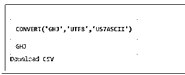
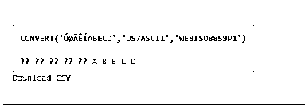
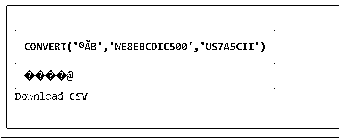
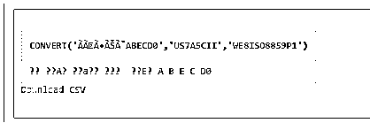

# Oracle 转换

> 原文：<https://www.educba.com/oracle-convert/>

## Oracle 转换函数的定义

*   Oracle Convert 函数负责将字符串值从一种字符集转换为另一种字符集。在这里，字符集可以定义为一组字符及其符号化方式。
*   一般来说，这个 convert()函数经常被实现来准确地存储在具有错误字符集的服务器数据库中的数据值。
*   该 Oracle Convert()功能可以在 Oracle 的某些版本中实现，例如 Oracle 11g、Oracle 12c、Oracle 9i、Oracle 8i 和 Oracle10g。
*   您应该注意到，Oracle Convert 函数不执行数据类型之间的转换，这可能是我们中的一些人所认为的。对于数据类型的转换，我们可以选择其他 Oracle 函数，如 TO_DATE、CAST、TO_NUMBER 和 TO_CHAR。

**语法:**

下面的语法代码结构将 Oracle Convert()函数表示为:

<small>Hadoop、数据科学、统计学&其他</small>

`CONVERT (string_expr,to_data_set {, from_data_set});`

让我们解释一下在 Oracle 中接受三个参数的 convert()函数的参数，如下所示:

*   **String_expr:** 表示需要转换字符集的字符串值。它包括 CHAR、NCHAR、VARCHAR2、NVHARCHAR2、CLOB 和 NCLOB 等数据类型。
*   **To_data_set:** 表示 string_expr 转换到的字符集名称。
*   **From_data_set:** 它定义了字符集名称，用于在服务器数据库中存储 string_expr 值。这个参数可以说是可选的，它的默认值是数据库的字符集。
*   **返回值:**这个 Oracle convert()函数由转换后的字符集中的一个字符串值产生。

下面列出了关于该函数的一些额外注意事项:

*   类型参数 CHAR 和 VARCHAR2 的返回数据类型是 VARCHAR2。
*   类型参数 NCHAR 和 NVARCHAR2 的返回数据类型是 NVARCHAR2。
*   对于 CLOB 数据类型，返回类型是 CLOB。
*   对于 NCLOB 数据类型，返回类型是 NCLOB。
*   to_data_set 和 from_data_set 可以是文字字符串，也可以是数据库中的任何表列。

公共字符集包括:

*   US 7 ASCII–US 7 位 ASCII 字符集
*   we 8 ebc DIC 1047–IBM 西欧 EBCDIC 代码页 1047
*   we8 ISO8859P1–ISO 8859-1 西欧 8 位字符集
*   ja16s jistilde–日文 Shift-JIS 字符集，与 MS 代码页 932 兼容
*   ee8ms win 1250–Microsoft Windows 东欧代码页 1250
*   we8mswin 1252–Microsoft Windows 西欧代码页 1252
*   al 32 utf 8–Unicode 5.0 通用字符集 UTF-8 编码格式。
*   UTF8–Unicode 3.0 通用字符集 CESU-8 编码格式
*   zht 16 mswin 950–Microsoft Windows 繁体中文代码页 950
*   F7 DEC–DEC 法语 7 位字符集

### Oracle 中的 convert 函数是如何工作的？

*   除了 SQL 中的实用函数之外，Oracle 内置函数库还包含转换函数。可能存在不同的场景，在这些场景中，SQL 查询假定输入是确定的数据类型，而接受输出是改变的数据类型。在这种情况下，Oracle 会间接地尝试将无法预测的值转换为可以就地替换的匹配良好的数据类型，并且不会影响应用程序的稳定性。这里，数据类型转换过程要么由程序员显式执行，要么由 Oracle 隐式执行。
*   基于矩阵的隐式数据类型转换函数展示了 Oracle 对内部类型转换的维护。此外，在这些过程中，Oracle 提供了类型转换功能，可以在开放式转换和结构化查询中实现。作为一个信息问题，因此建议执行转换作为信任软件智能的替代方案。虽然隐式转换功能很好，但要消除错误输入对类型转换造成问题的偏斜概率。
*   Oracle 建议不得在其数据库的主流版本中实现 convert()函数。这是因为输出返回的数据类型是字符数据类型，如 CHAR、VARCHAR、VARCHAR2、NCHAR、NVARCHAR2、CLOB 和 NCLOB。当 from_data_set 不固定为国家字符集或数据库字符集不被维护时。
*   不支持不包含在这两个字符集中的任何 from_data_set。因此，数据库和国家字符集中都不存在的值必须经过处理，并且可以保存为 BLOB 或 RAW。

### 例子

让我们来看看这个 Oracle Convert()函数的一些示例:

1.将字符串值从 ANSI 字符集转换为 UTF8 字符集，如下所示:

`SELECT CONVERT ('GHJ', 'utf8', 'us7ascii') FROM dual;`

**输出:**

在这里，上面的例子解释了使用 Oracle Convert()函数将出现在 US7ASCII 中的字符集“GHJ”转换为 UTF8 字符集。这个结果类似于将一个相同的字符串从 US7ASCII 数据库导入到 UTF8 数据库。

2.将字符串值的字符集从 Latin-1 转换为 ASCII，如下所示:

`SELECT CONVERT('Ó Ø Ä Ê Í A B E C D', 'US7ASCII','WE8ISO8859P1') FROM DUAL;`

**输出:**

这里，上面的实例阐明了使用 Oracle Convert()函数将 WE8ISO8859P1 中指定的字符集转换为 US7ASCII 字符集。这个结果类似于将一个相同的字符串从 WE8ISO8859P1 数据库导入到 US7ASCII 数据库。

3.Oracle Convert 函数可以直接在 SQL 中转换一个内容文件的字符集，例如:

`SELECT Convert('®Ã B','WE8EBCDIC500','US7ASCII')FROM DUAL;`

**输出:**

基本上，实现 convert 函数是为了将文本数据从一个特定的字符集转换为另一个指定的字符集。下面是一个示例，显示了 convert 函数将不可打印的英文字符串字母字符转换为等效的美国字符集，如下所示:

`SELECT CONVERT('à à Õ Ê Ø A B E C D0','US7ASCII','WE8ISO8859P1') FROM DUAL;`

**输出:**

这里，原始类型的英文字母从先前定义为 WE8ISO8859P1 集的字符集转换为 US7ASCII 字符集，we 8 集是表示 ISO 8859-1 西欧 8 位集的字符集。

### 结论

*   我们已经讨论了一个 Oracle 转换函数，即 CONVERT()，它接受一个字符集中的字符串值，并输出另一个特定字符集中的值。
*   这个 Oracle convert()函数建议仅在需要纠正以不正确的字符集保存或排列的数据值时执行。

### 推荐文章

这是 Oracle CONVERT 的指南。这里我们讨论定义、语法、参数，以及 Oracle 中 convert 函数是如何工作的？分别是。您也可以看看以下文章，了解更多信息–

1.  [Oracle XML 类型](https://www.educba.com/oracle-xmltype/)
2.  [甲骨文存在](https://www.educba.com/oracle-exists/)
3.  [甲骨文日期格式](https://www.educba.com/oracle-date-format/)
4.  [甲骨文 XML](https://www.educba.com/oracle-xml/)

