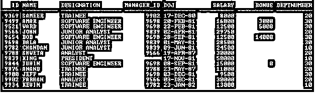
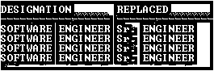
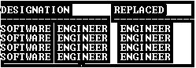
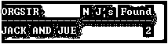
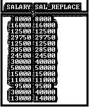

# Oracle 替换()

> 原文：<https://www.educba.com/oracle-replace/>

## Oracle REPLACE 简介()

顾名思义，Oracle REPLACE 函数用于用给定的字符串替换字符串。它接受一个搜索字符串，并用另一个给定的字符串替换它，但这是基于模式的。

*   它返回 CHAR，每个替换为搜索字符串的替换字符串。
*   如果第一个参数不是 LOB，则返回 VARCHAR2。
*   如果第一个参数是 LOB，则返回 CLOB。
*   它返回被替换字符串替换的搜索字符串的每个匹配项。
*   如果替换字符串被省略或为空，则搜索字符串的所有匹配项都将被删除。
*   它用一个字符串替换另一个字符串，并删除字符串。

### 句法

`REPLACE(CHAR, Search_str, Replace_str)`

<small>Hadoop、数据科学、统计学&其他</small>

**说明:**

*   CHAR:它可以是一个列名或字符串，用来用另一组字符替换一个字符序列。
*   Search_str:将在 CHAR 中搜索的字符串。
*   Replace_str:它是一个字符串，将替换 CHAR 中的 Search_str。它是可选的。如果 Replace_str 已省略或为 NULL，将删除 Search_str 的所有匹配项。

| **参数** | **数据类型** |
| 茶 | CHAR、VARCHAR2、NCHAR、NVARCHAR2、CLOB 或 NCLOB |
| 搜索 _ 字符串 | CHAR、VARCHAR2、NCHAR、NVARCHAR2、CLOB 或 NCLOB |
| 替换 _ 字符串 | CHAR、VARCHAR2、NCHAR、NVARCHAR2、CLOB 或 NCLOB |

### Oracle 中 REPLACE()函数是如何工作的？

如 REPLACE 函数语法所示，它最多接受三个参数。它们是 CHAR、Search_str 和 Replace_str。因此，该函数获取 Search_str 并在 CHAR 中搜索它，如果找到任何匹配或出现的内容，则用 Replace_str 替换它并返回更新后的 CHAR 值。如果没有找到任何匹配，则返回现有的 CHAR 值。这里 Replace_str 是一个可选参数。在删除匹配字符串的情况下，它可以被省略或为空。但是不能省略 Search_str，否则它会返回“缺少表达式”错误。

### 实现 REPLACE()函数的示例

下面是提到的一些例子:

在本节中，我们将看到 Oracle REPLACE 函数的实现及其行为。为此，我们将使用下面包含 14 条记录的示例表(Employee)来理解 Oracle REPLACE()函数的行为。

`SELECT * Employee;`

**输出:**

#### 示例#1

用所有三个参数替换( )函数

**代码:**

`SELECT Designation, REPLACE(Designation,'SOFTWARE','Sr.') Replaced FROM        Employee WHERE Designation='SOFTWARE ENGINEER';`

**输出:**

**解释:**在上面的例子中，用“高级工程师”替换“软件工程师”的函数。因为 Search _ str(' SOFTWARE ')搜索 Designation 列中的匹配项以及它找到的位置，用给定的 Replace_str ('Sr . ')替换它并返回更新后的结果。

**代码:**

`SELECT 'JACK AND JUE' OrgStr, REPLACE('JACK AND JUE','J','BL') Replace FROM DUAL;`

**输出:**

**解释:**上例中的‘J’被‘BL’代替。这里的“J”是一个单字符，而“BL”是双字符，因为 REPLACE 函数是作为字符串而不是字符运行的。这就是为什么“J”被“BL”取代的原因。

#### 实施例 2

不带 Replace_str 的 REPLACE()函数

**代码:**

`SELECT Designation, REPLACE(Designation,'SOFTWARE') Replaced FROM Employee WHERE Designation='SOFTWARE ENGINEER';`

**输出:**

**解释:**在上面的例子中，用‘工程师’替换‘软件工程师’的函数。因为 Search _ str(' SOFTWARE ')搜索 Designation 列中的匹配项以及它找到的位置，所以它会被删除，因为 Replace_str 被省略了。

#### 实施例 3

不带 Search_str 的 REPLACE()函数

**代码:**

`SELECT Designation, REPLACE(Designation, ,'Sr.') Replaced FROM Employee WHERE Designation='SOFTWARE ENGINEER';`

**输出:**

**说明:**上例省略了 REPLACE 函数的 Search_str 参数。因为它是一个强制参数，所以它返回一个“缺少表达式”错误。

#### 实施例 4

用于查找 Search_str 出现次数的 REPLACE()函数

**代码:**

`SELECT 'JACK AND JUE' OrgStr, LENGTH('JACK AND JUE')-LENGTH(REPLACE('JACK AND JUE', 'J')) "N J's Found" FROM DUAL;`

**输出:**

**说明:**在上面的例子中，用 LENGTH 函数代替起着至关重要作用的函数，求出 Search_str 出现的次数。

LENGTH(REPLACE('杰克和 JUE '，' J '):在这个部分中，REPLACE 函数删除了' J '，因为 Replace_str 被省略了，然后 LENGTH 函数计算 CHAR 参数的长度('杰克和 JUE ')，该长度变为 10。

长度('杰克和 JUE '):在这个部分长度函数计算字符参数的长度('杰克和 JUE ')是 12。然后 Subtract 函数(-)将其减去 12-10，并返回 Search_str 出现的次数。

**温馨提示:**

1.  替换功能的功能类似于翻译功能。翻译单个字符，一对一替换，而替换提供字符串
2.  替换函数可以用作嵌套替换函数。

**代码:**

`SELECT 'JACK AND JUE' OrgStr, REPLACE(REPLACE('JACK AND JUE','J', 'BL'), ’BL’, ’TR’) Replace FROM DUAL;`

**输出:**

#### 实施例 3

REPLACE 函数可以应用于 NUMBER 数据类型列。

**代码:**

`SELECT Salary, REPLACE(Salary, 30, 40) Sal_Replace FROM Employee;`

**输出:**

### 结论

Oracle REPLACE()函数是非常有用的字符串替换函数。这个函数可以用来计算 Search_str 出现的次数。这是替换字符串的最简单的方法。

### 推荐文章

这是 Oracle REPLACE()的指南。在这里，我们讨论 Oracle REPLACE()的介绍以及语法、工作原理和示例，以便更好地理解。您也可以浏览我们的其他相关文章，了解更多信息——

1.  [Oracle 唯一约束](https://www.educba.com/oracle-unique-constraint/)
2.  [在 Oracle 中获取](https://www.educba.com/fetch-in-oracle/)
3.  [Oracle 子查询](https://www.educba.com/oracle-subquery/)
4.  [甲骨文提交](https://www.educba.com/oracle-commit/)

