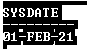
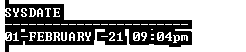
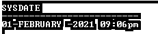
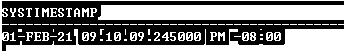
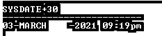

# Oracle 日期格式

> 原文：<https://www.educba.com/oracle-date-format/>

## Oracle 日期格式的定义

oracle 为用户提供了不同的功能和格式，从不同的格式我们有一个日期格式，Oracle 数据库以一种简单明了的方式处理日期格式，非常容易理解，但是许多客户端和 PL/SQL 开发人员对数据格式感到困惑。最大的问题是他们不知道日期是如何存储在数据库中的，也就是日期的正确格式。因此，原因日期格式命令为对象分配标准格式，它有不同类型，如日期时间、时间戳、时间戳 _TZ、时间戳 _LTZ 和 DSINTERVAL 等。日期格式用于描述我们用来存储数据的日期格式。模板不能改变数据库的区间表示，但是当我们把字符串转换成日期时，那时模板决定 OLAP 如何解释字符串。

**语法:**

<small>Hadoop、数据科学、统计学&其他</small>

`date_format [specified date time format template]`

**解释**

在上面的语法中，我们使用日期格式命令来指定数据库中使用的日期格式。这里指定的数据时间格式组成一个或多个日期和时间格式，用于插入或显示数据库中的记录。

### 日期格式在 Oracle 中是如何工作的？

现在让我们看看 oracle 中的日期格式如下。

Oracle 使用标准的输入和输出格式，即**DD–MON–YY**，该格式由 NLS _ 日期 _ 来源参数控制。

当用户显示日期值时，oracle 首先将该日期值转换为指定的内部格式，这种转换是通过使用 TO_CHAR 函数根据日期格式完成的。oracle 的默认日期格式是 DD–MON–YY。

系统日期使用如下数据函数。

*   **CURRENT_DATE:** 该函数用于显示当前时区在本系统中的当前日期。
*   **SYSDATE:** 也用于返回系统的当前日期。
*   **SYSTIMESTAMP:** 此函数返回系统当前的日期和时间，以秒为单位。

TO_CHAR 函数的一般用法如下。

*   **MM:** 用于以数字格式显示月份，例如: **05** 。
*   **MON:** 该格式用于显示带有名称的月份，例如 **JAN** 。
*   **月:**使用这种格式我们可以显示月的全称，例如**六月**
*   **DD:** 这用于显示一个月中的某一天，例如 **21。**
*   **DY:** 这种格式用来显示一天的名称，例如**孙。**
*   **YYYY:** 这四个 Y 用来显示年份，例如 **2020。**
*   YY: 通过使用这种格式，我们可以显示年份的最后两位数字，例如 **21。**

### 例子

现在我们来看一个不同的日期格式的例子，如下所示。

假设我们需要查看当前的系统数据。当时我们使用如下语句。

`select sysdate from dual;`

**解释**

在上面的例子中，我们使用 select sysdate 函数来检查系统当前日期，这里 dual 是一个表名，它是由 oracle 数据库用 data directory 自动创建的，所有用户都可以访问它。我们使用下面的快照来说明上述查询的最终输出。

日期的格式取决于 NLS 日期格式参数，假设我们需要以日期-月份-年份格式显示日期和时间，这时我们可以使用下面的语句。

`alter session set NLS_DATE_FORMAT='DD-MONTH-YY HH: MIpm';`

**解释**

在上面的语句中，我们使用 alter session 命令按照上面语句中所示的要求更改日期格式。我们使用下面的快照来说明上述查询的最终输出。

现在我们可以使用下面的语句来检查日期。

`select sysdate from dual;`

假设用户需要以 DD–MONTH–YYYY 格式显示日期和时间，我们可以使用如下语句。

`alter session set NLS_DATE_FORMAT=’DD-MONTH-YYYY HH:MIpm’;`

**解释**

在上面的语句中，我们使用 alter session 命令按照上面语句中所示的要求更改日期格式。我们使用下面的快照来说明上述查询的最终输出。

现在我们可以使用下面的语句来检查日期。

`select sysdate from dual;`

**例子**

假设用户需要显示日期和时间，我们可以使用如下语句。

`select systimestamp from dual;`

**解释**

我们使用下面的快照来说明上述查询的最终输出。

**例子**

我们可以根据我们的要求将日期转换成不同的格式，此时我们可以用日期格式来调用函数，如下所示。

`Select to_char(sysdate,'DAY')"Todays_Day" FROM DUAL;`

**解释**

在上面的例子中，我们使用 TO_CHAR 函数将日期转换成不同的格式。我们使用下面的快照来说明上述查询的最终输出。

**例子**

假设用户需要以 2021 年 1 月 8 日星期日的格式显示一个日期，这样我们就可以使用下面的语句。

`select to_char(sysdate,'Day, ddth Month, yyyy')"Todays_Day" from dual;`

**解释**

我们使用下面的快照来说明上述查询的最终输出。

**例子**

用户需要知道 2020 年 8 月 15 日是哪一天，我们可以使用如下语句。

`select to_char(to_date('15-aug-2020','dd-mon-yyyy'),'Day')from dual;`

**解释**

我们使用下面的快照来说明上述查询的最终输出。

**例子**

现在假设我们需要知道 30 天后哪一天会发生，我们可以使用下面的语句。

`select sysdate+30 from dual;`

**解释**

我们使用下面的快照来说明上述查询的最终输出。

### 日期格式的规则和规定

*   格式模型不能改变数据库中数据值的内部表示。所以我们可以用 TO_CHAR 格式。
*   oracle 中的日期格式使用数据库的返回值。
*   我们可以为 oracle 指定存储在数据库中的数据值的格式。

### 结论

我们希望通过这篇文章，您已经了解了 **Oracle 日期格式。从这篇文章中，我们学习了**日期格式**的基本语法，也看到了**日期格式**的不同例子。从本文中，我们了解了如何以及何时使用 **Oracle 日期格式。****

### 推荐文章

这是 Oracle 日期格式指南。这里我们讨论定义，日期格式在 Oracle 中是如何工作的？示例分别用代码实现。您也可以看看以下文章，了解更多信息–

1.  [甲骨文克隆数据库](https://www.educba.com/oracle-clone-database/)
2.  [Oracle 表空间](https://www.educba.com/oracle-tablespace/)
3.  [Oracle INSTR()](https://www.educba.com/oracle-instr/)
4.  [甲骨文唯一索引](https://www.educba.com/oracle-unique-index/)

