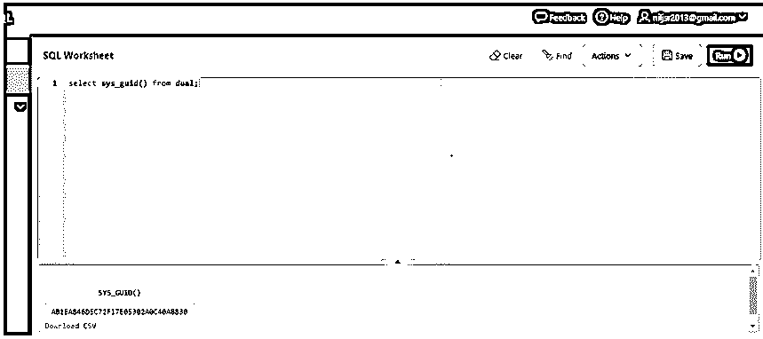
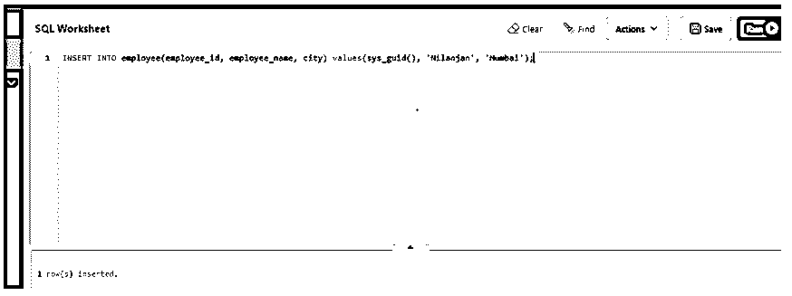
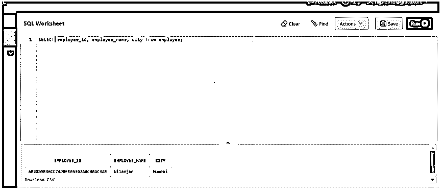
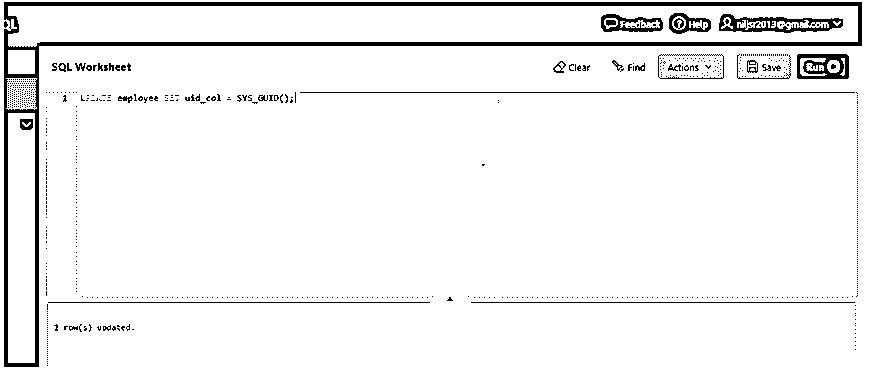
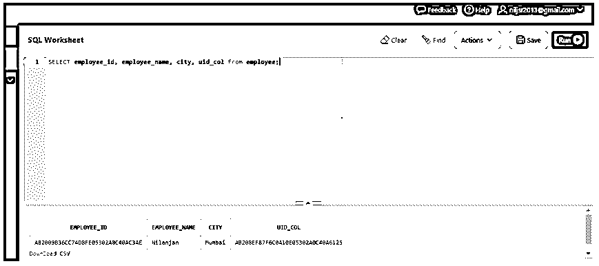

# Oracle SYS_GUID()

> 原文：<https://www.educba.com/oracle-sys_guid/>

## Oracle SYS_GUID()的定义

oracle 数据库中的 SYS_GUID()函数可以定义为 PL/SQL 中的内置函数，用于为表中的每一行生成并返回大小为 16 字节的全局唯一标识符(GUID)(原始值),它不接受函数中的任何参数，它生成 GUID，这些 GUID 应该是唯一的，这意味着它们不应重复两次，它还包含主机标识符、调用该函数的进程的进程或线程标识符。

**语法:**

<small>Hadoop、数据科学、统计学&其他</small>

在上一节中，我们讨论了函数的定义。在这一节中，我们将讨论函数的语法。下面让我们来看看这个函数的语法。

`SYS_GUID()`

需要记住的重要一点是，这个函数没有参数。

### SYS_GUID()在 Oracle 中是如何工作的？

在本节中，我们将讨论 Oracle 数据库中 sys_guid 内置函数的工作原理。此函数生成 RAW 类型的唯一标识符，它是一个 128 位数或 16 字节大小。因此，当我们执行函数 SYS_GUID 时，它会生成一个 128 位的唯一数字，这意味着它与之前生成的数字不同。它依赖于组件的组合来确保每次都是唯一的。UUID 包括对生成 UUID 的主机的网络地址的引用、时间戳(生成时间戳的确切时间)以及随机生成的最后一部分。网络地址和产生号码的准确时间的时间戳有助于使产生的号码总是唯一的号码，并且最后一个部分也有助于号码的唯一性。这三个部分的组合有助于该函数每次生成一个唯一的数字。

### Oracle SYS_GUID()的示例

在前面的部分中，我们讨论了 sys_guid()的工作方式，现在在这一部分中，我们将讨论几个例子。

#### 1.带有 Dual 的 SYS_GUID()

在第一个例子中，我们将使用这个函数生成一个惟一的标识号。因此，让我们准备同样的查询。

**查询:**

`SELECT sys_guid() from DUAL;`

在上面的查询中，默认情况下，Oracle 数据库中有一行一列的 DUAL 表。所有用户都可以通过名称 DUAL 访问它。

现在让我们在 SQL 工作表中运行查询并检查结果。

正如我们在上面的截图中看到的，生成了一个唯一的 128 位或 16 字节的数字。

#### 2.使用 SYS_GUID 在列中插入唯一 Id

在前面的示例中，我们使用函数创建了一个唯一标识符。我们也可以使用这个函数在表格的列中插入一个唯一的标识号。在本例中，我们将在 employee 表中的 employee id 列中插入一个随机的唯一数字。雇员 id 列是表的主键。为此，我们将使用 SYS_GUID 函数。让我们为此准备一个插入查询。

**查询:**

`INSERT INTO employee(employee_id, employee_name, city) values(sys_guid(), 'Nilanjan', 'Mumbai');`

在上面的查询中，我们对 employee_id 列使用 sys_guid()函数。让我们在 SQL 工作表中执行查询并检查结果。

正如我们在屏幕截图中看到的，一行已经成功插入。

现在让我们检查 employee 表中的数据并进行验证。让我们为此准备一条 SELECT 语句。

**查询:**

`SELECT employee_id, employee_name, city from employee;`

正如我们在上面的截图中看到的，雇员 id 由一个 16 字节或 128 位的唯一标识号组成。因此，我们可以使用这个函数来生成主数字。

#### 3.使用 SYS_GUID 更新列中的唯一 Id

在前面的示例中，我们讨论了可以使用 SYS_GUID 函数插入主键。在这个例子中，我们将检查如何使用这个函数更新现有列的值。就像我们在前面的例子中插入一个惟一的标识号一样，我们将使用相同的函数用一个惟一的号来更新一个列的值。让我们为此准备一个更新语句。

**查询:**

`UPDATE employee SET uid_col = SYS_GUID();`

让我们在 SQL 工作表中执行查询并检查结果。

正如我们在上面的截图中看到的，该行已经被更新。现在让我们检查 employee 表中的数据并进行验证。让我们为此准备一条 SELECT 语句。

**查询:**

`SELECT employee_id, employee_name, city, uid_col from employee;`

现在让我们在 SQL 工作表中执行上述查询并验证结果。

正如我们在上面的屏幕截图中看到的，UID_COL 显示了从函数 SYS_GUID()生成的唯一数字。

### 优势

在上一节中，我们讨论了几个例子来更好地理解这个函数的使用。现在，我们将讨论使用该功能的优点。该函数可用作主键的默认值。这个函数可以用来替代我们通常使用的序列。生成的数字总是唯一的，因为此函数生成的数字由三部分组成:生成 UUID 的主机的网络地址参考、时间戳和最后一部分是随机生成的部分，这意味着它将总是唯一的。需要注意的重要一点是，生成的数字不是连续的，而是随机的，这也减少了对热块的争用，并且我们不能执行算术运算。

### 结论

在本文中，我们在文章开头讨论了主题 SYS_GUID()的定义。稍后我们讨论了函数的语法和函数的工作方式。我们讨论了几个例子，并以该函数的优点结束了本文。

### 推荐文章

这是 Oracle SYS_GUID()的指南。这里我们也讨论一下 sys_guid()在 oracle 中的定义和工作原理？以及不同的示例及其代码实现。您也可以看看以下文章，了解更多信息–

1.  [Oracle 表空间](https://www.educba.com/oracle-tablespace/)
2.  [Oracle INSTR()](https://www.educba.com/oracle-instr/)
3.  [甲骨文唯一索引](https://www.educba.com/oracle-unique-index/)
4.  [甲骨文索引](https://www.educba.com/oracle-index/)

