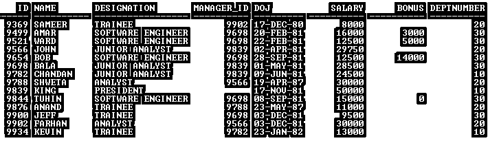
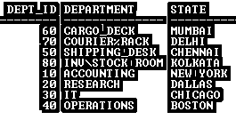
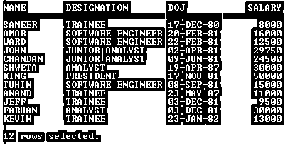
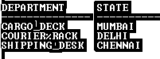

# Oracle 通配符

> 原文：<https://www.educba.com/oracle-wildcards/>

## 什么是 Oracle 通配符？

Oracle 通配符是指作为通配符搜索的字符模式匹配操作。通配符可以与 LIKE 运算符一起使用。带有 LIKE 运算符的通配符允许我们执行字符模式匹配。

Oracle 中有两个通配符，它们是:

<small>Hadoop、数据科学、统计学&其他</small>

*   %:它表示包括零在内的任意数量字符的序列。
*   _:它表示任何单个字符，但仅在指定位置。
*   WHERE 子句中必须使用带有 LIKE 运算符的通配符
*   在 SELECT 语句中可以使用带有 LIKE 运算符的通配符
*   带有 LIKE 运算符的通配符可用于 DML 操作(插入、更新、删除)

**语法:**

`SELECT …….FROM Table_Name WHERE ColumnName LIKE WILDCARD             character/pattern/literal.`

运筹学

`SELECT col_1, col_2…..col_n FROM Table_Name WHERE ColumnName LIKE           ‘pat%’;`

**描述:**

*   **Col_1/2/n:** 根据您的要求进行计算的列。
*   **表名:**根据您的要求
*   **其中:**必须使用该运算符。
*   **Column_Name:** 该条件将应用于列以过滤数据。
*   **LIKE:** 这是一个允许使用通配符的运算符。

### 通配符的实现及示例

在本节中，我们将看到 Oracle 通配符的实现及其行为。为此，我们将使用下面有 14 & 8 条记录的样本表(雇员&部门 _ 类别)来理解 Oracle 通配符行为。

**代码:**

`SELECT * FROM Employee;`

**输出:**

**代码:**

`SELECT * FROM Dept_category;`

**输出:**

#### 1.%通配符

**代码:**

`SELECT Name, Designation, DOJ, Salary FROM Employee WHERE Name LIKE 'CH%';`

**输出:**

在上面的 SELECT 语句 **%** 中，带有 LIKE 运算符的通配符根据条件过滤记录。它只返回那些在 name 列中名称以字符模式“ch”开头的记录，并返回匹配的记录。SQL 语句获取了“CHANDAN”的详细信息，因为在 Name 列中只有 CHANDAN 以“CH”字符开头。 **%** 代表包括零在内的任意数量字符的任意序列。

#### 2.带有 NOT 关键字的%通配符

**代码:**

`SELECT Name, Designation, DOJ, Salary FROM Employee WHERE Name NOT LIKE 'B%';`

**输出:**

在这个输出中，有两条记录丢失了，为什么？

因为上面的 SELECT 语句包含带有通配符和 LIKE 运算符的 NOT 关键字。这意味着该 SQL 语句只选择那些不是以提供的模式' B '和% WILCARD 开头的记录。

**代码:**

`SELECT Name, Designation, DOJ, Salary FROM Employee WHERE Name LIKE '%E%';`

**输出:**

在本例中， **%** 通配符在“E”前后使用了两次。这意味着它从由“E”字符组成的名称列中选择条目至少一次，并显示记录。

#### 3.下划线(' _ ')通配符

**代码:**

`SELECT Name, Designation, DOJ, Salary FROM Employee WHERE Designation LIKE '_O%'`

**输出:**

如下划线(' _ ')通配符代表指定位置的任何单个字符。

因此，该语句搜索 Designation 列中第二个字符为“O”的条目，但第一个字符可以是任何字符。并返回匹配的模式作为结果。

#### 4.下划线(“_”)通配符和 NOT 关键字

**代码:**

`SELECT Name, Designation, DOJ, Salary FROM Employee WHERE Designation NOT LIKE '_O%';`

**输出:**

因此，该语句没有关键字 with WILCARD，这意味着它搜索指定列中不包含第二个字符“O”的条目，但第一个字符可以是任何字符。并返回匹配的模式作为结果。

#### 5.通配符的缺点

**例#1**

`SELECT Department FROM Dept_Category WHERE Department LIKE '%_%';`

**输出:**

上面的 SELECT 语句返回 Dept_Category 表中的所有行，但是由于通配符条件，预期的结果是只包含' _ '字符的记录。所以是错误的输出。

**例 2**

`SELECT deptno, dname, loc FROM Dept WHERE dname LIKE ‘%%%’;`

**输出:**

上面的 SELECT 语句返回 Dept_Category 表中的所有行，但由于通配符条件，预期的结果是只包含“%”字符的记录。所以是错误的输出。

有两个问题出现了:

在上面两个例子中，当我们使用正确的语法时，为什么会出现这个问题？

*   在上面的两个示例中，Oracle Optimizer 将 _ & %视为通配符，而不是字符。

如何解决这个问题？

*   为了解决这一问题/缺陷，Oracle 提供了免责条款。

**转义子句:**转义子句用于查找“_”&“%”字符的精确匹配。ESCAPE 子句必须与' **\** '一起使用。

#### 6.带转义子句的下划线(' **_** ')通配符

**代码:**

`SELECT Department FROM Dept_Category WHERE Department LIKE '%\_%' ESCAPE ‘\’;`

**输出:**

在上面的示例中，由于 ESCAPE 子句，Oracle optimizer 将' _ '视为字符，而不是通配符。它返回预期的结果。

#### 7.带转义子句的下划线(' **%** ')通配符

**代码:**

`SELECT Department FROM Dept_Category WHERE Department LIKE '%\%%' ESCAPE ‘\’;`

**输出:**

在上面的示例中，由于 ESCAPE 子句，Oracle optimizer 将“%”(左数第二个)视为字符，而不是通配符。它返回预期的结果。

**注:**关键词@、$、&、^、等等。可以使用 escape 选项代替' \ '，在 SQL 查询中将通配符作为字符传递，以获得精确匹配。

*   对于区分大小写的字符搜索，字符函数(大写、小写或 INITCAP)可以与通配符一起使用

**代码:**

`SELECT Department, State FROM Dept_Category WHERE Department LIKE UPPER ('%**^**%ra%') ESCAPE '**^**';`

**输出:**

*   逻辑运算符(AND、or)可用于多个通配符条件

**代码:**

`SELECT Department, State FROM Dept_Category WHERE LOWER (Department) LIKE ('%^%ra%') ESCAPE '^' OR  LOWER (Department) LIKE ('%!_de%') ESCAPE '!';`

**输出:**

**Note:** In this case, query performance can be poor if the Table is big.

Oracle 通配符可以应用于任何数据类型。

### 结论

Oracle 通配符是使我们能够对任何数据类型列进行字符模式匹配操作的关键字或符号。在我们不知道列的确切内容的情况下，Oracle 通配符是查找记录的一个好选择。

### 推荐文章

这是 Oracle 通配符指南。在这里，我们讨论 oracle 中的介绍和不同的通配符，以及不同的示例和代码实现。您也可以看看以下文章，了解更多信息–

1.  [Oracle LIKE 运算符简介](https://www.educba.com/oracle-like-operator/)
2.  [特性&MySQL 中通配符的类型](https://www.educba.com/wildcards-in-mysql/)
3.  [完全外连接是如何工作的？](https://www.educba.com/oracle-full-outer-join/)
4.  [在甲骨文之间](https://www.educba.com/between-in-oracle/)
5.  [Oracle 窗口功能指南](https://www.educba.com/oracle-window-functions/)
6.  [Oracle While Loop |如何工作？](https://www.educba.com/oracle-while-loop/)

