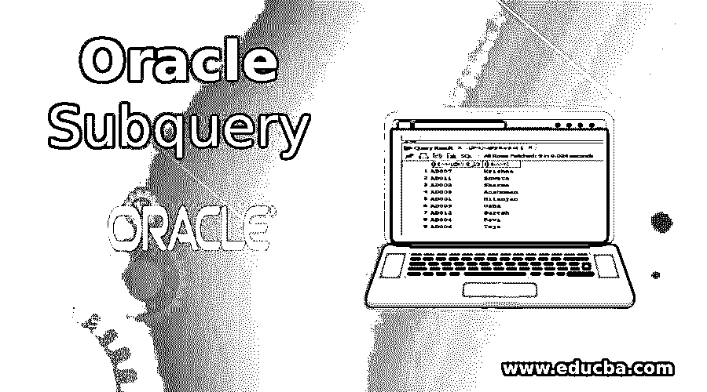
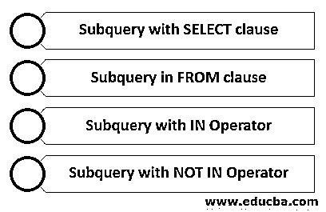
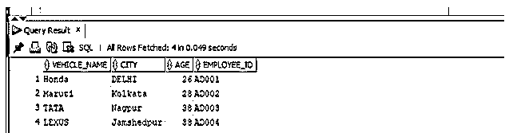
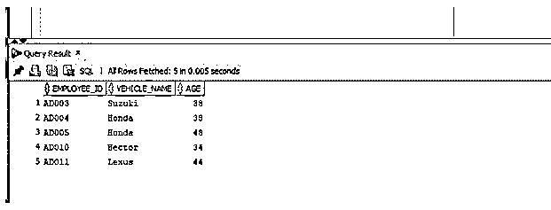
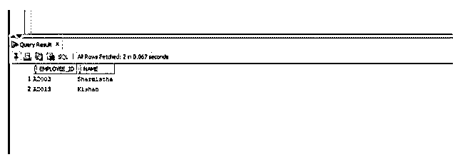
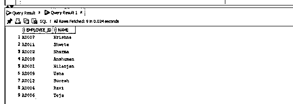

# Oracle 子查询

> 原文：<https://www.educba.com/oracle-subquery/>

## Oracle 子查询简介

Oracle 子查询是写在另一个语句或查询(我们可以说它是嵌套查询或存在于查询中的查询)中的 SELECT 语句，它可以是 SELECT、INSERT、UPDATE 甚至 DELETE 语句，通常，这些子查询驻留在 WHERE 子句、FROM 子句或 SELECT 子句中，以便用户可以在子查询的帮助下更好地构造和创建更复杂的查询，而无需使用连接或联合来编写复杂的查询。

**语法:**

<small>Hadoop、数据科学、统计学&其他</small>

子查询是一个 SELECT 语句。

`select column/columns from t1 where column1 = (select column1 from t2);`

**参数:**

*   **t1:** 是指我们要从中提取数据的表
*   **t2:** 它指的是内部查询从中获取 column2 值的表。
*   **Column1:** 应用 WHERE 条件的列。

### Oracle 子查询的工作

*   每当我们编写子查询时，子查询都应该用括号或圆括号()括起来。因此，当 oracle 获得一个也包含子查询的查询时，它首先执行子查询并检索结果，然后在外部查询中使用相同的结果。
*   当我们在 SELECT 查询的 FROM 子句中使用子查询时，Oracle 将其称为内嵌视图，当子查询出现在 SELECT 语句的 WHERE 子句中时，Oracle 将其称为嵌套子查询。
*   需要知道的重要一点是，对于 FROM 子句或内联视图，子查询级别的数量没有限制。

### 带示例的子查询类型

下面给出了子查询的类型及其示例:

#### 1.带有 SELECT 子句的子查询

在这种情况下，顾名思义，子查询将出现在 SELECT 子句中。在这种情况下，Oracle 首先评估子查询，然后执行外部查询。我们应该记住的一点是，我们应该在 select 子句子查询中使用 COUNT、MAX、MIN 等聚合函数，以便子查询返回单个值。

**举例:**

**代码:**

`SELECT
vehicle_name,
city,
ROUND(
(
SELECT
AVG( age )
FROM
employee e1
WHERE
e1\. employee_id = v2.EMPLOYEE_ID
),
2
) age, v2.employee_id
FROM
vehicle v2 WHERE v2.employee_id IS NOT NULL;`

如果我们看到上面的例子，我们已经使用了带有 select 子句的子查询。在这个例子中，我们使用了两个表“车辆”和“员工”。该子查询用于根据上述查询中显示的条件获取雇员的平均年龄。Oracle 为外部查询选择的每一行计算子查询，在本例中，外部查询是指车辆表中的员工 id 不为空。

让我们在 SQL developer 中运行查询并查看输出。

如你所见，平均年龄被四舍五入并显示出来。

#### 2.FROM 子句中的子查询

在这种情况下，子查询是用 FROM 关键字编写的。这也称为内嵌视图，因为它替换了查询中的表。我们将看到下面的例子来了解这方面的更多信息。

**举例:**

**代码:**

`SELECT
employee_id,
vehicle_name,
age
FROM (
SELECT e1.employee_id,
e1.vehicle_name,
e1.age
FROM
employee e1
WHERE
age >28
)
WHERE rownum <=5;`

如果我们看上面的例子，我们可以看到内部查询首先从 employee 表返回大于 26 的年龄，然后外部查询检索内部查询结果集的前 5 行。

让我们在 SQL developer 中运行查询并查看输出。

正如我们所看到的，输出显示了我们从内部查询中获得的结果集的前五行。

#### 3.带有 IN 运算符的子查询

在本例中，我们将 In 运算符用于子查询，由于我们使用 IN 运算符，子查询可以在其结果集中返回一个或多个值。外部查询将使用相同的结果集。

**举例:**

**代码:**

`SELECT EMPLOYEE_ID, name
FROM employee
WHERE vehicle_id IN (
SELECT VEHICLE_ID
FROM vehicle
WHERE VEHICLE_NAME ='TATA'
);`

如果我们看一下上面的例子，首先执行内部查询，它从车辆表中获取 TATA 生产的车辆的 vehicle _ id，然后外部查询使用内部查询返回的 vehicle _ id 来查询 employee 表中的数据。

让我们在 SQL developer 中执行上述查询，并查看输出。

正如我们所看到的，查询成功执行，并返回两条记录。

#### 4.带有 NOT IN 运算符的子查询

在这种情况下，我们在子查询中使用 NOT IN 运算符，子查询可以在其结果中返回一个或多个值。外部查询将使用相同的结果集。

**代码:**

`SELECT EMPLOYEE_ID, name
FROM employee
WHERE vehicle_id NOT IN (
SELECT VEHICLE_ID
FROM vehicle
WHERE VEHICLE_NAME ='TATA'
);`

如果我们看一下，它的工作方式与前面讨论的运算符相同。首先执行内部查询，它从 vehicle 表中获取不是由 TATA 制造的车辆的 vehicle _ id，然后外部查询使用内部查询返回的 vehicle _ id 从 employee 表中查询数据。

让我们在 SQL developer 中执行上述查询，并查看输出。

正如我们所看到的，该查询成功执行并返回了九行，这意味着内部查询从车辆表中返回了九个 vehicle _ ids。

### 结论

在本文中，我们讨论了子查询的定义及其语法。我们讨论了子查询实际上是如何工作的，然后讨论了子查询的类型，为了更好地理解这些子查询，我们使用了适当的示例。

### 推荐文章

这是 Oracle 子查询的指南。这里我们讨论 oracle 子查询的介绍、工作原理、子查询的类型以及相应的例子。您也可以看看以下文章，了解更多信息–

1.  [甲骨文联合所有](https://www.educba.com/oracle-union-all/)
2.  [Oracle 中的 UNION](https://www.educba.com/union-in-oracle/)
3.  MySQL 中的[表](https://www.educba.com/table-in-mysql/)
4.  [甲骨文中的减号](https://www.educba.com/minus-in-oracle/)
5.  [Oracle 窗口功能指南](https://www.educba.com/oracle-window-functions/)
6.  [Oracle While 循环](https://www.educba.com/oracle-while-loop/)
7.  [Oracle 基数|如何工作？](https://www.educba.com/oracle-cardinality/)

