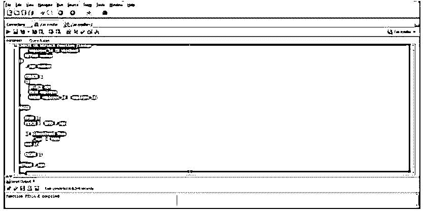
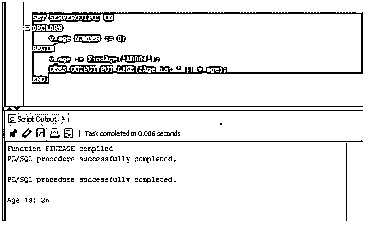
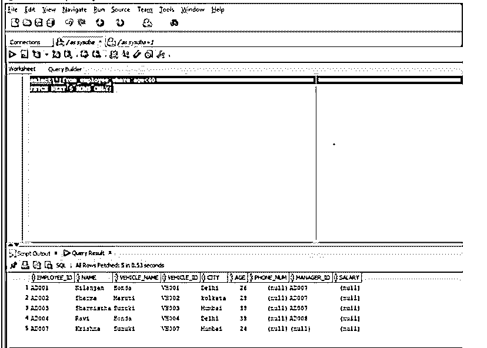

# 在 Oracle 中获取

> 原文：<https://www.educba.com/fetch-in-oracle/>

## Oracle 中的 FETCH 简介

FETCH 语句在 Oracle 中用于从多行查询的结果集中检索一行或多行数据，因为 FETCH 语句能够在一个实例中检索一行数据、结果集中存在的多行数据甚至所有行数据，从而允许开发人员控制实际结果集中所需数据的百分比，然后将从 FETCH 检索的一行/多行数据存储到从查询中选择的相应列中。

**语法:**

<small>Hadoop、数据科学、统计学&其他</small>

`FETCH cursorName INTO variableList;`

**参数:**

*   **cursorName:** 它指的是我们要从中获取行的游标的名称。
*   **variableList:** 它指的是我们要在其中存储来自游标的行的变量的名称。指定时，变量应该用逗号分隔。

### Oracle 中的 FETCH 语句是如何工作的？

*   FETCH 语句在 oracle 中工作，因为它用于从游标中检索行，以便开发人员可以对其进行某种操作或将它存储到相应的变量中。
*   因此，FETCH 通常用于带游标的 PL/SQL，也用于 SQL。
*   游标用于根据 SELECT 语句和 SELECT 语句中的条件从数据库中检索结果集。
*   因此，一旦光标检索到由行和列组成的结果集，我们就需要对结果集进行一些操作。因此，在这种情况下，我们使用 FETCH 语句从游标中检索这些行。
*   FETCH 语句允许我们控制想要工作或操作的行数。我们可以从游标中检索一行、多行或所有行。
*   在 SQL 查询或语句的情况下，我们将它写在查询的末尾，因此在查询执行(有或没有 WHERE 子句)之后，我们将获得基于查询的结果集。
*   最后出现的 FETCH 子句帮助我们限制我们实际想要检索并显示为输出的数据行数，并且我们可以根据我们的使用来更改它。

### Oracle 中的 FETCH 示例

下面是提到的例子:

#### 示例#1

使用函数计算雇员的年龄。

在本例中，我们将在函数中使用 FETCH 语句来查找相关雇员的年龄。该函数将雇员的 employee_id 作为一个变量，如果雇员存在，则返回雇员的年龄，如果雇员不存在，则返回一个错误号。

**代码:**

PL/SQL 函数

`CREATE OR REPLACE Function FindAge
( employee_id IN varchar2 )
RETURN number
IS
v_age number;
CURSOR c1
IS
SELECT age
FROM employee
WHERE employee_id = employee_id;
BEGIN
OPEN c1;
FETCH c1 INTO v_age;
if c1%notfound then
v_age := 9999;
end if;
CLOSE c1;
RETURN v_age;
END;`

如果我们看到上面的 PL/SQL 程序，就会创建一个名为 Find Age 的函数，它将 employee_id 作为函数中的一个参数。然后游标被初始化，它根据开发人员在调用函数时作为参数给出的 employee_id 检索雇员的年龄。然后，我们在程序中看到的 FETCH 语句从游标中检索年龄，并将其存储在 age 变量中，该变量是我们在函数开始时声明的一个局部变量。然后，我们返回年龄或错误号，以防输入雇员 id 的表中没有雇员。

**输出:**

现在让我们在 SQL developer 中运行程序并检查结果。

正如我们在上面的截图中看到的，这个函数已经编译好了，没有任何错误。现在让我们调用这个函数，并在 SQL developer 中执行它。

下面的程序调用该函数，然后显示雇员的年龄。

**代码:**

`SET SERVEROUTPUT ON
DECLARE
v_age NUMBER := 0;
BEGIN
v_age := FindAge('AD004');
DBMS_OUTPUT.PUT_LINE('Age is: ' || v_age);
END;`

**输出:**

现在让我们在 SQL Developer 中运行上述语句并检查结果。

正如我们在上面的截图中看到的，输出中显示了雇员的年龄。

#### 实施例 2

获取 SQL 以限制行数。

在本例中，我们将检查 FETCH 子句的使用，以限制从数据库中检索的行数。因此，由于我们在数据库中有一个名为 employee 的表，我们将只从 employee 表中检索年龄小于 40 岁的雇员的 5 行。

**代码:**

SQL 查询

`SELECT * FROM EMPLOYEE WHERE AGE<40
FETCH NEXT 5 ROWS ONLY;`

因此，上面的查询应该只从满足条件的 employee 表中获取 5 行。让我们在 SQL developer 中运行查询。

**输出:**

正如我们在上面的截图中看到的，只显示了满足条件(年龄小于 40 岁)的 5 行。

### 在 Oracle 中使用 FETCH 的优势

*   如果是 PL/SQL，FETCH 用于限制我们希望从数据库或游标中检索的行数。
*   这一点很重要，因为它允许我们限制行数，假设如果我们使用简单的 WHERE 子句，那么它将返回所有行，但在 FETCH 的情况下，我们可以设置行数限制，并基于此 Oracle 数据库将返回行。

### 结论

在本文中，我们讨论了 oracle 中的 FETCH。我们在本文中讨论了语法及其参数，以及 Oracle 中 FETCH 的工作方式。稍后我们讨论了来自 PL/SQL 和 SQL 的两个例子。

### 推荐文章

这是 Oracle 中的取数指南。在这里，我们讨论的介绍，如何获取语句在 Oracle 工作的例子和优势。您也可以看看以下文章，了解更多信息–

1.  [Oracle Alter Table](https://www.educba.com/oracle-alter-table/)
2.  [Oracle 外键](https://www.educba.com/oracle-foreign-key/)
3.  [Oracle 全外部连接](https://www.educba.com/oracle-full-outer-join/)
4.  [在甲骨文之间](https://www.educba.com/between-in-oracle/)

