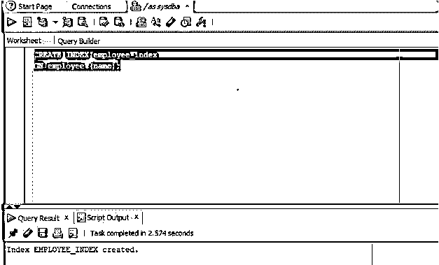
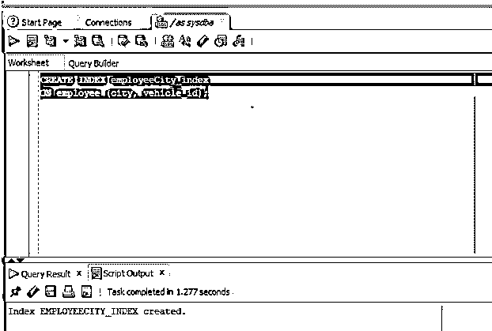
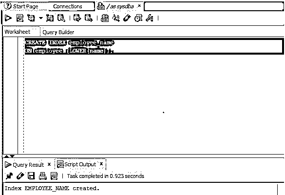
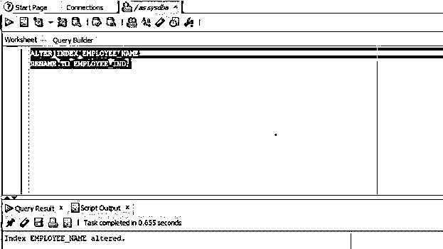
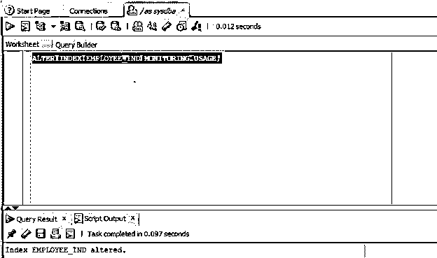
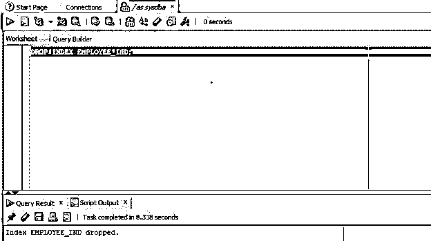

# Oracle 索引

> 原文：<https://www.educba.com/oracle-index/>

## Oracle 索引简介

Oracle 中的索引可以定义为一个模式对象，它为列中出现的每个值存储一个条目，并为每个值存储具有该值的行的位置，这有助于数据库提高效率，因为它有助于数据库提供对具有特定数据的那些行的快速访问，并且它可以被称为性能调整机制，因为它允许从 Oracle 数据库中更快地检索数据。

### 句法

在本文的这一部分，我们将讨论如何在 Oracle 数据库中创建索引。让我们先来看看如何在 Oracle 中创建索引的语法。

<small>Hadoop、数据科学、统计学&其他</small>

`CREATE INDEX index_name
ON table_name(column1,column2,...,columnN);`

#### 因素

以下是参数:

**index_name:** 它指的是我们要给正在创建的索引起的名字。

**table_name:** 表示我们要创建索引的表的名称。

column1，column2，…，column:它指要在索引中使用的一列或多列。

### 实施 Oracle 索引的示例

为了更好的理解，我们举几个例子。

#### 示例#1

在第一个示例中，我们将尝试为 employee 表创建一个索引，但只为一列创建索引。我们将为 employee 表中的列名创建一个索引。

**代码:**

`CREATE INDEX employee_index
ON employee (name);`

**输出:**

**说明:**在截图中我们可以看到，该指数已经创建成功。

#### 实施例 2

在第二个例子中，我们将为多个列创建一个索引。在本例中，我们将为 employee 表中的列 city 和 vehicle id 创建一个索引。让我们看看这个查询。

**代码:**

`CREATE INDEX employeeCity_index
ON employee (city, vehicle_id);`

**输出:**

**说明:**正如我们在截图中看到的，索引已经成功创建。

#### 实施例 3

在第三个例子中，我们将创建一个基于函数的索引。在本例中，我们将基于 employee 表中列名的小写计算创建一个索引。

**代码:**

`CREATE INDEX employee_name
ON employee (LOWER(name));`

**输出:**

**说明:**正如我们在截图中看到的，基于函数的索引已经成功创建。

### 如何在 Oracle 中修改索引？

在本节中，我们将检查如何改变索引。需要注意的重要一点是，模式必须包含我们想要更改的索引，并且用户必须有权更改索引。一般来说，DBA 团队通常拥有这些类型的权限。

我们可以使用 ALTER INDEX 进行许多类型的活动。

#### 1.重命名索引

在这种情况下，我们将更改模式中已经存在的现有索引的名称。让我们看看相同的语法。

**代码:**

`ALTER INDEX currentindex_name
RENAME TO new_indexname;`

**参数:**

**currentindex_name:** 它是指我们要更改的索引的当前名称

**new_indexname:** 指的是我们要赋予索引的新名称。

**代码:**

`ALTER INDEX EMPLOYEE_NAME
RENAME TO EMPLOYEE_IND;`

**输出:**

**说明:**正如我们在截图中看到的，索引已经被成功修改。

#### 2.使索引不可见

在这种情况下，我们将创建一个可见不可见的现有索引。在本例中，我们将使索引 EMPLOYEE_IND 不可见。让我们看看这个查询。

**代码:**

`ALTER INDEX EMPLOYEE_IND INVISIBLE;`

**输出:**

**说明:**截图中我们可以看到，指标已经修改成功。

#### 3.要监控索引使用情况

在这种情况下，我们将监控该索引，以便客户或用户能够知道该索引是否正在被使用，如果没有被使用，用户可以删除它。让我们看看语法。

**代码:**

`ALTER INDEX index_name MONITORING USAGE`

**参数:**

**Index_name:** 这是我们要监控的指标。

**代码:**

`ALTER INDEX EMPLOYEE_IND MONITORING USAGE;`

**输出:**

**说明:**正如我们在截图中看到的，索引 EMPLOYEE_IND 已经被成功修改。

### 如何在 Oracle 中删除索引？

在这一节中，我们将讨论如何删除索引。重要的一点是，我们需要有执行此活动的许可，而且索引应该存在于数据库中。当我们执行 drop 语句时，数据库会使依赖于与索引相关联的表的所有对象失效。

**代码:**

`DROP INDEX EMPLOYEE_IND;`

**输出:**

**说明:**正如我们在截图中看到的，索引已经被成功删除。

### 结论

在本文中，我们讨论了 Oracle 中的索引。我们从索引的定义开始，然后讨论了如何在 Oracle 中创建、修改和删除索引。所有的场景都借助例子进行了讨论。

### 推荐文章

这是 Oracle 索引指南。在这里，我们讨论 Oracle Index 的介绍，如何改变和删除它，并给出查询示例。您也可以浏览我们的其他相关文章，了解更多信息——

1.  [甲骨文版本](https://www.educba.com/oracle-versions/)
2.  [甲骨文条款](https://www.educba.com/oracle-clauses/)
3.  [甲骨文字符串函数](https://www.educba.com/oracle-string-functions/)
4.  [在甲骨文的职业生涯](https://www.educba.com/career-in-oracle/)

