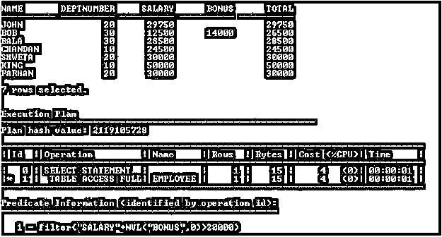

# Oracle 基于函数的索引

> 原文：<https://www.educba.com/oracle-function-based-index/>

## Oracle 基于函数的索引简介

Oracle Function-based Index 是一个模式对象，它为表或簇的索引列中出现的每个值包含一个条目。基于函数的索引基于表达式，使查询能够计算表达式返回的值。它提供了对行的直接快速访问。

### 句法

创建索引:

<small>Hadoop、数据科学、统计学&其他</small>

`CREATE INDEX IndexName ON Table (Function);`

删除索引:

`DROP INDEX IndexName;`

**说明:**

IndexName:根据 Oracle 命名约定，它可以是索引对象的任何名称。

函数:它可以是 Oracle 函数或用户定义的函数。

#### 索引的规格

索引是一个模式对象。Oracle 服务器使用索引，通过使用指针来加快对行的检索。无论在逻辑上还是在物理上，索引都独立于它所索引的表。该索引由 Oracle 服务器自动使用和维护。可以随时创建或删除索引，并且不会影响基表或其他索引。

删除表时，相应的索引也会自动删除。在一个表上可以创建多个索引，但这并不意味着更多的索引会带来更快的性能。在带有索引的表上提交的每个 DML 操作都意味着必须更新索引。索引通过使用快速路径访问方法来快速定位数据，从而减少了磁盘 I/O。

#### 集中点

*   要索引的表或簇必须在自己的模式中。
*   索引对象特权应该在要索引的表上可用。
*   需要创建索引和查询重写权限的用户必须具有创建索引系统权限。
*   无限表空间系统权限或表空间空间配额上的空间配额必须可用。
*   基于 SELECT 语句中表达式的基于函数的索引。
*   索引表达式是从包含 SQL 函数或用户定义函数的表列构建的。
*   使用 UPPER(列名)或 LOWER(列名)定义的基于函数的索引允许区分大小写的搜索。
*   用户应该对基于函数的索引中使用的函数拥有 Execute object 权限。
*   当在 WHERE 子句中使用函数时，基于函数的索引旨在提高查询性能。
*   为了确保 Oracle 使用索引而不是执行全表扫描，用户应该确保在后续查询中函数值不为空。
*   Oracle 将带有标记为 DESC 的列的索引视为基于函数的索引。
*   基于函数的索引仅在通过指定函数执行查询语句时使用。

### 实施 Oracle 基于函数的索引的示例

基于函数的索引的实现及示例:

在本节中，我们将看到 Oracle 基于函数的索引的实现及其行为。为此，我们将使用下面包含 14 条记录的示例表(Employee)来理解 Oracle 基于函数的索引行为。

**代码:**

`SELECT * FROM Employee;`

**输出:**

#### 示例#1:没有基于函数的索引

**代码:**

`SELECT Name, Deptnumber, Salary, Bonus, Salary + NVL (Bonus, 0) Total FROM Employee where Salary + NVL(Bonus, 0) > 20000;`

**输出:**

**说明:**上述 SELECT 语句的上述执行计划扫描了完整的 Employee 表。在上面的 SELECT 语句中，基于 Oracle 函数的表达式用于从 Employee 表中获取数据，但是该表没有用于该操作的索引。

#### 示例 2:基于函数的索引

现在，我们将为上面的表达式创建一个基于函数的索引，以防止对表进行完全扫描，并减少 I/O 周期。

**代码:**

`CREATE INDEX Emptotal ON Employee (Salary + NVL (Bonus, 0));`

**输出:**

现在已经为上面的表达式在 Employee 表上创建了基于函数的索引。现在我们将执行上面的查询来获取行。

**代码:**

`SELECT Name, Deptnumber, Salary, Bonus, Salary + NVL (Bonus, 0) Total FROM Employee where Salary + NVL (Bonus, 0) > 20000;`

**输出:**

**说明:**上述 SELECT 语句的执行计划表明，索引行访问的表不是完整的 Employee 表。而执行计划清楚地显示了成本的差异。

#### 示例 3:如何检查索引

可以从 USER_INDEXES 数据字典中检查索引。

**代码:**

`SELECT Table_Name,Index_Name FROM USER_INDEXES WHERE TABLE_NAME='EMPLOYEE';`

**输出:**

#### 示例 4:删除基于函数的索引

可以随时删除该索引，但用户需要具有删除权限。

**代码:**

`DROP INDEX Emptotal;`

**输出:**

在上面的示例中，使用 drop index 语法 index 会被删除。所以现在 Employee 表没有“Emptotal”索引。

**代码:**

`SELECT Table_Name,Index_Name FROM USER_INDEXES WHERE TABLE_NAME='EMPLOYEE';`

**输出:**

### 何时创建基于函数的索引

基于函数的表达式经常在 WHERE 子句或连接条件中使用。该表很大，大多数查询预计检索不到 2%到 4 %的行。

**提示:**

1.当表太小时，不应创建基于函数的索引。

2.当表频繁更新时，不应创建基于函数的索引。

### 结论

基于 Oracle 函数的索引减少了数据库的计算。如果任何查询由基于函数的表达式组成，并且定期或多次执行，那么数据库必须在每次运行时进行计算。为了避免每次都在数据库上进行这种计算，基于函数的索引是一个更好的选择。

### 推荐文章

这是 Oracle 基于函数的索引指南。在这里，我们将介绍 Oracle 基于函数的索引、适当的语法、何时创建以及示例代码。您也可以浏览我们的其他相关文章，了解更多信息——

1.  [甲骨文日期函数](https://www.educba.com/oracle-date-functions/)
2.  [Oracle 窗口函数](https://www.educba.com/oracle-window-functions/)
3.  Oracle 中的[功能](https://www.educba.com/function-in-oracle/)
4.  [甲骨文字符串函数](https://www.educba.com/oracle-string-functions/)

