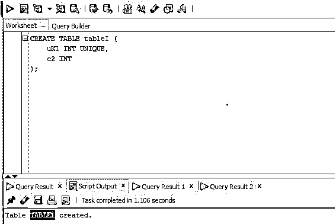
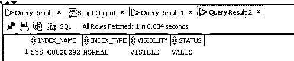
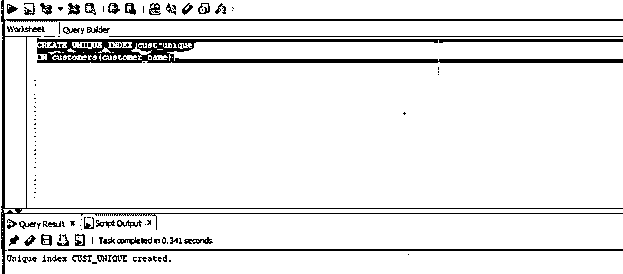
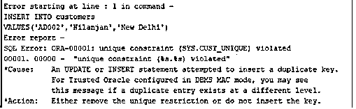
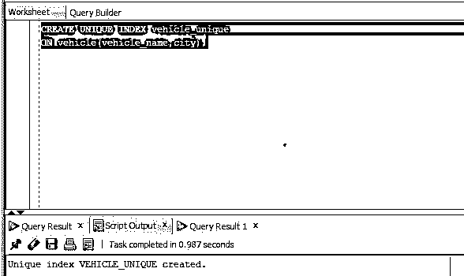
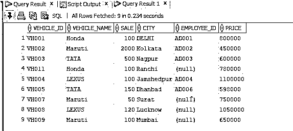
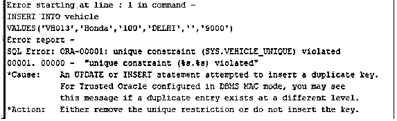

# Oracle 唯一索引

> 原文：<https://www.educba.com/oracle-unique-index/>

## Oracle 唯一索引简介

Oracle 唯一索引(Index 在数据库中为存储在表的索引列中的每个值创建一个条目，以允许更快地检索数据)可以定义为唯一索引，它不允许在使用唯一约束创建的特定列中输入重复值，因为每当我们在列上创建唯一约束或创建主键时，Oracle 数据库都会自动创建唯一索引。

### 句法

现在让我们来看看 Oracle 唯一索引的语法。语法与 create index 语法相似，几乎相似。

<small>Hadoop、数据科学、统计学&其他</small>

`CREATE UNIQUE INDEX indexName ON
tableName (column1, column2, …);`

#### 因素

以下是 Oracle 唯一索引的参数:

**indexName:** 用户想要创建的索引的名称。

**tableName:** 用户想要创建唯一索引的表的名称。

**列 1，列 2，..:**表示将要创建唯一索引的表的列名。

### Oracle 中的唯一索引是如何工作的？

在本文的前一部分，我们讨论了惟一索引的定义。在本节中，我们将讨论唯一索引在 Oracle 中是如何工作的。当我们创建一个具有唯一约束的表时，会自动创建一个唯一索引，但是如果我们想要显式地创建一个唯一索引，我们必须运行 CREATE INDEX 查询。一旦我们执行了带有特定列的 CREATE INDEX 查询，就在数据库中为该列中分配的所有值提供了条目，换句话说，创建了索引。当在表的列中创建唯一索引时，该索引不允许为该列创建任何其他重复索引，因为由于表的列已经具有与之相关联的唯一约束，所以唯一约束不允许为该列插入任何重复值。

### 实施 Oracle 唯一索引的示例

在这一节中，我们将借助示例讨论如何创建和使用唯一索引。

#### 示例#1

oracle 自动创建唯一索引:通常，每当我们将一列或多列与主键或唯一约束相关联时，ORACLE 数据库都会自动在主键或唯一键列上创建唯一索引。在本例中，我们将创建一个包含两列的表，并为其中一列分配 unique 约束，然后检查是否在其上创建了 UNIQUE 索引。让我们首先创建一个具有唯一约束的表。

**代码:**

`CREATE TABLE table1 (
uK1 INT UNIQUE,
c2 INT
);`

**输出:**

我们在其中一列上添加了唯一约束。因此，让我们准备一个 SELECT 查询来检查惟一索引是否已经创建。

**代码:**

`SELECT
index_name,
index_type,
visibility,
status
FROM
all_indexes
WHERE
table_name = 'TABLE1';`

**输出:**

**解释:**正如我们在上面的截图中看到的，唯一索引 SYS_C0020292 已经自动创建。

#### 实施例 2

ORACLE UNIQUE INDEX WHEN ONLY ONE COLUMN:在这一节中，我们将讨论如何借助一个示例在表中的一列上创建唯一索引。我们之前已经讨论过语法了。在本例中，我们将在 customers 表中的 customer name 列上创建一个惟一索引，然后我们将尝试插入重复值，并检查它是否允许。因此，让我们首先创建索引。

**代码:**

`CREATE UNIQUE INDEX cust_unique
ON customers(customer_name);`

**输出:**

**解释:**该列是 customer_name，将为其创建唯一的索引。正如我们在上面的截图中看到的，惟一索引已经创建。

现在让我们看看表中的现有值。

**代码:**

`SELECT * from customers;`

**输出:**

如我们所见，表格中有六行。现在让我们通过尝试输入一个重复值来检查唯一索引。让我们为此准备一个插入查询。

**代码:**

`INSERT INTO customers
VALUES('AD002','Nilanjan','New Delhi');`

**输出:**

**解释:**正如我们看到的，它抛出了 ORA-00001 唯一约束错误。

#### 实施例 3

多列时的 ORACLE 唯一索引:在这一节中，我们将借助一个示例讨论如何在一个表中的多列上创建唯一索引。我们之前已经讨论过语法了。在这个例子中，我们将在表 vehicle 中的两列 city 和 vehicle name 上创建一个惟一的索引，然后我们将尝试插入重复的值，并检查它是否允许。因此，让我们首先创建索引。

**代码:**

`CREATE UNIQUE INDEX vehicle_unique
ON vehicle(vehicle_name, city);`

**输出:**

现在让我们在 SQL Developer 中执行查询并检查结果。现在让我们检查车辆表的内容。

**代码:**

`SELECT * from vehicle;`

**输出:**

我们现在将尝试向列的 vehicle_name 和 city 中插入重复值。现在让我们准备一个插入查询，并尝试插入重复的值。

**代码:**

`INSERT INTO vehicle
VALUES('VH013','Honda','100','DELHI','','9000');`

**输出:**

**解释:**正如我们看到的，它抛出了 ORA-00001 唯一约束错误。

### 结论

在本文中，我们讨论了唯一索引。我们在文章开始时讨论了惟一索引的定义。在本文的后面，我们借助例子讨论了惟一索引的工作原理。

### 推荐文章

这是 Oracle 唯一索引指南。在这里，我们讨论一个介绍 Oracle 唯一索引，语法，它是如何与编程的例子。您也可以浏览我们的其他相关文章，了解更多信息——

1.  [甲骨文条款](https://www.educba.com/oracle-clauses/)
2.  [MySQL 中的唯一键](https://www.educba.com/unique-key-in-mysql/)
3.  [PostgreSQL 中的索引](https://www.educba.com/indexes-in-postgresql/)
4.  MySQL 中的[表](https://www.educba.com/table-in-mysql/)

