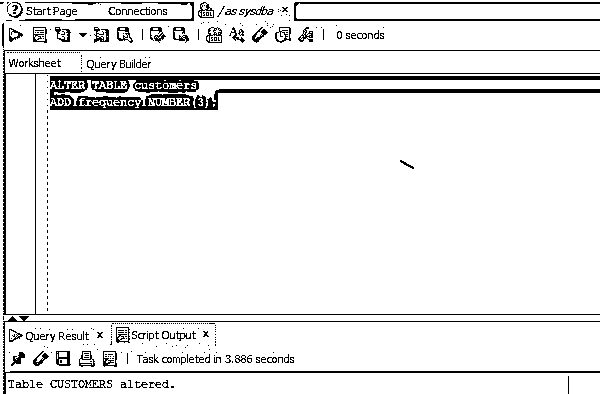
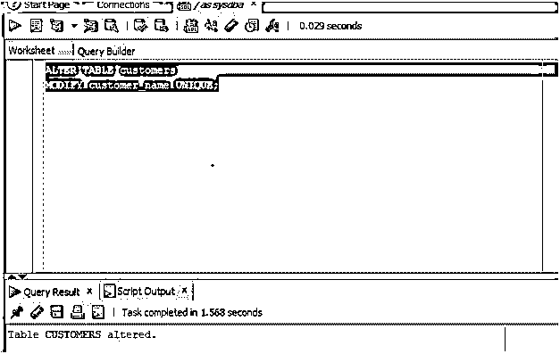
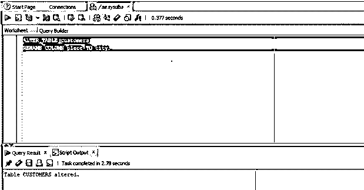
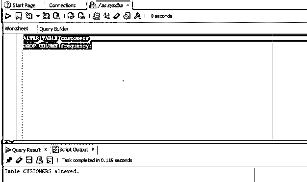

# Oracle 列

> 原文：<https://www.educba.com/oracle-column/>

## Oracle 专栏简介

oracle 中的列可以被定义为一组数据值，该组数据值仅具有特定的类型并且是同质的，包含可以是整数、字符、字符串、图像、BLOB 等等的值，并且列中的每个值代表 oracle 数据库的每一行的一个值，并且 Oracle 数据库或任何其他关系数据库(其中数据以表格形式存储)中的表由列和行形成。

### 实施 Oracle 列的示例

现在让我们借助一个例子来更好地理解:

<small>Hadoop、数据科学、统计学&其他</small>

#### 示例 1:在 Oracle 中添加一列

在第一点中，我们将讨论如何在 Oracle 中添加列。ALTER 语句是一个 DDL 语句，因为我们要通过添加一列来改变表的结构。

**代码:**

`ALTER TABLE customers
ADD frequency NUMBER(3);`

**输出:**

**解释:**在本查询中数据类型编号的频率列被添加到已有的客户表中。现在让我们在 SQL developer 中执行查询并检查结果。正如我们在屏幕截图中看到的，customers 表已被成功修改。

#### 示例 2:在表格中添加多列

在这种情况下，我们将在一个表中添加多个列。对于本例，我们将向表 customers 添加两列。让我们看看同样的查询。

**代码:**

`ALTER TABLE customers
ADD (frequency NUMBER(3), DOB date);`

**输出:**

**解释:**在上面的查询中，我们向表 customers 添加了列 frequency 和 DOB。让我们在 SQL developer 中执行查询并检查结果。正如我们在屏幕截图中看到的，这两列已经成功添加。

#### 示例#3: Alter 语句向列添加约束

在前一点中，我们讨论了如何在表中添加单个或多个列。因此，正如我们可以向现有表中添加新列一样，我们也可以使用 ALTER statement 修改表中的现有列，并向该特定列添加新的约束。因为该列已经存在。因此，我们将修改该列并向其添加一个新的约束。

让我们通过一个例子来更好地理解它。在本例中，我们将为数据库中已经存在的 customers 表中的一个现有列添加一个唯一的约束。让我们准备同样的查询。

**代码:**

`ALTER TABLE customers
MODIFY customer_name UNIQUE;`

**输出:**

**解释:**该列是 customer_name，我们正在添加 NOT NULL 约束，该约束不允许该列接受重复值。正如我们在截图中看到的，表格已经被成功修改。

#### 示例#4:重命名列

重命名列:就像我们可以在 Oracle 数据库中添加新列或修改现有列一样。我们还可以重命名现有的列。为了达到这个里程碑，我们需要使用 ALTER 语句。在本例中，我们将把一个现有的列重命名为一个不同的或新的名称。我们将尝试将表“CUSTOMERS”中的列“PLACE”的名称改为一个不同的新名称。让我们试着准备同样的查询。

**代码:**

`ALTER TABLE customers
RENAME COLUMN place TO city;`

**输出:**

**解释:**在上面的查询中，列“place”被重命名为“city”。让我们在 SQL developer 中执行查询并检查结果。正如我们在屏幕截图中看到的，该列已被成功重命名。

#### 示例 5:删除一列

就像我们可以添加、修改和重命名现有的列一样。我们还可以从数据库中删除一个现有的列。在本例中，我们将删除 customers 表中的列 frequency。让我们准备同样的查询。

**代码:**

`ALTER TABLE customers
DROP COLUMN frequency;`

**输出:**

**说明:**在上面的截图中，我们可以看到已经成功的删除了列，并且对表格进行了改动。

### 结论

在本文中，我们讨论了数据库中列的定义，然后讨论了可以对列执行的各种类型的操作。为了更好地理解，我们浏览了每个操作的语法和示例。

### 推荐文章

这是一篇 Oracle 专栏指南。为了更好地理解，我们在这里讨论 Oracle 列的介绍以及相应的查询示例。您也可以浏览我们的其他相关文章，了解更多信息——

1.  [甲骨文 CTE](https://www.educba.com/oracle-cte/)
2.  [Oracle REPLACE()](https://www.educba.com/oracle-replace/)
3.  [Oracle 临时表](https://www.educba.com/oracle-temporary-table/)
4.  [甲骨文摘录()](https://www.educba.com/oracle-extract/)

