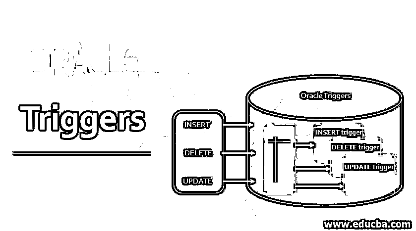
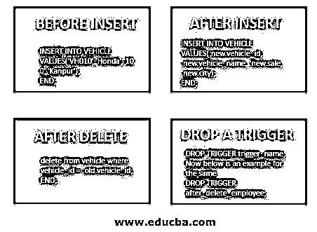

# oracle 触发器

> 原文：<https://www.educba.com/oracle-triggers/>

## Oracle 触发器简介

Oracle 触发器不过是 PL/SQL 中的一段代码，它保存在 Oracle 数据库中，只要用户需要，就可以重复使用。这可以在 DDL(数据定义语言)和 DML(数据操作语言)代码中使用。触发器中允许的参数可以分为四种类型，即“trigger_name”用于创建具有特定名称的触发器，“trigger_time”用于提及触发事件的时间，“trigger_event”用于定义事件的类型，“tbl_name”用于添加正在为其创建和使用触发器的表名。

**触发器的语法**

<small>Hadoop、数据科学、统计学&其他</small>

所以，在简单介绍了触发器之后。现在让我们开始了解触发器的语法。

下面我们可以看到如何创建触发器的语法:

`CREATE  [OR REPLACE] TRIGGER  trigger_name
trigger_time trigger_event
ON tbl_name [ FOR EACH ROW] Declare
----- Variable declarations
BEGIN
----trigger body
EXCEPTION
----exception handling code
END;`

**参数**

*   **trigger_name:** 它是我们在创建触发器时要给的触发器的名称。
*   **trigger_time:** 表示事件发生前还是发生后触发触发器。
*   **trigger_event:** 表示事件是插入事件还是删除事件或者更新事件。
*   **tbl_name:** 在其上创建触发器的表名。

所以，在了解了触发器的语法之后。现在让我们了解触发器是如何工作的。

### 触发器在 oracle 中是如何工作的？

触发器类似于当通过 SQL 语句或用户定义的过程对表触发 INSERT、DELETE、UPDATE 语句时隐式执行的过程。过程和触发器之间只有一个基本区别，即在过程的情况下，它是由用户、应用程序或触发器显式执行的，而触发器是在执行 UPDATE、DELETE 或 INSERT 语句时隐式执行的。例如，为了便于理解，有一个 AFTER INSERT 触发器，它是在对特定表执行 INSERT 语句后隐式触发的。因此，在特定的表中插入一行后，触发器主体中出现的任何语句都会被执行。因此，每当在该表中插入一行时，都会隐式触发触发器。

我们应该知道的一个重要注意事项是，我们不能在视图上创建 BEFORE 触发器。

因此，现在我们将借助一些实际例子来更好地理解触发器的执行。

### 例子

我们将要见证的第一个例子是:

#### 1.插入前

这意味着 Oracle 将在对表执行实际的插入操作之前触发触发器。

在本例中，我们将研究一个触发器，该触发器将在我们对 employees 表执行插入操作之前被触发。为了更好地理解，让我们看看下面的代码。

**代码:**

`CREATE OR REPLACE TRIGGER before_insert_employee
BEFORE INSERT
ON employee
FOR EACH ROW
BEGIN
INSERT INTO VEHICLE VALUES('VH010','Honda','100','Kanpur');
END;`

如果我们看一下上面的例子，我们可以看到这个触发器被应用到 employee 表上，并且每当在 employee 表上发生 BEFORE INSERT 操作时都会被触发。因此，每当任何用户执行插入命令时。该触发器将在执行插入操作之前触发，它将首先将给定数据插入车辆表，然后再将数据插入雇员表。

#### 2.插入后

在这种类型的触发器中，触发器将在执行 INSERT 语句后被激发。

在本例中，我们将研究一个触发器，该触发器将在对 employee 表执行插入操作后被触发。为了更好地理解，让我们看看下面的代码。

**代码:**

`CREATE OR REPLACE TRIGGER after_insert_employee
AFTER INSERT
ON employee
FOR EACH ROW
BEGIN
INSERT INTO VEHICLE VALUES(:new.vehicle_id, :new.vehicle_name, :new.sale, :new.city);
END;`

在上面的示例中，触发器应用于 employee 表，并且将在 employee 表中执行插入操作后被触发。如果每当在 employee 表上成功执行插入操作时都看到该代码，则该触发器将被隐式触发，将新值插入到 vehicle 表中。

#### 3.删除后

在这种类型的触发器中，触发器将在对相关表执行删除操作后被触发。

在下面的示例中，我们将查看在删除 employee 表中的一行后触发的触发器的执行情况。employee 表中的每一行删除都会触发该触发器。让我们看看下面的例子。

**代码:**

`CREATE OR REPLACE TRIGGER after_delete_employee
AFTER DELETE
ON employee
FOR EACH ROW
BEGIN
delete from vehicle where vehicle_id = :old.vehicle_id;
END;`

如果我们看到上面示例的代码，我们可以看到触发器被应用于 employee 表。因此，它将在 employee 表上的每个删除操作之后被触发。在我们的例子中，在 employee 表上执行删除操作之后，这个触发器将根据 vehicle_id 从 vehicle 表中删除一条记录。

#### 4.放下扳机

顾名思义，在这个示例中，我们将借助一个示例来了解如何删除已经创建并存储在数据库中的触发器。在下面的示例中，我们将删除 after delete 触发器。因为我们没有讨论 drop 触发器的语法。让我们先看看语法。

**代码:**

`DROP TRIGGER trigger_name;
Now below is an example for the same
DROP TRIGGER after_delete_employee;`

正如我们所看到的，我们只需在 DROP 语句后添加触发器名称，就可以从数据库中删除触发器。

### 结论

在本文中，我们学习了 oracle 触发器及其语法。我们了解了触发器的工作原理，我们还讨论了几个例子，以拓宽我们对不同类型触发器的了解，这些触发器可用于解决行业中的业务问题。

### 推荐文章

这是 Oracle 触发器指南。这里我们讨论触发器在 oracle 中是如何工作的？分别举例说明。您也可以浏览我们的其他相关文章，了解更多信息——

1.  [甲骨文 DBA 认证](https://www.educba.com/software-development/courses/oracle-dba-certification/)
2.  [PL/SQL 中的触发器](https://www.educba.com/triggers-in-pl-sql/)
3.  [甲骨文字符串函数](https://www.educba.com/oracle-string-functions/)
4.  [MySQL 中的光标](https://www.educba.com/cursor-in-mysql/)

