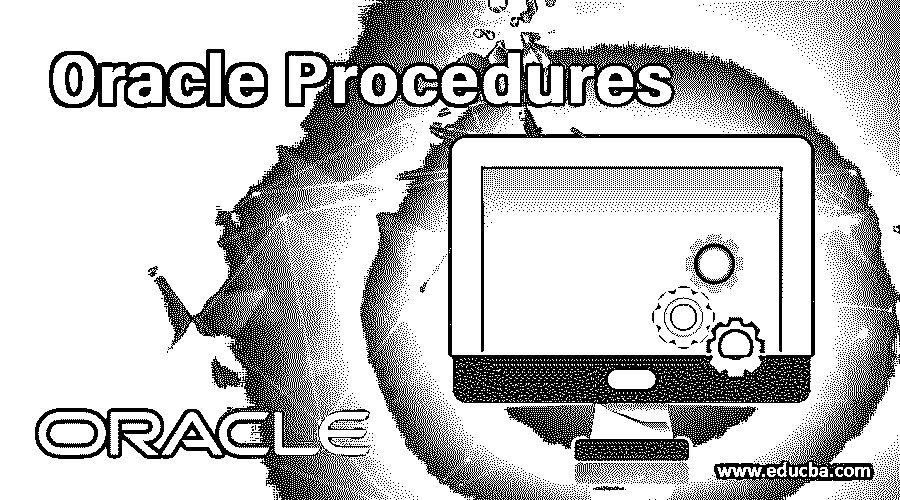
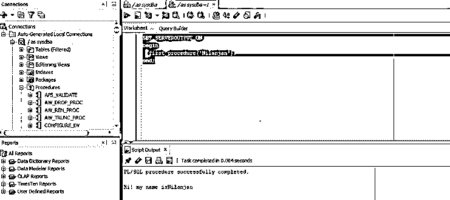

# Oracle 过程

> 原文：<https://www.educba.com/oracle-procedures/>

## Oracle 过程介绍

Oracle 中的过程可以称为子程序，存储在数据库中，用于对数据库或表的内容执行特定的操作。与任何其他程序一样，过程也应该有一些强制参数，以便成功地调用和执行过程，例如，过程名称、调用过程时用于传递值的 IN、OUT 或 IN OUT 等参数、用于声明变量和数据类型的声明部分，以及最后要执行的主部分。

**创建程序的语法:**

<small>Hadoop、数据科学、统计学&其他</small>

`CREATE OR REPLACE procedure_name ([optional argument])
IS
[declaration section] BEGIN
[executable section] END`

**Oracle 过程的参数:**

语法中使用的不同参数描述如下:

**1。procedure_name:** 正在创建的过程的名称。

**2。可选参数:**它是指调用过程时将要传递的参数。有三种类型的论点:

*   **IN:** 默认参数。它用于将值传递给参数。我们可以将常量、文字或表达式作为 IN 参数传递。它们的值不能在子程序中更改。
*   **OUT:** 用于向过程的调用方返回值。我们可以在过程内部更新 OUT 参数的值。
*   **IN OUT:** 它将初始值传递给过程，并将更新后的值返回给调用者。INOUT 参数通常是一个字符串缓冲区，它在程序内部被读取，然后被更新。

**3。声明段:**用于声明变量及其数据类型。

**4。可执行部分:**这个部分由实际执行来检索或更新数据库中的值的语句组成。

**调用过程的语法:**

`BEGIN
Procedure_name(arguments)
END`

在这里，我们给出了存储过程的名称以及 BEGIN 和 END 之间的参数(如果有的话),以调用该过程。现在，我们将了解 oracle 中的实际过程是如何工作的。

### Oracle 过程是如何工作的？

既然我们已经学过了过程的语法。现在让我们实际讨论一下程序是如何执行的。如上所述，过程是 PL/SQL 中的一个命名子程序，通常在我们需要重用时使用。因此要记住的一个要点是，因为过程是一个命名的子程序，它存储在数据库的模式级中。因此，在我们删除该过程之前，它一直存储在数据库中。

程序由三部分组成。第一部分是声明性的，第二部分是可执行的，第三部分是异常。控制首先转到声明部分，包含游标、类型、常量、表达式以及嵌套子程序的声明。声明的项对于过程来说是局部的，一旦过程完成执行，它们就不再存在。

之后，我们有可执行部分，在这个部分中，我们通过执行语句来操纵数据。如果我们在执行时得到任何错误，那么我们将有一个异常处理部分，在运行时处理异常。需要记住的一点是，声明和异常处理部分都是可选的。在过程中处理运行时异常是一个很好的实践。

过程中有两种类型的参数形式参数和实际参数。形参是在头文件中声明的变量，而实参是我们实际调用子程序时传递给它的值。

现在，我们将通过一些例子来检查如何创建和执行过程，以帮助我们更好地理解。

### Oracle 过程的示例

以下是 oracle 程序的示例:

#### 1.创建打印输入名称的过程

在这个例子中，我们创建了一个过程，在这个过程中，我们将一个名字作为输入，然后将这个名字和一条消息一起作为输出。让我们看看下面的例子:

**创建过程查询:**

`CREATE OR REPLACE PROCEDURE first_procedure (p_myname IN VARCHAR2)
IS
BEGIN
dbms_output.put_line ('Hi! my name is' ||p_myname);
END;`

现在让我们看一下代码，第一行告诉我们过程的名字，以及它接受什么类型的参数作为输入。在我们的例子中，名称是' first_procedure ',参数' p_myname '的类型为 In。

在 BEGIN 关键字之后的可执行部分，我们通过连接输入名称来打印消息。现在让我们在 [SQL developer](https://www.educba.com/what-is-sql-developer/) 中运行上面的查询，下面的截图向我们展示了同样的情况。

**输出:**

#### 2.执行打印输入名称的过程

在这个例子中，我们正在执行一个过程。让我们看看下面的例子:

**程序执行查询:**

`SET SERVEROUTPUT ON
BEGIN
first_procedure('Nilanjan');
END;`

在上面的查询中，我们正在执行上面创建的过程，绕过括号中的输入参数。需要注意的重要一点是，如果我们使用 SQL developer，我们必须首先设置服务器输出。这在 SQL*Plus 中是不需要的。

现在让我们在 SQL developer 中执行查询，我们会得到下面的输出。

**输出:**

正如您在执行过程中所看到的，它打印了名称和一条消息。

#### 3.删除过程

在本例中，我们删除了一个过程。让我们看看下面的例子:

**删除流程查询:**

一个过程会一直保留在数据库中，直到我们将其从数据库中删除。因此，如果我们想从数据库中删除一个过程，我们必须使用 DROP。下面的查询显示了如何从数据库中删除过程。

`DROP PROCEDURE first_procedure;`

在上面的查询中，我们只是为过程名提供了 DROP 关键字。一旦过程被删除，它就会从数据库中删除，因此我们无法执行它。让我们在 SQL developer 中运行上面的查询，我们可以在下面的屏幕截图中看到上面查询的输出。

**输出:**

### 结论

在本文中，我们学习了 ORACLE 中的过程以及如何使用它们。本文还讨论了语法及其参数。我们还通过一个示例了解了如何在 oracle 数据库中创建和删除过程。

### 推荐文章

这是 Oracle 过程指南。这里我们讨论 Oracle 过程的参数以及工作和示例。您也可以阅读以下文章，了解更多信息——

1.  [Oracle Warehouse Builder 的 8 大组件](https://www.educba.com/oracle-warehouse-builder/)
2.  [Oracle PL/SQL 面试问题](https://www.educba.com/oracle-pl-sql-interview-questions/)
3.  [Oracle 中 10 种不同类型的联接](https://www.educba.com/joins-in-oracle/)
4.  [Oracle 中如何使用 DISTINCT？](https://www.educba.com/distinct-in-oracle/)
5.  [关系数据库完全指南](https://www.educba.com/relational-database/)
6.  [甲骨文运营商| 7 大运营商](https://www.educba.com/oracle-operators/)
7.  [PostgreSQL 程序|工作和示例](https://www.educba.com/postgresql-procedures/)

