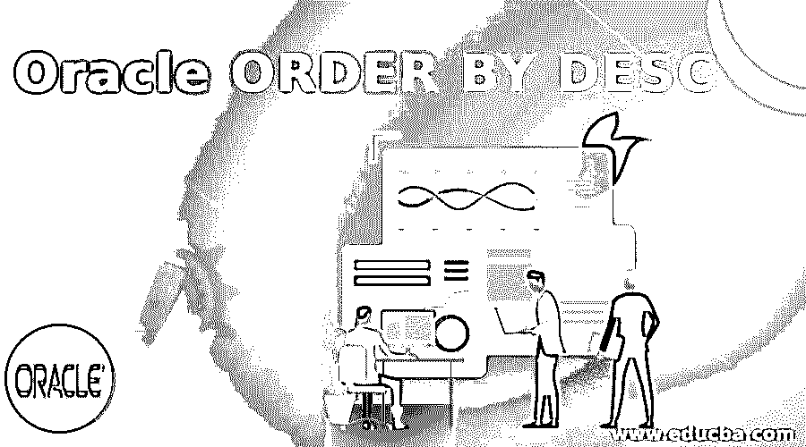
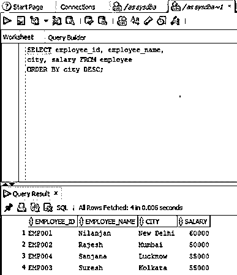
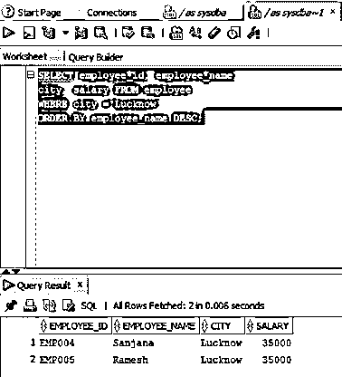
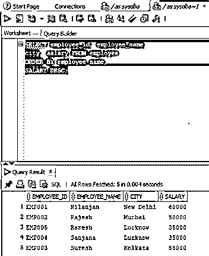
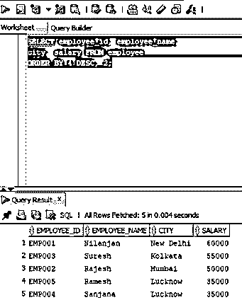

# DESC 订购甲骨文

> 原文：<https://www.educba.com/oracle-order-by-desc/>

## DESC 的甲骨文订单介绍

ORDER BY 子句可以定义为用于以升序或降序查询结果集或行的子句，因为存储在 oracle 数据库中的行或记录是以未指定的顺序存储的，并且当单词 DESC 添加到 ORDER BY 子句中时，定义略有变化，以降序查询行，否则 ORDER BY 的默认值是升序。

**语法:**

<small>Hadoop、数据科学、统计学&其他</small>

在上一节中，我们讨论了关于 ORDER BY DESC 子句的定义。现在让我们看看相同的语法。

`SELECT
column1,
column2
column_n
FROM
table_name
ORDER BY column_name DESC;`

**参数:**

*   **column1，column2，column_n:** 这是指我们需要其数据的列。
*   **table_name:** 表示我们要查询的表的名称
*   **column_name:** 是指我们要对值进行降序排序的列。

### DESC 订单在 Oracle 中是如何工作的？

通常，Oracle 数据库中的数据不是按照指定的顺序存储的(升序或降序)。现在让我们讨论一下 ORDER BY 子句在 oracle 数据库中是如何工作的。在执行具有 order by 子句的 select 查询时，如果不存在 where 条件，数据库首先从表中检索列的行，但是如果查询中存在 WHERE 条件，则首先执行 WHERE 条件，并基于此检索满足 WHERE 条件的列的行。这形成了查询的结果集。ORDER BY DESC 子句现在应用于该结果集，然后 oracle 根据 ORDER BY 子句中指定的列对结果集进行降序排序。如果没有 DESC 关键字，默认情况下，数据库会按照升序排序。

### 在 Oracle 中按 DESC 实施订单的实例

现在让我们来看几个例子，以便更好地理解:

#### 示例# 1–无条件地按降序对行进行排序

在本例中，我们将使用 ORDER BY DESC 子句对行进行降序排序。在本例中，我们将按照城市列以降序对雇员表的内容进行排序。由于没有 WHERE 条件，结果集将由表中的所有值组成。让我们看看同样的查询。

**查询:**

`SELECT employee_id, employee_name,
city, salary FROM employee
ORDER BY city DESC;`

**输出:**

正如我们在上面的屏幕截图中看到的，输出按照 city 列以降序显示值。

#### 示例# 2–使用 **WHERE** 条件按降序对行进行排序

在本例中，我们将使用带有 WHERE 条件的 ORDER BY DESC 子句对行进行降序排序。对于本例，我们将按照雇员姓名对雇员表的内容进行降序排序，这些雇员的城市是勒克瑙。由于存在 WHERE 条件，结果集将由 city 列中值为 Lucknow 的行组成。让我们为此准备选择查询。

**查询:**

`SELECT employee_id, employee_name,
city, salary FROM employee
WHERE city ='Lucknow'
ORDER BY employee_name DESC;`

**输出:**

正如我们在屏幕截图中看到的，上面的输出按照降序显示了 employee_name 列的值，其中城市是 Lucknow。

#### 示例# 3–在多列上按降序对行进行排序

在前面的示例中，我们在单个列上使用了 order by 子句，但是在这个示例中，我们将在多个列上应用它。在本例中，我们将按照雇员姓名升序和薪水降序对雇员表中的值进行排序。在这种情况下，我们不会使用 anywhere 条件，因此结果集将包含 employee 表中的所有值。让我们为此准备一个选择查询。

**查询:**

`SELECT employee_id, employee_name,
city, salary FROM employee
ORDER BY employee_name,
SALARY DESC;`

**输出:**

在 Oracle 上面的查询中，首先按雇员姓名对行进行排序以准备一个初始列表，然后初始列表再次按薪金降序排序以得到最终列表。

正如我们在上面的屏幕截图中看到的，输出按升序显示了 employee_name 列的值，然后按降序显示了 salary 列的值。

#### 示例 4–按照列的位置降序排列行

在前面的示例中，我们对单个列使用了 order by 子句，但是在本例中，我们将通过使用列的位置对多个列应用该子句。在本例中，我们将对 employee 表中的值进行排序，按雇员姓名升序排序，按薪金降序排序，但使用各列各自的位置。让我们为此准备一个选择查询。

**查询:**

`SELECT employee_id, employee_name,
city, salary FROM employee
ORDER BY 4 DESC, 2;`

**输出:**

在上面的查询中，我们用列位置替换了列名。Oracle 首先按照第四个位置的列对行进行降序排序，以准备一个初始列表，然后再按照第二个位置的列对初始列表进行升序排序。

正如我们在上面的屏幕截图中看到的，输出显示了排序后的结果。

### 结论

在本文中，我们详细讨论了关于 ORDER BY 子句的 DESC。首先，我们讨论了 ORDER BY 子句的定义，然后讨论了语法和工作原理。后来，我们通过所有场景的例子来更好地理解。

### 推荐文章

这是 DESC 的甲骨文订购指南。在这里，我们讨论由 DESC 提出的 Oracle ORDER 及其语法，以及实际的例子和不同的子查询表达式。您也可以浏览我们推荐的文章，了解更多信息——

1.  [甲骨文别名简介](https://www.educba.com/oracle-aliases/)
2.  [Oracle 中的 Left Join 是如何工作的？](https://www.educba.com/left-join-in-oracle/)
3.  [什么是 Oracle 数据库|应用](https://www.educba.com/what-is-oracle-database/)
4.  [至 10 个 Oracle 数据库面试问题](https://www.educba.com/oracle-database-interview-questions/)

