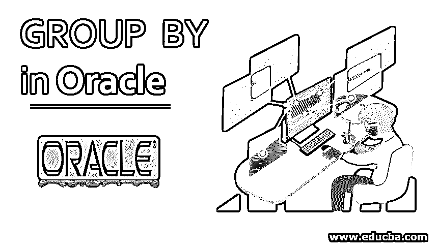
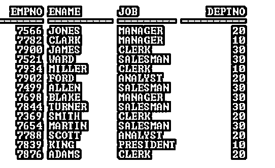
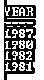
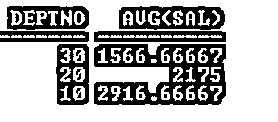

# Oracle 中的分组依据

> 原文：<https://www.educba.com/group-by-in-oracle/>

## Oracle 中的 GROUP BY 简介

GROUP BY [Oracle 子句用于](https://www.educba.com/oracle-clauses/)将表中的行分组。它在 SELECT 语句中用于按列或表达式的值对行进行分组。GROUP BY 子句按一个或多个列值对结果进行分组。

**集中点**

<small>Hadoop、数据科学、统计学&其他</small>

*   如果 group 函数包含在 SELECT 语句中，则在没有 GROUP BY 子句的情况下，不能使用单个结果列。
*   额外的非组函数列应该在 GROUP BY 子句中声明。
*   在使用 WHERE 子句将行分组之前，可以预先排除这些行。
*   GROUP BY 子句中不能使用列别名。
*   默认情况下，行按“分组依据”列表中包含的列的升序排序。
*   应用于 GROUP BY 子句的列不必是选择列表的一部分。
*   如果 SELECT 语句中的非组函数列包含组函数，则必须使用 GROUP BY 子句。

**语法**

1.不带组函数的语法

`SELECT Column_1, Column_2,..., Column_N FROM Table_Name WHERE condition(s)
GROUP BY Column_Name(s) ORDER BY Column(S);`

2.带组函数的语法

`SELECT Column_1, Column_2,..., GROUP_FUN(Column) FROM Table_Name
WHERE condition(s) GROUP BY Column_Name(s) ORDER BY Column(S);`

**描述:**

*   Col_1/2/n:根据您的要求进行计算的列。
*   Table_Name:根据您的要求
*   其中:这是可选的，取决于你的要求
*   GROUP_FUN: AVG、总和、最小值、最大值

**例:**无分组功能

`SQL>   SELECT Job FROM Emp GROUP BY Job;`

**输出:**

**示例:**带分组功能

`SQL>   SELECT Deptno, AVG (Sal) FROM Emp GROUP BY Deptno;`

**输出:**

**解释:**上面的两个例子(没有别名和有别名)清楚地显示了 GROUP BY 子句如何根据条件对行进行分组。

### Oracle GROUP BY 子句的实现及示例

在本节中，我们将看到 Oracle GROUP BY 子句的实现及其行为。为此，我们将使用下面包含 14 条记录的示例表(Emp)来理解 Oracle GROUP BY 子句的行为。

`SQL> SELECT * from Emp;`

**输出:**

#### 示例#1

具有非组功能列的 GROUP BY 子句

`SQL > SELECT Empno, Ename, Job, Deptno FROM Emp GROUP BY Deptno;`

**输出:**

上面的 SELECT 语句抛出了一个错误，因为在 SELECT 语句中包含了四个非组函数列，但在 GROUP BY 子句中只包含了一个列。

为了防止这种错误，所有非组功能列都应该包含在 GROUP BY 子句中。下面的例子:

`SQL > SELECT Empno, Ename, Job, Deptno FROM Emp GROUP BY Empno, Ename,Job, Deptno;`

**输出:**

#### 实施例 2

GROUP BY 子句中的列别名

`SQL> SELECT TO_CHAR (Hiredate, 'YYYY') Year FROM Emp GROUP BY Year;`

**输出:**

上述 SELECT 语句引发了无效标识符错误，因为 GROUP BY 子句中使用了列别名(Year)。根据规则，不能在 GROUP BY 子句中使用列别名。正确的 SELECT 语句如下:

`SQL> SELECT TO_CHAR (Hiredate, 'YYYY') Year FROM Emp GROUP BY
TO_CHAR (Hiredate, 'YYYY');`

**输出:**

#### 实施例 3

具有组函数的 GROUP BY 子句

`SQL> SELECT Deptno, AVG (Sal) FROM Emp GROUP BY Deptno;`

**输出:**

在上面的示例中，输出显示了对 Deptno 进行分组后每个 Deptno 的平均工资。

`SQL> SELECT Deptno, Job, SUM (Sal) FROM Emp GROUP BY Deptno;`

**输出:**

但是上面的 SELECT 语句抛出了一个错误，因为在 SELECT 语句的 GROUP functional column 中包含了两个非组函数列，而在 GROUP BY 子句中只包含了一个非组函数列。

为了防止这种错误，所有非组函数列都应该在 GROUP BY 子句中声明。下面的例子:

`SQL> SELECT Deptno, Job, SUM (Sal) FROM Emp GROUP BY Deptno, Job;`

**输出:**

#### 实施例 4

没有 GROUP BY 子句的组功能列和非组功能列

`SQL> SELECT Deptno, AVG (Sal) FROM Emp;`

**输出:**

上面的 SELECT 语句弹出一个错误，因为组功能列正与非组功能列一起使用。根据非组规则，如果使用组功能列，则 GROUP BY 子句中必须包含功能列。

请参见下面针对上述场景的正确 SELECT 语句:

`SQL> SELECT Deptno, AVG (Sal) FROM Emp GROUP BY Deptno;`

**输出:**

#### 实施例 5

更多分组汇总的例子

`SQL> SELECT Deptno, AVG (Sal) FROM Emp GROUP BY Deptno ORDER BY
AVG (Sal);`

**输出:**

`SQL> SELECT Deptno, MIN (Sal), MAX (Sal) FROM Emp GROUP BY deptno;`

**输出:**

`SQL> SELECT Deptno, MIN (Sal), MAX (Sal) FROM Emp WHERE Job=’CLERK’
GROUP BY deptno;`

**输出:**

**Note:** The above example shows that the column which exists in the Table but not included in the SELECT statement, can be used in the WHERE clause to filter the rows.

**温馨提示:**

*   如果只使用组功能列，则不需要使用 GROUP BY 子句。
*   组函数列别名可以在 ORDER BY 子句中使用，但不能在 GROUP BY 子句中使用。
*   组功能列总是返回单行结果。

### 结论

Oracle GROUP BY 子句是一个表达式或关键字，它将一个结果集分组为具有一个或多个列匹配值的子集。要按组获取结果集，或者需要对非组函数列应用聚合或组函数，Oracle GROUP BY 子句是一个不错的选择。

### 推荐文章

这是 Oracle 中的分组指南。这里我们用例子讨论 Oracle GROUP BY 子句的介绍、关注点和实现。您也可以浏览我们的其他相关文章，了解更多信息——

1.  [相交于甲骨文](https://www.educba.com/intersect-in-oracle/)
2.  [SQL 中的 GROUP BY 子句](https://www.educba.com/group-by-clause-in-sql/)
3.  [MySQL 中的光标](https://www.educba.com/cursor-in-mysql/)
4.  [Oracle 中的 UNION](https://www.educba.com/union-in-oracle/)
5.  [Oracle 中的表格示例](https://www.educba.com/table-in-oracle/)
6.  [Oracle 中的光标指南及示例](https://www.educba.com/cursor-in-mysql/)

