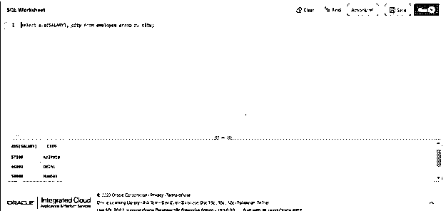
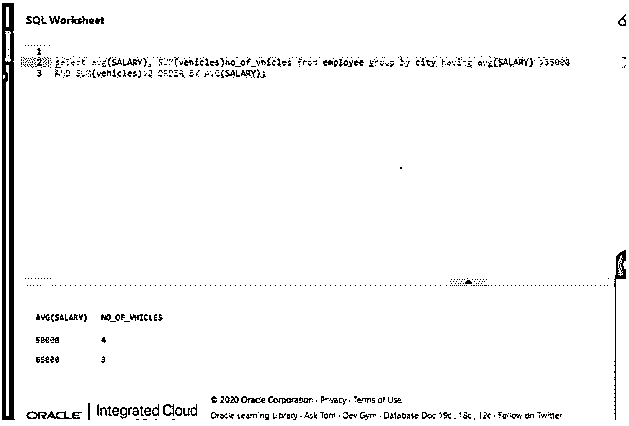

# Oracle 分组依据

> 原文：<https://www.educba.com/oracle-group-by-having/>

## 通过以下方式介绍 Oracle 集团

oracle 数据库中的 GROUP BY 可定义为一个子句，当与 SELECT 语句一起使用时，可用于将表中的相同数据排列到组或簇中，HAVING 子句可定义为一个筛选子句，当与 GROUP BY 一起使用时，可用于筛选 GROUP BY 子句检索或返回的组，它位于 SELECT 语句中的 WHERE 子句之后，但位于 ORDER BY 子句之前。

### 句法

现在让我们看看 GROUP BY HAVING 子句的语法，它非常简单。

<small>Hadoop、数据科学、统计学&其他</small>

`SELECT
expression_1, expression_2, expression_n, aggregate_function(expression)
FROM
table_name
GROUP BY
expression_1, expression_2, expression_n
HAVING
condition;`

#### 因素

**expression_1，expression_2，expression_n:** 这是指必须与 GROUP BY 函数一起使用的表达式。

**aggregate_function(表达式):**SUM、COUNT、MAX、MIN 等聚合函数

**table_name:** 应用 GROUP BY 函数的表的名称。

**condition:** 它是指我们希望对 GROUP BY 子句的结果集应用的条件，以限制或过滤 GROUP BY 返回的行。只包括条件评估为真的那些组，而不包括其余的组。

### 如何在 Oracle 中进行分组？

在上一节中，我们讨论了 Oracle 中的组的定义和语法。在本节中，我们将讨论它是如何工作的。GROUP BY 和 HAVING 是两个不同的子句。现在让我们来讨论当我们在同一个查询中使用这两种方法时，查询是如何执行的。当语句或查询执行时，GROUP BY 子句将表中的每一行分离或分组到一个特定的组中。每组由相似的数据组成。

数据根据 group by 子句后提到的某个表达式分组。这将返回一个由许多组组成的结果集。HAVING 子句现在根据 HAVING 子句后提到的条件，从 GROUP BY 子句返回的结果集中筛选或检查每个组。如果条件评估为真，则它将被包括在该组中，否则它不被包括。需要注意的重要一点是，HAVING 子句筛选组，而 WHERE 子句筛选行。

### 通过以下方式实施 Oracle GROUP 的示例

在这一节中，我们将讨论几个使用带有 having 的 Oracle 子句的各种情况的例子。

#### 示例#1

不使用 HAVING 的 GROUP BY:在这种情况下，我们将看到一个示例来理解如何在不使用 HAVING 的情况下使用简单的 GROUP BY 子句。在本例中，我们将对 employee 表中的列 city 使用 GROUP BY 子句。这应该根据不同的城市对行进行分组。让我们准备一个同样的查询。

**代码:**

`SELECT avg(SALARY), city from employee group by city;`

**输出:**

**解释:**在上面的查询中，我们通过根据雇员表中的城市对数据进行分组来查找平均工资。正如我们在上面的截图中看到的，输出显示了每个城市的平均工资。

#### 实施例 2

使用 HAVING 进行分组:在本例中，我们将使用带有 GROUP BY 的 HAVING 子句，并检查其工作原理。在本例中，我们将在 employee 表中的列 city 上使用带有 HAVING 条件的 GROUP BY 子句。这应该根据不同的城市对行进行分组，然后最终的结果集应该只包含那些满足 HAVING 条件的行。让我们准备一个同样的查询。

**代码:**

`SELECT avg(SALARY), city from employee group by city having avg(SALARY) >55000;`

**输出:**

**解释:**在上面的查询中我们可以看到，表中的行将首先按城市分组，然后在输出中只显示平均工资大于 55000 的那些组。正如我们在截图中看到的，只显示了工资高于 55000 的组。

#### 实施例 3

使用多个 HAVING 条件进行分组:在本例中，我们将在 GROUP BY 子句中使用多个 HAVING 条件，并检查它是如何工作的。我们也可以把这种情况称为具有复杂条件。在本例中，我们将对 employee 表中的 city 列使用 GROUP BY 子句，并使用多个 HAVING 条件。这应该根据不同的城市对行进行分组，然后最终的结果集应该只包含那些满足 HAVING 条件的行。让我们准备一个同样的查询。

**代码:**

`select avg(SALARY), SUM(vehicles)no_of_vhicles from employee group by city having avg(SALARY) >35000 AND SUM(vehicles)>2 ORDER BY AVG(SALARY);`

**输出:**

**解释:**在上面的查询中，我们可以看到表中的行将首先按城市分组，然后对初始结果集进行筛选，以便只筛选平均工资大于 35000 的组，然后再次检查满足第一个条件的组也必须满足组中存在的车辆总数必须大于 2。只有满足这两个条件的那些组才是最终结果。最终结果按平均工资升序排序，并显示为输出。正如我们在屏幕截图中看到的，输出以升序显示了平均工资高于 35000 和车辆多于两辆的组的结果。

### 结论

在本文中，我们详细讨论了 Oracle 数据库中 GROUP BY with HAVING 的定义、语法及其工作原理。为了获得实际的视角，我们讨论了每个场景的示例，以便更好地理解这个主题。

### 推荐文章

这是 Oracle GROUP 的指南。在这里，我们通过适当的语法、工作原理和查询示例来介绍 Oracle GROUP。您也可以浏览我们的其他相关文章，了解更多信息——

1.  [甲骨文提交](https://www.educba.com/oracle-commit/)
2.  [Oracle 唯一约束](https://www.educba.com/oracle-unique-constraint/)
3.  [Oracle 中的 UNION](https://www.educba.com/union-in-oracle/)
4.  [Oracle 中的自然连接](https://www.educba.com/natural-join-in-oracle/)

