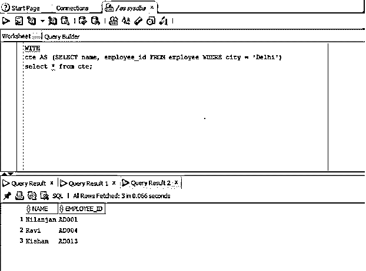
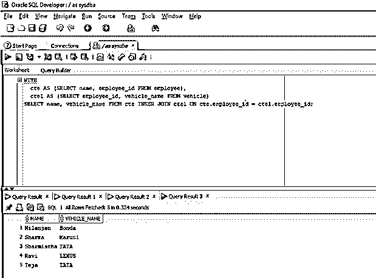

# 甲骨文 CTE 公司

> 原文：<https://www.educba.com/oracle-cte/>

## 甲骨文 CTE 公司简介

CTE ORACLE 是一个简单的查询，用于简化不同类别的 SQL 查询，因为派生表概念并不适合定义为命名的临时结果集，它只能存在于单个语句的范围内(在这种情况下，这里的语句意味着 SELECT 以及插入和更新等 DML 语句),并且可以根据开发人员的需要在该特定语句中多次引用。

### 句法

现在让我们看看下面的 Oracle 公用表表达式的语法。

<small>Hadoop、数据科学、统计学&其他</small>

`With [CTE_NAME (column1, column2,…)] AS
(
CTE QUERY
)`

#### 因素

*   **CTE _ 名称:**是指我们要给常用表表达式起的名字
*   **column1:** 表示表格的一列或列名。
*   **CTE 查询:**它实际上指的是查询或者语句。

### CTE 如何在甲骨文工作？

正如我们在本文前面部分已经看到的关于 CTE 的定义。在这一节中，我们将讨论它在数据库中是如何工作的。因此，为了便于数据库理解，我们在 CTE 查询语句开始之前使用 WITH 子句来定义它。这里的语句表示选择、插入、更新、删除。我们可以在一个 with 子句中添加多个 CTE，用逗号分隔它们。所以，一旦我们用 WITH 子句定义了 cte。我们可以像引用数据库中的表一样引用定义的 CTE。

最重要的一点是，我们可以在 WITH 子句查询的执行范围内引用它。一旦查询执行完毕，我们就不能在任何其他语句或查询中使用 CTE。所以我们可以说，CTE 的范围仍然是语句的执行。

递归公用表表达式(RCTE)作为关键字递归建议引用自身。它有一个引用其自身名称的子查询。它主要用于处理分层数据，如公司层次结构职位图表或表格，因为递归 CTE 将继续执行，直到结果集中返回整个层次结构。

在处理递归 CTE 时要记住的重要一点是，如果没有正确创建它，它将创建一个无限循环。

### 实施 Oracle CTE 的示例

下面是提到的例子:

#### 示例 1–使用 WITH 子句的单个 CTE

我们可以在一个 WITH 子句中创建多个 cte。在本例中，我们将创建一个 CTE，它包含雇员表中雇员 id 和雇员姓名的结果集。让我们看看同样的查询

**代码:**

`WITH
CTE AS (SELECT name, employee_id FROM employee WHERE city = 'Delhi')
select * from CTE;`

**解释:**现在我们来过一遍查询，了解一下。查询的第一部分是我们定义公共表表达式的部分。CTE 名称紧接在 WITH 子句之后提供。AS 子句括号内的 SELECT 语句查询是 CTE 子查询。CTE 子查询提取结果集，并将其存储在临时公共表达式表中，在本例中名为 CTE。第二个 SELECT 语句或查询末尾的 SELECT 语句显示临时存储在公用表表达式中的结果集。

需要记住的重要一点是，CTE 的范围只到语句执行时为止。

**输出:**现在让我们在 SQL developer 中执行查询并查看结果。

正如我们在截图中看到的，结果只显示了城市为德里的雇员的姓名和雇员 id。

#### 示例 2–使用 WITH 子句的多个 CTE

我们可以使用一个 WITH 子句来定义多个 cte。在本例中，我们将获取雇员及其车辆名称。车辆名存储在以车辆 id 为主键的车辆表中，雇员名存储在以雇员 id 为主键的雇员表中。在本例中，我们将只获取那些雇员姓名和雇员 id(外键)出现在车辆表中的车辆。让我们看看同样的查询。

**代码:**

`WITH
CTE AS (SELECT name, employee_id FROM employee),
CTE1 AS (SELECT employee_id, vehicle_name FROM vehicle)
SELECT name, vehicle_name FROM CTE INNER JOIN CTE1 ON CTE.employee_id = CTE1.employee_id;`

**解释:**现在我们来过一遍查询，了解一下。查询的第一部分是我们已经定义了两个公共表表达式的部分。这两个 CTE 名称都是在 WITH 子句之后提供的。AS 子句括号内的 SELECT 语句查询是 CTE 子查询。在这种情况下，CTE 子查询提取结果集并将其存储在 CTE 中，因为我们有两个 CTE，所以我们有两个子查询，其中子查询的每个结果集都存储在各自的 CTE 中。查询的第二部分由内部语句组成，其中我们使用 CTE 的结果集来显示雇员姓名和基于雇员 id 连接条件的相应车辆名称。

需要记住的重要一点是，CTE 的范围只到语句执行时为止。

**输出:**现在让我们在 SQL developer 中执行查询并查看结果。

正如我们在上面的截图中看到的，它显示了员工的姓名以及他们的车辆号码。

### 结论

在本文中，我们从 CTE 的定义以及如何在 Oracle 中编写 CTE(语法)入手，讨论了 Oracle CTE。在本文的后面，我们借助适当的例子讨论了 oracle 中各种 cte 的工作方式。

### 推荐文章

这是甲骨文 CTE 公司的指南。在这里，我们讨论了 Oracle CTE 的介绍，CTE 是如何与适当的语法，参数和各自的例子，以更好地理解。您也可以浏览我们的其他相关文章，了解更多信息——

1.  [Oracle Alter Table](https://www.educba.com/oracle-alter-table/)
2.  [甲骨文程序](https://www.educba.com/oracle-procedures/)
3.  [Oracle 子查询](https://www.educba.com/oracle-subquery/)
4.  [Oracle 约束条件](https://www.educba.com/oracle-constraints/)

