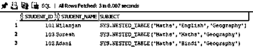
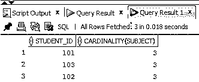
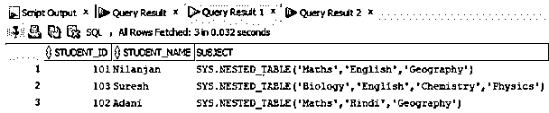
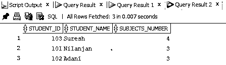
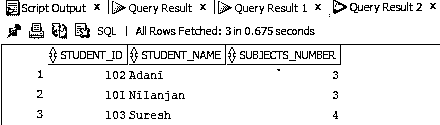
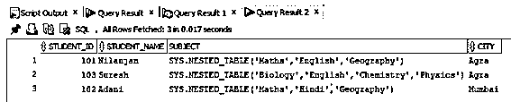
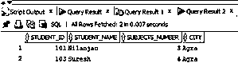

# Oracle 基数

> 原文：<https://www.educba.com/oracle-cardinality/>

## Oracle 基数函数简介

一般来说，基数是一个数学术语，可以定义为一个组或一个集合中元素的数量，作为该特定集合的一个属性，在 oracle 中，我们可以将其定义为一个列或嵌套表中不同元素数量的度量或计算，基数函数返回数据类型数字，如果嵌套表或列为空，则我们将从该函数获得 NULL 返回输出。

**语法:**

<small>Hadoop、数据科学、统计学&其他</small>

`CARDINALTY(nested_table)`

**参数:**

nested_table:它指的是嵌套表中需要基数的列。

### 基数函数在 Oracle 中是如何工作的？

在上一节中，我们学习了 oracle 中基数的定义。现在让我们看看它在 oracle 中是如何工作的。Cardinality 函数仅应用于嵌套表列，而不适用于任何其他列。因此，不要将它与 distinct function 混淆，因为与 distinct function 不同，它不能应用于不是嵌套表的列的任何其他列。当我们使用 SELECT 语句执行该函数时，该函数首先检查该列是否是嵌套列，然后测量存在的元素数量。需要注意的重要一点是，在测量嵌套列的每一行中的元素时，它不会检查元素是否重复。该函数提取的结果集返回数据类型号。它包含的数字等于嵌套表列的每一行中的元素数，如果没有元素，则在结果集中返回 NULL。

### Oracle 中基数函数的示例

现在让我们看看下面的例子，以便更好地理解 COMMIT 语句。

#### 1.正在查找列的基数

正如我们已经讨论过的，我们可以使用 cardinality 函数找到嵌套列的基数。因此，在本例中，我们将找到表 my_student 中嵌套列 subject 的基数。该表由非嵌套列和嵌套列组成。该表由三列组成。在应用该函数之前，让我们看一下表数据。

**查询:**

`SELECT * FROM my_student;`

**输出:**

正如我们在上面的数据中看到的，第三列是嵌套的表列，现在我们将使用基数函数来测量 subject 列的每一行中存在的元素数量。让我们看看同样的查询。

**查询:**

`select student_id, CARDINALITY(subject)
from my_student;`

**输出:**

正如我们在上面的屏幕截图中看到的，该查询返回 subject 列的每一行中的学生 id 和元素度量。在截图中可以看到的重要一点是，尽管 id 为 103 的学生提到的主题有重复的主题，因为主题的总数是 3。因此基数为 3。

#### 2.用 order by 子句查找列的基数

在这个场景中，我们将使用 CARDINALITY 函数按字母降序查找学生的姓名及其科目。同样，我们将使用 ORDER BY 子句。让我们先看看我的学生的表格。

**查询:**

`SELECT * FROM my_student;`

**输出:**

正如我们在表中看到的，它有三个学生，我们需要按照科目数量(基数)降序排列学生姓名。让我们为此创建一个 SELECT 语句。

**查询:**

`select student_id, student_name, CARDINALITY(subject) AS SUBJECTS_NUMBER
from my_student ORDER BY student_name DESC;`

在上面的查询中，关键字 DESC 用于按降序对雇员姓名进行排序。

**输出:**

正如我们在上面的截图中看到的，输出使用基数函数返回降序排列的名称以及每个名称的主题数。

另一种情况是使用 ORDER BY 而不使用 DESC 关键字。在这种情况下，默认情况下，排序顺序将是升序。让我们看一下不使用 DESC 和 ORDER BY 的查询。

**查询:**

`select student_id, student_name, CARDINALITY(subject)AS SUBJECTS_NUMBER
from my_student ORDER BY student_name ;`

**输出:**

正如我们在上面的屏幕截图中看到的，输出使用基数函数返回按升序排列的名称以及每个名称的主题数。

#### 3.用 Where 条件查找列的基数

在这个场景中，我们将使用 WHERE 条件来限制 SELECT 语句的结果集。例如，我们想找到原籍城市为‘阿格拉’的学生的科目数。在这种情况下，我们不能简单地只使用 SELECT 语句，我们需要使用 WHERE 条件。让我们看看 my_student 表中的数据。

**查询:**

`SELECT * FROM my_student;`

**输出:**

现在让我们创建一个查询，其中我们只获取来自阿格拉市的学生的科目基数。

**查询:**

`select student_id, student_name, cardinality(SUBJECT) AS SUBJECTS_NUMBER, city
from my_student where city ='Agra';`

正如我们在上面的查询中看到的，我们在 where 条件中给出了城市“Agra”。

**输出:**

正如我们在上面的截图中看到的，输出返回了来自阿格拉市的学生的姓名、学号、科目数。

### 结论

在本文中，我们讨论了 Oracle 中基数函数的定义。我们还讨论了函数的语法以及函数的工作方式。后来，我们通过不同的例子来更好地理解函数的实现。

### 推荐文章

这是 Oracle 基数指南。这里我们讨论 Oracle 基数的定义及其语法。我们还讨论了基数函数如何与参数一起工作。您也可以浏览我们推荐的文章，了解更多信息——

1.  [甲骨文别名简介](https://www.educba.com/oracle-aliases/)
2.  [Oracle 中的 Left Join 是如何工作的？](https://www.educba.com/left-join-in-oracle/)
3.  [什么是 Oracle 数据库|应用](https://www.educba.com/what-is-oracle-database/)
4.  [至 10 个 Oracle 数据库面试问题](https://www.educba.com/oracle-database-interview-questions/)

