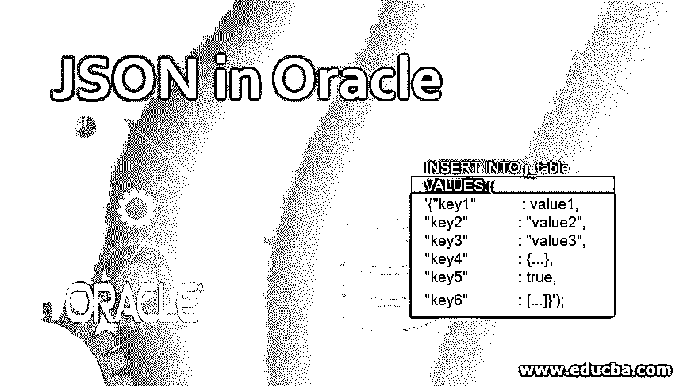
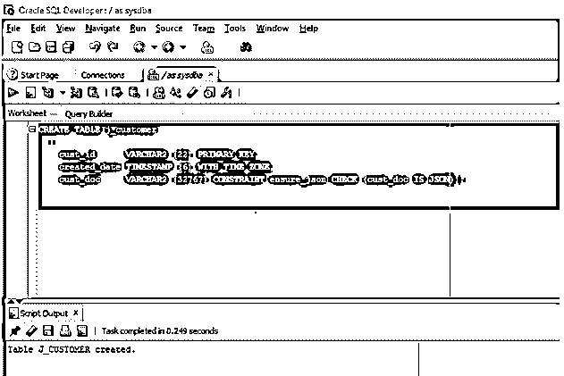
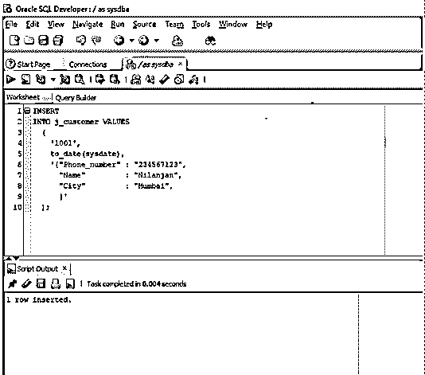
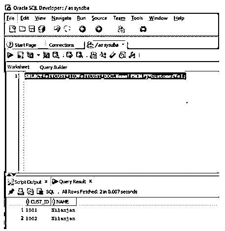

# Oracle 中的 JSON

> 原文：<https://www.educba.com/json-in-oracle/>

## Oracle 中的 JSON 简介

JSON 代表 JavaScript Object Notation 是一种开放的标准数据交换格式，它以属性-值对的形式存储数据对象，这使得它非常可读，这里的值可以是 JSON 对象)一个逗号分隔的属性值对，放在花括号内)、JSON 数组(逗号分隔的 JSON 对象列表，放在方括号内)、数字、字符串、布尔值、null，由于它减少了复杂的解析，因此很容易将 JSON 对象转换为 JavaScript 对象，类似地，将 JavaScript 对象转换为 JSON，并将 JSON 发送到服务器。在这个主题中，我们将学习 Oracle 中的 JSON。

**语法**

<small>Hadoop、数据科学、统计学&其他</small>

以在 oracle 中使用 json 为例，我们将讨论在关系型 oracle 数据库中使用 JSON 的两种方式。我们将讨论在 oracle 中插入 json 以及从 oracle 数据库中查询 json 数据的语法。

**在 Oracle 中插入 JSON**

`INSERT INTO j_table
VALUES (
'{"key1"           : value1,
"key2"            : "value2",
"key3"            : "value3",
"key4"            : {...},
"key5"            : true,
"key6"            : [...]}');`

**参数**

1.  j_table:包含一个或多个 JSON 列的表。
2.  Key:这些是 JSON 对象中用花括号括起来的字符串
3.  Value:这些是有效的数据类型(string、Boolean、integer、null ),用冒号与 JSON 对象中的键隔开。

**在 Oracle 中查询 JSON 数据**

`SELECT j_table.j_column.jsonKey FROM j_table;`

**参数**

1.  **j_table:** 具有一个或多个 json 列的表
2.  **j_column:** 有 json 数据的列
3.  **jsonkey:** 这将从 json 列的每个文档中返回键值。

### JSON 在 Oracle 中是如何工作的？

在上一节中，我们讨论了各种情况的语法。现在让我们看看 JSON 在 oracle 中是如何工作的。Oracle 数据库对可以存储 json 对象的表没有任何限制，这意味着包含 json 数据的列可以与表中不包含 JSON 数据的其他列或包含 JSON 数据的其他列共存。当在 Oracle 数据库中创建包含存储 json 文档的列的表时，我们应该添加一个名为 is_json 的约束，这样当在表中插入值作为数据类型时，表只接受 json 文档，同时声明 json 应该保持 VARCHAR2。当从数据库中查询 json 数据时，这非常简单，因为我们只需要编写一个普通的 SQL SELECT 语句，唯一的区别是我们需要提供我们想要的数据的键。假设有一个名为 column_json 的列，它存储 json 文档。在这种情况下，我们需要所有的电话号码，因为电话号码与其他字段一起存储在 json 文档中。所以我们只提 column_name。phone_number (key)在 select 查询中，这将从该列中出现的所有 json 文档中提取电话号码。返回值将始终是 VARCHAR2。

### 如何用实例在 Oracle 中插入 Json 数据？

我们将使用两个例子来研究这些，第一个例子是我们将如何创建一个存储 JSON 数据的表，然后我们将看到如何使用 insert 语句来存储数据。

我们首先要创建一个 j_customer 表，它有三列。cust_id 列将是主键，包含每个客户的唯一 id、首次插入客户的日期，然后是名为 cust_doc 的 json 列，它将以 json 格式存储每个客户的客户详细信息。

**查询**

`CREATE TABLE j_customer
(
cust_id     VARCHAR2 (22) PRIMARY KEY,
created_date TIMESTAMP (6) WITH TIME ZONE,
cust_doc     VARCHAR2 (32767) CONSTRAINT ensure_json CHECK (cust_doc IS JSON)
);`

如果我们看到上面的查询，我们可以看到我们使用了一个检查约束 is_json 来检查只有 json 对象被插入到列中，因为列的数据类型是 varchar2。

现在让我们在 SQL developer 中执行查询。

上面的屏幕截图显示 J_CUSTOMER 表已经成功创建。

现在让我们在刚刚创建的 J_CUSTOMER 表中插入一列。

我们将在列 cust_doc 中插入一个 json 文档，在表 j_customer 的另外两列中插入非 json 数据对象。插入查询如下所示。

`INSERT
INTO j_customer VALUES
(
'1001',
'to_date(sysdate)',
'{"Phone_number" : "234567123",
"Name"   : "Nilanjan",
"City"       : "Mumbai",
}'
);`

在上面的查询中，json 文档由三个键值对组成。键值通过冒号分隔，花括号表示 json 文档的开始和结束。

我们将在 SQL developer 中执行上述查询。

正如我们在上面的截图中看到的，该行已经成功插入。

### 如何用例子查询 JSON 数据？

在上一节中，我们讨论了如何创建一个表，然后插入 JSON 数据。在这一节中，我们将讨论从表中提取 json 数据。

在本例中，我们将提取存储在列 cust_doc 中的 json 文档中的键“name”的值。

让我们看看同样的查询。

`SELECT e1.CUST_ID, e1.CUST_DOC.Name FROM j_customer e1;`

在上面的查询中，我们从每个文档中提取字段/键名称的值，该值作为 varchar2 返回。

让我们在 SQL developer 中执行查询。

在屏幕截图中，我们可以看到字段名的值以及客户 id。

### 优势

Oracle 数据库查询是声明性的，这意味着我们可以将 json 数据与关系数据连接起来，并类似地将它与其他关系数据一起查询。我们可以访问存储在数据库中的 JSON 数据，就像我们使用 JSON 访问数据库中的其他数据一样。

### 结论

在本文中，我们讨论了 JSON 的定义以及它在 Oracle 中的实际工作方式。在本文的后面，我们讨论了从 oracle 数据库创建、插入和提取 Json 数据，并使用了每种情况下的例子。

### 推荐文章

这是一本关于 Oracle 中 JSON 的指南。这里我们结合实例讨论 JSON 在 Oracle 中的工作原理，以及如何在 Oracle 中插入和查询数据。您也可以看看以下文章，了解更多信息–

1.  [Python 中的 JSON](https://www.educba.com/json-in-python/)。
2.  [JSON 面试问题](https://www.educba.com/json-interview-questions/)
3.  [Javascript 数组到字符串](https://www.educba.com/javascript-array-to-string/)
4.  [JavaScript 对象到字符串](https://www.educba.com/javascript-object-to-string/)

