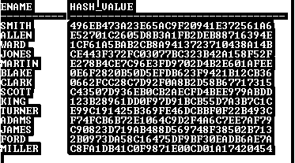
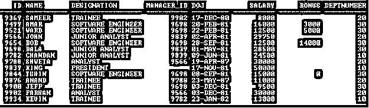
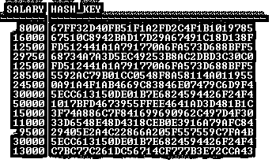
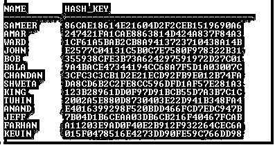
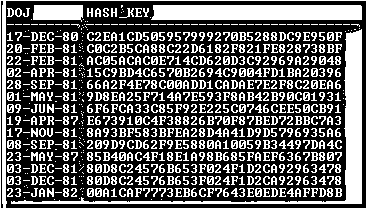
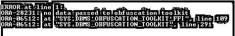
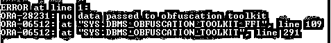
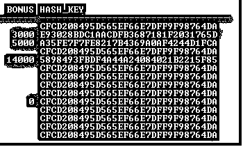
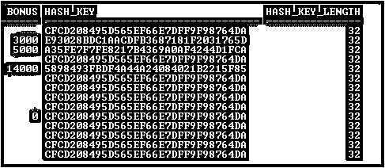

# Oracle MD5

> 原文：<https://www.educba.com/oracle-md5/>

## Oracle MD5 简介

Oracle MD5 函数是一种散列函数，用于访问数据完整性。MD5 代表消息摘要算法 5。MD5 是一种加密散列函数，通常用于计算输入值的校验和，并生成 128 位(16 字节)散列值。

**集中点:**

<small>Hadoop、数据科学、统计学&其他</small>

*   MD5 算法是由密码学家 Ronald Rivest 于 1991 年开发的。
*   MD5 函数使用消息摘要算法 5。
*   MD5 函数常用于加密哈希函数。
*   MD5 函数生成 128 位(16 字节)哈希值。
*   MD5 函数返回 32 个字符的十六进制数字。
*   MD5 函数减少了运行时的缓存使用。
*   MD5 已被广泛应用于各种加密应用中。
*   MD5 函数计算输入值的校验和。
*   如果输入为 NULL，MD5 函数返回 NULL。
*   MD5 函数是一种加密算法，它接受任意长度的输入，并生成 128 位长的消息摘要。

### 句法

`SELECT DBMS_OBFUSCATION_TOOLKIT.MD5(INPUT =>
UTL_RAW.CAST_TO_RAW (Column Name)) [Alias Name] FROM Table Name;`

**说明:**

*   **DBMS _ OBFUSCATION _ TOOLKIT:**它是一个 Oracle 内置的包，提供加密和解密数据的功能。
*   **MD5:** 它是一个(消息摘要算法 5)函数，可以使用 DBMS_OBFUSCATION_TOOLKIT 内置包访问。
*   **UTL _ 劳:**这是一个包裹。UTL 表示它并不特定于数据库环境，但也可以用于其他环境。
*   **CAST_TO_RAW:** 此函数将 VARCHAR 值转换为 VARBINARY 值。
*   **列名:**将要加密的列数据
*   **【别名】:**可选。别名可用于理解。
*   表名:这是将要使用的表的名称。

**代码:**

`SELECT Ename, DBMS_OBFUSCATION_TOOLKIT.MD5 (INPUT =>
UTL_RAW.CAST_TO_RAW (Ename)) HASH_VALUE FROM Emp;`

**输出:**

### 实施 Oracle MD5 的示例

下面是提到的例子:

#### 示例#1

在本节中，我们将看到 Oracle 函数的实现及其行为。为此，我们将使用下面包含 14 条记录的示例表(Employee)来理解 Oracle MD5Function 的行为。

**代码:**

`SELECT * Employee;`

**输出:**

#### 实施例 2

数字数据类型列上的 Oracle MD5 函数

**代码:**

`SELECT Salary, DBMS_OBFUSCATION_TOOLKIT.MD5 (input =>
UTL_RAW.CAST_TO_RAW (Salary)) HASH_KEY FROM Employee;`

**输出:**

**说明:**在上面的例子中，MD5 函数为 number 数据类型的 Salary 列数据生成了加密哈希值。

#### 实施例 3

VARCHAR2 数据类型列上的 Oracle MD5 函数

**代码:**

`SELECT Name, DBMS_OBFUSCATION_TOOLKIT.MD5 (input =>
UTL_RAW.CAST_TO_RAW (Name)) HASH_KEY FROM Employee;`

**输出:**

**说明:**在上面的例子中，MD5 函数为 Name 列数据生成了加密哈希值，该值为 VARCHAR2 数据类型。

#### 实施例 4

日期数据类型列上的 Oracle MD5 函数

**代码:**

`SELECT DOJ, DBMS_OBFUSCATION_TOOLKIT.MD5 (input =>
UTL_RAW.CAST_TO_RAW (DOJ)) HASH_KEY FROM Employee;`

**输出:**

**说明:**上面的例子清楚地表明，MD5 函数可以应用于任何数据类型。但是 MD5 函数的行为会随着空值或包含空值的列而改变。参见下面的一些例子

#### 实施例 5

NULL 上的 Oracle MD5 函数

**代码:**

`SELECT NULL, DBMS_OBFUSCATION_TOOLKIT.MD5 (input =>
UTL_RAW.CAST_TO_RAW (NULL)) HASH_KEY FROM DUAL;`

**输出:**

**说明:**上面的例子是 MD5 找到空值时抛出错误。但是这里 Oracle 抛出了 3 个错误，为什么呢？因为第一个错误 ORA-28231 说出来是因为函数期望的不是空值，但它得到的是空值。第二个和第三个错误是相同的，但发生在不同的级别或行，这就是为什么包“DBMS_OBFUSCATION_TOOLKIT”抛出两次。这两个错误是相同的，因为它由相同的 ORA 号组成，这意味着这些错误的原因相同。

#### 实施例 6

具有杂项值(空值和非空值)的 Oracle MD5 函数

**代码:**

`SELECT BONUS, DBMS_OBFUSCATION_TOOLKIT.MD5 (input =>
UTL_RAW.CAST_TO_RAW (Bonus)) HASH_KEY FROM Employee;`

**输出:**

**解释:**上例也抛出了与上例相同的错误，因为在本例中,“BONUS”列也包含空值，MD5 函数在获得空值时抛出了错误。但是使用 Oracle 函数可以避免这种错误。

#### 实施例 7

Oracle MD5 函数与 Oracle NVL 函数一起防止空值错误

**代码:**

`SELECT BONUS, DBMS_OBFUSCATION_TOOLKIT.MD5 (input =>
UTL_RAW.CAST_TO_RAW (NVL(Bonus, 0))) HASH_KEY FROM Employee;`

**输出:**

**说明:**使用适当的 Oracle 函数可以防止空值错误。在上面的示例中，NVL 函数防止了空值错误，因为 NVL 提供零“0”而不是空值，因为零的 HASH_KEY 对于奖金列中的空值完全相同。

#### 实施例 8

Oracle MD5 函数哈希值长度

**代码:**

`SELECT BONUS, DBMS_OBFUSCATION_TOOLKIT.MD5(input =>
UTL_RAW.CAST_TO_RAW(NVL(Bonus,0))) HASH_KEY,
LENGTHB (DBMS_OBFUSCATION_TOOLKIT.MD5(input=>
UTL_RAW.CAST_TO_RAW (NVL (Bonus,0)))) HASH_KEY_LENGTH FROM
Employee;`

**输出:**

**Note:** All the above note and examples executed in Oracle 11g Version. In Oracle 12C syntax of MD5 function may change.

**温馨提示:**

*   MD5 函数是比较两个或更多数据文件之间的数据或文件的好选择。
*   Oracle 函数可以与 MD5 函数一起使用。
*   MD5 函数在 Oracle 12C 版本中可用，但在软件包下。
*   如上所述，UTL 原始数据并不特定于数据库环境。

### 结论

Oracle MD5 函数用于产生给定数据的哈希值。该哈希值是评估数据完整性的重要关键。MD5 是一种加密散列函数，在计算输入值的校验和以及生成 128 位(16 字节)散列值时，它是一个很好的选择。这也是在不检查文件内容的情况下比较文件的好方法。

### 推荐文章

这是 Oracle MD5 的指南。在这里，我们讨论 Oracle MD5 的介绍、语法和解释。您也可以浏览我们的其他相关文章，了解更多信息——

1.  [Oracle 全外部连接](https://www.educba.com/oracle-full-outer-join/)
2.  [Oracle 中的左连接](https://www.educba.com/left-join-in-oracle/)
3.  [Oracle 中的分组依据](https://www.educba.com/group-by-in-oracle/)
4.  [Oracle 窗口函数](https://www.educba.com/oracle-window-functions/)
5.  [Oracle While Loop |如何工作？](https://www.educba.com/oracle-while-loop/)
6.  [Oracle 基数|如何工作？](https://www.educba.com/oracle-cardinality/)

