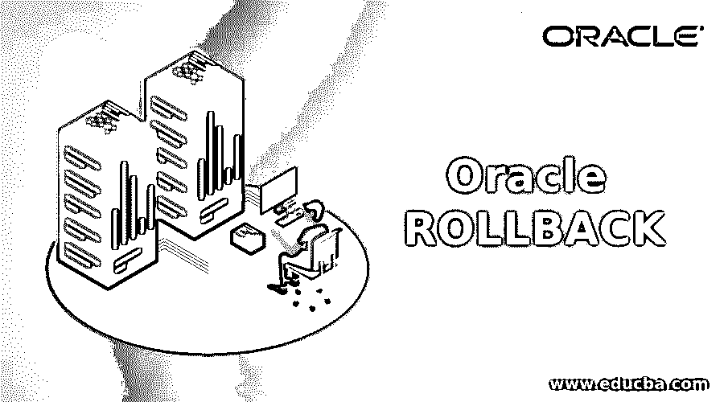
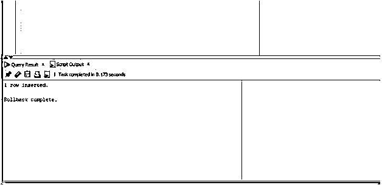
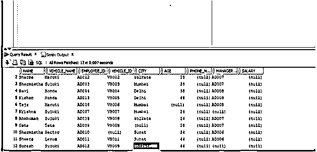
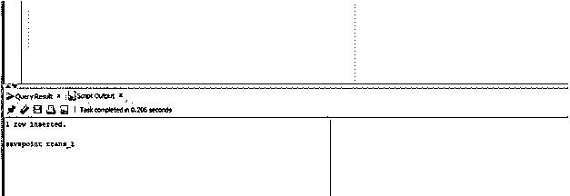
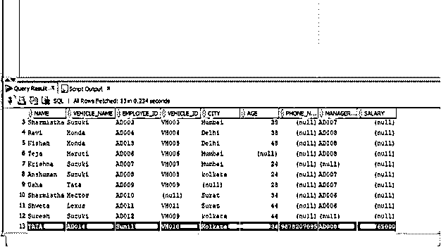
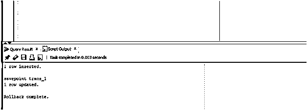

# Oracle 倒回

> 原文：<https://www.educba.com/oracle-rollback/>

## Oracle 回滚简介

Oracle Rollback 语句要求 Oracle 数据库回滚整个事务，这意味着它将撤消或忽略当前事务可能完成的任何工作或更改(插入、更新或删除),并且数据库将恢复到以前的状态(这意味着数据库在当前事务创建或启动之前的状态),它还可用于手动强制任何损坏或有疑问的事务忽略其更改，并将数据库恢复到以前的状态。

### 句法

下面我们将讨论 Oracle 中 ROLLBACK 语句的语法。语法很简单

<small>Hadoop、数据科学、统计学&其他</small>

`ROLLBACK [WORK ] [ TO savepoint| FORCE 'string' ];`

现在让我们了解一下 ROLLBACK 语句中使用的各种参数。

#### ROLLBACK 语句中使用的参数

以下是一些参数:

*   **Work:** 可选参数。有无 **WORK** 子句的语句对输出没有影响。它只是由 Oracle 添加的，以符合 SQL。
*   **保存点:**也是可选参数。如果我们使用保存点，那么 oracle 会忽略当前会话对子句提供的保存点时间所做的所有更改。如果未提供该子句，则数据库会撤消所有已做的更改。
*   **Force 'string':** 它也是一个可选参数。它用于回滚或省略不确定和挂起的事务。我们需要用这个子句在字符串中指定事务 id。可以在系统视图 DBA_2PC_PENDING 中看到损坏或可疑事务的事务 id。需要注意的是，用户应该拥有 DBA 权限来访问 DBA_2PC_PENDING 之类的系统视图。

### Oracle 回滚是如何工作的？

如果没有提供保存点子句，Oracle 中的 ROLLBACK 会要求 Oracle 回滚或忽略当前事务所做的更改，否则它将只回滚到保存点之前所做的更改。换句话说，它将数据库恢复到子句中提到的保存点。假设当前事务中有 insert 和 update 语句，并且它们被执行。如果我们不需要 update 语句所做的更改，那么在这种情况下，我们需要使用带有 savepoint 子句的 ROLLBACK 语句，它将告诉数据库忽略 update 语句的更改，并将数据库恢复到执行 UPDATE 语句之前的状态，但是由于 INSERT 语句所做的更改将会出现。如果我们不使用任何保存点，而只想忽略 INSERT 和 DELETE 语句所做的所有更改，那么我们只需使用不带任何子句的 ROLLBACK 语句，所有更改都会被忽略，数据库会返回到执行 INSERT 和 UPDATE 语句之前的状态。

### 实施 Oracle 回滚的示例

下面是提到的例子:

#### 示例#1

ROLLBACK WITHOUT 子句:在这种情况下，我们将使用 ROLLBACK 来忽略当前事务所做的更改。在这种情况下，我们将在 EMPLOYEE 表中插入一个新行，然后使用 ROLLBACK 语句忽略 insert 语句所做的所有更改。让我们看看相同的 SQL 语句。

**代码:**

`insert into employee values('Sunil','TATA','AD014','VH010','Kolkata','34','9878207095','AD008','65000');
ROLLBACK;`

第一条 SQL 语句将 SQL 语句中的值插入到 employees 表中，然后我们将使用 ROLLBACK 语句回滚更改，并使数据库返回到应用 insert 语句之前的状态。

**输出:**

正如我们在上面的截图中看到的，在执行插入查询后，回滚成功完成。

现在让我们运行选择查询，检查值是否出现在 Employee 表中。

正如我们可以看到的，Employee 表中没有我们使用 INSERT 语句插入的值。因此，ROLLBACK 语句成功地将数据库恢复到当前事务之前的状态。

#### 实施例 2

带保存点的回滚:在这种情况下，我们不会回滚整个事务，而只会回滚到某个保存点，我们将使用 SAVEPOINT 语句在事务之间声明该保存点。因此，在本例中，我们将首先使用 insert 语句在 employee 表的错误列中插入值，然后创建 INSERT 语句作为保存点，然后使用 update 语句更新错误的插入值。让我们看看这个查询。

**代码:**

`insert into employee values('Sunil','TATA','AD014','VH010','Kolkata','34','9878207095','AD008','65000');
savepoint  trans_1;`

在上面的查询中，我们可以看到有两个 SQL 语句，一个是 insert 语句，另一个设置保存点。

**输出:**

正如我们在屏幕截图中看到的，insert 语句已经成功执行，保存点也已经创建。

现在让我们运行 SELECT 语句来查看 EMPLOYEE 表。

`Select * from employee;`

如果我们在屏幕截图中看到第 13 行，那么我们可以看到该行已经被插入。

现在让我们运行 UPDATE 语句来更新内容，然后运行 ROLLBACK 语句将数据库带到保存点 trans_1。

`UPDATE EMPLOYEE SET NAME ='SUNIL' WHERE VEHICLE_ID ='VH010';
ROLLBACK TO SAVEPOINT trans_1;`

在这个查询中，我们更新名称，然后使用 ROLLBACK 和 SAVEPOINT 子句。

让我们在 SQL developer 中运行查询并检查结果。

正如我们所看到的，回滚到保存点已经成功完成。现在让我们运行 SELECT 语句来检查 EMPLOYEE 表。

我们可以看到，EMPLOYEE 表的内容与保存点 trans_1 中的内容相同。

### 结论

在本文中，我们讨论了 ROLLBACK 语句的定义和语法。为了更好地理解这个概念，本文稍后将讨论 Oracle 中回滚的工作方式以及我们使用回滚的各种情况和适当的示例。

### 推荐文章

这是 Oracle 回滚指南。在这里，我们讨论 Oracle 回滚的介绍、语法、参数、工作原理、代码和输出示例。您也可以浏览我们的其他相关文章，了解更多信息——

1.  [Oracle vs SQL Server](https://www.educba.com/oracle-vs-sql-server/)
2.  [在甲骨文的职业生涯](https://www.educba.com/career-in-oracle/)
3.  [Oracle vs MSSQL](https://www.educba.com/oracle-vs-mssql/)
4.  [Oracle 窗口函数](https://www.educba.com/oracle-window-functions/)
5.  [如何运行 Oracle While 循环？](https://www.educba.com/oracle-while-loop/)

