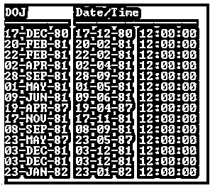
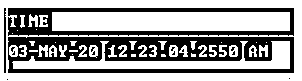
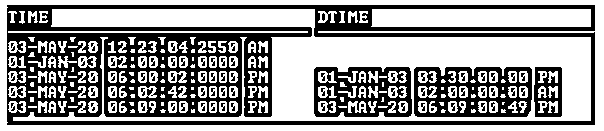
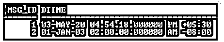
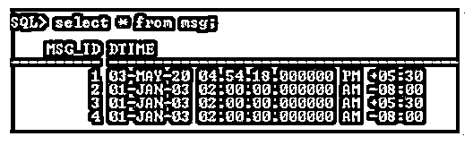
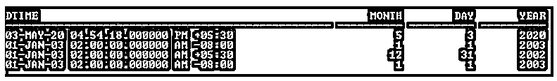

# Oracle 时间戳

> 原文：<https://www.educba.com/oracle-timestamp/>

## Oracle 时间戳简介

Oracle TIMESTAMP 是一种以世纪、年、月、日、时、分、秒格式存储的数据类型。时间戳是日期数据类型的扩展。时间戳数据类型是日期数据类型的增强，提供了更多的智能。

**集中点:**

<small>Hadoop、数据科学、统计学&其他</small>

*   Oracle 在 9i 版本中引入了时间戳数据类型。
*   它允许以秒为单位存储日期时间。
*   默认情况下，时间戳的格式是' YYYY-MM-DD HH24:MI:SS。FF '。
*   默认情况下，带时区的时间戳格式为“YYYY-MM-DD HH24: MI: SS”。TZH 法郎:TZM。这里 TZH 是时区小时，TZM 是时区分钟。
*   秒分数的位数/长度可以从 0-9 位数中指定。默认长度是 6 位数。
*   此外，Oracle 还引入了带时区的时间戳和带本地时区的时间戳，这允许我们存储带时区的日期/时间。

**语法:**

1.没有时区

`TIMESTAMP[{Fractional – Seconds - Precision}]`

2.带时区

`TIMESTAMP [{Fractional – Seconds - Precision}] WITH TIME ZONE`

3.使用当地时区

`TIMESTAMP [{Fractional – Seconds - Precision}] WITH LOCAL TIME ZONE`

**描述:**

*   **小数–秒–精度:**可选地指定日期时间字段中要考虑的秒的小数部分的位数。
*   默认精度长度是 6 位数。
*   **带时区:**允许栏目存储时区。时区可以手工输入，默认为系统时区。
*   **带当地时区:**这也允许存储时区。它将数据存储在数据库中，并根据数据库时区进行规范化，但时区偏移量不作为列数据的一部分存储。Oracle 以用户的本地会话时区返回该数据。

### 时间戳数据类型在 Oracle 中如何工作？

因为 Oracle 提供日期数据类型来表示日期和时间值。这种数据类型能够存储日、月、年、世纪、小时、分钟和秒。Oracle 引入了一种新的数据类型 TIMESTAMP，它是日期数据类型的扩展。时间戳数据类型存储日、月、年、世纪、小时、分钟、秒和秒的小数部分。它能够存储时区的日期和时间。

#### 示例#1

对于日期数据类型。

**代码:**

`SELECT DOJ, TO_CHAR(DOJ,'DD-MM-YY HH: MI: SS’) "Date/Time" FROM    Employee;`

**输出:**

在雇员表中，DOJ 列是日期数据类型，用于存储日期/时间日期。上面的输出清楚地显示了 DOJ 列包含日期和时间值，但不包含秒的分数和时区。

但在现实世界中，许多事件都是在一秒钟内发生的。日期数据类型不提供存储该信息能力。因此 Oracle 引入了时间戳数据类型来解决这个实时问题。

#### 实施例 2

对于时间戳数据类型。

**代码:**

`desc error;`

**输出:**

上图显示了错误表的描述，其中时间列是时间戳数据类型，DTIME 列是时间戳和本地时区数据类型。

**代码:**

`SELECT Time FROM Error;`

**输出:**

在上面的示例中，使用了错误表中的时间列，它是时间戳数据类型。时间列存储日期时间细节，以秒为单位，有四位精确数字(因为它是在表创建期间指定的)。但是没有时区指示，因为时间列只指定了时间戳数据类型。所以它存储的日期时间没有时区。

**输出:**

#### 实施例 3

对于带时区的时间戳数据类型。

**代码:**

`desc msg;`

**输出:**

上图是 Msg 表的描述。在表 DTIME 列中用时区声明了时间戳数据类型。这意味着此列存储日期时间和时区信息。默认情况下，它存储系统时区，但它也接受手动。

**代码:**

`SELECT * FROM Msg;`

**输出:**

在上面的输出中+05:00 和-08:00 表示各自的时区。因此，如果我们不指定时区，它将获取系统时区，否则它将存储指定的时区。

**代码:**

`insert into Msg values(3,TIMESTAMP ‘2003-01-01 2:00:00’);`

**输出:**

在上面的 insert 语句中，没有指定时区。

**代码:**

`insert into Msg values(4,TIMESTAMP ‘2003-01-01 2:00:00 -08:00’);`

**输出:**

在上面的 insert 语句中，时区被指定为-08:00。因此，如果未指定时区，DTIME 列将存储系统时区。

**代码:**

`select * from msg;`

**输出:**

### 技巧

1.Oracle EXTRACT 函数用于提取时间戳的组成部分。

**语法:**

`EXTRACT (Component From timestamp_column)`

组件包括年、月、日、小时、分钟和秒，即 timezone_hour。

**举例:**

**代码:**

`SELECT Dtime, EXTRACT(month from dtime) Month,
EXTRACT(day from dtime) day,
EXTRACT(year from dtime) year
FROM Msg`

**输出:**

2.时间戳默认格式可以使用 NLS _ 时间戳 _ TZ _ 格式进行更改，但该更改将仅反映当前会话。

**语法:**

`ALTER SESSION SET NLS_TIMESTAMP_TZ_FORMAT=’Format';`

3.在 Oracle 数据库中也可以更改时区。

**语法:**

对于数据库级别:

`ALTER DATABASE SET time_zone = ‘Format';`

对于会话级别:

`ALTER SESSION SET time_zone = ‘Format’`

4.FROM_TZ 用于将时间戳转换为不同的时区。

**举例:**

`SELECT FROM_TZ (TIMESTAMP, '2010-01-10 09:10:00', '4:00') FROM dual;`

5.CURRENT_TIMESTAMP，它返回带有会话时区的当前日期时间。

### 结论

Oracle TIMESTAMP 数据类型的引入是为了解决实时问题，尤其是当事件在一秒钟内发生多次时。在这种情况下，几分之一秒对于跟踪这些事件起着至关重要的作用。可以使用时间戳跟踪事件的时区。如果事件发生得更频繁，时间戳数据类型会更有用。

### 推荐文章

这是一个 Oracle 时间戳指南。这里我们分别从数据类型和实例两个方面来介绍 Oracle TIMESTAMP。您也可以看看以下文章，了解更多信息–

1.  [在 Oracle 中获取](https://www.educba.com/fetch-in-oracle/)
2.  [Oracle 唯一约束](https://www.educba.com/oracle-unique-constraint/)
3.  [Oracle 中的自然连接](https://www.educba.com/natural-join-in-oracle/)
4.  [甲骨文提交](https://www.educba.com/oracle-commit/)

