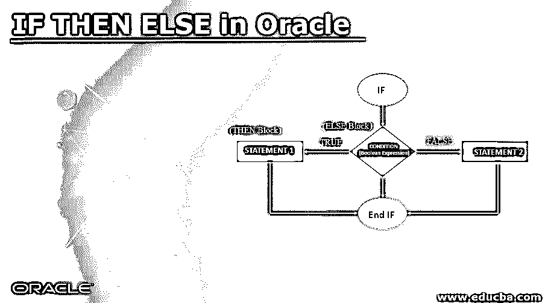
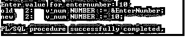
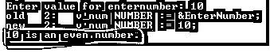
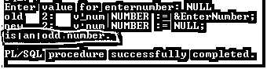

# 如果在甲骨文中

> 原文：<https://www.educba.com/if-then-else-in-oracle/>

## Oracle 中 IF THEN ELSE 简介

在 Oracle 中，IF THEN ELSE 是一个分支语句。该语句使我们能够指定两组不同的语句来执行。该语句接受布尔表达式作为条件，这取决于该表达式的值，如果 THEN ELSE 语句执行或跳过一系列语句。

### 句法

`IF Condition
THEN
Statement 1;
ELSE
Statement 2;
END IF;`

<small>Hadoop、数据科学、统计学&其他</small>

**说明:**

*   **IF:** 它是一个保留字，标记 IF 语句的开始
*   **条件:**这是一个布尔表达式，返回一个布尔结果。
*   **语句 1:** 这是一个在条件评估结果为真时执行的语句
*   **ELSE:** 如果条件返回假结果，则执行。这是一个启用语句的选项。
*   **语句 2:** 这是一个在条件返回结果时执行的语句。
*   **ENDIF:** 该关键字关闭或终止 IF THEN ELSE 块或语句

### Oracle 中 IF THEN ELSE 的流程图

IF … THEN … ELSE 块的流程图

两个流程图都清楚地显示了 IF THEN ELSE 语句是如何工作的。IF 块接受条件并评估为真/假。如果条件返回 TRUE，则转到“then”块，执行“语句 1”，然后执行 END 块。如果条件返回 FALSE，则转到“ELSE”块，执行“语句 2 ”,然后执行 END 块。如果条件评估为“NULL ”,则“NULL”将被视为“FALSE ”,然后转到“ELSE”块并执行“语句 2 ”,然后执行 END 块。

### 大致分一下来思考一下

在实现 Oracle IF THEN ELSE 语句之前，必须了解一些关于 IF THEN ELSE 构造的要点:

*   “IF … THEN … ELSE”是保留字，标志着“IF”语句的开始。
*   这使我们能够指定两组不同的语句来执行。
*   当条件评估为“真”时，评估一个组，当条件评估为“假”时，评估下一个组。
*   “END IF”是一个保留字，表示“IF … THEN … ELSE”结构的结尾。
*   当执行“IF … THEN”时，条件被评估为“TRUE”或“FALSE”。
*   条件不需要在括号中具体说明。
*   使用比较运算符或 SQL * PLUS 运算符来比较条件。
*   一个“IF”关键字可以使用逻辑连接(如“AND”、“OR”)在某个时间点管理任意数量的条件。
*   尽管多个条件不需要使用括号来约束，但最好使用括号的正确实现来控制它们的优先级，以避免模糊性。
*   每一个被实现的“如果”都必须有一个“真”状态评估才能成功执行。但是当条件为“假”时，评估状态不是强制性的。
*   在“IF”的实际作业完成后，控制结构将作业返回到 PL / SQL 块的原始状态。

### 在 Oracle 中实施 IF THEN ELSE 的示例

在本节中，我们将使用一些示例来了解 Oracle IF … THEN … else 的实现以及这种控制结构在 Oracle 中是如何工作的。为此，我们将使用下面的样本表(员工&部门 _ 类别)来理解 Oracle IF … THEN … ELSE 行为。

**代码:**

`DECLARE
V_num NUMBER: = &EnterNumber;
BEGIN
IF MOD (V_num, 2) =0 THEN
DBMS_OUTPUT.PUT_LINE (V_num ||' is an even number.');
ELSE
DBMS_OUTPUT.PUT_LINE (V_num ||' is an odd number.');
END IF;
END;`

**输出:**

**说明:**

&EnterNumber:此处的“&”允许用户在范围和数据类型标准内输入值。

*   **MOD (m，n):** 这是一个预定义的函数，返回被‘n’除的余数。
*   **DBMS_OUTPUT:** DBMS_OUTPUT 是一个 Oracle 内置的包，它允许我们写入数据以直接输出到屏幕上。这个包用于显示调试信息。
*   **PUT_LINE:** 将信息或结果显示成一行的过程

如果 MOD 函数返回 0，则等式条件评估为“真”并执行 then 块语句，否则执行 else 块。

因为显示“PL/SQL procedure completed”的输出意味着上述代码中没有错误。但是输出并没有抛出预期的结果。为什么？

它没有显示预期的结果，因为没有设置控件来显示输出。要设置控件，需要在当前用户会话中执行一次“SET SERVER OUTPUT ON ”,它允许缓冲区显示输出。在进程中运行“SET SERVER OUTPUT ON”后，查看同一示例的输出。

在这个输出中，我们得到了预期的输出“10 是一个偶数”。

上述 PL/SQL 程序中的空效果

在上面的输出中，输入的值是 NULL，在这种情况下，IF … THEN … ELSE 执行 FALSE (ELSE)块，这就是为什么输出在 V_num 的位置显示 NULL。

**提示:**每当执行条件流程时，最好在执行前交叉验证任何变量或值的空状态。要运行任何 PL/ SQL 程序，请使用正斜杠“/”键。必须小心处理 NULL，可以使用嵌套 IF 或其他条件来处理 NULL。

### 结论

Oracle IF … THEN … ELSE 是一种控制结构，在试图在两个互斥的操作之间进行选择时非常有用。它用在 PL/SQL 块中，使程序员能够以适当的方式处理实时要求。这个结构对布尔表达式和布尔结果进行操作。

### 推荐文章

这是 Oracle 中 IF THEN ELSE 的指南。这里我们讨论 Oracle 中 IF THEN ELSE 的语法、流程图和示例介绍。您也可以浏览我们的其他相关文章，了解更多信息——

1.  [甲骨文运算符](https://www.educba.com/oracle-operators/)
2.  [Oracle 中的光标](https://www.educba.com/cursor-in-oracle/)
3.  [Oracle 查询](https://www.educba.com/oracle-queries/)
4.  [Oracle vs MSSQL](https://www.educba.com/oracle-vs-mssql/)

