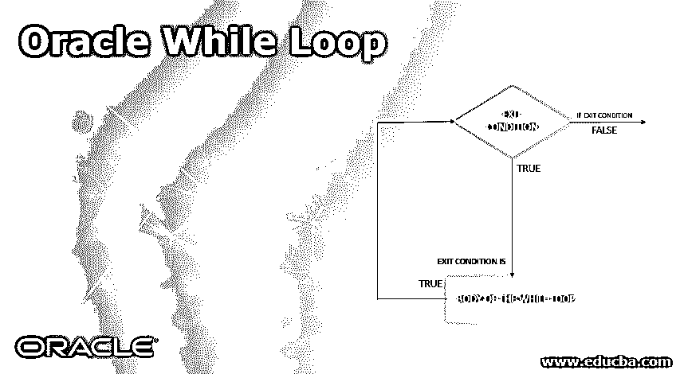
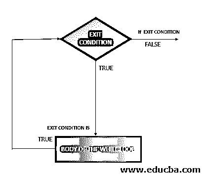
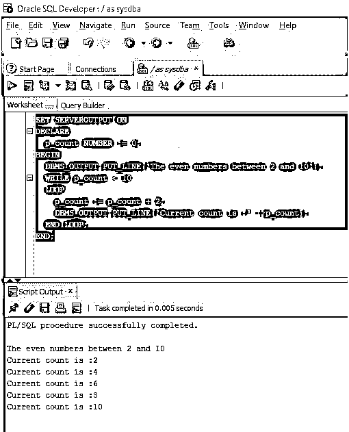
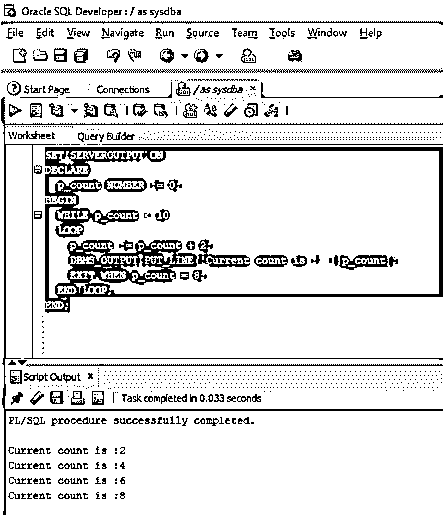

# Oracle While 循环

> 原文：<https://www.educba.com/oracle-while-loop/>

## Oracle While 循环简介

Oracle While 循环可以定义为入口控制循环(循环定义为重复执行的指令序列)，这意味着即使循环开始时出现的退出条件不满足，循环体也不会执行一次，因为退出条件在循环执行开始前进行检查，并且需要注意的一点是，在循环体中出现的指令每次执行后，控制都会返回到退出条件，直到条件变为假。

### 句法

现在让我们看看 Oracle While 循环的语法。

<small>Hadoop、数据科学、统计学&其他</small>

`WHILE condition
LOOP
{Body of the Loop}
END LOOP;`

#### Oracle While 循环的参数

现在让我们看看参数

*   **条件:**该参数是指 while 循环开始时的退出条件。只有当这个条件为真时，语句才会被执行，否则不会被执行。
*   **循环:**是指循环的开始。
*   **循环体:**指每次条件语句为真时执行的语句
*   **结束循环:**指循环结束。

### Oracle While 循环的流程图

现在让我们看看下面的流程图，以便更好地理解 WHILE 循环的概念。

### Oracle 中的 While Loop 是如何工作的？

*   在本节中，我们将讨论 WHILE 循环在 Oracle 中是如何工作的。在定义部分，我们讨论了 while 循环是一个出口控制循环。这意味着每当程序控制到达 WHILE 循环的开头时，它遇到的第一条语句是首先执行的表达式。
*   在执行该表达式时，该表达式返回一个为真或假的布尔值。如果返回值为 false，控件会立即跳过循环，并且不会执行 While 循环。出现的第二种情况是，如果返回的布尔值为真，在这种情况下，控制进入循环内部，并开始逐个执行循环体中出现的每个语句。
*   一旦它们执行了所有的语句并到达循环的末尾，控制再次回到循环的开始并执行退出条件来检查它是真还是假。如果该值为假，则控制退出循环，如果该值为真，则控制再次进入循环并逐个执行每个语句。
*   这个过程一直持续到退出条件返回 False，并且受控退出循环。由于这个原因，它也被称为进入控制循环，因为进入循环是由循环的退出条件决定的。

### 实施 Oracle While 循环的示例

现在让我们看看提到的例子:

#### 示例#1

在第一个例子中，我们将使用一个简单的 WHILE 循环来查看循环的行为。该示例旨在打印从 2 到 10 的偶数。它将包括二号和十号。所以可以用很多方法来实现，但是对于本文，我们将使用 WHILE 循环。因此，让我们来看看 PL/SQL 程序中相同的 using WHILE 循环。

**代码:**

`SET SERVEROUTPUT ON
DECLARE
p_count NUMBER := 0;
BEGIN
DBMS_OUTPUT.PUT_LINE('The even numbers between 2 and 10');
WHILE p_count < 10
LOOP
p_count := p_count + 2;
DBMS_OUTPUT.PUT_LINE('Current count is :' ||p_count);
END LOOP;
END;`

**输出:**

**解释:**正如我们所看到的，第一条语句用于将服务器输出设置为 on，以便我们可以在输出中打印结果。如果我们看看这个程序，我们会看到退出条件被用来检查变量 p_count 是否小于 10。p_count 的初始值为零。所以，在第一次运行时，它将为真，循环体将被执行。每次执行后，p_count 的值将增加两位数。在该值大于 10 的情况下，exit 语句为 false，控制退出循环，这标志着循环的结束。正如我们在输出中看到的，PL/SQL 程序返回从 2 到 10 的偶数列表。

#### 实施例 2

在第二个示例中，我们将使用 WHILE 循环的 EXIT WHEN 子句来调整前面的示例。EXIT WHEN 子句用于根据特定条件终止循环。在这个例子中，我们将使用上面的例子，并将在 p_number 变量的值为 8 时终止循环。所以它只会打印从 2 到 8 的偶数。让我们看看 PL/SQL 程序。

**代码:**

`SET SERVEROUTPUT ON
DECLARE
p_count NUMBER := 0;
BEGIN
WHILE p_count < 10
LOOP
p_count := p_count + 2;
DBMS_OUTPUT.PUT_LINE('Current count is :' ||p_count);
EXIT WHEN p_count = 8;
END LOOP;
END;`

**输出:**

**解释:**在上面的程序中可以看到，使用了 EXIT WHEN 语句，给出的条件是当 p_count 为 8 时。因此，即使退出条件为真，当 p_count 值为 8 时，控制也应该终止循环。正如我们在输出中看到的，由于 EXIT WHEN 条件，循环在值为 8 时终止。

### 结论

在本文中，我们讨论了 WHILE 循环的定义及其语法。我们还使用流程图研究了 WHILE 循环的工作方式。我们看到了几个例子来更好地理解不同的情况以及如何使用 WHILE 循环。

### 推荐文章

这是一个 Oracle While 循环指南。这里我们讨论 Oracle While 循环的介绍、语法、流程图和示例，以便更好地理解。您也可以浏览我们的其他相关文章，了解更多信息——

1.  [Oracle 中的光标](https://www.educba.com/cursor-in-oracle/)
2.  Oracle 中的[功能](https://www.educba.com/function-in-oracle/)
3.  [Oracle Alter Table](https://www.educba.com/oracle-alter-table/)
4.  [Oracle 约束条件](https://www.educba.com/oracle-constraints/)
5.  [Oracle 窗口函数](https://www.educba.com/oracle-window-functions/)
6.  [Oracle While 循环指南](https://www.educba.com/oracle-while-loop/)

