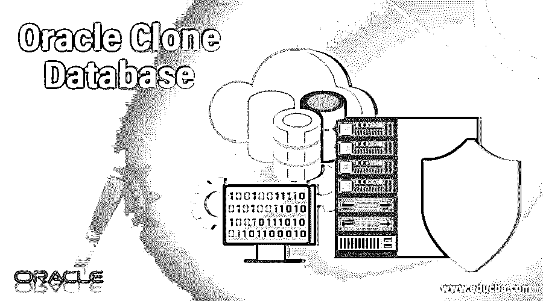

# Oracle 克隆数据库

> 原文：<https://www.educba.com/oracle-clone-database/>

## Oracle 克隆数据库简介

Oracle 数据库克隆只是一个过程，用于创建与现有 Oracle 数据库完全相同的数据库。克隆技术用于制作现有数据库的副本，以便 DBA 执行各种测试活动，如备份和恢复。在本主题中，我们将了解 Oracle 克隆数据库。

*   DBA 执行 Oracle 数据库克隆来测试备份和恢复策略。
*   这种技术用于导出从生产数据库中删除的 Oracle 对象。
*   克隆可以单独执行，也可以在同一台主机上执行。

### 为什么需要克隆？

*   执行备份和恢复策略。
*   保留生产数据库的备份。
*   该数据库副本可用于开发。
*   该数据库副本可用于产品测试、beta 测试等。
*   该技术用于在重命名数据库之前获取数据库的副本。
*   它用于将 Oracle 数据库重新定位到另一台机器上。
*   这种技术对于将 Oracle 数据库移动到新的存储介质非常有用。
*   Oracle 克隆通常是制作现有 Oracle 数据库副本的最快方法。
*   Oracle 克隆过程主要由 DBA 用来为开发人员提供完整的开发实例。

### Oracle 克隆的类型

有三种方法可以执行 Oracle 数据库克隆。下面列出了这些。

<small>Hadoop、数据科学、统计学&其他</small>

*   冷克隆
*   宿主克隆
*   RMAN 克隆

我们将继续简要解释如何在所有这三种方法中执行克隆操作。

#### 1.冷克隆

这是执行 Oracle 数据库克隆的可靠方法。要执行数据库克隆，需要如下给出的数据库信息:此处假定了文件名和路径，根据安装的不同，用户可以使用不同的文件名和路径。

*   **源数据库名称:** PROD
*   **源数据库物理文件路径:/**u01**/**PROD**/**oradata
*   **克隆数据库名称:** PRODCLON
*   **克隆数据库物理文件路径:** /u01/PRODCLON/oradata

**步骤:**

1.启动源数据库

`export ORACLE_SID=PROD
sqlplus / as sysdba
startup`

2.查找数据文件、控制文件和重做日志文件的路径和名称。

`select name from v$datafile;
select member from v$logfile;
select name from v$controlfile;`

3.进行控制文件备份。

`alter database backup controlfile to trace;`

4.参数文件备份。

如果' PROD '数据库正在使用 spfile，

`create pfile=’/u02/PRODCLON/initPRODCLON.ora’ from spfile;`

如果数据库使用 pfile，请使用 OS 命令将 pfile 复制到备份位置。

5.关闭“生产”数据库

`shutdown`

6.将“生产”数据库的所有数据文件、控制文件和重做日志文件拷贝到目标数据库位置。

`mkdir /u02/PRODCLON/oradata
cp /u01/PROD/oradata/* /u02/PRODCLON/oradata/`

7.在克隆数据库中为转储创建适当的目录结构，并在参数文件中指定它们。

`mkdir -p /u02/PRODCLON/{bdump,udump}`

8.编辑克隆数据库参数文件，并对克隆数据库进行必要的更改

`cd /u02/PRODCLON/
vi initPRODCLON.ora
db_name=PRODCLON
control_files=/u02/PRODCLON/oradata/cntrl01.ctl
background_dump_dest=/u02/PRODCLON/bdump
user_dump_dest=/u02/PRODCLON/udump
. . .
. . .
:wq!`

9.在 NOMOUNT 阶段启动克隆数据库。

`export ORACLE_SID=PRODCLON
startup nomount pfile=’/u02/PRODCLON/initPRODCLON.ora’`

10.使用跟踪控制文件为克隆数据库创建控制文件跟踪，并指定重做日志和数据文件的路径。

`CREATE CONTROLFILE SET DATABASE “PRODCLON” RESETLOGS ARCHIVELOG
MAXLOGFILES 16
MAXLOGMEMBERS 3
MAXDATAFILES 100
MAXINSTANCES 8
MAXLOGHISTORY 292
LOGFILE
GROUP 1 ‘/u02/PRODCLON/oradata/redo01.log’ SIZE 5M,
GROUP 2 ‘/u02/PRODCLON/oradata/redo02.log’ SIZE 5M,
DATAFILE
‘/u02/PRODCLON/oradata/system01.dbf’,
‘/u02/PRODCLON/oradata/undotbs01.dbf’,
‘/u02/PRODCLON/oradata/sysaux01.dbf’,
‘/u02/PRODCLON/oradata/users01.dbf’,
‘/u02/PRODCLON/oradata/example01.dbf’
CHARACTER SET AL32UTF8`

11.通过从跟踪路径运行来创建控制文件

`@u01/PROD/source/udump/cntrl.sql`

12.成功创建控制文件后，使用 resetlogs 选项打开数据库。

`alter database open resetlogs;`

#### 2.热克隆

热克隆方法更适合运行 24*7*365 的数据库。要将此方法应用于数据库克隆，数据库必须处于归档日志模式，并且此方法不需要关闭数据库。

*   **源数据库名称:** PROD
*   **源数据库物理文件路径:/**u01**/**PROD**/**oradata
*   **克隆数据库名称:**产品克隆
*   **克隆数据库物理文件路径:** /u01/PRODCLON/oradata

**步骤:**

1.查找数据文件的路径和名称。

`select name from v$datafile;`

2.备份参数文件

如果' PROD '数据库正在使用 spfile 创建 pfile，

`create pfile=’/u02/PRODCLON/initPRODCLON.ora’ from spfile;`

如果数据库使用 pfile，请使用 OS 命令将 pfile 复制到备份位置。

3.记下最早的日志序列号。

`alter system switch logfile;
archive log list;`

4.将数据库置于备份模式

`alter database begin backup;`

5.将“生产”数据库的所有数据文件拷贝到克隆位置。

`mkdir /u02/PRODCLON/oradata
cp /u01/PROD/source/oradata/*.dbf /u02/PRODCLON/oradata/`

6.复制所有数据文件后，将数据库从备份模式中释放。

`alter database end backup;`

7.切换当前日志文件，并记下最早的日志序列号

`alter system switch logfile;
archive log list;`

8.将第一个旧日志序号期间生成的所有归档日志文件复制到最后一个旧日志序号

9.将控制文件跟踪备份到跟踪路径

`alter database backup controlfile to trace;`

10.为克隆数据库创建目录结构，并指定相同的目录结构

`cd /u02/PRODCLON
mkdirbdumpudump`

11.编辑克隆数据库参数文件，并对克隆数据库进行必要的更改

`cd /u02/PRODCLON
vi initPRODCLON.ora
db_name=PRODCLON
control_files=/u02/PRODCLON/oradata/cntrl01.ctl
background_dump_dest=/u02/PRODCLON/bdump
user_dump_dest=/u02/PRODCLON/udump
. . .
. . .
:wq!`

12.在 NOMOUNT 阶段启动克隆数据库。

`export ORACLE_SID=PRODCLON
startup nomount pfile=’/u02/PRODCLON/initPRODCLON.ora’`

13.使用跟踪控制文件为克隆数据库创建控制文件。

`CREATE CONTROLFILE SET DATABASE “PRODCLON” RESETLOGS ARCHIVELOG
MAXLOGFILES 16
MAXLOGMEMBERS 3
MAXDATAFILES 100
MAXINSTANCES 8
MAXLOGHISTORY 292
LOGFILE
GROUP 1 ‘/u02/PRODCLON/oradata/redo01.log’ SIZE 5M,
GROUP 2 ‘/u02/PRODCLON/oradata/redo02.log’ SIZE 5M,
DATAFILE
‘/u02/PRODCLON/oradata/system01.dbf’,
‘/u02/PRODCLON/oradata/undotbs01.dbf’,
‘/u02/PRODCLON/oradata/sysaux01.dbf’,
‘/u02/PRODCLON/oradata/users01.dbf’,
‘/u02/PRODCLON/oradata/example01.dbf’
CHARACTER SET AL32UTF8;`

14.通过从跟踪路径运行跟踪文件来创建控制文件

`@u01/PROD/source/udump/cntrl.sql`

15.使用备份控制文件选项恢复数据库。

`recover database using backup controlfile until cancel;`

16.此后，系统会提示您输入归档日志文件。指定归档日志文件的绝对路径和文件名，并一直输入这些文件，直到越过最后一个旧序列号(请参考:步骤 8)，键入 CANCEL 结束介质恢复。

17.使用 resetlogs 选项打开数据库。

`alter database open resetlogs;`

#### 3.RMAN 克隆

RMAN 提供了一个复制命令，用于备份数据库以创建克隆数据库。此命令将文件恢复到目标数据库，之后执行不完全恢复，并使用 RESETLOGS 选项打开克隆数据库。

*   **源数据库名称:** PROD
*   **源数据库物理文件路径:/**u01**/**PROD**/**oradata
*   **克隆数据库名称:** PRODCLON
*   **克隆数据库物理文件路径:** /u01/PRODCLON/oradata

**步骤:**

1.参数文件备份。

如果' PROD '数据库正在使用 spfile，

`create pfile=’/u02/PRODCLON/initPRODCLON.ora’ from spfile;`

如果数据库使用 pfile，请使用 OS 命令将 pfile 复制到备份位置。

2.为克隆数据库创建适当的目录结构

`cd /u02/PRODCLON
mkdirbdumpudump`

3.编辑克隆数据库参数文件

`cd /u02/PRODCLON
viinitPRODCLON.ora
db_name=PRODCLON
control_files=/u02/PRODCLON/oradata/cntrl01.ctl
db_file_name_convert=(‘/u01/PROD/oradata’,’/u02/PRODCLON/oradata’)`

此参数指定应该从何处克隆数据文件

`log_file_name_convert=(‘/u01/PROD/oradata’,’/u02/PRODCLON/oradata’)`

此参数指定重做日志文件应该从哪里克隆到哪里

`background_dump_dest=/u02/PRODCLON/bdump
user_dump_dest=/u02/PRODCLON/udump
. . .
. . .
:wq!`

**注意:**只有当源数据库目录结构和克隆数据库目录结构不同时，才需要 db_file_name_convert 和 log_file_name_convert 参数。

4.使用' listener.ora '文件配置监听器并启动监听器

`SID_LIST_LISTENER =
(SID_LIST =
(SID_DESC =
(GLOBAL_DBNAME = PROD)
(ORACLE_HOME = /u01/oracle/product/10.2.0/db_1/)
(SID_NAME =PROD)
)
(SID_DESC =
(GLOBAL_DBNAME = PRODCLON)
(ORACLE_HOME = /u02/oracle/product/10.2.0/db_1/)
(SID_NAME =PRODCLON)
)
)`

5.将以下信息添加到“tnsnames.ora”文件中。

`con_PRODCLON=
(DESCRIPTION =
(ADDRESS_LIST =
(ADDRESS = (PROTOCOL = TCP)(HOST = 200.168.1.22)(PORT = 1521))
)
(CONNECT_DATA =
(SERVER = DEDICATED)
(SERVICE_NAME = PRODCLON)
)
)`

6.在 NOMOUNT 阶段启动数据库并退出。

`export ORACLE_SID=PRODCLON
startup nomount pfile=’/u02/PRODCLON/initPRODCLON.ora’
exit`

7.启动 RMAN，将“PROD”作为目标，将“PRODCLON”作为辅助。

`export ORACLE_SID=PROD
rman target / auxiliary sys/sys@con_PRODCLON`

8.发出 RMAN 复制命令启动克隆过程。

`RMAN> duplicate target database to ‘PRODCLON’;`

**注意:**前面的命令使用所有可用的归档日志文件将所有文件从目标数据库的备份恢复到克隆数据库目标。

### 结论–Oracle 克隆数据库

Oracle 克隆是备份现有数据库的一个非常有用的过程。管理员在执行数据库克隆时不需要连接到源数据库，这降低了对生产系统产生影响的可能性。

### 推荐文章

这是 Oracle 克隆数据库指南。在这里，我们将讨论为什么需要克隆，Oracle 克隆的 3 种类型以及相应的步骤。您也可以看看以下文章，了解更多信息–

1.  [甲骨文联合](https://www.educba.com/oracle-coalesce/)
2.  [甲骨文 CTE](https://www.educba.com/oracle-cte/)
3.  [Oracle REGEXP_REPLACE](https://www.educba.com/oracle-regexp_replace/)
4.  [甲骨文中的枢纽](https://www.educba.com/pivot-in-oracle/)

