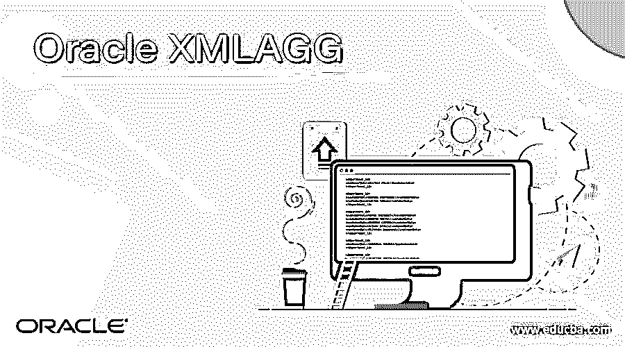
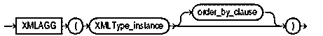
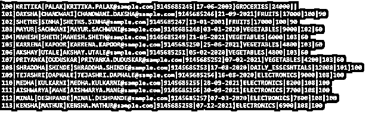
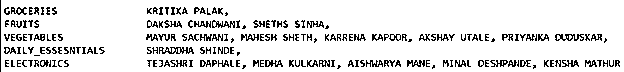
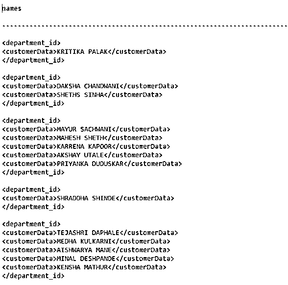
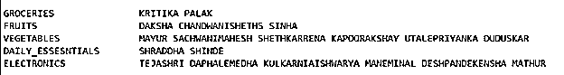
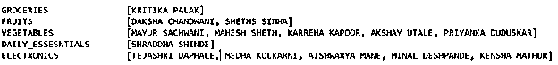
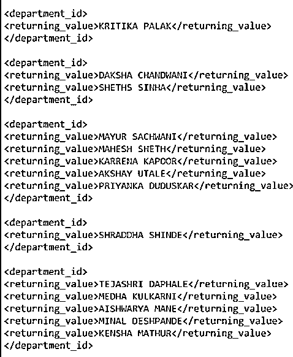

# Oracle XMLAGG

> 原文：<https://www.educba.com/oracle-xmlagg/>

## Oracle XMLAGG 简介

我们可以使用 oracle 数据库中的 XMLAGG 函数来聚集 XML 片段的集合。该函数返回的值将是一个 XML 格式的聚合文档，如果传递给该函数的任何参数的计算结果为 NULL，则该参数将被跳过或从最终结果中删除。该函数的行为与 SYS_XMLAGG 的行为相同。但是 SYS_XMLAGG 和 XMLAGG 之间只有一个区别，即 XMLAGG 函数不接受 XMLFORMAT 对象来格式化结果，尽管它返回节点的集合作为结果。另一个区别是 XMLAGG 的结果不像 SYS_XMLAGG 那样包含在元素标记中。ORDER BY 子句中提到的数字文字不像在其他情况下那样被 oracle 数据库解释为列位置，而是被称为数字文字本身。

**语法**

<small>Hadoop、数据科学、统计学&其他</small>

XMLAGG 函数的语法如下所示

`XMLAGG(<XML_ELEMENT> ORDER BY <VALUE>)`

语法也可以从下图中理解——

由于 XMLAGG 函数在一行或一个单元格中返回结果，以将所有元素标记包装在一个父标记中，因此我们可以选择使用 XML_ELEMENT，这将有助于将所有结果包含在一个新的父标记中或由它创建的单个元素中。当要聚合字符串时，我们可以使用“.extract('//text()')"，这将使字符串在 XML 中保持在一起，rtrim()函数可以与它一起使用，以消除尾随的逗号或空格。当我们要使用 XMLAGG 函数而不是字符串来聚合 CLOB 值时，我们可以使用 xmlparse，它将接受 XML 文本并将其转换为 XMLTYPE 数据类型。ORDER BY 子句的使用本质上是完全可选的，可用于对使用 XMLAGG 函数连接的 XML 元素的值进行排序。

### Oracle XMLAGG 示例

让我们以一个特定品牌的客户数据为例，该品牌有多个商店，每个商店有多个部门。创建了表，并在其中插入了数据，这可以通过使用以下查询来完成

`DROP TABLE customers;
COMMIT;
CREATE TABLE customers
( customer_id     NUMBER(6)
, f_name     VARCHAR2(20)
, l_name      VARCHAR2(25)
, email_id          VARCHAR2(40)
, mobile_number   VARCHAR2(20)
, purchase_date      DATE
, store_id       VARCHAR2(20)
, bill_amount           NUMBER(8,2)
, salesman_id   NUMBER(6)
, department_id  NUMBER(4)
) ;
CREATE UNIQUE INDEX cust_id_pk ON customers (customer_id) ;
COMMIT;`

总共有 14 个不同的客户数据被插入到使用 INSERT INTO 语句创建的客户表中，其内容如下所示

`SELECT department_id,
rtrim(xmlagg(xmlelement(customerData,f_name
|| ' '
|| l_name , ', ')
ORDER BY f_name).extract('//text()').getstringval(), ',') AS "names"
FROM customers
GROUP BY department_id;`

上面语句中使用的 xml 元素将导致创建一个名为 customer data 的新 XML 元素。我们可以给这个被创建的 xml 元素起任何名字，它将包含 f_name、l_name 的连接值，以及每个连接值之间的逗号。在这种情况下，XMLAGG 的使用导致了 XML 片段的创建，它是客户数据 XML 元素的集合。rtrim()的使用删除了所有的空格和尾随逗号，而. extract 有助于将字符串作为一个单元保存在一起。上述查询的执行将给出以下输出，以及根据商店部门分组的所有结果集，如下所示

在 XML 格式中，执行上述查询的输出将如下所示，以及根据商店的部门分组的所有结果集

通过使用 XMLPARSE，我们甚至可以将 XMLAGG 函数与 CLOB 数据类型值一起使用，而不是字符串值，XML parse 将指定的 XML 值作为文本，并进一步将它们转换为 XMLTYPE 数据类型。

`SELECT department_id,
xmlagg(xmlparse(content f_name
|| ' '
|| l_name wellformed)
ORDER BY f_name).getclobval()
FROM customers
GROUP BY department_id;`

上述查询的执行将给出以下输出，以及根据商店部门分组的所有结果集，但聚合值之间没有逗号，如下所示

在 XML 格式中，执行上述查询的输出将如下所示，以及根据商店的部门分组的所有结果集

对于高于 18c 或更高版本的 oracle 数据库，我们甚至可以使用 JSON_ARRAYAGG 来代替 XMLAGG 函数。我们可以使用 JSON_ARRAYAGG 来代替上面查询中的 XMLAGG 函数，如下所示，它会生成类似的结果，只是每组的方括号略有不同。

`SELECT department_id,
replace(JSON_ARRAYAGG(f_name || ' ' || l_name ORDER BY department_id RETURNING CLOB),'"','') AS returning_value
FROM customers
GROUP BY department_id;`

上述查询的执行将给出以下输出，以及根据商店部门分组的所有结果集，如下所示

在 XML 格式中，执行上述查询的输出将如下所示，以及根据商店的部门分组的所有结果集

### 结论

我们可以使用 oracle 数据库管理系统中的 XMLAGG 函数来聚合多个字符串或 XML 片段，以将它们表示为一个连接在一起的 XML 元素。通常，字符串被聚合生成一个逗号分隔的连接字符串，它是所有次要字符串的集合。XMLAGG 函数的工作方式类似于 SYS_XMLAGG 函数，只是在格式上略有不同。在高于 18 c 的 oracle 版本中，我们还可以使用 JSON_ARRAYAGG 函数作为 XMLAGG 的替代方法，来聚合多个值，并在一行或一个单元格中表示它们。ORDER BY 和 GROUP BY 语句通常与 XMLAGG 函数一起使用，以获得正确排序的分组连接结果。

### 推荐文章

这是 Oracle XMLAGG 的指南。这里我们讨论如何在 oracle 数据库管理系统中使用 XMLAGG 函数。您也可以看看以下文章，了解更多信息–

1.  [Oracle 表空间](https://www.educba.com/oracle-tablespace/)
2.  [Oracle Synonyms](https://www.educba.com/oracle-synonyms/)
3.  [甲骨文联合](https://www.educba.com/oracle-coalesce/)
4.  [甲骨文分析功能](https://www.educba.com/oracle-analytic-functions/)

