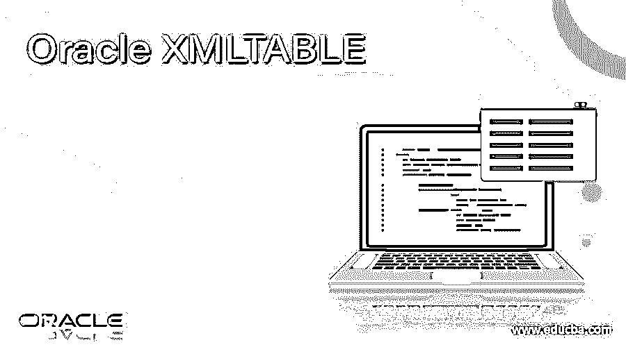
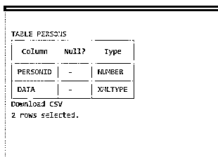
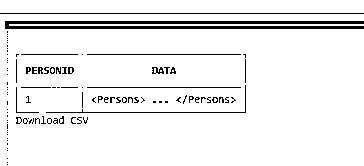

# Oracle XMLTABLE

> 原文：<https://www.educba.com/oracle-xmltable/>

## Oracle XMLTABLE 简介

Oracle XMLTABLE 函数是从 Oracle 10g 开始添加到 Oracle 的一个新函数，它与 XQuery 等其他函数一起添加到它的 XML 处理 API 集合中。在这里，XQuery 将允许您构造 XML 数据以及关系数据，并使用 XQuery 语言查询 XML。但是 Oracle 中的 XMLTABLE 函数负责从 Oracle XQuery 命令查询结果创建关系表及其列。通常，XMLTABLE 函数将返回任何 XML 文档的内容，或者可能是关系表格式结构中的任何元素。XMLTABLE 是一个 SQL/XML 函数，它在 SQL 的 FROM 子句中实现，但与包含 XML 数据的驱动表结合使用，用于将 XML 数据转换为关系形式。因此，使用这个 Oracle XMLTABLE 函数，可以从 XML 数据中检索一些信息。

**语法**

<small>Hadoop、数据科学、统计学&其他</small>

XMLTABLE 函数的基本语法解释如下:

`XMLTABLE(‘<XQuery>’ PASSING <xml Table_column >
COLUMNS <New_Table_Column_Name> <Column Type> PATH <XQuery path>)`

XMLTABLE 函数包含一个生成行的 XQuery 表达式，在子句列中，存在一个或多个生成列的表达式。

在练习 Oracle xmlTABLE 函数之前，我们应该首先了解 XPath，XPath 实现了一个路径表达式，用于从 XML 文档中选择节点和节点列表。这里列出了一些有益的路径和表达式，可用于从 xml 文档中选择任何节点或节点列表。

**表情描述**

Nodename 选择所有名为“nodename”的节点

/从根节点中选择

//从当前节点中挑选文档中的节点，无论它们在哪里，都等于选择

.选取当前节点

..选取当前节点的父节点

@选择属性

Table_element 选取所有名为“Table_element”的节点

Table_Name/Table_Element 选择表格的所有子代表格元素

//Table_Element 选取所有表格元素，不管它们存在于文档中的什么位置

此外，方括号中列出了一系列谓词。]应用于发现特定节点或覆盖确定值的节点。

**路径表达式结果**

/table_name/table_element[1]选取初始表格元素，该元素是表格元素的子元素。

/table _ name/table _ element[last()]选取已知为 table 元素的子元素的最后一个 table 元素。

/table _ name/table _ element[last()-1]选取倒数第二个表格元素，该元素是表格元素的子元素。

//table_element[@type='admin']选取包含名为 type 且值为' admin '的属性的所有表格元素。

### XMLTABLE 函数在 Oracle 中是如何工作的？

*   Oracle 中的 XMLTABLE 操作符允许用户将 XML 数据分割成表行，并将表列投影到表上。为此，有效地创建了一个关于数据表和 XMLTABLE 调用的笛卡儿积，该调用允许 XMLTABLE 将一行中的 XML 文档分割成多行，出现在最终的执行结果中。
*   使用 PASSING 子句，表列将被识别为数据源。在这里，表行是通过用斜杠符号分隔的 XQuery 表达式来识别的。然后，使用 table COLUMNS 子句将列预测到生成的 XML 片段上，该子句通过路径表达式检测适当的标记，并将首选的表列名分配给相应的数据类型。
*   我们应该谨慎使用子句列中提供的列名。如果应用了除大写字母以外的任何内容，则可能需要提及它们，以便直接引用它们。应该注意，它是使用 XMLTABLE 调用的别名而不是一致的表别名进行查询的。

### 例子

让我们用几个实例来说明 Oracle XMLTABLE 函数，它使用 XPath 的几个表达式从 XML 文档中获取少量信息，如下所示:

`XMLTABLE = (XML_namespaces_clause, XQuery_string,XMLTABLE _options)`

这描述了 XMLTABLE 结构，其中 XML_namespace_clause 由一组 XML 名称空间声明组成，这些声明由提供的 XQuery 表达式(XQuery_string)引用，进一步计算 XML_Table_Column 的子句路径中的行和 XPath 表达式，用于计算整个 XMLTABLE 函数的列。

**读取所有订单的订单编号和订单日期**

我们将查询下面的命令，应用 XMLTABLE 函数解析创建的 person 表中的 XML 内容，该表也包含少量 XML 数据:

`CREATE TABLE Persons (PersonID NUMBER, data XMLTYPE);`

运行查询后，表就可以被操作了。

**输出:**

因此，首先让我们使用 INSERT 语句向其中输入几条记录，并输入一条 XML 数据类型的记录，如下所示:

`INSERT INTO Persons VALUES(1, xmltype(‘<Persons>
<Person pcode=”111” type =”admin”>
<personname>Nikhil</personname>
<profile>Engineer</profile>
<age>30</age>
<mailid>nikhil502@gmail.com</mailid>
</Person>
<Person pcode=”112” type =”admin”>
<personname>Sahil</personname>
<profile>Teacher</profile>
<age>31</age>
<mailid>sahil302@gmail.com</mailid>
</Person>
<Person pcode=”113” type =”user”>
<personname>Divya</personname>
<profile>Executive</profile>
<age>28</age>
<mailid>divya854@gmail.com</mailid>
</Person>
</Persons>’));`

我们可以将表 Persons 的内容视为:

`SELECT * FROM Persons;`

**输出:**

XML 包括与个人相关的数据。因此，现在我们将应用 Oracle XMLTABLE 函数，使用 XPath 和 XQuery 字符串表达式从这个创建的 XML 文档中检索任何信息，如下所示:

`SELECT t.PersonID, x.* FROM Persons t, XMLTABLE ('/Persons/Person' PASSING t.data COLUMNS Personname VARCHAR2 (30) PATH  ‘text()’ ) x WHERE y.PersonID =1;`

这里，服务器读取节点 Personname/age/profile/mailid 的内容，有时我们还需要获取当前所选节点项的文本值。因此，在上面的查询中，我们选择了路径/Persons/Person/personname，并通过使用表达式 text()来接收这个节点的值。因此，结果将使用 Oracle 中的 XMLTABLE 函数读取表中 personname 的姓名和所有人员的相关概要信息。

`SELECT t.PersonID, x.* FROM Persons t, XMLTABLE ('/Persons/Person' PASSING t.data COLUMNS Personname VARCHAR2 (30) PATH 'personname',Profile VARCHAR2(30) PATH 'profile' ) x WHERE t.PersonID =1;`

**输出:**

### 结论

*   Oracle XMLTABLE 函数和操作符函数实际上非常适合于小型 XML 文档或带有几行的数据库表，其中每行都包含一个无关紧要的 XML 文档。
*   同样，每当 XML 文档变得更好时，服务器的性能就会变得更差，这等同于手动解析技术。但是在处理这些大型 XML 文档时，用户可能不得不放弃 XMLTable 操作符的可访问性，而选择劳动密集型的解决方案。

### 推荐文章

这是 Oracle XMLTABLE 的指南。这里我们讨论 XMLTABLE 函数如何在 Oracle 中工作，并给出例子和输出。您也可以看看以下文章，了解更多信息–

1.  [Oracle 表空间](https://www.educba.com/oracle-tablespace/)
2.  [甲骨文索引](https://www.educba.com/oracle-index/)
3.  [甲骨文授予](https://www.educba.com/oracle-grant/)
4.  [甲骨文 NVL()](https://www.educba.com/oracle-nvl/)

