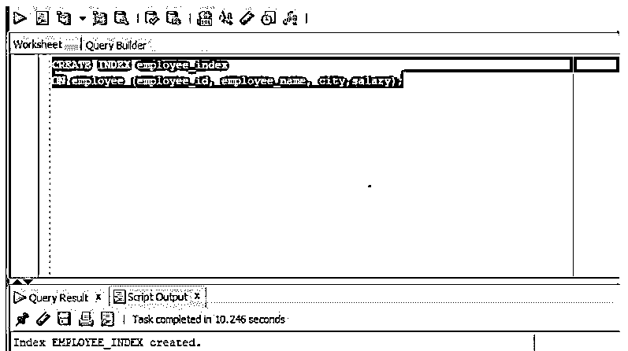
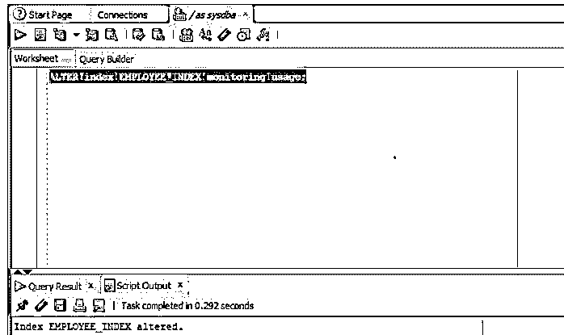
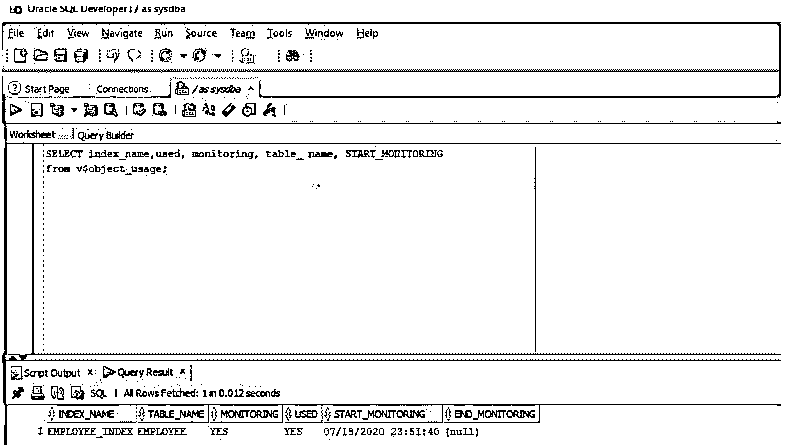
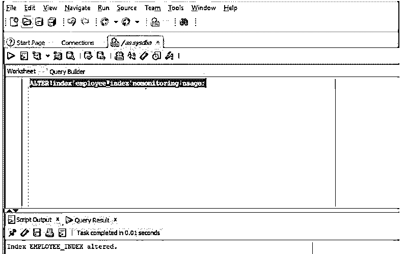

# Oracle 性能调整

> 原文：<https://www.educba.com/oracle-performance-tuning/>

## Oracle 性能调优简介

Oracle 中的性能调优可以定义为通过简化这些查询的执行来优化(最佳或最有效地利用)Oracle 查询性能的过程，它还通过改进查询的响应时间、查询的操作以及改进不同应用程序和 Oracle 数据库之间的通信来改进数据库中对象的更改、更新或创建过程。

### 如何在 Oracle 中执行性能调优？

众所周知，Oracle 数据库是一个关系数据库，这意味着数据存储在表中，而表由行和列组成。在 SQL(结构化查询语言)的帮助下，来自关系数据库的数据被检索、改变和创建。Oracle 中的性能调优是通过考虑 Oracle RDBMS(关系数据库管理系统)中存在的各种元素或系统来执行的，并对性能问题的根源进行故障排除。

<small>Hadoop、数据科学、统计学&其他</small>

一般来说，性能调优是由数据库管理员完成的，一般来说，性能问题是指特定应用程序在提交表单或获取特定用户屏幕上显示的详细信息时遇到延迟。如果出现这些问题，DBA 首先会寻找问题的根本原因，这是一项繁琐的任务，因为 RDBMS 中存在许多元素，并且对 Oracle 数据库管理系统的各个组件进行调优是一项时间敏感的任务。一般来说，Oracle DBA 在调优单个元素之前，首先会进行系统级检查，如服务器连接、实例和调优。一旦 DBA 完成了系统级检查，他们就可以继续进行 SQL 查询调优。

下面提到了几种我们可以进行 SQL 查询调优的方法:

*   我们应该首先隔离在运行应用程序时最常使用的查询，因为对它们进行性能调优会给我们带来更好的结果，我们应该记住的一点是，查询调优是一个持续的过程，总会有改进的余地。
*   我们应该向表中添加索引，因为它有助于我们加快查询的执行速度，但有一点要记住，添加太多索引实际上会产生性能问题，而不是解决它们，我们应该避免不必要的索引。
*   除非绝对必要，否则我们应该尽量避免在 SELECT 语句中使用*，因为添加*可能会增加系统的负载，尤其是在表有大量列和数据负载的情况下。
*   我们不应该在 update 和 insert 语句中使用索引，因为它会降低查询的性能并产生问题，批量 UPDATE 或 INSERT 语句也是如此。
*   我们不应该混合数据类型，应该避免将数字转换为字符，并尽可能使用 GTT(全局临时表)表。
*   我们还可以研究锁定的问题。如果数据库对象上有锁，那么它将使另一个并发会话等待。会造成阻塞，还可能造成死锁(死锁发生在两个或两个以上的用户在等待访问彼此锁定的数据时)。
*   我们也可以检查活动监视器。作为自动工作量资料档案库(AWR)的一部分，有一些可用的统计数据，它实际上监视数据库的健康状况，并提供关于数据库的性能和健康状况的报告。通过检查这些报告，DBA 还可以了解问题的根源，并且故障排除变得更加容易。

### Oracle 性能调优示例

我们研究指数监测。在 oracle 中，为了进行性能调优，我们可以设置索引监控。通过启用索引监控，我们可以检查 oracle 中使用了哪些索引，如果所有者愿意，可以在特定的时间内对索引进行监控。在本例中，我们将对此进行检查。让我们为监控创建一个表上的索引。我们将在表 employee 上创建一个索引 employee_index。

让我们准备同样的查询。

**代码:**

`CREATE INDEX employee_index
ON employee (employee_id, employee_name, city, salary);`

让我们在 SQL developer 中执行同样的操作。

**输出:**

正如我们所看到的，索引已经创建，现在让我们启用该索引进行性能监控。

让我们为此准备一个 ALTER 语句。

**代码:**

`ALTER index EMPLOYEE_INDEX monitoring usage;`

让我们在 SQL developer 中执行上述查询并检查结果。

**输出:**

正如我们可以看到的，查询已经被成功地修改了，现在我们将检查我们修改的索引是否只是用于监视。为了检查这一点，我们将使用 SELECT 语句来查询表 v$object_usage。

让我们为此准备一条 SELECT 语句。

**代码:**

`SELECT index_name, used, monitoring, table_ name, START_MONITORING
from v$object_usage;`

让我们在 SQL developer 中执行查询并检查结果。

**输出:**

正如我们在屏幕截图中看到的，该表显示该索引用于监控目的。

我们还可以通过使用另一个 ALTER 语句来停止监视目的。

让我们准备一份变更声明。

**代码:**

`ALTER index employee_index nomonitoring usage;`

让我们在 SQL Developer 中执行查询并检查结果。

**输出:**

正如我们在截图中看到的，监控已经停止。

### Oracle 性能调优的优势

Oracle 性能调优的几个优点如下:

*   性能更好的系统。
*   SQL 查询的执行时间更短。
*   数据库和应用程序之间的连接通过对服务器连接和实例的适当监控来优化。
*   更好地避免了死锁或锁定情况。

### 结论

在本文中，我们了解了 Oracle 中的性能调优。我们从了解定义开始这篇文章。随后，我们看到了性能调优的方法和示例，也看到了一些优势。

### 推荐文章

这是 Oracle 性能调优指南。这里我们讨论一下简介，如何在 oracle 中执行性能调优？例子和优点。您也可以看看以下文章，了解更多信息–

1.  [甲骨文授予](https://www.educba.com/oracle-grant/)
2.  [Oracle 数据类型](https://www.educba.com/oracle-data-types/)
3.  [Oracle Synonyms](https://www.educba.com/oracle-synonyms/)
4.  [甲骨文日期函数](https://www.educba.com/oracle-date-functions/)

