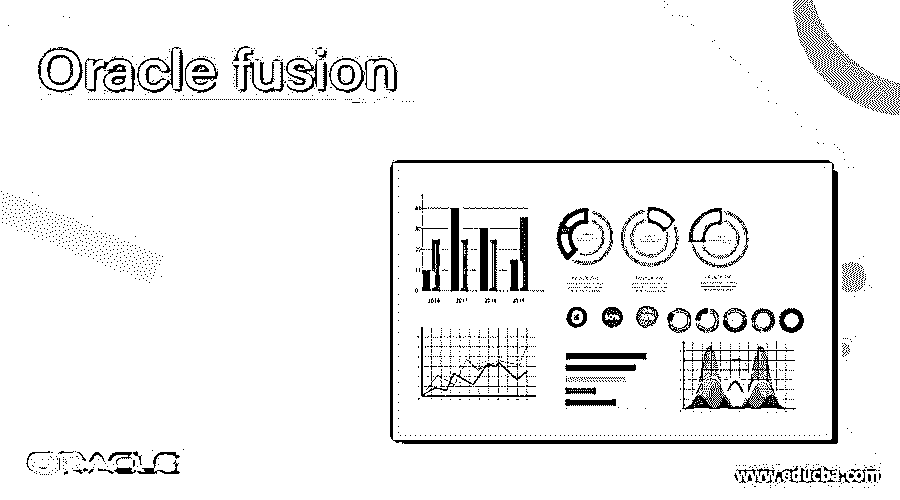
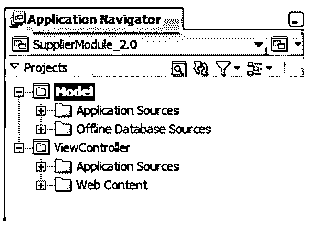
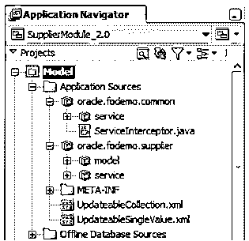
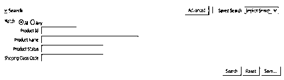

# Oracle 融合

> 原文：<https://www.educba.com/oracle-fusion/>

## Oracle 融合简介

基本上，oracle 融合是一个面向服务的平台和应用程序套件，它用于连接下一代企业技术、应用程序和服务，包括 Oracle 融合中间件和融合应用程序。这是一个开放标准的面向业务的应用程序，它提供了新的不同的标准方法来增加业务以及轻松采用新技术。通常情况下，融合与 oracle 企业应用程序配合使用，可以将业务性能提升到一个新的水平。Oracle fusion 为用户提供了不同的选项来满足不同的业务需求。融合的标准有效地响应，我们根据用户的需求进行简单的修改。

### 我们为什么需要 oracle 融合？

1.  fusion 的主要优势在于它能够将云的混合架构与外部开发框架相集成。
2.  另一个主要原因是它具有优化性能的能力。
3.  Oracle fusion 提供了比其他套件更好的价格和性能。
4.  做客户关系管理也是有用的。
5.  这很容易按照要求采用新技术。
6.  融合包括财务、客户关系管理和 HCM。
7.  它对库存和成本管理很有用。
8.  对创新管理也有帮助。
9.  它有助于获得商品或服务。

### Oracle 融合是如何工作的？

现在让我们看看融合的工作原理如下。

<small>Hadoop、数据科学、统计学&其他</small>

它有不同的组件，下面我们一个一个来看。

#### 基于标准的架构

oracle fusion 是基于标准的技术，能够快速响应灵活的变化，是用户驱动的业务软件，有助于实现一流的业务能力。融合包括以下产品。

1.  Oracle WebCentre 有助于确定设计时间，它还提供了开发企业门户和社交网站的运行时工具。
2.  它还提供商业智能功能。
3.  通用内容管理意味着我们可以为业务应用程序管理文档、web 内容文档、数字资产管理和记录保留功能。
4.  Oracle SOA 套件提供了一组用于部署、设计和管理 SOA 应用程序的服务基础设施组件。

#### 业务流程

Oracle 融合管理软件是最佳实践业务流程。它包括 oracle 产品线，如 oracle 电子商务套件、PeopleSoft、oracle on demand 等。fusion 的用户界面是用户友好的，应用程序的设计提高了工作效率。融合界面基于角色，支持多种模式、设备和不同渠道的交付。在设计时通过 JDeveloper 进行配置很容易。业务流程为用户提供了内置的用户社区和工作空间。

#### 选择部署选项

Oracle fusion 有如下不同的部署选项。

1.  它由企业托管。
2.  它使用公共云并通过互联网托管，如软件即服务。
3.  它还使用私有云，并作为 Saas 或 BPO 产品托管。
4.  另一个主要选项是混合实施自有场所和云。

#### 安全性

它提供了如下不同的安全选项。

1.  它提供基于角色的访问安全性。
2.  它还提供一致和透明的数据安全性。
3.  它有强大的隐私保护。
4.  所有融合工具在信息生命周期中都使用相同的策略。
5.  它提供访问配置。

#### Oracle 融合架构设计

Oracle fusion 包括以下产品系列。

1.  它有一个客户管理组件，帮助管理客户、联系人和资源。
2.  它还提供财务流程，如资产、分类账、现金周期、发票、付款、应收账款和收款等。
3.  架构的下一个组成部分是人力资本管理。它用于管理公司的员工。
4.  它有一个项目组合管理，用于管理项目，即计划、预算、预测、客户账单以及报告绩效。
5.  Oracle supply chain management 用于管理订单计划、流程、设计和订单执行。

**数据模型和业务逻辑设计**

这是融合工作的主要组成部分，oracle 融合使用统一的数据模型，我们可以根据需要扩展数据模型。逻辑数据为全球组织提供了灵活的企业结构。

### 优点和缺点

下面我们来看看融合的优缺点。

#### 优势

1.  它具有内置发票成像功能，可用于发票集成。Oracle fusion 会自动将发票的扫描副本发送到特定的电子邮件地址。
2.  Oracle fusion 使用 SOAP web 服务进行数据集成。
3.  它在应用程序中有社交网络。
4.  oracle fusion 的安装非常简单。
5.  它使用商业智能。

#### 不足之处

1.  这对新的初学者来说是不友好的。
2.  它需要更多的定制选项来提供业务支持。
3.  云相关的操作需要更多的时间。
4.  由于互联网连接不良而影响应用程序的性能。

### 例子

安装 JDeveloper 后，我们可以打开应用程序导航并打开供应商模块，如下图所示。

该模型包含对显示 web 应用程序有用的 java 类和元数据文件，如下面的屏幕截图所示。

我们可以通过使用这个工具来执行不同的操作，这里我们使用了一个来自官方网站 oracle 的截图。

供应商模块中的搜索表单如下图所示。

通过这种方式，我们可以管理供应商培训，还可以使用 fusion 查看产品详情。

### Oracle 融合的使用

### 结论

我们希望从这篇文章中你已经了解了融合。从本文中，我们了解了 Oracle 融合的不同示例。我们也看到了融合的优缺点。从本文中，我们了解了如何以及何时使用 Oracle 融合。

### 推荐文章

这是一份 Oracle 融合指南。在这里，我们将通过示例讨论 Oracle 融合的工作原理以及我们为什么需要这种融合。您也可以看看以下文章，了解更多信息–

1.  [Oracle 表空间](https://www.educba.com/oracle-tablespace/)
2.  [甲骨文授予](https://www.educba.com/oracle-grant/)
3.  [Oracle Synonyms](https://www.educba.com/oracle-synonyms/)
4.  [Oracle 聚合函数](https://www.educba.com/oracle-aggregate-functions/)

