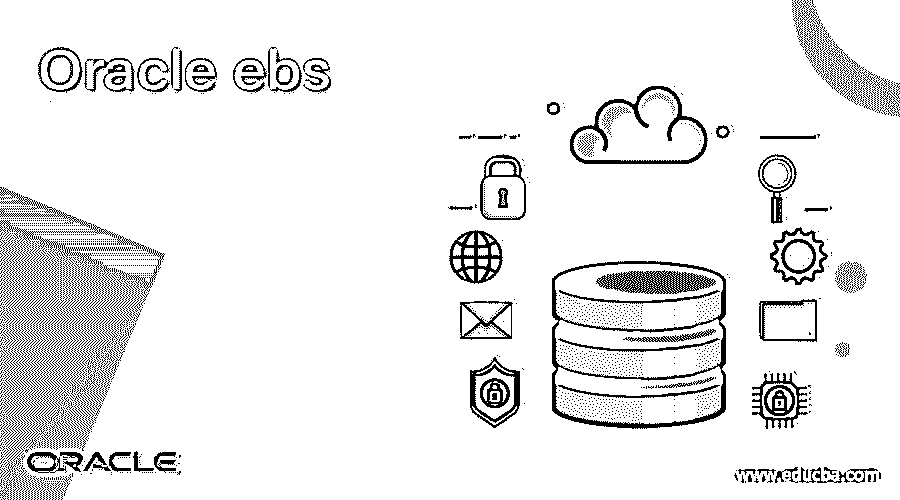
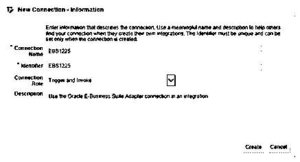
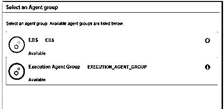
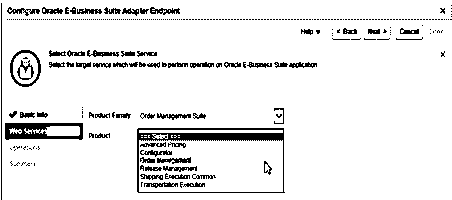
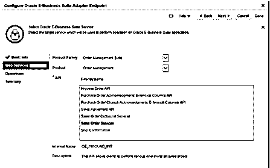
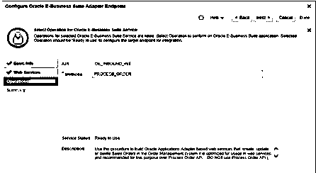
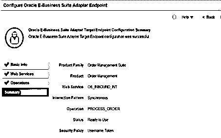

# Oracle ebs

> 原文：<https://www.educba.com/oracle-ebs/>

## Oracle ebs 简介

Oracle EBS 包括由 Oracle 提供的不同类型的集成业务应用程序。EBS 的完整形式是 Oracle 电子商务套件。基本上，它用于将所有对业务有帮助的 oracle 应用程序与其各种各样的流程结合起来。它主要关注企业资源规划，我们如何建立客户关系，即客户关系管理和供应链管理。oracle 数据库管理系统是应用最广泛的 Oracle 企业软件包，也是该软件包的核心技术驱动力。EBS 主要允许我们上传和分析数据，以及为 Hyperion EBS 映射元数据。第一次发布是在 2001 年，此后，oracle 不断更新 EBS 包。

### Oracle ebs 如何工作？

现在让我们看看下面提到的工作:

<small>Hadoop、数据科学、统计学&其他</small>

基本上，它在不同主要因素上工作如下。

1.  #### Enterprise Resource Planning

EBS 套件的主要特点是它的工作方式与 ERP 应用程序相同。EBS 套件允许用户上传和分析他们的数据的单一资源事实。其中我们可以包含 Hyperion EBS 集成，它提供了映射功能，有助于提取数据和元数据。企业资源规划的主要目的是改善协作工作并降低成本。

2.  #### Customer Relationship Management

客户关系管理意味着 CRM，其中所有 CRM 流程的唯一真实来源。CRM 主要用于与客户建立关系以改善业务，这意味着它是一种有助于改善业务的商业智能应用工具。

3.  #### Supply Chain Management

Oracle 供应链管理是 EBS 中最重要的因素，因为它带来了与产品或服务相关的各种反馈。这有助于设计产品，以及我们如何更好地向客户提供产品。它主要致力于发现产生的大量数据中的错误和 bug。它包括订单和价格管理以及物流和运输管理。

4.  #### Oracle Bone Inscriptions Finance

这包括现金管理，即应付款、应收款和总帐。

5.  #### Human resource management system

这有助于管理所有招聘流程，该模块为用户提供所有人力资源活动的实时视图，包括培训、时间管理、工资和其他福利。

6.  #### Oracle Bone Inscriptions Logistics

oracle logistics 允许用户计划、管理和控制企业内部的产品和服务流程。它还提供有关未来计划的信息以及特殊仓库内的安全库存。

7.  #### Order Management

此模块用于管理整个业务销售订单管理流程。

8.  #### Transportation management

运输管理用于管理第三方物流提供商和托运人的运输计划和执行能力。运输管理的优势是降低运输成本和客户服务。

9.  #### Warehouse management system

Oracle warehouse management system 用于管理配送过程中的货物及其信息。本模块提供的业务流程有助于管理分销流程中的员工和设备。

### 优点和缺点

现在我们来看看有哪些优缺点如下。

#### 优势

1.  Oracle ebs 用于管理全球业务。
2.  这也有助于促进决策。
3.  Oracle 用于降低产品成本并为客户提供更好的服务。
4.  主要的好处是，它有助于我们提高公司业绩。
5.  Oracle ebs 支持不同的工具，如 CRM、ERP 和 SCM。
6.  借助 CRM 工具，我们管理客户订单，为客户提供更好的服务，这意味着我们可以与客户建立关系，这就是 CRM。
7.  Oracle ebs 非常快速可靠，能够根据需求定制 aas。

#### 不足之处

1.  oracle ebs 的 GUI 并不简单，也不是用户友好的。
2.  Oracle ebs 需要高昂的维护成本，这是小型组织无法承受的。
3.  Oracle ebs 的部署和定制需要更多的工作，还需要部门和开发人员之间的协调。
4.  在 oracle ebs 中，在线修补需要更高的无错性。
5.  启动多表单会话时出现问题。

### 例子

现在，让我们看看 oracle ebs 的不同示例，如下所示。

首先，建立 oracle ebs suite 和 REST 服务的连接，如下所示。

1.  首先，我们需要登录 oracle 集成云服务。
2.  之后，单击连接并创建一个新的连接，连接名称、标识符、连接角色和描述如下图所示。

在上面的截图中，我们展示了如何建立连接。这是来自甲骨文官方网站的参考截图。

**之后，我们需要选择一个代理组**

选择所需的代理组，如 EBS，然后我们需要指定连接细节，如上面的屏幕截图所示。然后测试连接并保存设置。选择代理组，如下图所示。

因此，我们成功地建立了连接，并添加了 EBS 代理组。然后下一步是选择 web 服务，如下图所示。

在下一步中，我们需要从产品列表中选择销售订单服务 API，如上面的屏幕截图所示。选择销售订单，如下图所示。

之后，我们需要从操作页面中选择流程订单方法，如下图所示。

我们通过使用 summary page 选项来查看摘要，下面的屏幕截图显示了目标端点的摘要。

上面提到的所有截图都来自甲骨文的官方网站。

这样，我们可以借助 oracle ebs 执行不同的操作。

### 结论

我们希望通过这篇文章，您已经了解了 Oracle ebs。从本文中，我们了解了 Oracle ebs 的不同示例。我们也看到了 oracle ebs 的优点是什么，oracle ebs 的缺点是什么。从本文中，我们了解了如何以及何时使用 Oracle ebs。

### 推荐文章

这是 Oracle ebs 的指南。在这里，我们将讨论 Oracle ebs 的工作原理和示例，并了解其优缺点。您也可以看看以下文章，了解更多信息–

1.  [Oracle 表空间](https://www.educba.com/oracle-tablespace/)
2.  [Oracle 位图索引](https://www.educba.com/oracle-bitmap-index/)
3.  [Oracle Synonyms](https://www.educba.com/oracle-synonyms/)
4.  [甲骨文 NVL()](https://www.educba.com/oracle-nvl/)

