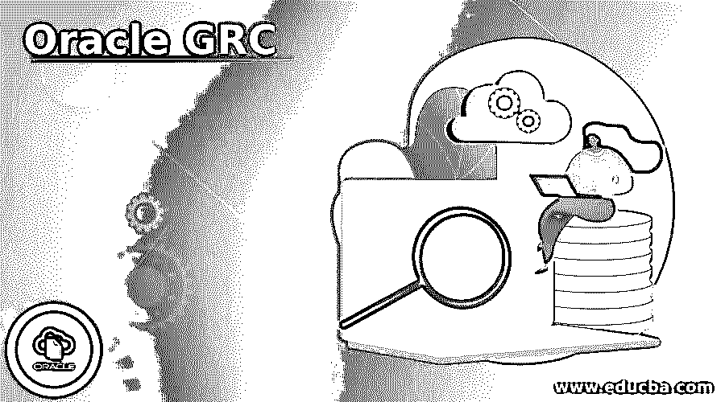
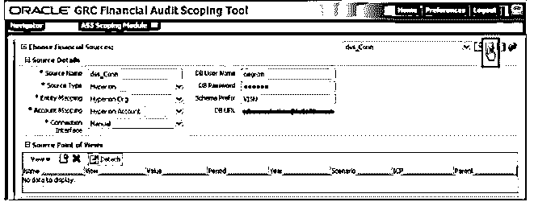
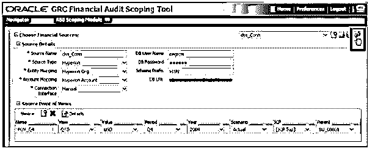
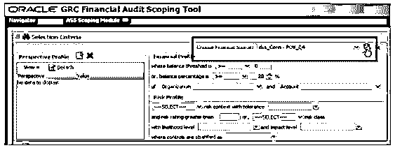

# oracle rac

> 原文：<https://www.educba.com/oracle-grc/>

## Oracle GRC 简介

Oracle GRC 意味着治理、风险和法规遵从性，这意味着它是一组用于监管业务管理应用程序所有活动的组件。用户可以使用 oracle 应用程序访问控制调控器(AACG)和 oracle 企业事务控制调控器(ETCG)创建模型和持续控制，借助这两个控制调控器，我们可以顺利运行所有活动并避免事务风险。总的来说，GRC 有助于确定公司的文档记录，也有助于制定应对风险和管理法规要求的策略。通过使用 GRC，用户可以定义业务风险、控制风险和其他对象，例如我们可以针对风险应用控制的业务流程。

### 我们为什么需要 Oracle GRC？

基本上，如果我们需要一个非常互动和简单的业务流程，以及它作为公司的要求，这意味着我们需要工具互动和可定制的模式。

<small>Hadoop、数据科学、统计学&其他</small>

如果用户需要创建具有不同权限的供应商，我们也可以使用 GRC 定义供应商的访问权限或责任。

现在让我们来看看为什么我们需要 GRC，基本上，通过使用以下显示 GRC 需求的参数，以低风险管理整个业务是有用的。

*   如果我们当时需要实施职责分离，我们可以使用 GRC。
*   它防止商业交易中的任何欺诈或失败。
*   它维护业务流程中的所有变更。
*   它帮助我们防止未经授权的行为或商业交易。

### **Oracle GRC 是如何工作的？**

现在，我们来看看 oracle 中的 GRC 是如何工作的，如下所示:

在当今世界，大多数组织都实施了 oracle ERP，有许多与审计、安全和法规遵从性相关的要求，我们需要在这些方面实施治理并最大限度地降低风险，因此，我们可以使用提供此类工具的 GRC 模块。GRC 是一种工具，有助于管理业务流程以提高效率，控制用户访问以最小化风险，以及跟踪数据变化以提高财务完整性。

GRC 有以下四种不同的产品:

*   **应用程序访问控制管理器(AACG):** 该模块有助于管理任何特定组织内用户的职责。此外，这有助于定义用户的责任和访问权限，即用户的权限。
*   **交易控制主管(TCG):** 通过使用该模块，我们可以防止不必要的交易风险，或者可以说是防止欺诈性商业交易。
*   **配置控制调控器:**通过使用配置控制调控器，我们维护变更。
*   **预防控制总监(PCG):** 我们可以执行规则，以防止未经授权的行为或任何与业务相关的交易。PCG 是作为 GRC 组件在 oracle ebs 中运行的一组不同的应用程序。

PCG 有如下不同的模块:

#### 1.表单规则

在不修改 oracle ebs 且不需要任何开发专业知识的情况下，我们通过使用如下表单规则来执行关键任务。

*   我们可以阻止指定字段中的更改。
*   我们可以限制访问并定义用户的角色。
*   有时，我们需要将一些字段设置为强制和隐藏的，以便使用表单规则。
*   它还提供了一个编写 SQL 查询的选项。

#### 2.流动规则

当我们需要自动化业务流程或者我们需要执行一系列活动时，我们可以使用流程规则。

**启动标准:**在启动标准下，有如下两条规则。

*   **流程:**业务的流程我们可以根据需要定义，有以下几种选择。我们可以通过使用 oracle API 来执行 DML 操作。它还为工作流提供通知。在这个流程中，我们可以一起执行多个规则，它们在一个流程中按顺序定义，以执行各个步骤。在这种情况下，审批规则或拒绝选项等步骤之间会产生相关性
*   **审核规则:**当我们启用审核规则时，将审核对指定字段的更改，并且它还会监控指定字段的更改。

#### 3.变更控制

它结合了流、审计规则和表单的不同功能。

### Oracle GRC 的优势和劣势

以下是 Oracle GRC 的优点和缺点:

#### 优势:

*   风险管理对所有业务流程都很有用，可以防止可疑交易、访问控制和更多特权。
*   它非常用户友好，也是一个非常互动和可定制的工具。
*   GRC 的所有功能都是自动功能。
*   这是一个高效、简单的合规管理模块软件。
*   我们可以使用 oracle GRC 在一个平台上实施多项法规。

#### 缺点:

*   它不支持高可用性，并且需要使用一些旧技术进行重新设计。
*   当我们在没有标准流程的情况下实施 GRC 时，会给用户带来难以承受的问题。
*   GRC 可能需要训练有素的职能顾问来使用和实施其功能。
*   Oracle 技术支持无法及时有效地解决所有问题。

### Oracle GRC 示例

下面是提到的例子:

成功安装后，我们需要检查连接，我们正在测试 GRC 财务审计范围，如下图所示。

现在我们需要定义源点，并从 HFM 维度中选择值，如下图所示。

然后选择财务来源，然后单击连接图标，如下图所示。

都提到了我们从官网导入的截图。

### 使用

下面给出了 Oracle GRC 的用法:

*   Oracle GRC 习惯于实时合规性。
*   它用于业务流程的安全性，并提供对不必要的交易风险的控制。
*   我们在同一个平台上执行多项操作，也就是说在一个控制面板中。
*   我们可以监控整个业务流程，并对其进行控制。

### 推荐文章

这是一份 Oracle GRC 指南。这里我们分别讨论介绍，需要，工作，优点，缺点，例子和用法。您也可以看看以下文章，了解更多信息–

1.  [甲骨文克隆数据库](https://www.educba.com/oracle-clone-database/)
2.  [Oracle SYS_GUID()](https://www.educba.com/oracle-sys_guid/)
3.  [Oracle 表空间](https://www.educba.com/oracle-tablespace/)
4.  [甲骨文分组依据有](https://www.educba.com/oracle-group-by-having/)

