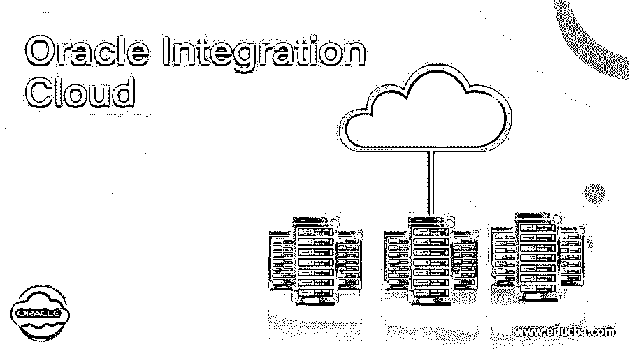
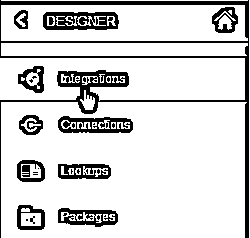
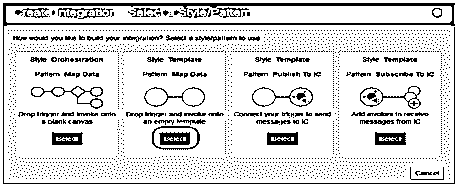
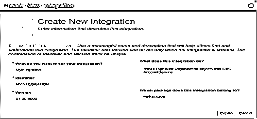
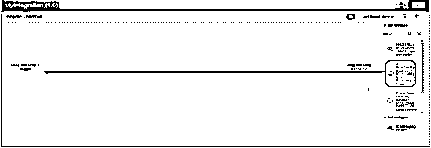
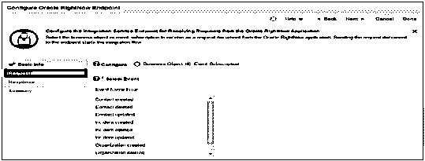

# Oracle 集成云

> 原文：<https://www.educba.com/oracle-integration-cloud/>

## Oracle 集成云的定义

Oracle integration cloud 是基于云的集成软件或应用程序，旨在执行不同基于云的应用程序之间的集成。此外，它还具有开箱即用的功能，可以与我们的场所进行集成。它基于 oracle service bus 应用程序，oracle integrated cloud 专为非开发人员设计，采用不同的方法来创建集成。oracle 集成云的所有配置都是基于浏览器的，XSL 用于 oracle 集成云中的数据映射和转换。它有一长串持续增长的应用程序适配器。

### 我们为什么需要 Oracle 集成云？

Oracle integration cloud 是一个非常好的应用集成平台，它在其中执行流程自动化、移动和 web 开发。基本上，它用于加速设计和交付集成的每一步。

<small>Hadoop、数据科学、统计学&其他</small>

借助 oracle 集成云，我们可以实现流程自动化以及客户对客户和客户对客户的自动化和集成。通过使用 oracle 集成云，我们能够直接从浏览器创建具有自动化流程的 web 和移动工作流应用程序。

oracle 集成云的另一个需求是，它用于每项服务的单一计费指标，这有助于简化服务消费和业务支出的估算和跟踪。

### Oracle 集成云是如何工作的？

现在，我们来看看 oracle 集成云是如何工作的，如下所示。

当我们需要使用多种不同类型的应用程序来支持我们的业务时，保持系统之间的同步是非常重要的。在 oracle integration cloud 中，客户自动进入其他系统，这些系统保存了该客户的所有详细信息。

我们可以通过基于网络的工具使用集成的云服务来开发 SaaS 应用程序。使用拖放功能，我们可以轻松地集成不同的应用程序。它有如下不同的模块。

**消息转换**

XSLT 映射工具在 SOA 中可用，在 OIC 上也可用。Oracle integrated cloud 提供了在基于 web 的设计器中创建地图的功能，我们也可以在 JDeveloper 中导入地图。

**发布和订阅**

通过使用消息云服务适配器，我们可以发布或订阅由 oracle 集成云应用程序生成的所有事件，它提供了发布我们的系统所需的任何内容的功能，并通过使用 oracle 集成云来集成它们。

**监控**

在 oracle 集成中，云仪表板提供了可见性，以查看集成中发生的事情，如 SOA 套件中的审计、故障排除和调试。

**通知能力**

通知是 oracle integration cloud 中的一个模块，用于检查所有应用程序，系统通过提供通知功能正常工作，并且可以配置连接，还显示通知消息以确保连接成功完成。

**传感器**

我们可以在集成实现中设置传感器，它为传感器中定义的数据提供搜索功能。Oracle 集成云中也提供了同样的功能，我们称之为业务跟踪标识符。

**连接**

连接用于定义作为源或目标的端点，并在集成中实现。集成的所有连接都基于适配器，因为适配器提供了一种建立连接的简单方法。

**查找**

Oracle integration cloud 具有查找功能，它允许在映射中交叉引用查找数据，就像 DVMs 一样。其中我们可以在多个集成中重用所有的表。查找映射可用作 CSV 格式的导入或导出选项。

**套餐**

包允许我们对集成进行分组，这意味着我们可以在。jar 文件格式。

### 优点和缺点

**优势**

1.  oracle 集成云的功能非常简单。
2.  不需要编码。
3.  在 oracle integration cloud 中，我们可以轻松地诊断问题和排除故障。
4.  其他系统也可供使用。
5.  连接器、积分器和仪表板在单个
6.  Oracle 集成云易于使用，用户界面也很友好。

**缺点**

1.  拖放功能会产生不良影响。
2.  工作流创建是 oracle 集成云中的一项挑战。
3.  它需要更多的适配器。
4.  更换策略不好，因为我们可以更换相同适配器类型的连接。
5.  云的速度有时很慢。
6.  Web 性能有所欠缺。

### 例子

现在让我们看看如何创建一个集成云，如下所示。

在这里，我们创建了一个集成流程，它在 oracle 服务云和 oracle 销售云之间同步客户信息，如下所示。

在 designer 中，选择如下所示的 Integration 命令来创建新的集成。

在整合页面后，我们需要点击创建并选择样式和模式对话框，如下图所示。

然后输入与新创建的集成相关的所有信息，如集成的名称、标识符和功能，如下图所示。

之后，拖动我们的 oracle 服务云进行连接，如下图所示。

拖动后，我们需要填写基本的所有必要信息，如下图所示。

### Oracle 集成云的使用

### 结论

我们希望通过这篇文章，您已经了解了 Oracle 集成云。从本文中，我们了解了集成云的不同示例。我们还将了解 Oracle 集成云的优势和劣势。从本文中，我们了解了如何以及何时使用 Oracle 集成云。

### 推荐文章

这是 Oracle 集成云指南。这里我们讨论一下定义，Oracle 集成云是如何工作的？优缺点，以及例子。您也可以看看以下文章，了解更多信息–

1.  [甲骨文存在](https://www.educba.com/oracle-exists/)
2.  [Oracle XML 类型](https://www.educba.com/oracle-xmltype/)
3.  [甲骨文日期格式](https://www.educba.com/oracle-date-format/)
4.  [甲骨文 XML](https://www.educba.com/oracle-xml/)

