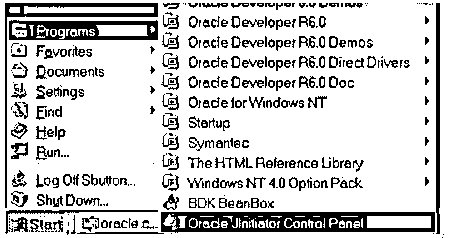
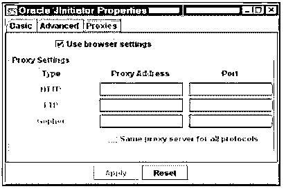
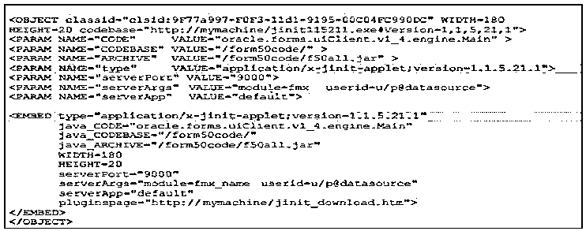
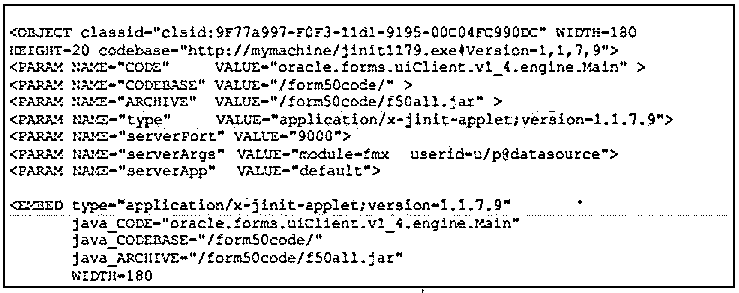

# Oracle Jinitiator

> 原文：<https://www.educba.com/oracle-jinitiator/>

## Oracle Jinitiator 简介

oracle 为基于 web 的 Oracle 应用程序提供 jinitiator。基本上 jinitiator 是一个 Java 虚拟机，它允许我们在 web 浏览器中运行客户端应用程序。如果可以访问基于 web 的 oracle 应用程序，那么我们称之为 JVM。我们在插件或活动控件的帮助下完成的工作依赖于 netscape 或 internet explorer 浏览器。它提供了在客户机上指定 java 虚拟机而不是默认浏览器 JVM 的能力。Jinitiator 作为 netscape navigator 和 internet explorer 的不同组件的插件运行，它不能替换或修改 JVM。

### 为什么我们需要 Oracle Jinitiator？

*   基本上，oracle 为客户端系统提供了 java 运行时环境，客户端系统可以借助 web 浏览器透明地启动。Oracle jinitiator 是 JavaSoft java 插件的一个版本。
*   它曾经为 JavaSoft JRE 提供了一种可以在浏览器中启动的机制，就像 oracle jinitiator 提供了同样的机制一样，也就是说，我们可以在浏览器中以稳定和受支持的方式运行应用程序。
*   此外，它还提供了执行 oracle forms 应用程序的平台。
*   与 JavaSoft 插件相比，它提供了更多的额外特性。

### Oracle Jinitiator 是如何工作的？

让我们看看 jinitiator 在 oracle 中是如何工作的:

<small>Hadoop、数据科学、统计学&其他</small>

使用 oracle jinitiator 有两种方法，如下所示。

#### 1.使用 Netscape Navigator 启动 Oracle Jinitiator

我们可以利用 jinitiator 和 netscape navigator 插件在浏览器中运行应用程序，类似于其他附件。这里我们使用 Netscape 的 HTML <embed>标签，应用工程师确定插件作为一个站点页面运行。这有助于 prophet jinitiator 在互联网浏览器中运行应用程序，并限制客户端的调解。当 navigator 第一次发现指示 prophet jinitiator 使用情况的 HTML 页面时，客户端可以在 HTML 页面上看到一个插件未加载的交换框，该框指示客户端下载 prophet jinitiator 页面。

之后，客户就可以下载 Jinitiator 表单，用它们的工作框架进行可行的再现。当我们在我们的框架上有效地引入 prophet Jinitiator 时，客户端需要关闭 navigator 并重启它，然后返回到 HTML 页面的登录页面。现在 prophet jinitiator 将运行应用程序，并利用<embed>标签中的各种边界来交付 applet。在导航器发现表明先知 jinitiator 和导航器的页面之后，导航器将很容易地加载和运行来自邻居圈的模块，并与任何客户端进行交互。

#### 2.使用 Microsoft Internet Explorer 启动 Oracle Jinitiator

它利用存储 ActiveX 控件和 COM 段，就像它另外利用 HTML <object>标签一样，web 工程师指出 ActiveX 控件或 COM 段应该作为一个网页运行，这种段包含了 prophet jinitiator。当 internet explorer 第一次发现 HTML 文档时，它一直在更改记录以指示 prophet Jinitiator 的使用，internet explorer 客户端可以下载 prophet company 通过 VeriSign 认可的 ActiveX 控件。</object>

在这种情况下，客户端点击“是”按钮，此时 internet explorer 将下载 prophet Jinitiator。在 prophet jinitiator 建立之后，它运行并使用其在<object>标签中的边界来交付 applet。在那之后，web voyager 发现该站点页面被调整以帮助 prophet jinitiator，它将容易地从邻居圈子加载和运行 oracle jinitiator，而无需客户端调解。</object>

**如何向一位** **先知吉门特塞挑战？**

*   将 prophet jinitiator HTML 标记添加到我们框架的基本 HTML 记录中。
*   在计算机或机器上安装 prophet jinitiator。
*   之后我们需要修改先知 jinitiator 的记录。
*   Oracle jinitiator 可供下载。

**将 Prophet Jinitiator 添加到基本 HTML 记录:**

*   在内容管理器中打开 HTML 记录，添加对象和嵌入标签。
*   之后，我们需要利用内容工具来调整下载的 jinitiator 记录。

**调整 Oracle Jinitiator 插头:**

*   首先改变 jinitiator 的储备规模。
*   同样的方法改变桩的大小。
*   之后，我们需要检查中介工作者。

之后，我们可以更改储备和商店大小，并检查 prophet jinitiator 的中介工人设置。查看 jinitiator 的收益率。

### Oracle Jinitiator 的优点和缺点

以下是 Oracle Jinitiator 的优点和缺点:

#### 优势:

*   我们可以在旧版本中运行最新的 Oracle jinitiator JVM
*   它提供了不同浏览器之间的一致性。
*   这是一个可靠的部署平台。
*   它提供了高性能的部署环境。

#### 缺点:

*   所有代码都是手写的。
*   文档、可维护性和质量都是问题。
*   缺乏集成工具。

### Oracle Jinitiator 示例

下面是提到的例子:

首先，我们需要使用控制面板设置 oracle Jinitiator，如下图所示。

现在配置代理设置，或者我们可以使用浏览器提供的默认设置，如下图所示。

下面的截图显示了一个 HTML 页面，允许人力资源应用程序如下。

如果获得了新版本的 oracle Jinitiator 并将其放入服务器，则客户端浏览器将被迫使用新版本，如下图所示。

这样，我们就可以使用 oracle Jinitiator 运行应用程序文件。

### 使用

下面给出了 oracle jinitiator 的用法:

*   当我们第一次访问 oracle form web 应用程序时，它会自动安装。
*   Oracle web client 是一个 java applet，托管在浏览器中，默认情况下，浏览器使用 JVM，建议使用 jinitiator 来避免任何问题。
*   通过使用 oracle jinitiator，我们可以直接在 netscape navigator 或 internet explorer 中运行 oracle 应用程序表单服务和图形应用程序。

### 推荐文章

这是 Oracle Jinitiator 的指南。在这里，我们分别讨论了介绍，需要，工作，优点，缺点，例子和用途。您也可以看看以下文章，了解更多信息–

1.  [甲骨文存在](https://www.educba.com/oracle-exists/)
2.  [Oracle XML 类型](https://www.educba.com/oracle-xmltype/)
3.  [甲骨文克隆数据库](https://www.educba.com/oracle-clone-database/)
4.  [Oracle SYS_GUID()](https://www.educba.com/oracle-sys_guid/)

