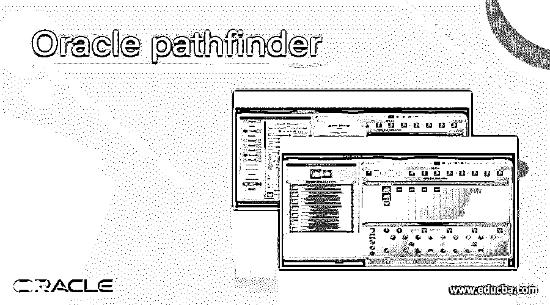
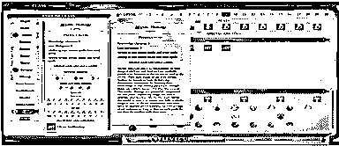
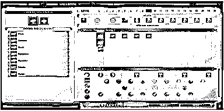
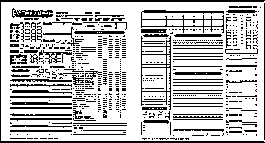

# Oracle 探路者

> 原文：<https://www.educba.com/oracle-pathfinder/>

## Oracle pathfinder 简介

虽然神圣的存在通过许多专家工作，也许没有人比先知更令人困惑。这些神圣的容器被允许拥有权力而不需要他们的决定，被命运选择来使用控制，甚至他们也不完全理解。与牧师相反，她通过献身于一个神来吸引魔法，先知从许多来源积累力量和力量，特别是那些支持他们信仰的神。先知通常会崇拜与他们信仰相同的所有神圣存在，而不是尊崇一个单独的来源。虽然有些人认为是先知的祝福，其他人认为他们是一个辱骂，改变了不可预见的存在。在本主题中，我们将了解 Oracle pathfinder。

### 我们为什么需要 oracle pathfinder？

神谕对于能表演魔法的人来说，就是拥有一种魔法力量，这种力量除了巫师什么都不是。先知是基于魅力的不受约束的施法者，过去他们和牧师共享一个法术列表(和一些不同的视角)。因为他们的能力是如此的相似，神谕可以胜任牧师所能胜任的任何工作，而且基于他们的魅力，神谕比牧师有更好的面容。

<small>Hadoop、数据科学、统计学&其他</small>

### Oracle pathfinder 是如何工作的？

现在我们来看看 pathfinder 在 Oracle 中是如何工作的，如下所示。

基本上，oracle pathfinder 包括如下不同的属性。

#### 1.能力

在神谕中，我们使用了一个牧师对象，即神谕牧师要么是一个严格的魔术师，要么我们可以说是流血边缘的战斗魔术师。我们可以选择任何职位，这个职位取决于我们需要在党内规划什么角色。我们在这里定义的一些角色如下。

*   如果我们打算在那个时候成为一个战斗轮，我们必须需要攻击和伤害的力量，如果我们在那个时候有一个直的战士，我们可以调整力量。
*   我们可以在其中增加交流电的功率，以及任何可能产生的反射，我们需要保存以备进一步处理。如果在 AC 中出现任何问题，那么我们可以选择 12 分的重甲熟练度，这是可以接受的。另一方面，我们作为普通战士，那么我们需要在 AC 上做一些改变，这意味着我们需要改进 AC 并计划进攻。
*   **CON:** con 的意思是我们需要击中要害，并把它留到以后处理。
*   如果我们的等级是 4+并且我们没有重要的技能，如果我们被要求的话，我们需要转储智力。但是许多甲骨文之谜提供了获取所有技能的途径，这些技能可以帮助我们成为有智慧的优秀图书馆员。
*   **WIS:** 用于保存遗嘱，遗嘱在 oracle 中使用。
*   它提供了施法的功能，或者我们可以说是能力。

#### 2.赛马会

奖励点有助于魅力，这是一个关键点，但如果我们有奖励点的其他能力，有利于战士。

*   矮人:这个惩罚对魅力来说是个问题，但是我们可以通过使用施法者来解决这个问题。
*   如果你因为基本原则和魅力而获得奖励，这对一个战士来说是一个很好的组合。如果我们需要玩一个小的直战斗机，我们使用 GNOME，这是最好的选择。另一方面，一个受青睐的奖励会给予更高等级的力量，但是记住一件事，这是更高等级的能力力量，一旦我们使用了所有的力量，投资将会被浪费。
*   半精灵:半精灵的魅力将获得灵活的奖励点，而被偏爱的职业奖励将给予额外的法术，这将有助于提高先知的多功能性。**T3】**
*   半兽人:魅力换来了灵活的加成，然后我们得到了黑暗视野，这很好，但这是我们必须得到的。这同样有助于提高 oracle 的通用性。

#### 3.特征

性状的选择取决于性格观念。因为神秘和拼写使神谕多样化，这有助于确定什么类型的特征对神谕有益。

#### 4.技能

*   外交:外交是游戏中最重要的技能之一，特别是当我们计划聚会的时候。
*   **治疗:**是处理魔法能力但作为神职人员说不好的最好方法。

#### 5.武器

武器在游戏中是最重要的，它有不同的类型，如铁手套，重锤和长矛等。

#### 6.装甲

在游戏中，如果我们需要精通重甲以便能够使用+5 护甲，护甲是很重要的。

#### 7.拼写

它的工作原理和牧师一样。我们不能每天交换咒语。

### 优点和缺点

以下是优点和缺点

#### 优势

*   神谕提供了一个比牧师更好的面孔。
*   它提供了细目分类
*   它提供了一个集成的应用程序来检索和预测任何位置。
*   这有助于我们识别哪个咒语不见了。

**缺点**

*   部署没那么简单。
*   与其他数据库的集成很困难。
*   oracle pathfinder 的结构很复杂。

### 例子

让我们看看 oracle pathfinder 的例子，如下所示。

上面的截图显示了神秘 theurge 中第 9 级的记分卡。当我们从类中选择下一个级别时，没有问题，但下一页不包括在 oracle 中。这就是下面截图所示的 bug。

现在我们需要一些日志，如下图所示。

### Oracle pathfinder 的使用

1.  基本上，它是用于咒语和他们的神秘的启示。
2.  它使用了甲骨文拼写列表，非常棒。
3.  有了神谕探路者的帮助，我们会得到更多的法术。
4.  它还用于提高 oracle 的通用性。

### 结论

我们希望通过这篇文章，您已经了解了 Oracle Pathfinder。从本文中，我们了解了 Oracle Pathfinder 的不同示例。我们还会看到 Oracle Pathfinder 的优缺点。从本文中，我们了解了如何以及何时使用 Oracle Pathfinder。

### 推荐文章

这是 Oracle pathfinder 的指南。在这里，我们讨论 Oracle Pathfinder 的不同示例及其优缺点。您也可以看看以下文章，了解更多信息–

1.  [甲骨文 XML](https://www.educba.com/oracle-xml/)
2.  [Oracle 表空间](https://www.educba.com/oracle-tablespace/)
3.  [Oracle INSTR()](https://www.educba.com/oracle-instr/)
4.  [甲骨文合并](https://www.educba.com/oracle-merge/)

