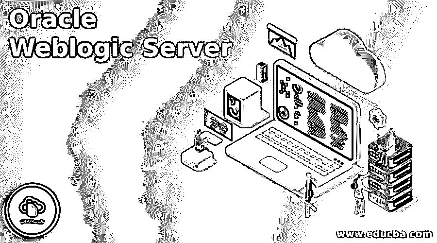

# Oracle Weblogic Server

> 原文：<https://www.educba.com/oracle-weblogic-server/>

## Oracle Weblogic Server 的定义

Oracle Weblogic server 是业界著名的应用服务器，它负责通过 Java EE 标准构建企业应用程序，并以很低的所有权成本将它们安装在一致的、可访问的运行时上。因此，这款 Oracle Weblogic server 特意与 Oracle 的完整产品和云服务组合结合在一起。它提供了与以前版本的兼容性，并提供了新的结构来提高开发人员的效率、可获得性、可管理性以及对云固有的基于 Kubernetes 的设置的利用。

### 为什么我们需要 Oracle Weblogic Server？

它有以下好处:

<small>Hadoop、数据科学、统计学&其他</small>

*   完整的 Java EE 和 Jakarta EE 应用程序提供了与 API 的强大技术组合。
*   运行 Java 应用程序的 Oracle Weblogic 支持云中立环境。
*   应用程序现代化集中了上市时间，通过开源和集成工具实现了高敏捷性。
*   对于企业应用程序需求，Oracle Weblogic server 与其他 Oracle 产品和技术相集成，以提供最佳的可获得性、表示和支持性。
*   跨内部和云的卓越分布式缓存解决方案。
*   Oracle 云中 Oracle Weblogic Server 的快速供应。
*   可以关联到多个外部企业套件，如电子商务套件、PeopleSoft 等。在 Weblogic 服务器中。

### Oracle Weblogic Server 的工作原理

*   此 Oracle Weblogic server 的系统管理员包括各种各样的任务，例如形成 Weblogic server 域、定位应用程序、将域从改进环境转移到汇编环境、观察和处理运行时系统的性能、分析和排除困难。
*   因为 Weblogic server 域被定义为一组用于特定目的的 Weblogic Server 服务。例如，用户可以创建一个用于交付员工门户的域，也可以创建另一个用于向您的客户交付业务服务的域。
*   因为 Oracle Weblogic server 的管理系统是以 JAVA EE 和其他标准为中心的，而且它还吸收了一个定期实施以处理其他软件和硬件组件的系统。作为补充，Oracle Weblogic server 具有不同的基于标准的、可扩展的优势。否则，用户也可以应用 API 来构建定制的管理实用程序。

### 优势

下面列出了优点:

*   该 Weblogic 平台提供了唯一高度集成、可靠的解决方案和卓越的性能，将共同应用程序基础架构的优势与易于使用、强大的应用程序改进和管理框架结合起来，适用于特定类别的应用程序，如门户计划、自定义开发和企业集成。
*   Weblogic server 负责提供一个创建和安装多层分布式企业应用程序的平台。
*   它有助于集中应用服务，例如 Web 服务器功能、业务模块和后端企业方案。
*   Weblogic server 实现了连接池和缓存等技术，用于开发资源使用和应用程序性能。
*   它有助于提供企业级安全性以及强大的管理设施。
*   它是稳定的、有抵抗力的，包括用户管理、消息传递、集群管理和运行时性能。
*   它为经理和管理员创造了一个简单的任务。
*   Linux 上的 Weblogic 可以坚如磐石。

### 不足之处

下面列出了缺点:

*   Oracle Weblogic server 成本高昂，导致小公司不愿购买许可。
*   最新版本的 Java 无法实现，尽管它们不是专门针对版本 Java 11 的，但 Java 本身是 Oracle 产品。
*   存在内部构建的工具 CI/CD。
*   DB 版本的几个连接性？
*   可以改进基于云的部署。
*   需要迁移到全新的原生云时代，但 Oracle 正在解决这一问题。
*   可以增强性能和用户界面。
*   对于任何健康问题案例，它必须驱动警报。
*   安装和管理可以变得更加简单。
*   weblogic server 的配置很困难。
*   配置变更的分析和重启需求。
*   当它接近本机问题时，日志记录就会减少。
*   控制台需要增强。
*   领域复制似乎很难，需要很多知识和脚本方面的努力。

### Oracle Weblogic Server 的使用

我们有如下用法:

*   **简化 Java EE 应用**:在 Weblogic server 的帮助下，通过运营商交付 Docker 供应支持的安装工具提供了 Kubernetes 监督功能。
*   **在云中执行 Java 应用:**通过 Oracle 中的 Oracle Weblogic server for Cloud infra structure 将现有的本地 Java 应用迁移到云中，以更低的成本获得更高的性能。
*   **构建 Java 微服务:**在标准的基础上，Helidon 利用函数式编程的方式为现代和云原生 Java 应用提供 MicroProfile APIs。

如今，商业环境加载了电子商务和网络应用程序，这些应用程序可以加快进入新市场的速度，支持发现新的方式来接触和保留客户，从而允许快速提供新产品和服务。但为此，我们需要构建和安装新的解决方案，以获得一个可靠的、值得信赖的电子商务平台，该平台能够连接和授权各种类型的用户，同时在一个权威、灵活、端到端的电子商务解决方案中吸收公司记录、大型机应用程序和其他企业应用程序。

此外，该解决方案必须提供可访问的性能和高可用性，以管理最重要的企业级计算。因为，作为一个行业电子商务交易平台，Oracle Weblogic server 允许快速创建和部署可靠、安全、可安装和可控制的应用程序。它处理系统级的事实，因此人们可以思考业务逻辑和演示。因此，Oracle 生产的 weblogic server 提供了与重要数据库、新兴工具和其他类型环境的紧密集成。该服务器的几个版本可以是 Weblogic tengah，它是最老的和初步的版本，而另一个最新的版本是 Weblogic server 14c(14.1.1)。

### 结论

*   Oracle Weblogic Server 是一个可扩展的组合平台，用于在云中和内部培养、安装和运行 Java 等企业应用程序。
*   这个 Weblogic server 提供了 Java 企业版(EE)和 Jakarta EE 的成熟、强大和可访问的执行。
*   在这个服务器中，使用的语言是 Java，它是由 Oracle 公司开发的。

### 推荐文章

这是 Oracle Weblogic Server 的指南。在这里，我们还讨论了它的定义和工作方式，以及它的优缺点。您也可以阅读以下文章来了解更多信息—

1.  [甲骨文存在](https://www.educba.com/oracle-exists/)
2.  [Oracle XML 类型](https://www.educba.com/oracle-xmltype/)
3.  [甲骨文日期格式](https://www.educba.com/oracle-date-format/)
4.  [甲骨文克隆数据库](https://www.educba.com/oracle-clone-database/)

