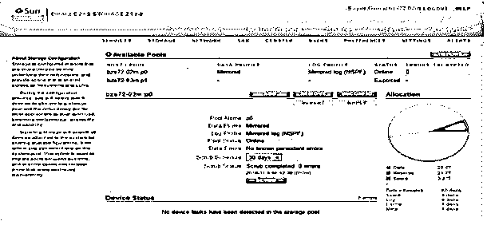
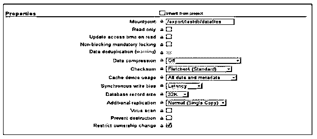
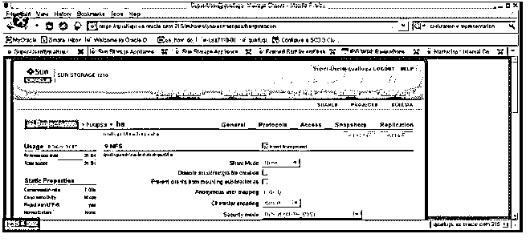

# 甲骨文 ZFS 公司

> 原文：<https://www.educba.com/oracle-zfs/>

## 甲骨文 ZFS 公司简介

Oracle 提供了不同的存储设备，即 Oracle ZFS 存储。它为用户提供了不同的功能，例如整合文件、在单个平台上存储不同的数据。它将所有高资源与数 Pb 的存储容量结合在一起，所有用户都可以高速无误地运行所有工作负载或我们所说的作业。它还具有内置的 Oracle 数据库集成，包括数据库的自动化优先排序，它使 It 部门能够优化工作负载性能并最大限度地减少管理，以实现较低的总体拥有成本。它是一个文件系统和逻辑卷管理器，并且是可扩展的。

### 为什么我们需要一个甲骨文 ZFS？

*   许多组织需要一个单一的平台来提供所有的功能，没有任何错误，具有高速度和安全性。
*   它为用户提供了相同的功能，这意味着它提供了一个平台来同时处理不同的作业。基本上，Oracle ZFS 是一个文件系统，这意味着它是一个存储机器，用于在云中存储不同的作业，并提供具有可扩展性和安全性的高性能。
*   它还像 RAC 一样支持数据库，并提供防止数据损坏的保护。

### 甲骨文 ZFS 公司的运作

下面给出的是工作:

<small>Hadoop、数据科学、统计学&其他</small>

#### 1.甲骨文 ZFS 公司的原则和设计目标

Oracle ZFS 的主要目标是通过标准硬件提供高性能以及端到端数据保护和简单管理。当前的 Oracle ZFS 存储设备使用 64 位操作系统来增加虚拟内存空间。它还包括空间布局系统，这有助于对攻击者隐藏内存地址。它使用 64 位地址空间，因为它减少了虚拟内存的压力，增加了高负载系统的稳定性，也提高了灵活性。

所有上述功能都包含在 Oracle ZFS 存储设备中，它能够处理所有作业，使用数据保护算法和高级数据服务运行作业，并使用自动化工具管理所有活动。这是 Oracle ZFS 提供高性能和虚拟化的主要原因。在工作负载期间，它可以更有效地使用硬件。

#### 2.Oracle ZFS 池化存储模型

Oracle ZFS 池化存储模型意味着它是物理磁盘的集合，ZFS 利用容量池的概念来监控实际容量。的确，文档框架是在一个单独的实际设备上开发的。为了处理大量的设备并适应信息重复，卷管理员的想法是给出一个单独设备的描述，这样文档框架就不会被改变以利用不同的设备。鉴于文档框架对信息在虚拟化卷上的实际位置没有影响，该计划增加了另一层复杂性，并最终阻止了某些记录框架的推进。

#### 3.事务语义

Oracle ZFS 存储设备始终使用事务性文件系统，这意味着它始终由磁盘组成。传统文件系统会覆盖信息，这意味着如果框架断电，例如在时间和信息块之间以及当它连接到索引时，通常我们会使用 fsck 命令来解决这个问题。此命令对于监控所有活动非常有用，例如检查文档框架状态，以及在交互过程中是否会发生任何不必要的事情。在事务性文件系统中，我们通过使用写时复制语义来管理所有数据。

#### 4.校验和以及自我修复数据

Oracle ZFS 通过使用不同的校验和算法来验证所有数据。在传统文件系统中，由于传统文件系统的卷管理层和设计，校验和验证是在每个数据块的基础上执行的。在传统文件系统中，在没有任何校验和错误的情况下将块写入不正确的位置，这是传统文件系统中的一个问题。但是 ZFS 提供校验和来检测故障并正确地删除它们。

#### 5.无与伦比的扩展性

ZFS 文档框架的一个关键计划组件是多功能性，即可扩展性。默认情况下，文件系统使用 128 位，允许 256 万亿次存储。在这里，我们动态分配所有数据，因此不需要预分配数据。

#### 6.ZFS 快照

快照是文件系统的只读格式。它可以轻松快速地生成，并且不需要额外的磁盘空间。

#### 7.简化管理

这是 Oracle ZFS 存储设备的一个重要功能，它为用户提供了简单的管理模型。它恰当地继承了所有功能，并且管理得非常好。

### 甲骨文 ZFS 公司的优势和劣势

下面给出了提到的优点和缺点:

#### 优势:

*   它能更快地运行所有作业。
*   它提供简单的支持来保护云。
*   它具有集中存储功能。
*   它还具有数据完整性验证和自动修复功能。
*   它的最大存储容量为 256 万亿次。
*   它提供数据复制功能来恢复数据。
*   它还提供了安全性。

#### 缺点:

*   增加了数据恢复的难度。
*   甲骨文 ZFS 存储设备的成本很高。
*   它增加了工作负载的管理复杂性。
*   它需要更多的硬件。
*   如果任何子系统都可能发送邮件，则可能无法执行独立操作。

### 例子

下面是提到的例子:

Oracle ZFS 具有监控所有进程的功能，当前系统的状态如下图所示。

现在，让我们看看如何在 Oracle ZFS 中共享具有不同属性的数据库，如下图所示。

下面的屏幕截图显示了我们如何将新项目添加到 Oracle ZFS 存储设备中，如下所示。

### 使用

下面给出的是用法:

*   通过使用 Oracle ZFS，我们可以在多个用户访问应用程序和数据库时更快地运行它们。
*   我们可以存储大量数据，并通过保护措施很好地进行管理。
*   它具有数据复制属性，因此不会丢失数据。
*   基本上，它用于高带宽的数据分析。

### 推荐文章

这是甲骨文 ZFS 公司的指南。这里我们讨论一下引言，我们为什么需要一个甲骨文 ZFS？工作原理、优点、缺点、示例和用法。您也可以看看以下文章，了解更多信息–

1.  [甲骨文存在](https://www.educba.com/oracle-exists/)
2.  [Oracle XML 类型](https://www.educba.com/oracle-xmltype/)
3.  [甲骨文克隆数据库](https://www.educba.com/oracle-clone-database/)
4.  [Oracle SYS_GUID()](https://www.educba.com/oracle-sys_guid/)

