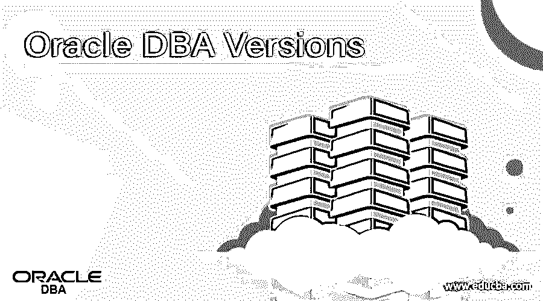

# Oracle 数据库管理员版本

> 原文：<https://www.educba.com/oracle-dba-versions/>

## Oracle DBA 版本的定义

*   Oracle DBA 被定义为 Oracle 数据库管理员，负责管理拥有不同职责和操作的 Oracle 数据库服务器。
*   由于数据库用户的类型及其相关联的角色和工作在一个站点可能不同，因此具有高特权级别的 DBA 用户占用更多的优先级任务来处理和控制整个数据库管理以及应用程序创建者和其他用户的管理。
*   在每个数据库服务器中，至少需要一个 DBA 来管理大型和小型站点。因为 Oracle 数据库服务器很大，并且包括许多类型的用户，他们相互分担一部分责任来处理和保护数据库。
*   因此，Oracle DBA 版本包含 Oracle 数据库增强功能，提供新的功能来维持市场领先的性能、可靠性、可伸缩性和安全性，在本地和云中也是如此。

### Oracle 数据库管理员版本

最初，甲骨文是由拉里·埃里森、鲍勃·迈纳和埃德·奥茨于 1977 年 6 月 16 日以 SDL(软件开发实验室)的名字创立的。后来，直到 1979 年，该公司的名称并不成功，同年，该公司的名称被三个勇敢的朋友修改为 Relational Software Inc。此外，该公司因其产品得到认可，并再次更名为甲骨文系统公司。1995 年晚些时候，该名称被修改为甲骨文公司，并一直延续至今。

这只是 oracle DBA 版本历史的一个简介。现在，让我们讨论和解释 DBA 版本的一些细节，如下所示:

<small>Hadoop、数据科学、统计学&其他</small>

| **版本** | **年** | **新结构** |
| Oracle v2 | One thousand nine hundred and seventy-nine | 最初商业化的基于 SQL 的 RDBMS。 |
| Oracle v3 | One thousand nine hundred and eighty-three | 数据分发、并发控制器和可伸缩性 |
| Oracle v4 | One thousand nine hundred and eighty-four | 具有多版本的读取一致性 |
| Oracle v5 | One thousand nine hundred and eighty-five | 分布式数据库系统和服务器/客户机计算支持 |
| Oracle v6 | One thousand nine hundred and eighty-eight | PL/SQL、在线备份和恢复、行级锁定、Oracle 并行服务器和可伸缩性 |
| Oracle 7 | One thousand nine hundred and ninety-two | 触发器、PL/SQL 存储事件过程、基于成本的优化器、共享游标、透明的应用程序故障转移 |
| Oracle 8 | One thousand nine hundred and ninety-seven | 虚拟专用数据库、分区、Java、恢复管理器、本地互联网协议、Dataguard |
| oracle 9i | Two thousand and one | 逻辑备用、Oracle XML DB、Oracle Real application clusters，即 RAC、流、数据挖掘 |
| Oracle 10gR1 | Two thousand and three | 自动数据库诊断监视器，Oracle ASM，网格基础架构，闪回数据库 |
| Oracle 10gR2 | Two thousand and five | 在线索引、透明数据加密、数据库保险库、真实应用程序测试、高级压缩 |
| oracle 11g r1 | Two thousand and seven | 数据库云服务器，安全文件，主动数据保护 |
| oracle 11g r2 | Two thousand and nine | 数据库设备，群集文件系统，混合列压缩，golden Gate 复制，数据编辑 |
| Oracle 12cR1 | Two thousand and thirteen | 数据库云服务、内存列存储、SQL 模式匹配、原生 JSON、多租户架构 |
| Oracle 12cR2 | Two thousand and sixteen | 客户云、数据库云服务器云服务、零数据丢失恢复设备、本机分片 |
| Oracle 18c | Two thousand and eighteen | Active Directory 集成、自治数据库、多态表函数、Data guard 多实例重做应用 |
| 甲骨文 19c | Two thousand and nineteen | 分区混合表、自动索引、实时统计+仅统计查询、数据保护 DML |

*   **Oracle 8:** 在 Oracle 的这个 DBA 版本中，引入了恢复管理器(RMAN ),它表示 Oracle 数据库的恢复和备份工具以及分区功能，在性能方面极大地影响了数据库管理系统。此外，Oracle 8 的灾难恢复功能被称为 Dataguard。
*   **Oracle 9:** 在这个版本中，最有益的特性无疑是(RAC) Real Application Cluster。此外，同时安装在许多服务器上的 Oracle Instance 提供了数据库的高可用性。在其他 RDBMS 中，还没有像 RAC(主动-主动)这样的功能成为公司的必要条件，称为呼叫业务关键型系统，特别是对于银行和保险等有即时资金流动的客户。
*   **Oracle 10g 发布日期:**Oracle 10g 于 2003 年推出，具有从操作系统处理 Oracle 存储管理的能力，目前称为自动存储管理。在 Oracle 9 版本中，名为 Real application cluster 的特性得到了增强，另一个特性 Grid Infrastructure 也在 Oracle 10g 中发布。Oracle 10g 提供了一个最重要的特性，即针对数据库管理员的闪回和减少用户故障的恢复。同样，还引入了一些其他创新功能，如透明数据加密和高级压缩。
*   **Oracle 11g 发布日期:**2007 年，Oracle 11g 推出。此外，数据库云服务器是 Oracle 在硬件方面开发的数据库机。因此，Oracle 11g 成为数据库云服务器中使用的第一个数据库版本。在此版本中，Active dataguard 功能是为 dataguard 数据库的灾难恢复功能开发的。集群文件系统、混合列压缩和数据编辑被列为该版本的另一个特性。
*   **Oracle 12c 发布:**在 12c 版本中，Oracle 在 2012 年发布了几个不同的特性，这些特性已经在市场上引起了反响，此外，这背后最重要的原因是它宣布了云特性。因此，现在 10g 和 11g 中的 g . I . e . grid 概念被 c . I . e . cloud 所取代。
*   **Oracle 18c 发布日期:**Oracle 18c 将于 2018 年发布，包括 Data Guard 多实例重做应用和自治数据库等最重要的功能。
*   **Oracle 19c 发布日期:**2019 年，Oracle 19c 推出了自动索引、分区混合表、数据保护 DML 重定向和实时统计+仅统计查询等功能。

因此，Oracle DBA 的职能是对几个任务进行优先级排序，例如称重数据库服务器硬件、部署 Oracle 软件、预测数据库、生成和打开数据库、备份数据库和登记系统用户、执行数据库设计、备份完整功能的数据库以及最后调整数据库性能。

### 结论

*   在这个 Oracle DBA 版本中，我们了解了所有几个版本，这些版本在开发、安全、性能和管理等所有领域都提供了各种新特性和创新能力。
*   所有这些都为数据库管理员和开发人员提供了必要的工具，以支持在安全高效的数据库基础设施上创建创新的应用程序。

### 推荐文章

这是 Oracle DBA 版本的指南。这里我们讨论一下定义，解释一些关于 DBA 版本的细节。您也可以看看以下文章，了解更多信息–

1.  [Oracle Update with Join](https://www.educba.com/oracle-update-with-join/)
2.  [甲骨文存在](https://www.educba.com/oracle-exists/)
3.  [Oracle XML 类型](https://www.educba.com/oracle-xmltype/)
4.  [甲骨文 XML](https://www.educba.com/oracle-xml/)

