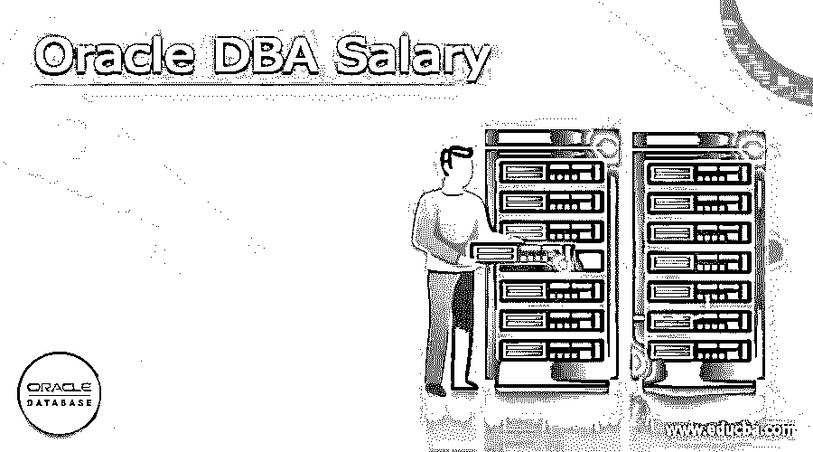

# Oracle 数据库管理员工资

> 原文：<https://www.educba.com/oracle-dba-salary/>

## Oracle 数据库管理员工资简介

oracle 的数据库管理系统称为 Oracle 数据库管理系统，在该系统中，在线事务处理和 Oracle 数据工作负载以正常方式执行，以便在 Oracle 系统内部高效地完成工作。数据库硬件处理得很好，并且数据库是用所有系统方法安装和配置的，因此我们可以很好地监控性能。事实上，所有与数据库相关的活动，如设计、创建、维护、管理和成本效益都是由数据库管理员完成的。Linux 和 SQL 知识有助于理解数据库，这也有助于编写基本代码。

### Oracle 数据库管理员工资

*   在集成新旧系统时，数据库管理员应该小心管理旧数据。还应该对新数据库进行各种测试，以确保安全性。所有易受攻击的数据都将存储在数据库中，因此安全性必须得到优先考虑。
*   Oracle 数据库薪资因地区和公司而异。在印度，它也因大都市的不同而不同。塔塔咨询服务公司为初级数据库管理员提供 65 万卢比。如果他们擅长云计算并知道数据建模，工资将每年增加 80 万卢比。我们在 Cognizant 的工资相同，但在 IBM 和 Wipro，Oracle 数据库管理员的工资更低，高达 55 万卢比。IBM 有自己的数据库和管理团队，因此较少使用 Oracle。HCL 提供的甚至更少，每年 47.5 万卢比。埃森哲为初级管理人员提供的薪水更高，为 85 万卢比。在甲骨文公司，数据库管理员的工资是 87 万卢比，在甲骨文公司可以学到更多。与其他公司相比，基础架构和数据库管理将有所不同。
*   在印度，最高的年薪是 140 万卢比，这取决于数据库管理员掌握的各种技能。oracle 数据库管理员可以转变为数据仓库架构师或数据库开发人员，因为这两个角色都需要深入了解数据库。这设法从数据库中创建所有的数据，并获得比目前数据库管理职位更高的薪水。开发人员可以编写代码，管理数据库免受各种安全威胁，并创建一个自治数据库。

### Oracle 数据库管理员工资指南

*   美国数据库管理员的平均工资是 93000 美元。但如果是专门针对甲骨文的，需求更多，因此工资是 108000 美元。Oracle 数据库管理员的加薪和奖励更多，达到 116000 美元。工资随着经验和技能的增加而增加，对于具有各种技能的入门级 Oracle 管理员，工资高达 12 万美元。
*   入门级数据库管理员的工资为 40000 美元，最低百分位数的人的工资为 50000 美元。数据库管理员的平均工资水平是 87000 美元。不仅仅是在美国，全球对 It 和数据库管理员的需求也在增加，这导致无论在哪里，薪水都更高。与其他人相比，知识产权专家的工资较低，而数据库管理经理的初始工资为 130000 美元，并根据他们在该领域的技能和经验增加。数据库营销经理的工资为 105000 美元，与收入相同的数据库仓库分析师的工资相当。
*   加州为数据库管理员支付更多薪水。圣何塞市支付 94000 美元，这是最高的工资。洛杉矶和罗利支付 93000 美元，而旧金山支付 91000 美元。在所有城市中，康涅狄格州的工资最低，起薪为 87000 美元。不同城市的平均工资也不同，新泽西州的平均工资最高，为每小时 51 美元，其次是华盛顿，平均工资为 47 美元。

### DBA 在未来有一个范围

*   大多数公司都有数据库，因为数据库中每天都要处理大量的数据。因此，是时候考虑自治数据库并从维护数据库模式中走出来了。这有助于数据库自动完成所有日常数据库任务，因此数据库管理员可以专注于数据库的创新过程。数据库的数据架构和建模可以由管理员完成，因此可以从根级别管理数据库。这有助于每个人从开始阶段就理解数据，并从数据库层面纠正任何设计错误。
*   此外，可以让数据库管理员与其他角色和业务级别协作，以便可以轻松管理数据库的安全性以及来自其他级别的数据。这一级别应该需要更具战略性的思维和协作理念，这有助于他们通过在所有级别的数据管理中提供安全性来为公司提供更多投入。虽然数据库管理员在数据库维护方面的工作减少了，但他们的专业知识可以用于其他数据级别，从而使数据库管理对使用数据库的任何人来说都更加安全和容易。将会有关键的客户数据，这需要更多的安全性。数据库管理员可以很好地管理所有的数据。
*   Oracle RAC、Golden Gate、数据库云服务器和 Oracle 中的云计算是非常需要数据库管理员专业知识的新领域。技能集可以改进，维护可以自动完成，这样数据库管理员就有更多的时间关注新的和新颖的想法来增强数据库，从而增强客户数据。这使得该公司为所有级别的数据提供更多的安全性，并在管理员的帮助下进行更好的数据库设计。

### 结论

Oracle 数据库管理员是一个既有挑战性又令人满意的角色，因为数据库中涉及到数据仓库过程。整个数据库中的数据是一致的，并且应该始终保持这种数据完整性。数据库的安全性非常重要，这使得系统在各个方面都很强大。

<small>Hadoop、数据科学、统计学&其他</small>

### 推荐文章

这是 Oracle DBA 薪资指南。在这里，我们将讨论简介、概述、oracle DBA 薪资、未来范围。您也可以看看以下文章，了解更多信息–

1.  [甲骨文营销云](https://www.educba.com/oracle-marketing-cloud/)
2.  [甲骨文截止日期](https://www.educba.com/oracle-to_date/)
3.  [desc 的甲骨文订单](https://www.educba.com/oracle-order-by-desc/)
4.  [Oracle 重命名表](https://www.educba.com/oracle-rename-table/)

