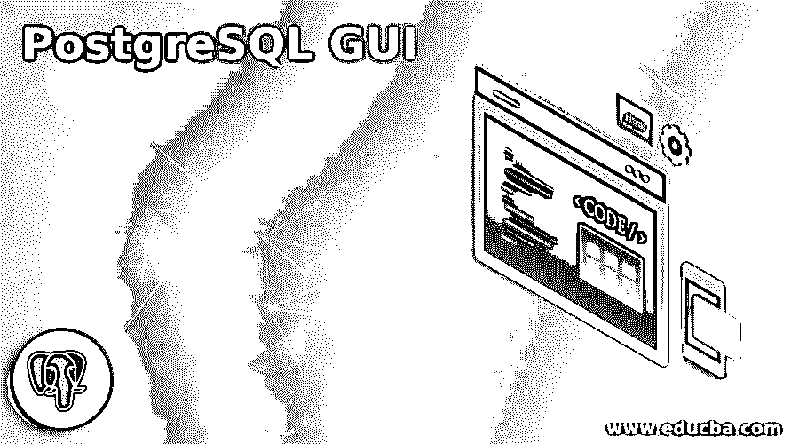

# PostgreSQL 图形用户界面

> 原文：<https://www.educba.com/postgresql-gui/>

## PostgreSQL GUI 简介

PostgreSQL 为用户提供了不同的 GUI 工具。GUI 意味着图形用户界面工具。它是开源的，允许利用图形用户界面工具的帮助，我们可以很容易地管理 PostgreSQL 的所有操作。GUI 提供了一个快捷键来方便新用户，同时也为用户提供了良好的可视化效果。我们可以使用 GUI 远程访问不同的数据库服务器。PostgreSQL 提供了一个基于窗口的界面，使其更易于使用。图形用户界面在数据库管理中起着重要的作用。

命令行界面是实现 PostgreSQL 的传统方式。命令行界面使用控制台显示，一些用户不喜欢控制台显示。与 GUI 工具相比，它提供了少量的信息。在命令行界面中浏览数据库、表和用户是困难的。所以命令行界面有一些缺点。

<small>Hadoop、数据科学、统计学&其他</small>

### 前 5 名 **PostgreSQL** GUI 工具

以下是 5 大 GUI 工具:

#### 1.pgAdmin

pgAdmin 工具是开源的，可以免费使用。它支持 PostgreSQL 的所有操作和功能。它非常容易操作，初学者和有经验的数据库开发人员都可以使用。

**优点:**

*   通过使用 pgAdmin，我们可以创建、查看以及编辑所有常见的 PostgreSQL 对象。
*   它为用户提供了一个图形化的查询工具，使得编写和执行查询变得容易。
*   pgAdmin 仪表板允许用户监控服务器活动，如数据库锁、服务器的连接会话和服务器的当前事务。
*   基本上，pgAdmin 工具是一个 web 应用程序。因此，它可以部署在另一台服务器上进行远程访问。
*   pgAdmin 工具提供过程语言调试器，帮助用户进行调试。
*   pgAdmin UI 有可拆卸的面板。这个可拆卸的面板可以根据用户的喜好来布置。
*   如果用户想要在机器之间移动数据，那么有一个可移植版本的 pgAdmin。

**缺点:**

*   与付费 GUI 工具相比，pgAdmin GUI 速度慢，而且不直观。
*   pgAdmin 使用的资源太多。

#### 2.DBeaver

DBeaver 是一个用于 PostgreSQL 的跨平台 GUI 工具。数据库管理员和开发人员都使用这个 GUI 工具，它支持所有类型的数据库，如 Sybase、MySql、SQLite、Oracle、DB2 和 MS Access 等。我们可以在 Windows、Linux 和 macOS 操作系统上运行。

**优点:**

*   它提供了一个可视化的查询生成器，使得在没有 SQL 知识的情况下构建复杂的 SQL 查询变得容易。
*   DBeaver 支持不同类型的数据视图，这意味着它是编辑者的一个好选择。
*   DBeaver 提供了一个工具来生成假数据来检查您的系统。
*   它还为不同文件格式的用户提供了导入和导出功能。
*   与其他 GUI 工具相比，它为数据库管理系统提供了高级安全性。
*   它自动生成数据库或表格的 ER 图。

**劣势:**

*   与其他 GUI 工具相比，当我们使用大型数据集时，速度会很慢。

#### 3.Navicat

Navicat 是一种 GUI 工具，它支持不同的数据库系统，如 PostgreSQL、MySql 和 MongoDB。对于初学者和有经验的开发人员来说，它很容易使用。Navicat 最重要的功能是与云数据库协同工作。

**优点:**

*   它为用户提供了一个可视化的 SQL 构建器，使得在这个 GUI 中创建 SQL 语句变得非常容易，与其他 GUI 工具相比，它非常快。
*   它有一个自动完成功能，以节省时间和避免错误。
*   Navicat 提供了一个数据建模工具，可以在图表的帮助下轻松地可视化数据库和模式。
*   Navicat 提供作业调度工具，并通过邮件通知他们。
*   它还支持云协作。

**缺点:**

*   用户需要为不同的数据库系统购买不同的许可证。它锁定单个的许可证。
*   由于价格高，它不适合小公司和自由职业者。

#### 4.数据夹点

DataGrip 支持多种数据库系统，是一个跨平台的集成开发环境。它是由 JetBrains 开发的。它是 PostgreSQL 使用的工具之一。它支持所有的数据库系统，如 MySql、DB2、Oracle、SQLite 和 H2 等。支持 Windows、Linux、macOS 等不同操作系统。

**优点:**

*   DataGrip 为用户提供了一个自动完成的工具，使他们更容易和节省时间。
*   DataGrip 的 GUI 是可定制的，非常用户友好，具有智能查询控制台来跟踪编码。
*   我们可以轻松地在表格、视图和程序之间导航。
*   它帮助开发人员检测编码中的错误，并就我们如何修复它提供建议。

**缺点:**

*   DataGrip 不是 PostgreSQL 自带的，因此它缺少一些 PostgreSQL 特性。
*   它会消耗系统的许多资源。

#### 5.OmniDB

OmniDB 是 GUI 工具之一，它支持不同的数据库系统，如 MySql、oracle 和 MariaDB 等。它提供了创建数据库、表和创建新用户的工具，这意味着所有必要的工具都可用。它支持三个平台 Windows、Linux 和 macOS。

**优点:**

*   我们可以轻松地添加或删除服务器连接，这意味着我们可以轻松地配置。
*   它提供了自动完成和语法突出显示功能，以节省时间和避免用户的错误。
*   它还为用户提供了一个仪表板，显示关于当前数据库的信息。
*   开发者可以通过插件轻松添加和分享新功能。

**缺点:**

*   与 pgAdmin、Navicat 和 DataGrip 等其他 GUI 工具相比，它不提供 PostgreSQL 的所有功能。
*   很难提出错误。

### 结论

从上面的文章中，我们看到了不同类型的 GUI 工具，如 pgAdmin、DBeaver、Navicat、DataGrip 和 OmniDB。我们还看到了它支持的每种平台的不同特性。与其他 GUI 工具相比，pgAdmin 通常支持 PostgreSQL 的所有类型的特性。从这篇文章中，我们看到了如何处理不同的 GUI 工具。

### 推荐文章

这是一个 PostgreSQL GUI 的指南。在这里，我们讨论 PostgreSQL 图形用户界面的介绍，以及排名前五的图形用户界面工具及其各自的优缺点。您也可以看看以下文章，了解更多信息–

1.  [PostgreSQL 比较日期](https://www.educba.com/postgresql-compare-date/)
2.  [PostgreSQL 除了](https://www.educba.com/postgresql-except/)
3.  [PostgreSQL 事务](https://www.educba.com/postgresql-transaction/)
4.  [PostgreSQL 真空](https://www.educba.com/postgresql-vacuum/)