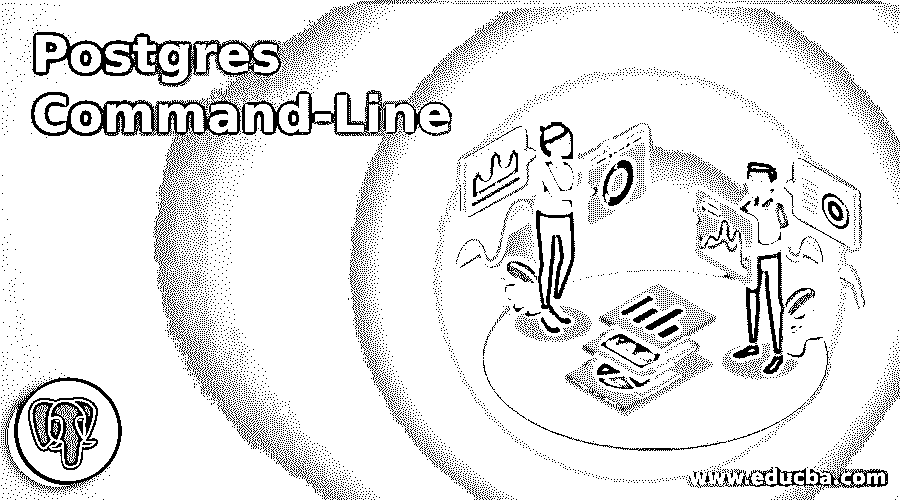
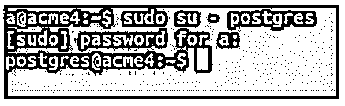
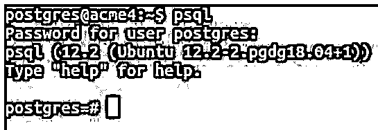
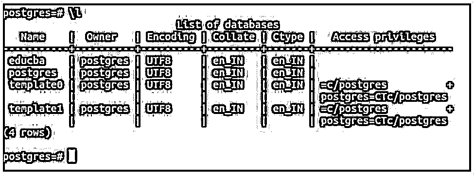
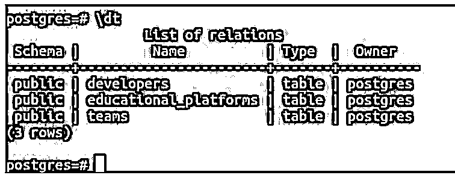
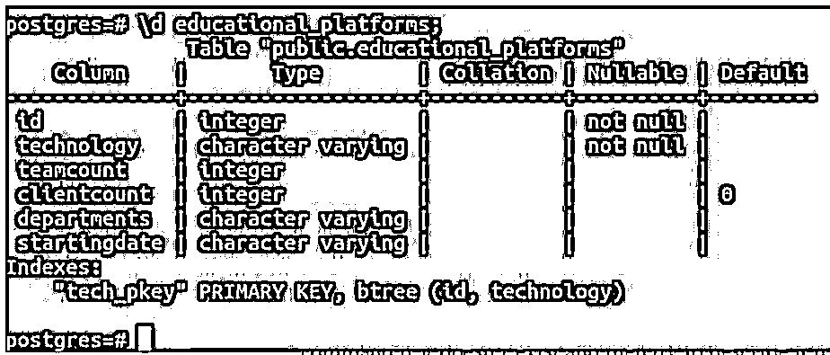
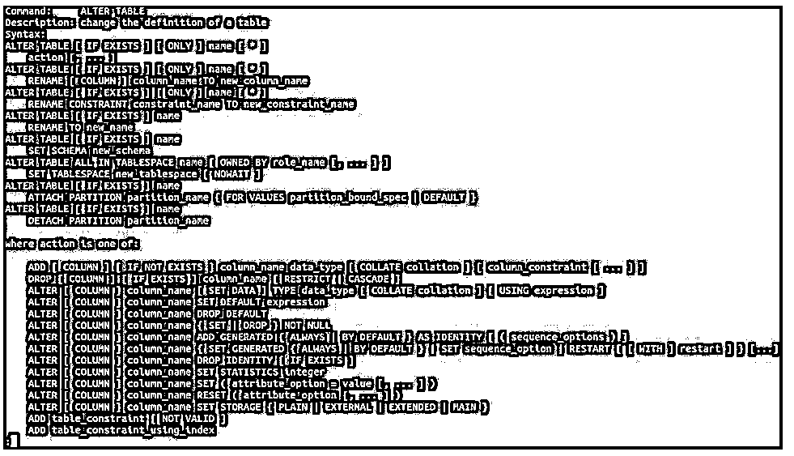
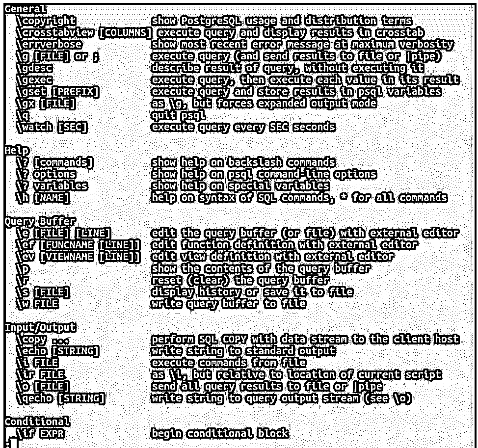
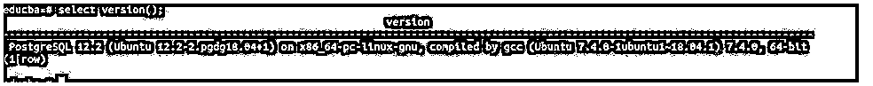
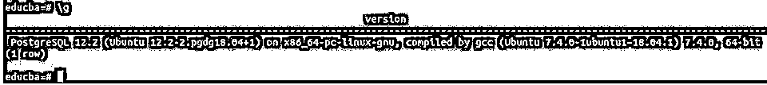

# Postgres 命令行

> 原文：<https://www.educba.com/postgres-command-line/>

## Postgres 命令行介绍

以下文章提供了 Postgres 命令行的概要。您可以与数据库(尤其是 PostgreSQL 数据库)进行交互的前端主要分为两种类型:命令行交互和图形用户界面交互。这里我们看到 PostgreSQL 中有一个这样的基于命令行终端的工具，用于用户与数据库的交互。Psql 是基于终端的前端工具。因此，您可以在终端上使用 psql 实用程序轻松有效地与 PostgreSQL 数据库进行交互。

无论何时下载 PostgreSQL，psql 都会内置其中。如果你的机器上安装了 Postgres，你不需要做任何努力。在这里，我们将了解如何使用 psql 作为 PostgreSQL 数据库交互的命令行实用程序，以及在使用命令行处理 PostgreSQL 时应该知道的一些最基本的命令。

<small>Hadoop、数据科学、统计学&其他</small>

**语法:**

`psql [options...] [databaseName [nameOfUser]]`

您可以打开您的终端并登录到您的 shell 用户，然后要打开 psql 命令提示符，您可以按上面的格式键入命令，其中 options、databaseName 和 nameOfUser 是可选参数。

*   **选项:**有-a、-b、-c、-d 等多种选项可供选择。，可用于说明在连接到 psql 数据库时，您是否希望回显结果、回显查询或指定其他相关信息。
*   **databaseName:** 这是您希望在进入 psql 命令提示符时连接到的数据库的名称。默认不提及；如果您的数据库中有名为 Postgres 的数据库，您将连接到该数据库，这是大多数情况下的情况，或者当 Postgres 不在您的数据库系统中时，连接到 template1。
*   **nameOfUser:** 您可以通过在此处指定特定用户的名称来登录 psql 提示符。

### 用法和内部

除了输入查询并将它们发送给 Postgres，psql 还可以用于触发外部文件中指定的命令，并使用元命令，这无疑使任务变得更容易，并允许编写类似 shell 的命令，使我们能够使用 psql 编写脚本。

每当您在 psql 提示符下键入一个命令时，这个命令就会在内部发送到 Postgres 服务器，然后被解释和触发，结果被发送回 psql 并显示在 psql 终端上。我们将看看初学者在使用 psql 命令行界面与 PostgreSQL 数据库交互时应该知道的一些基本和重要的命令。

### Postgres 命令行示例

下面是提到的例子:

#### 示例#1

让我们用 Postgres 用户使用下面的命令输入命令 shell。

**代码:**

`sudo su – postgres`

它将要求您输入根密码，设置方式如下。

**输出:**

#### 实施例 2

现在让我们使用命令输入 psql 提示符。

**代码:**

`psql`

如果您想使用已经登录的用户输入默认数据库，如上例所示，Postgres 是用户名。

**输出:**

#### 实施例 3

这里它会询问密码，因为我们已经设置了密码。输入密码后，命令行提示似乎有些像这样。

**代码:**

`postgres=#`

所以，现在我们要登录到 psql 终端提示符，我们当前的数据库是 Postgres。

#### 实施例 4

查看所有数据库。

我们将看到的第一个命令是\l，它列出了当前数据库服务器中的所有数据库。\l 命令给出以下输出。

**代码:**

`\l`

**输出:**

可以看到，与数据库相关的名称、所有者、编码、校对、类型和访问权限在启动命令后被检索。

#### 实施例 5

查看所有表格。

要列出当前数据库中的所有表，请输入\dt 命令。RDBMS 中的表被称为关系。\dt 命令给出以下输出。

**代码:**

`\dt`

**输出:**

如果数据库中没有表，将显示一条消息“没有找到关系”。使用\dt 命令显示表的模式、名称、类型和所有者。

#### 实施例 6

描述一下桌子。

要检索关于表的结构、约束和触发器的信息，我们可以使用\d 命令。这也称为描述表。如果表不存在，可以使用 create table 命令创建表，如果数据库中没有表，则尝试描述它。现在，我们将使用以下命令描述 educational_platforms 表。

**代码:**

`\d educational_platforms;`

**输出:**

#### 实施例 7

切换数据库。

要切换您的数据库并连接到其他数据库，您可以使用\c 或\connect 命令，如下所示。

**代码:**

`\c educba;`

其中 educba 是作为参数传递的要连接的数据库的名称。

**输出:**

现在，您已经连接到 educba 数据库。

#### 实施例 8

了解特定命令的语法。

如果您想找出特定命令的语法，您可以使用\h 命令。

例如，如果您想知道 ALTER TABLE 命令的语法，可以使用下面的命令。

**代码:**

`\h ALTER TABLE;`

**输出:**

您可以输入\q 命令来退出检索结果。

#### 实施例 9

列出所有命令。

如果您想方便地了解 psql 中所有可用的命令，可以使用\命令。

**代码:**

`\?`

`educba=#/?`

**输出:**

它给出了命令语法及其描述。

#### 实施例#10

检查版本。

如果您想知道关于您正在使用的 PostgreSQL 版本的信息，那么您可以启动下面的命令。

**代码:**

`select version();`

**输出:**

#### 实施例 11

再次发出上次发出的命令，

假设您想要检索由您发出的最后一个命令，并发出相同的命令。您可以使用\g 命令轻松地检索和启动它。

**代码:**

`\g`

**输出:**

### 结论

我们可以轻松有效地使用 psql 命令行 from-end 终端工具。许多元命令帮助我们操作数据库并与之交互，从而轻松地执行操作。psql 命令行也可用于编写脚本和运行外部文件中的命令。

### 推荐文章

这是一个 Postgres 命令行指南。这里我们分别讨论介绍、用法、内部原理和例子。您也可以看看以下文章，了解更多信息–

1.  [PostgreSQL Like](https://www.educba.com/postgresql-like/)
2.  [PostgreSQL 回合](https://www.educba.com/postgresql-round/)
3.  [PostgreSQL 替换](https://www.educba.com/postgresql-replace/)
4.  [PostgreSQL 授权](https://www.educba.com/postgresql-grant/)