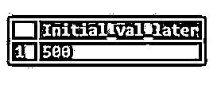

# PostgreSQL 变量

> 原文：<https://www.educba.com/postgresql-variables/>

## PostgreSQL 变量简介

PostgreSQL 变量是一个方便的名称，或者是给内存位置的抽象名称。变量总是有一个特定的数据类型，如布尔、文本、字符、整数、双精度、日期、时间等。它们用于存储可以改变的数据。如果 PostgreSQL 变量没有定义默认值，则它们被初始化为空值。我们可以通过使用函数或代码块来修改存储在变量中的值。在函数执行期间，我们可以将数据临时存储在变量中。

**语法:**

<small>Hadoop、数据科学、统计学&其他</small>

考虑以下语法来声明变量:

`DECLARE var_name [ CONSTANT ] data-type [ NOT NULL ] [ { DEFAULT | := } initial_value ]`

**说明:**

*   **var_name:** 要赋值的变量名。
*   **常量:**这是可选组件。如果我们已经定义了常量，那么一旦变量被初始化，我们就不能改变变量的值。
*   **数据类型:**要分配的变量数据类型。
*   **NOT NULL:** 这是一个可选组件。如果我们定义了 NOT NULL，那么变量就不能有空值。
*   **initial_value:** 这是可选组件。通过使用这个，我们可以在创建变量时初始化变量。如果我们没有定义 initial_value，那么变量将被赋予空值。

### 如何在 PostgreSQL 中初始化变量？

有多种方法可以初始化变量，如下所示:

#### 1.而创造

我们可以在创建变量时通过给定初始值来初始化变量。

考虑下面的例子来理解变量初始化。

**代码:**

`DECLARE num_of_students integer := 100;`

或者

`DECLARE num_of_students integer DEFAULT 100;`

上述示例将声明一个名为 num_of_students 的 PostgreSQL 变量，其初始值为 100，数据类型为整数。

#### 2.创作后

我们可以先声明一个变量，然后初始化这个变量。

考虑下面的例子来理解创建后的变量初始化。

**代码:**

`DECLARE num_of_students integer;`

上述示例将声明一个名为 num_of_students 的 PostgreSQL 变量，其数据类型为整数。

现在，我们将使用以下语句初始化该变量:

**代码:**

`num_of_students := 300`

上述语句将名为 num_of_students 的 PostgreSQL 变量初始化为值 300。

### 如何在 PostgreSQL 中声明变量？

有多种方法可以声明如下给出的变量:

#### 1.用初始值声明

考虑下面的例子来理解带有 initial_value 的变量声明。

**代码:**

`DECLARE name_of_student VARCHAR:= 'John';`

或者

`DECLARE name_of_student VARCHAR DEFAULT 'John';`

上述示例将声明一个名为 name_of_student 的 PostgreSQL 变量，其数据类型为 VARCHAR，初始值为' John '。

#### 2.不带初始值的声明

考虑下面的例子来理解没有初始值的变量声明。

**代码:**

`DECLARE name_of_student VARCHAR;`

上述示例将声明一个名为 name_of_student 的 PostgreSQL 变量，其数据类型为 VARCHAR。

#### 3.声明常量变量

考虑下面的例子来理解带有初始值和常量的变量声明。

**代码:**

`DECLARE name_of_student CONSTANT VARCHAR:= 'John';`

或者

`DECLARE name_of_student CONSTANT VARCHAR DEFAULT 'John';`

上述示例将声明一个名为 name_of_student 的 PostgreSQL 变量，其数据类型为 VARCHAR，初始值为“John ”,该变量将被进一步更改为常量。

### 变量是如何工作的？

*   我们在函数中使用的所有 PostgreSQL 变量都需要在 DECLARE 关键字中定义。
*   在函数执行期间，我们可以将数据临时存储在变量中。
*   我们可以修改存储在变量中的数据。
*   如果任何 PostgreSQL 变量被定义为常量，我们就不能改变变量的值。
*   我们可以用默认值声明一个 PostgreSQL 变量，或者如果它没有被定义为常量，我们可以在以后根据需要修改它。

### PostgreSQL 变量的示例

下面是一些例子:

#### 示例#1

为 PostgreSQL 变量赋予初始值。

##### 形容词（adjective 的缩写）没有默认关键字

考虑名称的以下功能:

**代码:**

`/*"Initial_val_without_default_keyword"()*/
-- FUNCTION: public."Initial_val_without_default_keyword"()
-- DROP FUNCTION public."Initial_val_without_default_keyword"();
CREATE OR REPLACE FUNCTION public."Initial_val_without_default_keyword"(
)
RETURNS integer
LANGUAGE 'plpgsql'
COST 100
VOLATILE
AS $BODY$DECLARE
def_var integer := 100;
BEGIN
RETURN def_var;
END;
$BODY$;`

现在我们将执行上面的函数。

阐释下面的 SQL 语句，并对上述函数的结果进行快照。

**代码:**

`SELECT public."Initial_val_without_default_keyword"()`

**输出:**

##### b.使用默认关键字

考虑名称的以下功能:

**代码:**

`"Initial_val_with_default_keyword"()
-- FUNCTION: public."Initial_val_with_default_keyword"()
-- DROP FUNCTION public."Initial_val_with_default_keyword"();
CREATE OR REPLACE FUNCTION public."Initial_val_with_default_keyword"(
)
RETURNS integer
LANGUAGE 'plpgsql'
COST 100
VOLATILE
AS $BODY$DECLARE
def_var integer default 200;
BEGIN
RETURN def_var;
END;
$BODY$;`

现在我们将执行上面的函数。

阐释下面的 SQL 语句，并对上述函数的结果进行快照。

**代码:**

`SELECT public."Initial_val_with_default_keyword"()`

**输出:**

##### 碳（carbon 的缩写）常数变量

*   **无默认关键字**

考虑名称的以下功能:

**代码:**

`-- FUNCTION:
public."Initial_val_constant_without_default_keyword"()
-- DROP FUNCTION
public."Initial_val_constant_without_default_keyword"();
CREATE OR REPLACE FUNCTION
public."Initial_val_constant_without_default_keyword"(
)
RETURNS integer
LANGUAGE 'plpgsql'
COST 100
VOLATILE
AS $BODY$ DECLARE
def_var CONSTANT integer := 200;
BEGIN
RETURN def_var;
END;
$BODY$;`

现在我们将执行上面的函数。

阐释下面的 SQL 语句，并对上述函数的结果进行快照。

**代码:**

`SELECT public."Initial_val_constant_without_default_keyword"()`

**输出:**

*   **带有默认关键字**

考虑名称的以下功能:

**代码:**

`-- FUNCTION:
public."Initial_val_constant_with_default_keyword"()
-- DROP FUNCTION
public."Initial_val_constant_with_default_keyword"();
CREATE OR REPLACE FUNCTION
public."Initial_val_constant_with_default_keyword"(
)
RETURNS integer
LANGUAGE 'plpgsql'
COST 100
VOLATILE
AS $BODY$DECLARE
def_var CONSTANT integer default 300;
BEGIN
RETURN def_var;
END;
$BODY$;`

现在我们将执行上面的函数。

举例说明以下 SQL 语句和快照，以理解上述函数的结果:

**代码:**

`SELECT public."Initial_val_constant_with_default_keyword"()`

**输出:**

#### 实施例 2

在声明后为 PostgreSQL 变量赋值。

考虑名称的以下功能:

**代码:**

`-- FUNCTION: public."Initial_val_later"()
-- DROP FUNCTION public."Initial_val_later"();
CREATE OR REPLACE FUNCTION public."Initial_val_later"(
)
RETURNS integer
LANGUAGE 'plpgsql'
COST 100
VOLATILE
AS $BODY$Declare
def_var integer ;
BEGIN
def_var:=500;
RETURN def_var;
END;
$BODY$;`

现在我们将执行上面的函数。

说明以下 SQL 语句和上述函数的快照:

**代码:**

`SELECT public."Initial_val_later"()`

**输出:**

***

*** 

### 推荐文章

这是一个 PostgreSQL 变量的指南。这里我们讨论 PostgreSQL 变量的介绍，如何初始化，声明变量，以及例子。您也可以看看以下文章，了解更多信息–

1.  [PostgreSQL 触发器](https://www.educba.com/postgresql-triggers/)
2.  [PostgreSQL 有](https://www.educba.com/postgresql-having/)
3.  [PostgreSQL SPLIT_PART()](https://www.educba.com/postgresql-split_part/)
4.  [PostgreSQL 提取()](https://www.educba.com/postgresql-extract/)