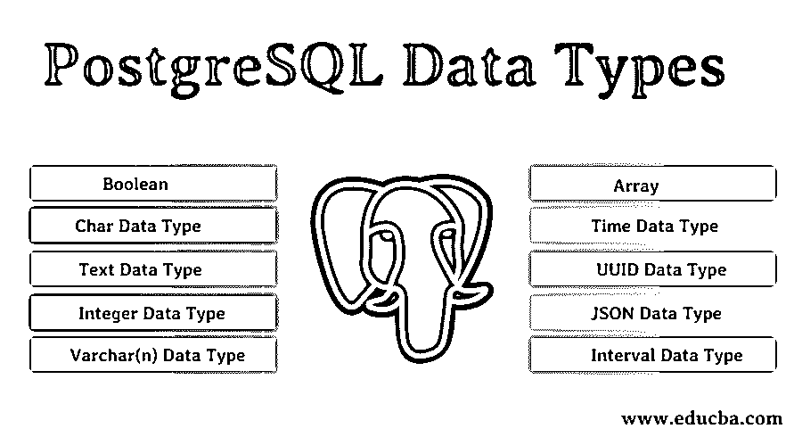
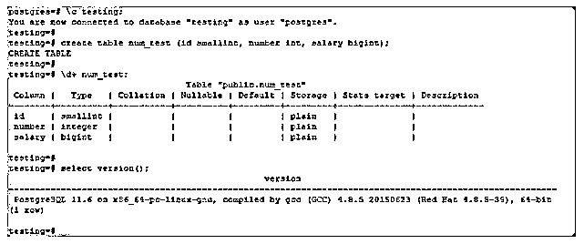
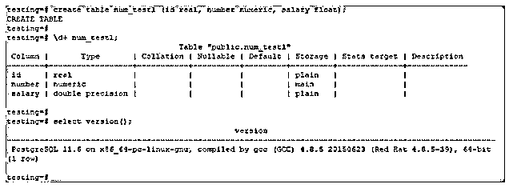
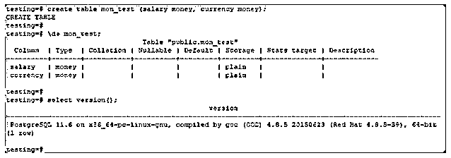
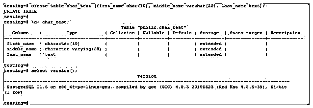
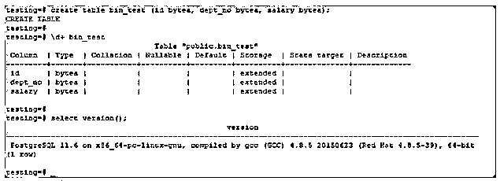
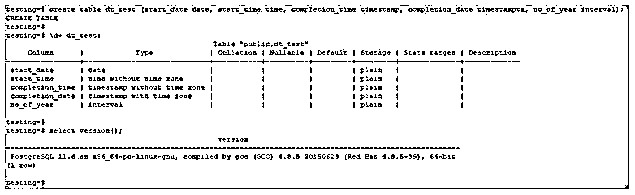
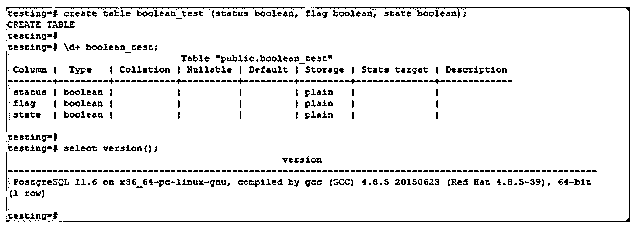
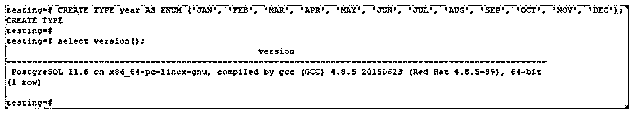

# PostgreSQL 数据类型

> 原文：<https://www.educba.com/postgresql-data-types/>

## PostgreSQL 数据类型简介

PostgreSQL 数据类型是创建数据库表时定义的受支持的数据类型。PostgreSQL 有几种可用的数据类型，如数字、货币、字符、二进制、布尔、日期/时间和枚举类型。每种数据类型都用于存储和处理特定类型的数据。它既支持单值数据类型，如整数和字符、浮点和布尔以及多值，也支持复杂数据类型，如数组、JSON 和 interval。枚举数据类型具有创建一组静态值数据集的特定功能，例如定义一年中的几个月。

所有使用数据运行的应用程序都必须有一个数据库，其中存储了所有与数据相关的应用程序。正如我们所知，数据被认为是任何系统的关键部分，必须存在一些平台来帮助处理和管理数据。数据类型可以被定义为一种数据。简单地说，被分配了一种数据类型的变量只能存储该数据类型的值。例如，如果任何变量应该只存储整数值，那么在所有情况下，它将只存储整数值。如果用户试图在该变量中输入不同数据类型的值，将会导致错误。

<small>Hadoop、数据科学、统计学&其他</small>

### 不同的 PostgreSQL 数据类型

下面给出了不同的 PostgreSQL 类型:

*   数字数据类型
*   货币数据类型
*   字符数据类型
*   二进制数据类型
*   日期/时间数据类型
*   布尔数据类型
*   枚举数据类型

#### 1.数字数据类型

它主要提供两种不同类型的数值数据类型。

*   整数
*   浮点数

##### 整数数据类型

用整数数据类型定义的变量只能存储整数值。该值必须是整数值否则；它将以抛出错误结束。例如，如果一个名为 I 的变量应该存储整数值，那么它将只保存整数值。

**例如:**–1，200，459，354 等。

在 PostgreSQL 中，基本上存在如下三种整数:

*   **小整数:**小整数的存储大小为 2 字节。

小整数的范围是-32768 到+32767

*   **整数:**整数的存储大小为 4 字节。

整数的范围是-2147483648 到+2147483647

*   **大整数:**大整数的存储大小为 8 字节。

大整数的范围是-9223372036854775808 到 9223372036854775807

**代码:**

`# create table num_test (id smallint, number int, salary bigint);`

**输出:**

##### 浮点数

浮点数主要分为以下三种类型:

*   浮动
*   数字的
*   真实还是浮动 8

**Float:** 这是 PostgreSQL 中的浮点数精度。如果浮点数至少为 n，最大为 8 个字节，则为范围。它也称为双精度数据类型。

**Numeric:** 这是 PostgreSQL 中的实数数据类型。数字 p 和 s 是数字数据类型中的精确数字。

**Real:** 是 PostgreSQL 数据类型中的 4 字节浮点数。

**代码:**

`# create table num_test1 (id real, number numeric, salary float);`

**输出:**

#### 2.货币数据类型

PostgreSQL 中的货币数据类型使用固定精度的小数来存储当前金额。PostgreSQL 中货币数据类型的范围是-92233720368547758.08 到+9223372036854758.07

**代码:**

`# create table mon_test (salary money, currency money);`

**输出:**

#### 3.**字符数据类型**

在这方面，主要有三种不同的字符数据类型可用。

*   茶
*   可变长字符串
*   文本

**Char 数据类型:**Char 数据类型用于存储单个字符值。通常最好用在只需要存储单个字符的地方。如果用户试图在其中放置多个字符，将会导致错误。存储字符值的变量占用很少的存储空间。

**例子:**‘A’，‘A’，‘m’等

**文本数据类型:**数据类型为文本的变量可以存储长字符串值。在所有需要存储的文本长度未知的情况下，都可以使用文本数据类型。在 PostgreSQL 中，它也称为可变长度字符串。在这些数据类型中，文本数据被称为具有无限记录的字符串。

**例子:**“你好”、“恭喜”等

**Varchar(n)数据类型:**写有某个数字的 Varchar 数据类型表示它只能存储或保存写在它旁边的字符数。在这些数据类型中，我们可以存储 n 个字符。

例如，如果我们写 varchar(9)，这意味着变量将只能保存最大数量的好字符。

**例子:**“ABCDEFGHI”，“Hello Hey”

**代码:**

`# create table char_test (first_name char(10), middle_name varchar(20), last_name text);`

**输出:**

#### 4.二进制数据类型

PostgreSQL 二进制数据类型允许在 PostgreSQL 中存储二进制字符串。它的可变长度是二进制数据类型。

**代码:**

`# create table bin_test (id bytea, dept_no bytea, salary bytea);`

**输出:**

#### 5.日期/时间数据类型

时间数据类型被分配给只存储时间值的变量。应该有某种特定的时间格式必须存储在时间数据类型变量中。它是 PostgreSQL 中最重要的数据类型之一，因为它用于跟踪事务。

**例如:** 12:00:36，01:06:56

下面是 PostgreSQL 中可用的日期/时间数据类型如下:

*   日期
*   时间
*   时间戳
*   Timestamptz
*   间隔

**Date:** 该数据类型只存储日期。它不会存储任何时间。这种数据类型的低值是公元前 4713 年，最高值是公元 294276 年。

**Time:** 这个数据类型只存储时间。它不会存储任何日期。这种数据类型的低值是公元前 4713 年，最高值是公元 5874897 年。

**时间戳:**该数据类型存储日期和时间。它不会存储任何时间戳。这种数据类型的低值是公元前 4713 年，最高值是公元 294276 年。

**Timestamptz:** 该数据类型存储带有时间戳的日期和时间。这种数据类型的低值是公元前 4713 年，最高值是公元 294276 年。

**区间:**这些数据类型的存储大小为 12 字节。它将描述时间间隔值。

**代码:**

`testing=# create table dt_test (start_date date, start_time time, completion_time timestamp, completion_date timestamptz, no_of_year interval);`

**输出:**

#### 6.布尔数据类型

Boolean 是 PostgreSQL 支持的数据类型之一。此数据类型只能存储两个值，即“真”和“假”。在通常情况下，布尔值用于验证语句是否正确，因为当语句正确时，它返回真值；否则，该值将为假。决策时也使用这种数据类型，并且基于两个值中的任何一个；这个决定必须由程序来做。

**举例:**“真”、“假”

**代码:**

`# create table boolean_test (status boolean, flag boolean, state boolean);`

**输出:**

#### 7.枚举数据类型

它包括一组静态有序的值。这与编程语言中支持的 enum 数据类型非常相似。PostgreSQL 中的枚举数据类型使用 create type 命令创建。在这种情况下，如果我们创建一次枚举数据类型，它将在任何其他类型中使用。

**代码:**

`# CREATE TYPE year AS ENUM ('JAN', 'FEB', 'MAR', 'APR', 'MAY', 'JUN', 'JUL', 'AUG', 'SEP', 'OCT', 'NOV', 'DEC');`

**输出:**

### PostgreSQL 中的其他一些数据类型

下面列出了 PostgreSQL 中的一些其他数据类型。

*   **区间数据类型:**被赋予区间数据类型的变量能够存储特定的时间间隔。它与时间有关，在几种情况下可以用来估计时间。在数据库中，可以观察到哪个事务在什么时间间隔发生，这种数据类型有助于我们管理时间间隔。例如，“7 个月前”，2 年 5 小时 40 分钟
*   **Array:** 数组用于存储一组字符串或一组任意值，但唯一的限制是所有数组值必须是相同的数据类型。使用数组使程序变得非常方便，在开发代码时不属于该部分的每个人都可以理解。示例–数组[408]-589-5846 '，'(408)-589-5555 ']
*   **UUID 数据类型:**UUID 数据类型用于存储通用唯一标识符，这些标识符实际上是在整个程序中用来唯一标识任何东西的值。它是一种特殊的数据类型，在高级编程语言中是找不到的。示例–0 e 37 df 36-f698-11e 6-8d D4*–*CB 9 ced 3d f 976，a 81 BC 81 b-dead-4e5d-abff-90865 D1 e 13 b 1
*   **JSON 数据类型:**存储 JSON 值的变量被赋予 JSON 数据类型。它是 PostgreSQL 中使用的最重要的数据类型之一，能够保存复杂的 JSON 数据。示例-{ "客户":" Doe "，"项目":{ "产品":"应用"，"数量":7}}

### 结论

PostgreSQL 数据库管理在用于任何必须处理数据的应用程序时都非常有用。它被设计成可以处理多种数据类型，其中所有的数据类型都有自己的重要性。此外，为了在事务完成时跟踪时间，有时间、日期、间隔等数据类型。，都存在。在 Kali Linux 等操作系统中，它是内置的。这使得开发人员很容易将他们的应用程序与数据库集成在一起。他们还可以使用 PostgreSQL 中提供的不同类型的数据类型。

### 推荐文章

这是 PostgreSQL 数据类型的指南。这里我们已经详细讨论了 PostgreSQL 不同数据类型的基本含义以及附加数据类型。您也可以浏览我们推荐的其他文章，了解更多信息——

1.  [PostgreSQL 字符串函数](https://www.educba.com/postgresql-string-functions/)
2.  [PostgreSQL 架构](https://www.educba.com/postgresql-architecture/)
3.  [PostgreSQL 特性](https://www.educba.com/postgresql-features/)
4.  [PostgreSQL 中的索引](https://www.educba.com/indexes-in-postgresql/)