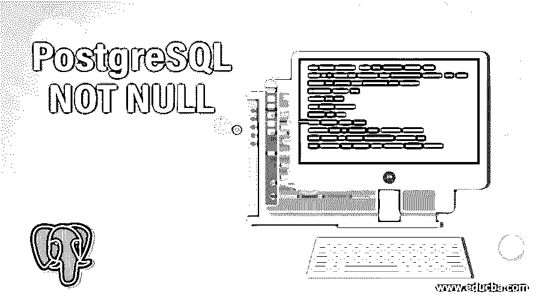
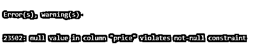
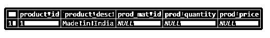
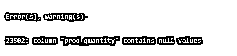
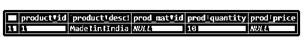
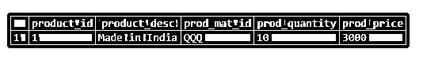

# PostgreSQL 不为空

> 原文：<https://www.educba.com/postgresql-not-null/>

## PostgreSQL 的定义不为空

PostgreSQL 为我们提供了 NOT NULL 约束；通过使用 NOT NULL，我们可以确保我们提到的 NOT NULL 约束中的列不接受任何空值。根据数据库理论，NULL 关键字定义信息缺失或未知。空值的含义不同于零值或空字符串。考虑这样一种情况，我们有一个学生信息详细资料，如果我们不知道该学生的手机号码，那么我们在学生信息详细资料中插入手机号码信息时使用该值为 NULL，这表明在学生详细资料中插入手机号码信息时该信息是未知的。如果学生没有使用手机，也没有手机号码，那么我们可以使用空字符串来代替。

**语法:**

<small>Hadoop、数据科学、统计学&其他</small>

`column_name data-type NOT NULL`

**解释:**定义了 NOT NULL 约束的 column_name 不允许插入 NULL 值

### 在 PostgreSQL 中 NOT NULL 是如何工作的？

*   PostgreSQL NOT NULL 约束在语法上用在列的数据类型之后，如果列上没有定义要插入的 NULL 值的 NOT NULL 约束，这将导致拒绝插入 NULL 值。
*   为了检查给定值是否为空，我们必须使用布尔运算符 IS NOT NULL 或 is NULL。如果我们比较 NULL = NULL 表达式，我们将得到 NULL 结果。
*   NOT NULL 约束的含义是在对表执行插入或更新操作时；我们应该有一个不等于空值的值。
*   NOT NULL 约束用于所谓的列约束，而不是表约束。
*   在 PostgreSQL 中，列可以定义多个约束，这意味着除了 NOT NULL 约束，一个列还可以有不同的约束。

### 在 PostgreSQL 中实现 NOT NULL 的示例

为了详细理解 PostgreSQL NOT NULL 约束，我们将逐一查看以下示例。

#### 1.在表创建过程中对列添加非空约束

我们将创建一个命名产品的表，该表将在一些列上添加一个非空约束。考虑下面的 CREATE TABLE 语句，创建一个具有非空约束的名为 products 的新表。

`CREATE TABLE products(
id serial PRIMARY KEY,
name VARCHAR(80) NOT NULL,
price numeric NOT NULL
);`

我们在列的数据类型后使用了 NOT NULL 关键字来定义 NOT NULL 约束。在 PostgreSQL 中，我们可以在一个语句上定义多个约束，比如 NOT NULL、外键、UNIQUE、CHECK 等。约束定义的顺序并不重要。

现在，我们将使用下面的 INSERT INTO 语句在 products 表中插入一些可接受的值。

`INSERT INTO products(name, price)
VALUES ('Chair', 2000);`

通过使用以下快照和 SQL 语句来说明上述语句的结果。

`SELECT * FROM products;`

**输出:**

现在，我们将尝试使用下面的 INSERT INTO 语句在 products 表中插入一些空值。

`INSERT INTO products(name, price)
VALUES ('Chair', NULL);`

如您所见，我们试图在 price 中插入一个空值，这违反了 price 列上添加的约束，因此我们将得到以下异常作为输出。

**输出:**

#### 2.在已经存在的列上添加非空约束

我们可以使用 ALTER TABLE 语句在现有表的列上添加 NOT NULL 约束，如下所示:

`ALTER TABLE tbl_name ALTER COLUMN col_name SET NOT NULL;`

我们可以同时更新多个列，使现有表上的多个列具有 NOT NULL 约束；考虑以下相同的语法:

`ALTER  TABLE tbl_name
ALTER COLUMN col_name1 SET NOT NULL,
ALTER COLUMN col_name2 SET NOT NULL;`

考虑下面的例子，我们将使用下面的 CREATE table 语句创建一个表 product_orders。

`CREATE TABLE product_orders (
product_id serial PRIMARY KEY,
product_desc VARCHAR (40) NOT NULL,
prod_mat_id VARCHAR (16),
prod_quantity NUMERIC,
prod_price NUMERIC
);`

现在，我们将使用以下 INSERT INTO 语句在 product_orders 表中插入一些记录:

`INSERT INTO product_orders (product_desc)
VALUES
('Made in India');`

通过使用以下快照和 SQL 语句来说明上述语句的结果。

`SELECT * FROM product_orders ;`

**输出:**

如果我们希望 prod_quantity 列不为空，那么我们可以使用 ALTER TABLE 语句将非空约束添加到 prod_quantity 列。但是 product_orders 表不为空，如果我们尝试更新该表，因为它对 prod_quantity 列有非空约束，就会引发错误。

如果我们对 product_orders 表执行以下语句，该表现在不为空，我们将得到如下错误:

`ALTER TABLE product_orders ALTER COLUMN prod_quantity SET NOT NULL;`

**输出:**

因此，我们必须首先更新 product_orders 表，如下所示。

`UPDATE product_orders SET prod_quantity = 10;`

通过使用以下快照和 SQL 语句来说明上述语句的结果。

`SELECT * FROM product_orders;`

**输出:**

`ALTER TABLE product_orders ALTER COLUMN prod_quantity SET NOT NULL;`

类似地，我们可以更新 product_orders 表中 prod_mat_id 和 prod_price 列的非空约束。为此，我们再次需要在 prod_mat_id 和 prod_price 列中插入一些值。

`UPDATE product_orders
SET prod_mat_id = 'QQQ',
prod_quantity = 10;
prod_price = 3000;`

通过使用以下快照和 SQL 语句来说明上述语句的结果。

`SELECT * FROM product_orders;`

**输出:**

现在，我们将使用如下语句向 prod_mat_id 和 prod_price 列添加 NOT NULL 约束。

`ALTER TABLE product_orders
ALTER COLUMN prod_mat_id SET NOT NULL,
ALTER COLUMN prod_price SET NOT NULL;`

现在我们可以确保 product_orders 表中 prod_price 列。

`UPDATE product_orders
SET prod_quantity = NULL;`

### 在 PostgreSQL 中使用 NOT NULL 的优点

*   通过使用 PostgreSQL 非空约束，我们可以避免在表中插入或更新空值。
*   PostgreSQL NOT-NULL 约束将导致表的列中有数据。
*   它将始终帮助我们在包含具有非空约束的列的表中插入有效数据。

### 结论

我们希望通过上面的文章，您已经理解了如何使用 PostgreSQL NOT NULL 以及 PostgreSQL NOT NULL 是如何工作的。另外，我们还添加了一些 PostgreSQL NOT NULL 的例子来详细理解它。

### 推荐文章

这是一个 PostgreSQL 的指南，不是 NULL。在这里，我们讨论 PostgreSQL 中的介绍和 not null 如何工作，以及不同的例子和它的代码实现。您也可以看看以下文章，了解更多信息–

1.  [PostgreSQL 日期函数](https://www.educba.com/postgresql-date-functions/)
2.  [PostgreSQL 中的外键](https://www.educba.com/foreign-key-in-postgresql/)
3.  [PostgreSQL 完全连接](https://www.educba.com/postgresql-full-join/)
4.  [PostgreSQL 中的通配符](https://www.educba.com/wildcards-in-postgresql/)
5.  [如何使用 PostgreSQL 通知？](https://www.educba.com/postgresql-notify/)
6.  [PostgreSQL RANK()指南](https://www.educba.com/postgresql-rank/)
7.  [PostgreSQL 布尔值指南](https://www.educba.com/postgresql-boolean/)
8.  [PostgreSQL COALESCE |如何工作？](https://www.educba.com/postgresql-coalesce/)